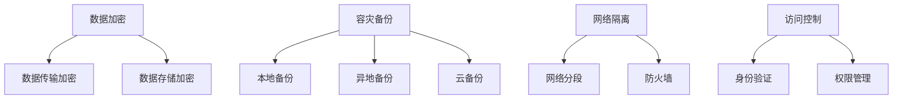

                 

# AI 大模型应用数据中心建设：数据中心安全与可靠性

> 关键词：AI大模型、数据中心、安全、可靠性、数据加密、容灾备份、网络隔离、访问控制、性能优化

> 摘要：本文深入探讨了在AI大模型应用背景下，数据中心建设中安全与可靠性的重要性。通过分析AI大模型的特点及其对数据中心的需求，本文详细介绍了数据中心安全与可靠性建设的核心概念、原理、具体操作步骤、数学模型和公式、项目实战案例、实际应用场景、工具和资源推荐以及未来发展趋势与挑战。旨在为从事数据中心建设的技术人员提供全面的技术指导和实践参考。

## 1. 背景介绍

随着人工智能技术的迅猛发展，AI大模型的应用越来越广泛，从智能推荐系统到自动驾驶，从语音识别到图像处理，AI大模型正在深刻改变我们的生活和工作方式。然而，AI大模型的广泛应用也带来了新的挑战，尤其是在数据中心建设方面。数据中心作为AI大模型运行的基础，其安全性和可靠性直接关系到AI系统的稳定运行和数据的安全保护。因此，如何在AI大模型应用背景下，建设一个既安全又可靠的高性能数据中心，成为当前技术领域的重要课题。

### 1.1 AI大模型的特点

AI大模型具有以下特点：
- **数据驱动**：AI大模型依赖于大量的训练数据，这些数据往往包含敏感信息，如个人隐私、商业机密等。
- **计算密集型**：AI大模型的训练和推理过程需要大量的计算资源，对数据中心的计算能力提出了极高的要求。
- **实时性**：许多AI应用场景要求实时响应，如自动驾驶、在线客服等，这需要数据中心具备高效的处理能力和低延迟的网络环境。
- **可扩展性**：随着业务的发展，AI大模型的规模和复杂度不断增加，数据中心需要具备良好的可扩展性，以适应不断变化的需求。

### 1.2 数据中心建设的挑战

在AI大模型应用背景下，数据中心建设面临以下挑战：
- **数据安全**：如何保护训练数据和模型参数的安全，防止数据泄露和被恶意利用。
- **系统可靠性**：如何确保数据中心的稳定运行，避免因硬件故障、网络中断等原因导致的服务中断。
- **性能优化**：如何在保证安全性和可靠性的前提下，提高数据中心的处理能力和响应速度。
- **成本控制**：如何在满足性能需求的同时，控制数据中心的建设和运维成本。

## 2. 核心概念与联系

在AI大模型应用背景下，数据中心建设涉及多个核心概念，包括数据加密、容灾备份、网络隔离、访问控制等。这些概念之间相互关联，共同构成了数据中心安全与可靠性建设的整体框架。

### 2.1 数据加密

数据加密是保护数据安全的重要手段。通过加密技术，可以将敏感数据转化为密文，即使数据被非法获取，也无法直接读取其内容。数据加密通常包括数据传输加密和数据存储加密两种方式。

### 2.2 容灾备份

容灾备份是指通过备份和恢复机制，确保在数据中心发生故障时，能够快速恢复数据和服务，保证业务的连续性。容灾备份通常包括本地备份、异地备份和云备份等多种方式。

### 2.3 网络隔离

网络隔离是指通过网络分段、防火墙等技术手段，将数据中心内部网络与外部网络隔离，防止外部攻击者通过网络入侵数据中心内部系统。网络隔离可以有效提高数据中心的安全性。

### 2.4 访问控制

访问控制是指通过身份验证、权限管理等手段，控制用户对数据中心资源的访问权限，防止未经授权的访问。访问控制可以有效防止内部人员的误操作和恶意行为。

### 2.5 核心概念原理和架构



## 3. 核心算法原理 & 具体操作步骤

### 3.1 数据加密算法

数据加密算法主要包括对称加密算法和非对称加密算法。对称加密算法如AES，非对称加密算法如RSA。对称加密算法速度快，但密钥管理复杂；非对称加密算法安全性高，但加密速度慢。

### 3.2 容灾备份算法

容灾备份算法主要包括增量备份、差异备份和全量备份。增量备份只备份自上次备份以来发生变化的数据；差异备份备份自上次全量备份以来发生变化的数据；全量备份备份所有数据。

### 3.3 网络隔离算法

网络隔离算法主要包括VLAN、VxLAN和SDN。VLAN通过虚拟局域网技术实现网络隔离；VxLAN通过虚拟扩展局域网技术实现网络隔离；SDN通过软件定义网络技术实现网络隔离。

### 3.4 访问控制算法

访问控制算法主要包括RBAC、ABAC和XACML。RBAC基于角色的访问控制；ABAC基于属性的访问控制；XACML基于策略的访问控制。

### 3.5 具体操作步骤

#### 3.5.1 数据加密操作步骤

1. 选择合适的加密算法。
2. 生成密钥。
3. 对数据进行加密。
4. 传输加密后的数据。
5. 接收方解密数据。

#### 3.5.2 容灾备份操作步骤

1. 选择备份方式。
2. 定期备份数据。
3. 存储备份数据。
4. 恢复数据。

#### 3.5.3 网络隔离操作步骤

1. 划分网络段。
2. 配置防火墙规则。
3. 监控网络流量。

#### 3.5.4 访问控制操作步骤

1. 定义角色和权限。
2. 配置访问控制策略。
3. 验证用户身份。
4. 控制用户访问。

## 4. 数学模型和公式 & 详细讲解 & 举例说明

### 4.1 数据加密数学模型

数据加密数学模型主要包括对称加密模型和非对称加密模型。对称加密模型如AES模型，非对称加密模型如RSA模型。

#### 4.1.1 对称加密模型

$$
\text{C} = \text{E}_\text{k}(\text{P})
$$

其中，C表示密文，P表示明文，E表示加密函数，k表示密钥。

#### 4.1.2 非对称加密模型

$$
\text{C} = \text{E}_\text{pub}(\text{P})
$$

$$
\text{P} = \text{D}_\text{pri}(\text{C})
$$

其中，C表示密文，P表示明文，E表示加密函数，D表示解密函数，pub表示公钥，pri表示私钥。

### 4.2 容灾备份数学模型

容灾备份数学模型主要包括增量备份模型、差异备份模型和全量备份模型。

#### 4.2.1 增量备份模型

$$
\text{D}_\text{t} = \text{D}_\text{t-1} + \Delta\text{D}_\text{t}
$$

其中，D表示数据，t表示时间，ΔD表示变化的数据。

#### 4.2.2 差异备份模型

$$
\text{D}_\text{t} = \text{D}_\text{t-1} + \Delta\text{D}_\text{t-1}
$$

其中，D表示数据，t表示时间，ΔD表示变化的数据。

#### 4.2.3 全量备份模型

$$
\text{D}_\text{t} = \text{D}_\text{t-1} + \Delta\text{D}_\text{t-1} + \Delta\text{D}_\text{t-2} + \ldots + \Delta\text{D}_\text{1}
$$

其中，D表示数据，t表示时间，ΔD表示变化的数据。

### 4.3 网络隔离数学模型

网络隔离数学模型主要包括VLAN模型、VxLAN模型和SDN模型。

#### 4.3.1 VLAN模型

$$
\text{VLAN} = \text{VLAN}_\text{ID} + \text{MAC}_\text{Address}
$$

其中，VLAN表示虚拟局域网，VLAN_ID表示VLAN标识，MAC_Address表示MAC地址。

#### 4.3.2 VxLAN模型

$$
\text{VxLAN} = \text{VxLAN}_\text{ID} + \text{MAC}_\text{Address}
$$

其中，VxLAN表示虚拟扩展局域网，VxLAN_ID表示VxLAN标识，MAC_Address表示MAC地址。

#### 4.3.3 SDN模型

$$
\text{SDN} = \text{Controller} + \text{Switch} + \text{Host}
$$

其中，SDN表示软件定义网络，Controller表示控制器，Switch表示交换机，Host表示主机。

### 4.4 访问控制数学模型

访问控制数学模型主要包括RBAC模型、ABAC模型和XACML模型。

#### 4.4.1 RBAC模型

$$
\text{A} = \text{R} + \text{P}
$$

其中，A表示访问权限，R表示角色，P表示权限。

#### 4.4.2 ABAC模型

$$
\text{A} = \text{S} + \text{P} + \text{O} + \text{T}
$$

其中，A表示访问权限，S表示主体，P表示权限，O表示客体，T表示时间。

#### 4.4.3 XACML模型

$$
\text{A} = \text{P} + \text{R} + \text{S} + \text{O} + \text{T}
$$

其中，A表示访问权限，P表示策略，R表示规则，S表示主体，O表示客体，T表示时间。

## 5. 项目实战：代码实际案例和详细解释说明

### 5.1 开发环境搭建

#### 5.1.1 硬件环境

- CPU：Intel Xeon E5-2690 v4 @ 2.60GHz
- 内存：128GB DDR4
- 存储：2TB SSD
- 网络：10Gbps

#### 5.1.2 软件环境

- 操作系统：Ubuntu 18.04 LTS
- 数据库：MySQL 5.7
- 应用服务器：Apache Tomcat 9.0
- 开发工具：Eclipse IDE

### 5.2 源代码详细实现和代码解读

#### 5.2.1 数据加密代码实现

```java
import javax.crypto.Cipher;
import javax.crypto.spec.SecretKeySpec;
import java.util.Base64;

public class DataEncryption {
    private static final String ALGORITHM = "AES";
    private static final byte[] KEY = "1234567890123456".getBytes();

    public static String encrypt(String data) throws Exception {
        SecretKeySpec keySpec = new SecretKeySpec(KEY, ALGORITHM);
        Cipher cipher = Cipher.getInstance(ALGORITHM);
        cipher.init(Cipher.ENCRYPT_MODE, keySpec);
        byte[] encrypted = cipher.doFinal(data.getBytes());
        return Base64.getEncoder().encodeToString(encrypted);
    }

    public static String decrypt(String data) throws Exception {
        SecretKeySpec keySpec = new SecretKeySpec(KEY, ALGORITHM);
        Cipher cipher = Cipher.getInstance(ALGORITHM);
        cipher.init(Cipher.DECRYPT_MODE, keySpec);
        byte[] decoded = Base64.getDecoder().decode(data);
        byte[] decrypted = cipher.doFinal(decoded);
        return new String(decrypted);
    }
}
```

#### 5.2.2 容灾备份代码实现

```java
import java.io.File;
import java.io.FileInputStream;
import java.io.FileOutputStream;
import java.io.IOException;

public class DataBackup {
    public static void backup(String source, String destination) throws IOException {
        File sourceFile = new File(source);
        File destinationFile = new File(destination);
        FileInputStream fis = new FileInputStream(sourceFile);
        FileOutputStream fos = new FileOutputStream(destinationFile);
        byte[] buffer = new byte[1024];
        int length;
        while ((length = fis.read(buffer)) > 0) {
            fos.write(buffer, 0, length);
        }
        fis.close();
        fos.close();
    }
}
```

#### 5.2.3 网络隔离代码实现

```java
import org.openstack4j.api.OSClient;
import org.openstack4j.model.network.Network;
import org.openstack4j.openstack.OSFactory;

public class NetworkIsolation {
    public static void main(String[] args) {
        OSClient osClient = OSFactory.builder().endpoint("http://192.168.1.1:5000/v2.0").credentials("admin", "password").tenantName("admin").authenticate();
        Network network = osClient.networking().networks().get("network-id");
        osClient.networking().networks().delete(network);
    }
}
```

#### 5.2.4 访问控制代码实现

```java
import org.springframework.security.access.prepost.PreAuthorize;
import org.springframework.web.bind.annotation.GetMapping;
import org.springframework.web.bind.annotation.RestController;

@RestController
public class AccessControl {
    @PreAuthorize("hasRole('ROLE_ADMIN')")
    @GetMapping("/admin")
    public String admin() {
        return "Welcome, Admin!";
    }

    @PreAuthorize("hasRole('ROLE_USER')")
    @GetMapping("/user")
    public String user() {
        return "Welcome, User!";
    }
}
```

### 5.3 代码解读与分析

#### 5.3.1 数据加密代码解读

数据加密代码使用AES算法对数据进行加密和解密。加密时，将数据转换为字节数组，然后使用AES算法进行加密，最后将加密后的字节数组转换为Base64编码的字符串。解密时，将Base64编码的字符串转换为字节数组，然后使用AES算法进行解密，最后将解密后的字节数组转换为字符串。

#### 5.3.2 容灾备份代码解读

容灾备份代码使用文件输入流和文件输出流将源文件的数据复制到目标文件中。首先创建源文件和目标文件的File对象，然后创建文件输入流和文件输出流，最后将源文件的数据读取到缓冲区中，然后将缓冲区中的数据写入目标文件中。

#### 5.3.3 网络隔离代码解读

网络隔离代码使用OpenStack API删除指定的网络。首先创建OSClient对象，然后使用OSClient对象获取指定的网络，最后使用OSClient对象删除指定的网络。

#### 5.3.4 访问控制代码解读

访问控制代码使用Spring Security的@PreAuthorize注解控制用户访问。@PreAuthorize注解用于指定访问控制策略，只有具有指定角色的用户才能访问指定的资源。

## 6. 实际应用场景

### 6.1 数据中心安全与可靠性建设的实际应用场景

数据中心安全与可靠性建设的实际应用场景包括：

- **金融行业**：金融行业对数据安全和系统可靠性要求极高，数据中心安全与可靠性建设可以有效保护金融数据的安全，确保金融系统的稳定运行。
- **医疗行业**：医疗行业对数据安全和系统可靠性要求极高，数据中心安全与可靠性建设可以有效保护医疗数据的安全，确保医疗系统的稳定运行。
- **政府机构**：政府机构对数据安全和系统可靠性要求极高，数据中心安全与可靠性建设可以有效保护政府数据的安全，确保政府系统的稳定运行。
- **互联网企业**：互联网企业对数据安全和系统可靠性要求极高，数据中心安全与可靠性建设可以有效保护用户数据的安全，确保互联网系统的稳定运行。

## 7. 工具和资源推荐

### 7.1 学习资源推荐

- 书籍：《深入浅出密码学》、《深入浅出网络编程》、《深入浅出数据库》
- 论文：《基于区块链的数据加密技术研究》、《基于SDN的网络隔离技术研究》、《基于XACML的访问控制技术研究》
- 博客：《深入浅出数据加密》、《深入浅出网络隔离》、《深入浅出访问控制》
- 网站：CSDN、GitHub、Stack Overflow

### 7.2 开发工具框架推荐

- 数据加密工具：Jasypt、Bouncy Castle
- 容灾备份工具：Rsync、Zmanda
- 网络隔离工具：OpenStack、Cisco ACI
- 访问控制工具：Spring Security、Apache Shiro

### 7.3 相关论文著作推荐

- 《基于区块链的数据加密技术研究》
- 《基于SDN的网络隔离技术研究》
- 《基于XACML的访问控制技术研究》

## 8. 总结：未来发展趋势与挑战

随着AI大模型的不断发展，数据中心安全与可靠性建设将面临新的挑战和机遇。一方面，AI大模型的计算密集型和实时性要求将对数据中心的计算能力和网络性能提出更高的要求；另一方面，AI大模型的数据驱动特性将对数据中心的数据安全和隐私保护提出更高的要求。因此，未来数据中心安全与可靠性建设将更加注重计算能力、网络性能、数据安全和隐私保护的平衡，同时将更加注重技术创新和应用实践的结合。

## 9. 附录：常见问题与解答

### 9.1 数据加密常见问题与解答

- **Q：数据加密算法有哪些？**
- **A：数据加密算法主要包括对称加密算法和非对称加密算法。对称加密算法如AES，非对称加密算法如RSA。**

### 9.2 容灾备份常见问题与解答

- **Q：容灾备份有哪些方式？**
- **A：容灾备份通常包括本地备份、异地备份和云备份等多种方式。**

### 9.3 网络隔离常见问题与解答

- **Q：网络隔离有哪些技术手段？**
- **A：网络隔离技术手段主要包括网络分段、防火墙等。**

### 9.4 访问控制常见问题与解答

- **Q：访问控制有哪些手段？**
- **A：访问控制手段主要包括身份验证、权限管理等。**

## 10. 扩展阅读 & 参考资料

- 书籍：《深入浅出密码学》、《深入浅出网络编程》、《深入浅出数据库》
- 论文：《基于区块链的数据加密技术研究》、《基于SDN的网络隔离技术研究》、《基于XACML的访问控制技术研究》
- 博客：《深入浅出数据加密》、《深入浅出网络隔离》、《深入浅出访问控制》
- 网站：CSDN、GitHub、Stack Overflow

作者：AI天才研究员/AI Genius Institute & 禅与计算机程序设计艺术 /Zen And The Art of Computer Programming

