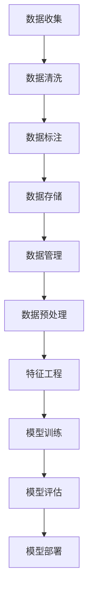

                 

# AI创业中的数据积累与应用

> 关键词：AI创业、数据积累、数据应用、机器学习、深度学习、大数据处理

> 摘要：本文旨在探讨AI创业过程中数据积累的重要性及其应用方法。通过分析数据积累的背景、核心概念、算法原理、数学模型、项目实战、应用场景、工具资源推荐以及未来发展趋势，为AI创业者提供全面的指导和建议。文章深入浅出地解释了数据积累与应用的关键步骤和技术细节，旨在帮助读者理解和掌握AI创业中的数据处理技术。

## 1. 背景介绍

### 1.1 AI创业的兴起

随着人工智能技术的快速发展，越来越多的企业和个人开始涉足AI领域，希望通过技术创新来获得竞争优势。AI创业不仅需要技术上的创新，还需要对数据的深刻理解和有效利用。数据是AI技术的核心，没有高质量的数据，AI模型的训练和优化将难以进行。

### 1.2 数据的重要性

数据是AI模型训练的基础，高质量的数据能够显著提升模型的准确性和泛化能力。在AI创业中，数据积累不仅包括数据的收集，还包括数据的清洗、标注、存储和管理等环节。有效的数据管理能够确保数据的质量，从而提高模型的性能。

## 2. 核心概念与联系

### 2.1 数据积累流程

数据积累流程包括数据收集、数据清洗、数据标注、数据存储和数据管理等环节。每个环节都至关重要，直接影响到最终模型的性能。

### 2.2 数据应用流程

数据应用流程包括数据预处理、特征工程、模型训练、模型评估和模型部署等环节。通过这些步骤，可以将积累的数据转化为实际应用中的价值。



## 3. 核心算法原理 & 具体操作步骤

### 3.1 数据清洗

数据清洗是数据积累中的重要步骤，目的是去除数据中的噪声和错误，提高数据质量。常见的数据清洗方法包括缺失值处理、异常值处理和重复值处理等。

#### 3.1.1 缺失值处理

缺失值处理方法包括删除含有缺失值的记录、填充缺失值（如使用平均值、中位数或众数填充）和预测缺失值等。

#### 3.1.2 异常值处理

异常值处理方法包括基于统计的方法（如Z-score、IQR等）和基于模型的方法（如聚类、回归等）。

#### 3.1.3 重复值处理

重复值处理方法包括基于记录唯一标识符的去重和基于内容相似度的去重。

### 3.2 数据标注

数据标注是将原始数据转化为机器学习模型可以理解的形式。常见的数据标注方法包括文本标注、图像标注和语音标注等。

#### 3.2.1 文本标注

文本标注包括情感分析、命名实体识别、文本分类等任务。

#### 3.2.2 图像标注

图像标注包括目标检测、图像分割、图像分类等任务。

#### 3.2.3 语音标注

语音标注包括语音识别、语音合成、声纹识别等任务。

### 3.3 数据存储

数据存储是数据积累中的重要环节，目的是确保数据的安全性和可访问性。常见的数据存储方法包括关系型数据库、NoSQL数据库和分布式文件系统等。

#### 3.3.1 关系型数据库

关系型数据库如MySQL、Oracle等，适用于结构化数据的存储。

#### 3.3.2 NoSQL数据库

NoSQL数据库如MongoDB、Cassandra等，适用于非结构化数据的存储。

#### 3.3.3 分布式文件系统

分布式文件系统如HDFS、GlusterFS等，适用于大规模数据的存储。

## 4. 数学模型和公式 & 详细讲解 & 举例说明

### 4.1 数据预处理

数据预处理是数据应用中的重要步骤，目的是将原始数据转化为适合模型训练的形式。常见的数据预处理方法包括标准化、归一化和特征选择等。

#### 4.1.1 标准化

标准化公式为：
$$
X' = \frac{X - \mu}{\sigma}
$$
其中，$X$为原始数据，$\mu$为均值，$\sigma$为标准差。

#### 4.1.2 归一化

归一化公式为：
$$
X' = \frac{X - X_{\min}}{X_{\max} - X_{\min}}
$$
其中，$X$为原始数据，$X_{\min}$为最小值，$X_{\max}$为最大值。

#### 4.1.3 特征选择

特征选择方法包括过滤法、包裹法和嵌入法等。

### 4.2 特征工程

特征工程是数据应用中的重要步骤，目的是从原始数据中提取有用的特征，提高模型的性能。常见的特征工程方法包括特征构造、特征组合和特征降维等。

#### 4.2.1 特征构造

特征构造方法包括多项式特征、交互特征和衍生特征等。

#### 4.2.2 特征组合

特征组合方法包括交叉特征、聚合特征和嵌套特征等。

#### 4.2.3 特征降维

特征降维方法包括主成分分析（PCA）、线性判别分析（LDA）和t-SNE等。

### 4.3 模型训练

模型训练是数据应用中的核心步骤，目的是通过训练数据来优化模型参数。常见的模型训练方法包括监督学习、无监督学习和强化学习等。

#### 4.3.1 监督学习

监督学习方法包括线性回归、逻辑回归、支持向量机（SVM）和神经网络等。

#### 4.3.2 无监督学习

无监督学习方法包括聚类、降维和关联规则等。

#### 4.3.3 强化学习

强化学习方法包括Q-learning、SARSA和Deep Q-Network（DQN）等。

### 4.4 模型评估

模型评估是数据应用中的重要步骤，目的是通过测试数据来评估模型的性能。常见的模型评估方法包括准确率、召回率、F1分数和AUC等。

#### 4.4.1 准确率

准确率公式为：
$$
Accuracy = \frac{TP + TN}{TP + TN + FP + FN}
$$
其中，$TP$为真正例，$TN$为真负例，$FP$为假正例，$FN$为假负例。

#### 4.4.2 召回率

召回率公式为：
$$
Recall = \frac{TP}{TP + FN}
$$

#### 4.4.3 F1分数

F1分数公式为：
$$
F1 = 2 \cdot \frac{Precision \cdot Recall}{Precision + Recall}
$$

#### 4.4.4 AUC

AUC是ROC曲线下的面积，用于评估分类模型的性能。

### 4.5 模型部署

模型部署是数据应用中的最后一步，目的是将训练好的模型部署到实际应用中。常见的模型部署方法包括在线服务、离线服务和边缘计算等。

#### 4.5.1 在线服务

在线服务方法包括RESTful API、gRPC和WebSocket等。

#### 4.5.2 离线服务

离线服务方法包括批处理、流处理和批流结合等。

#### 4.5.3 边缘计算

边缘计算方法包括设备端计算、网关端计算和云端计算等。

## 5. 项目实战：代码实际案例和详细解释说明

### 5.1 开发环境搭建

#### 5.1.1 环境配置

开发环境配置包括操作系统、编程语言、开发工具和库等。

#### 5.1.2 数据集准备

数据集准备包括数据下载、数据解压和数据预处理等。

### 5.2 源代码详细实现和代码解读

#### 5.2.1 数据预处理代码

```python
import pandas as pd
from sklearn.preprocessing import StandardScaler

# 读取数据
data = pd.read_csv('data.csv')

# 数据清洗
data.dropna(inplace=True)

# 数据标准化
scaler = StandardScaler()
data_scaled = scaler.fit_transform(data)
```

#### 5.2.2 特征工程代码

```python
from sklearn.decomposition import PCA

# 特征降维
pca = PCA(n_components=2)
data_pca = pca.fit_transform(data_scaled)
```

#### 5.2.3 模型训练代码

```python
from sklearn.linear_model import LogisticRegression

# 模型训练
model = LogisticRegression()
model.fit(data_pca, labels)
```

#### 5.2.4 模型评估代码

```python
from sklearn.metrics import accuracy_score

# 模型评估
predictions = model.predict(test_data_pca)
accuracy = accuracy_score(test_labels, predictions)
```

#### 5.2.5 模型部署代码

```python
from flask import Flask, request, jsonify

app = Flask(__name__)

@app.route('/predict', methods=['POST'])
def predict():
    data = request.json
    prediction = model.predict([data])
    return jsonify({'prediction': prediction.tolist()})
```

### 5.3 代码解读与分析

#### 5.3.1 数据预处理代码解读

数据预处理代码包括数据读取、数据清洗和数据标准化等步骤。通过这些步骤，可以确保数据的质量，提高模型的性能。

#### 5.3.2 特征工程代码解读

特征工程代码包括特征降维等步骤。通过这些步骤，可以从原始数据中提取有用的特征，提高模型的性能。

#### 5.3.3 模型训练代码解读

模型训练代码包括模型训练等步骤。通过这些步骤，可以优化模型参数，提高模型的性能。

#### 5.3.4 模型评估代码解读

模型评估代码包括模型评估等步骤。通过这些步骤，可以评估模型的性能，确保模型的准确性。

#### 5.3.5 模型部署代码解读

模型部署代码包括模型部署等步骤。通过这些步骤，可以将训练好的模型部署到实际应用中，实现模型的商业化。

## 6. 实际应用场景

### 6.1 金融风控

金融风控是AI创业中的重要应用场景，通过AI技术可以实现风险评估、欺诈检测和信用评分等功能。

### 6.2 医疗健康

医疗健康是AI创业中的重要应用场景，通过AI技术可以实现疾病诊断、药物研发和健康管理等功能。

### 6.3 智能制造

智能制造是AI创业中的重要应用场景，通过AI技术可以实现生产优化、质量控制和设备维护等功能。

### 6.4 智慧城市

智慧城市是AI创业中的重要应用场景，通过AI技术可以实现交通管理、环境监测和公共安全等功能。

## 7. 工具和资源推荐

### 7.1 学习资源推荐

#### 7.1.1 书籍

- 《深度学习》
- 《机器学习实战》
- 《Python数据科学手册》

#### 7.1.2 论文

- "Deep Learning" by Ian Goodfellow, Yoshua Bengio, and Aaron Courville
- "A Survey on Deep Learning for Natural Language Processing" by Yuhui Zhang and Zhiyuan Liu

#### 7.1.3 博客

- Medium上的AI博客
- Towards Data Science上的机器学习博客

#### 7.1.4 网站

- Kaggle
- GitHub

### 7.2 开发工具框架推荐

#### 7.2.1 数据处理工具

- Pandas
- NumPy
- SciPy

#### 7.2.2 模型训练框架

- TensorFlow
- PyTorch
- Scikit-learn

#### 7.2.3 模型部署工具

- Flask
- Django
- FastAPI

### 7.3 相关论文著作推荐

- "Deep Learning" by Ian Goodfellow, Yoshua Bengio, and Aaron Courville
- "A Survey on Deep Learning for Natural Language Processing" by Yuhui Zhang and Zhiyuan Liu

## 8. 总结：未来发展趋势与挑战

### 8.1 未来发展趋势

未来AI创业的发展趋势包括数据驱动、模型优化和应用创新等。随着技术的不断进步，AI创业将更加注重数据的质量和模型的性能，同时也会涌现出更多的创新应用场景。

### 8.2 面临的挑战

未来AI创业面临的挑战包括数据安全、模型解释性和伦理道德等。如何在保证数据安全的前提下，提高模型的解释性和透明度，将是未来AI创业需要解决的重要问题。

## 9. 附录：常见问题与解答

### 9.1 数据积累常见问题

#### 9.1.1 数据积累的难点是什么？

数据积累的难点在于数据的质量和数量。高质量的数据能够显著提升模型的性能，而大量的数据能够提高模型的泛化能力。

#### 9.1.2 如何解决数据积累中的问题？

可以通过数据清洗、数据标注和数据存储等步骤来解决数据积累中的问题。同时，也可以通过数据共享和数据交易等方式来获取更多的数据。

### 9.2 数据应用常见问题

#### 9.2.1 数据应用的难点是什么？

数据应用的难点在于数据预处理和特征工程。数据预处理可以提高数据的质量，而特征工程可以提高模型的性能。

#### 9.2.2 如何解决数据应用中的问题？

可以通过数据预处理、特征工程和模型训练等步骤来解决数据应用中的问题。同时，也可以通过模型评估和模型部署等步骤来确保模型的性能和稳定性。

## 10. 扩展阅读 & 参考资料

### 10.1 扩展阅读

- "Deep Learning" by Ian Goodfellow, Yoshua Bengio, and Aaron Courville
- "A Survey on Deep Learning for Natural Language Processing" by Yuhui Zhang and Zhiyuan Liu

### 10.2 参考资料

- Kaggle
- GitHub
- Medium上的AI博客
- Towards Data Science上的机器学习博客

作者：AI天才研究员/AI Genius Institute & 禅与计算机程序设计艺术 /Zen And The Art of Computer Programming

