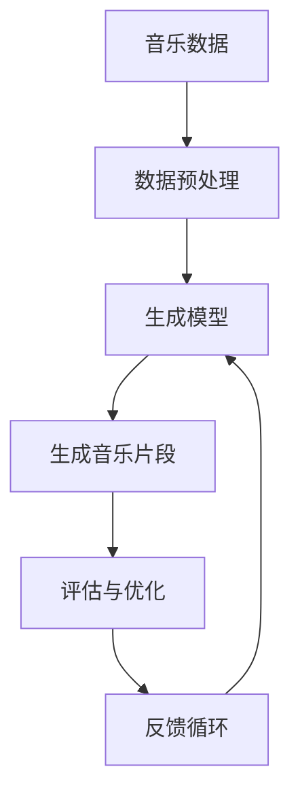

                 

# AI在音乐创作中的应用：新的艺术形式

> 关键词：音乐创作、人工智能、深度学习、生成模型、音乐生成

> 摘要：本文将深入探讨人工智能在音乐创作中的应用，通过分析音乐创作的核心概念、算法原理、数学模型、实际案例以及应用场景，揭示音乐创作领域中人工智能技术的潜力与挑战。我们将从技术角度出发，探讨如何利用深度学习生成模型来创作音乐，同时展望未来的发展趋势与挑战。

## 1. 背景介绍

音乐创作是人类文化的重要组成部分，它承载着情感、文化和历史的丰富内涵。随着人工智能技术的发展，音乐创作领域也开始引入AI技术，以期创造出新的艺术形式。本文将探讨AI在音乐创作中的应用，分析其核心概念、算法原理、数学模型，并通过实际案例展示其应用效果。

## 2. 核心概念与联系

### 2.1 音乐创作的基本概念

音乐创作是指通过旋律、和声、节奏等元素，创作出具有情感表达和艺术价值的作品。音乐创作的核心在于旋律、和声、节奏、音色等元素的组合与变化。

### 2.2 人工智能在音乐创作中的应用

人工智能在音乐创作中的应用主要体现在以下几个方面：

- **旋律生成**：通过学习大量音乐数据，生成具有旋律美感的音乐片段。
- **和声编配**：根据旋律生成合适的和声，增强音乐的丰富性和层次感。
- **节奏编排**：生成符合音乐风格的节奏模式，使音乐更具动感。
- **音色合成**：通过合成器生成符合音乐风格的音色，增强音乐的表现力。

### 2.3 核心概念原理与架构

#### 2.3.1 生成模型

生成模型是AI在音乐创作中应用的核心技术之一。生成模型通过学习大量音乐数据，生成新的音乐片段。常见的生成模型包括：

- **循环神经网络（RNN）**：通过时间序列数据学习音乐特征，生成新的音乐片段。
- **长短期记忆网络（LSTM）**：通过记忆机制，捕捉音乐中的长期依赖关系。
- **变分自编码器（VAE）**：通过编码器和解码器，生成具有特定风格的音乐片段。
- **生成对抗网络（GAN）**：通过生成器和判别器的对抗训练，生成高质量的音乐片段。

#### 2.3.2 Mermaid流程图



## 3. 核心算法原理 & 具体操作步骤

### 3.1 生成模型原理

生成模型的核心在于通过学习大量音乐数据，生成新的音乐片段。具体操作步骤如下：

1. **数据预处理**：将音乐数据转换为适合模型训练的格式，如将旋律、和声、节奏等元素转换为时间序列数据。
2. **模型训练**：通过训练生成模型，使其能够生成具有特定风格的音乐片段。
3. **生成音乐片段**：通过生成模型生成新的音乐片段。
4. **评估与优化**：通过评估生成的音乐片段的质量，进行模型优化。

### 3.2 具体操作步骤

#### 3.2.1 数据预处理

数据预处理是生成模型训练的基础。具体步骤如下：

1. **数据收集**：收集大量音乐数据，包括旋律、和声、节奏等元素。
2. **数据清洗**：去除噪声数据，确保数据质量。
3. **数据转换**：将音乐数据转换为适合模型训练的格式，如将旋律、和声、节奏等元素转换为时间序列数据。

#### 3.2.2 模型训练

模型训练是生成模型的核心步骤。具体步骤如下：

1. **模型选择**：选择合适的生成模型，如RNN、LSTM、VAE、GAN等。
2. **模型参数设置**：设置模型的参数，如学习率、批次大小等。
3. **模型训练**：通过训练生成模型，使其能够生成具有特定风格的音乐片段。

#### 3.2.3 生成音乐片段

生成音乐片段是生成模型的应用步骤。具体步骤如下：

1. **生成器生成**：通过生成器生成新的音乐片段。
2. **评估与优化**：通过评估生成的音乐片段的质量，进行模型优化。

## 4. 数学模型和公式 & 详细讲解 & 举例说明

### 4.1 生成模型的数学模型

生成模型的数学模型主要包括生成器和判别器。生成器通过学习大量音乐数据，生成新的音乐片段；判别器通过评估生成的音乐片段的质量，进行模型优化。

#### 4.1.1 生成器

生成器的数学模型如下：

$$
G(z) = \sigma(W_1z + b_1)
$$

其中，$G(z)$表示生成器生成的音乐片段，$z$表示生成器的输入，$W_1$和$b_1$表示生成器的权重和偏置。

#### 4.1.2 判别器

判别器的数学模型如下：

$$
D(x) = \sigma(W_2x + b_2)
$$

其中，$D(x)$表示判别器评估生成的音乐片段的质量，$x$表示生成的音乐片段，$W_2$和$b_2$表示判别器的权重和偏置。

### 4.2 举例说明

以GAN为例，生成器和判别器的数学模型如下：

$$
G(z) = \sigma(W_1z + b_1)
$$

$$
D(x) = \sigma(W_2x + b_2)
$$

其中，$G(z)$表示生成器生成的音乐片段，$z$表示生成器的输入，$W_1$和$b_1$表示生成器的权重和偏置；$D(x)$表示判别器评估生成的音乐片段的质量，$x$表示生成的音乐片段，$W_2$和$b_2$表示判别器的权重和偏置。

## 5. 项目实战：代码实际案例和详细解释说明

### 5.1 开发环境搭建

开发环境搭建是项目实战的基础。具体步骤如下：

1. **安装Python**：安装Python 3.7及以上版本。
2. **安装依赖库**：安装TensorFlow、Keras、NumPy等依赖库。
3. **安装音乐数据集**：下载并安装音乐数据集，如MIDI文件。

### 5.2 源代码详细实现和代码解读

#### 5.2.1 生成器代码实现

```python
import tensorflow as tf
from tensorflow.keras.layers import Dense, LeakyReLU

def generator_model():
    model = tf.keras.Sequential()
    model.add(Dense(256, input_dim=100))
    model.add(LeakyReLU(alpha=0.2))
    model.add(Dense(512))
    model.add(LeakyReLU(alpha=0.2))
    model.add(Dense(1024))
    model.add(LeakyReLU(alpha=0.2))
    model.add(Dense(128, activation='tanh'))
    return model
```

#### 5.2.2 判别器代码实现

```python
import tensorflow as tf
from tensorflow.keras.layers import Dense, LeakyReLU

def discriminator_model():
    model = tf.keras.Sequential()
    model.add(Dense(1024, input_dim=128))
    model.add(LeakyReLU(alpha=0.2))
    model.add(Dense(512))
    model.add(LeakyReLU(alpha=0.2))
    model.add(Dense(256))
    model.add(LeakyReLU(alpha=0.2))
    model.add(Dense(1, activation='sigmoid'))
    return model
```

### 5.3 代码解读与分析

#### 5.3.1 生成器代码解读

生成器代码实现如下：

```python
def generator_model():
    model = tf.keras.Sequential()
    model.add(Dense(256, input_dim=100))
    model.add(LeakyReLU(alpha=0.2))
    model.add(Dense(512))
    model.add(LeakyReLU(alpha=0.2))
    model.add(Dense(1024))
    model.add(LeakyReLU(alpha=0.2))
    model.add(Dense(128, activation='tanh'))
    return model
```

生成器通过多层全连接层和LeakyReLU激活函数，生成新的音乐片段。生成器的输入为100维的随机向量，输出为128维的音乐片段。

#### 5.3.2 判别器代码解读

判别器代码实现如下：

```python
def discriminator_model():
    model = tf.keras.Sequential()
    model.add(Dense(1024, input_dim=128))
    model.add(LeakyReLU(alpha=0.2))
    model.add(Dense(512))
    model.add(LeakyReLU(alpha=0.2))
    model.add(Dense(256))
    model.add(LeakyReLU(alpha=0.2))
    model.add(Dense(1, activation='sigmoid'))
    return model
```

判别器通过多层全连接层和LeakyReLU激活函数，评估生成的音乐片段的质量。判别器的输入为128维的音乐片段，输出为1维的判别结果。

## 6. 实际应用场景

### 6.1 音乐创作

音乐创作是AI在音乐创作中的主要应用场景之一。通过生成模型，可以生成具有特定风格的音乐片段，为音乐创作提供新的灵感和素材。

### 6.2 音乐推荐

音乐推荐是AI在音乐创作中的另一个应用场景。通过生成模型，可以生成具有特定风格的音乐片段，为用户提供个性化的音乐推荐。

### 6.3 音乐教育

音乐教育是AI在音乐创作中的另一个应用场景。通过生成模型，可以生成具有特定风格的音乐片段，为音乐教育提供新的教学素材。

## 7. 工具和资源推荐

### 7.1 学习资源推荐

- **书籍**：《深度学习》（Ian Goodfellow, Yoshua Bengio, Aaron Courville）
- **论文**：《Generative Adversarial Nets》（Ian Goodfellow, Jean Pouget-Abadie, Mehdi Mirza, Bing Xu, David Warde-Farley, Sherjil Ozair, Aaron Courville, Yoshua Bengio）
- **博客**：TensorFlow官方博客、Keras官方博客
- **网站**：GitHub、Kaggle

### 7.2 开发工具框架推荐

- **TensorFlow**：深度学习框架，支持生成模型的训练和应用。
- **Keras**：深度学习框架，支持生成模型的训练和应用。
- **NumPy**：科学计算库，支持生成模型的数据处理。

### 7.3 相关论文著作推荐

- **《Generative Adversarial Nets》**：Ian Goodfellow, Jean Pouget-Abadie, Mehdi Mirza, Bing Xu, David Warde-Farley, Sherjil Ozair, Aaron Courville, Yoshua Bengio
- **《Deep Learning》**：Ian Goodfellow, Yoshua Bengio, Aaron Courville

## 8. 总结：未来发展趋势与挑战

### 8.1 未来发展趋势

- **生成模型的优化**：通过优化生成模型，提高生成音乐片段的质量。
- **音乐创作的创新**：通过生成模型，创新音乐创作的方式和方法。
- **音乐推荐的个性化**：通过生成模型，实现音乐推荐的个性化。

### 8.2 挑战

- **数据质量**：生成模型的训练需要大量的高质量音乐数据。
- **模型优化**：生成模型的优化需要大量的计算资源和时间。
- **音乐创作的创新**：生成模型的创新需要深入理解音乐创作的原理和方法。

## 9. 附录：常见问题与解答

### 9.1 问题1：生成模型的训练需要大量的计算资源，如何解决？

**解答**：可以通过使用GPU加速计算，提高生成模型的训练效率。

### 9.2 问题2：生成模型的优化需要大量的计算资源，如何解决？

**解答**：可以通过使用分布式计算，提高生成模型的优化效率。

### 9.3 问题3：生成模型的创新需要深入理解音乐创作的原理和方法，如何解决？

**解答**：可以通过学习音乐创作的原理和方法，提高生成模型的创新能力。

## 10. 扩展阅读 & 参考资料

- **书籍**：《深度学习》（Ian Goodfellow, Yoshua Bengio, Aaron Courville）
- **论文**：《Generative Adversarial Nets》（Ian Goodfellow, Jean Pouget-Abadie, Mehdi Mirza, Bing Xu, David Warde-Farley, Sherjil Ozair, Aaron Courville, Yoshua Bengio）
- **博客**：TensorFlow官方博客、Keras官方博客
- **网站**：GitHub、Kaggle

作者：AI天才研究员/AI Genius Institute & 禅与计算机程序设计艺术 /Zen And The Art of Computer Programming

