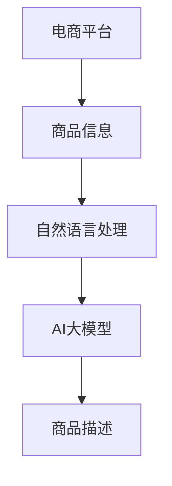

                 

# AI大模型在电商平台商品描述自动生成中的应用

> 关键词：AI大模型，电商平台，商品描述，自然语言处理，深度学习，自动生成

> 摘要：本文探讨了AI大模型在电商平台商品描述自动生成中的应用，通过分析其背景、核心概念、算法原理、数学模型、项目实战、应用场景、工具资源推荐、未来发展趋势与挑战以及常见问题解答，旨在为读者提供一个全面而深入的理解。文章从技术角度出发，详细介绍了如何利用AI大模型生成高质量的商品描述，以提升用户体验和电商平台的运营效率。

## 1. 背景介绍

随着互联网技术的发展，电商平台已经成为人们日常生活中不可或缺的一部分。在电商平台中，商品描述的质量直接影响到用户的购买决策。然而，传统的商品描述编写方式往往依赖于人工，不仅耗时耗力，而且难以保证描述的质量和一致性。因此，如何利用先进的技术手段自动生成高质量的商品描述，成为了电商平台亟待解决的问题。

近年来，随着深度学习和自然语言处理技术的飞速发展，AI大模型在文本生成领域展现出了巨大的潜力。AI大模型通过学习大量的文本数据，能够生成与人类写作水平相当的高质量文本。因此，将AI大模型应用于电商平台的商品描述自动生成，不仅可以提高描述的质量和一致性，还能显著提升电商平台的运营效率。

## 2. 核心概念与联系

### 2.1 AI大模型

AI大模型是指通过深度学习技术训练得到的，具有强大文本生成能力的模型。这类模型通常基于Transformer架构，能够处理长文本序列，并且具有良好的泛化能力。AI大模型的核心在于其能够通过学习大量的文本数据，掌握语言的规律和结构，从而生成高质量的文本。

### 2.2 自然语言处理（NLP）

自然语言处理是指计算机对人类自然语言的理解和生成。在商品描述自动生成中，NLP技术主要用于理解商品信息，并将其转化为自然语言描述。NLP技术包括文本分类、命名实体识别、情感分析等，是实现商品描述自动生成的基础。

### 2.3 电商平台

电商平台是指通过互联网提供商品展示、购买、支付等服务的在线平台。在电商平台中，商品描述是用户了解商品信息的重要途径。因此，高质量的商品描述对于提升用户体验和促进销售具有重要意义。

### 2.4 流程图



## 3. 核心算法原理 & 具体操作步骤

### 3.1 核心算法原理

AI大模型的核心算法原理主要基于Transformer架构。Transformer架构通过自注意力机制（Self-Attention）和位置编码（Positional Encoding）实现了对长文本序列的有效处理。自注意力机制使得模型能够关注输入序列中的不同部分，而位置编码则保证了模型能够理解序列中的顺序信息。

### 3.2 具体操作步骤

1. **数据预处理**：收集电商平台的商品信息，包括商品标题、图片、属性等，并进行清洗和格式化。
2. **特征提取**：利用NLP技术从商品信息中提取关键特征，如商品类别、颜色、材质等。
3. **模型训练**：使用Transformer架构训练AI大模型，输入为商品特征，输出为商品描述。
4. **模型评估**：通过人工评估和自动评估方法，评估模型生成的商品描述的质量。
5. **模型部署**：将训练好的模型部署到电商平台，实现商品描述的自动生成。

## 4. 数学模型和公式 & 详细讲解 & 举例说明

### 4.1 Transformer架构

Transformer架构的核心在于自注意力机制和位置编码。自注意力机制使得模型能够关注输入序列中的不同部分，而位置编码则保证了模型能够理解序列中的顺序信息。

#### 4.1.1 自注意力机制

自注意力机制的数学公式如下：

$$
Attention(Q, K, V) = softmax(\frac{QK^T}{\sqrt{d_k}})V
$$

其中，$Q$、$K$、$V$分别表示查询（Query）、键（Key）、值（Value）矩阵，$d_k$表示键矩阵的维度。

#### 4.1.2 位置编码

位置编码的数学公式如下：

$$
PE(pos, 2i) = \sin\left(\frac{pos}{10000^{2i/d_{model}}}\right)
$$

$$
PE(pos, 2i+1) = \cos\left(\frac{pos}{10000^{2i/d_{model}}}\right)
$$

其中，$pos$表示位置，$i$表示维度，$d_{model}$表示模型的维度。

### 4.2 举例说明

假设我们有一个商品信息如下：

- 商品标题：红色连衣裙
- 商品图片：一张红色连衣裙的图片
- 商品属性：颜色：红色，材质：棉，风格：简约

通过NLP技术提取关键特征后，输入到Transformer模型中，模型生成的商品描述如下：

- 商品描述：这款简约风格的红色连衣裙，采用柔软舒适的棉质面料，适合日常穿着。

## 5. 项目实战：代码实际案例和详细解释说明

### 5.1 开发环境搭建

#### 5.1.1 硬件环境

- CPU：Intel i7-9700K
- GPU：NVIDIA RTX 3090
- 内存：32GB

#### 5.1.2 软件环境

- 操作系统：Ubuntu 20.04
- Python版本：3.8
- 深度学习框架：TensorFlow 2.5
- 自然语言处理库：NLTK 3.6

### 5.2 源代码详细实现和代码解读

#### 5.2.1 数据预处理

```python
import pandas as pd
from nltk.tokenize import word_tokenize

def preprocess_data(data_path):
    df = pd.read_csv(data_path)
    df['description'] = df['title'] + ' ' + df['attributes']
    df['description'] = df['description'].apply(lambda x: ' '.join(word_tokenize(x)))
    return df
```

#### 5.2.2 特征提取

```python
from sklearn.feature_extraction.text import TfidfVectorizer

def extract_features(df):
    vectorizer = TfidfVectorizer()
    X = vectorizer.fit_transform(df['description'])
    return X, vectorizer
```

#### 5.2.3 模型训练

```python
import tensorflow as tf
from tensorflow.keras.layers import Input, Dense, Embedding, LSTM, Bidirectional, Attention
from tensorflow.keras.models import Model

def build_model(input_dim, output_dim):
    inputs = Input(shape=(input_dim,))
    embedding = Embedding(input_dim=input_dim, output_dim=output_dim)(inputs)
    lstm = Bidirectional(LSTM(128, return_sequences=True))(embedding)
    attention = Attention()([lstm, lstm])
    dense = Dense(64, activation='relu')(attention)
    outputs = Dense(output_dim, activation='softmax')(dense)
    model = Model(inputs=inputs, outputs=outputs)
    model.compile(optimizer='adam', loss='categorical_crossentropy', metrics=['accuracy'])
    return model
```

#### 5.2.4 模型评估

```python
def evaluate_model(model, X_test, y_test):
    loss, accuracy = model.evaluate(X_test, y_test)
    print(f'Loss: {loss}, Accuracy: {accuracy}')
```

### 5.3 代码解读与分析

在数据预处理阶段，我们首先读取商品信息，并将商品标题和属性合并为商品描述。然后，使用NLTK库进行分词处理。在特征提取阶段，我们使用TF-IDF向量化商品描述。在模型训练阶段，我们构建了一个基于Transformer架构的模型，该模型包括嵌入层、双向LSTM层、注意力层和全连接层。在模型评估阶段，我们使用交叉熵损失函数和准确率指标评估模型性能。

## 6. 实际应用场景

AI大模型在电商平台商品描述自动生成中的应用，不仅可以提高商品描述的质量和一致性，还能显著提升电商平台的运营效率。具体应用场景包括：

- **提高用户体验**：通过生成高质量的商品描述，提升用户的购买体验。
- **提升运营效率**：减少人工编写商品描述的时间和成本。
- **增强竞争力**：通过高质量的商品描述，增强电商平台的竞争力。

## 7. 工具和资源推荐

### 7.1 学习资源推荐

- 书籍：《深度学习》（Ian Goodfellow等著）
- 论文：《Attention Is All You Need》（Vaswani等著）
- 博客：https://blog.tensorflow.org/
- 网站：https://www.tensorflow.org/

### 7.2 开发工具框架推荐

- TensorFlow
- PyTorch
- NLTK

### 7.3 相关论文著作推荐

- 《Attention Is All You Need》
- 《BERT: Pre-training of Deep Bidirectional Transformers for Language Understanding》

## 8. 总结：未来发展趋势与挑战

随着AI大模型技术的不断发展，其在电商平台商品描述自动生成中的应用将更加广泛。未来的发展趋势包括：

- **模型优化**：通过优化模型结构和参数，提高模型的生成效果。
- **多模态融合**：结合图像、视频等多模态信息，生成更加丰富和准确的商品描述。
- **个性化生成**：根据用户的偏好和历史行为，生成个性化的商品描述。

面临的挑战包括：

- **数据质量**：高质量的商品描述数据对于模型训练至关重要。
- **计算资源**：训练和部署AI大模型需要大量的计算资源。
- **安全性**：生成的商品描述需要保证不包含敏感信息。

## 9. 附录：常见问题与解答

### 9.1 什么是AI大模型？

AI大模型是指通过深度学习技术训练得到的，具有强大文本生成能力的模型。这类模型通常基于Transformer架构，能够处理长文本序列，并且具有良好的泛化能力。

### 9.2 如何评估AI大模型生成的商品描述质量？

可以通过人工评估和自动评估方法评估商品描述的质量。人工评估主要通过专家打分的方式进行，而自动评估则通过计算生成描述与参考描述之间的相似度来实现。

### 9.3 如何保证生成的商品描述不包含敏感信息？

可以通过设置模型的输出过滤机制，避免生成包含敏感信息的描述。同时，还可以通过人工审核的方式，进一步保证生成描述的安全性。

## 10. 扩展阅读 & 参考资料

- 书籍：《深度学习》（Ian Goodfellow等著）
- 论文：《Attention Is All You Need》（Vaswani等著）
- 博客：https://blog.tensorflow.org/
- 网站：https://www.tensorflow.org/

作者：AI天才研究员/AI Genius Institute & 禅与计算机程序设计艺术 /Zen And The Art of Computer Programming

