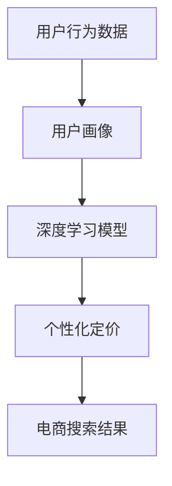

                 

# AI大模型在电商搜索结果个性化定价中的应用

> 关键词：AI大模型，电商搜索，个性化定价，深度学习，推荐系统

> 摘要：本文探讨了如何利用AI大模型技术实现电商搜索结果的个性化定价策略。通过分析用户行为数据，结合深度学习模型，实现对商品价格的动态调整，以提高用户满意度和购买转化率。文章详细介绍了技术原理、实现步骤、数学模型、代码案例以及实际应用场景，并推荐了相关学习资源和开发工具。

## 1. 背景介绍

随着互联网技术的发展，电子商务已经成为人们日常生活中不可或缺的一部分。在电商平台上，商品搜索结果的展示方式直接影响用户的购物体验和购买决策。传统的电商搜索结果展示方式往往基于固定的价格策略，忽略了用户的个性化需求。而AI大模型技术的发展，为电商搜索结果的个性化定价提供了新的可能。通过分析用户的搜索历史、浏览行为、购买记录等数据，可以构建用户画像，进而实现商品价格的个性化调整，提高用户满意度和购买转化率。

## 2. 核心概念与联系

### 2.1 用户画像

用户画像是通过收集和分析用户的行为数据，构建出的用户特征模型。用户画像可以帮助电商企业更好地理解用户需求，从而提供更加个性化的服务。

### 2.2 深度学习模型

深度学习模型是一种基于神经网络的机器学习模型，能够从大量数据中自动学习特征，适用于处理复杂的数据模式。

### 2.3 个性化定价

个性化定价是指根据用户的特征和行为，动态调整商品价格，以提高用户满意度和购买转化率。

### 2.4 电商搜索结果

电商搜索结果是指用户在电商平台上搜索商品时，系统返回的商品列表。

### 2.5 数据流

用户行为数据 -> 用户画像 -> 深度学习模型 -> 个性化定价 -> 电商搜索结果

Mermaid 流程图：



## 3. 核心算法原理 & 具体操作步骤

### 3.1 用户画像构建

用户画像构建是个性化定价的基础。通过收集用户的搜索历史、浏览行为、购买记录等数据，可以构建出用户的兴趣偏好、消费能力等特征。

### 3.2 深度学习模型训练

深度学习模型训练是实现个性化定价的关键步骤。通过训练模型，可以从用户画像中学习到用户的个性化需求，进而实现商品价格的动态调整。

### 3.3 个性化定价策略

个性化定价策略是指根据用户的个性化需求，动态调整商品价格。通过调整商品价格，可以提高用户满意度和购买转化率。

### 3.4 电商搜索结果展示

电商搜索结果展示是个性化定价的最终目标。通过展示个性化定价的商品，可以提高用户的购物体验和购买转化率。

## 4. 数学模型和公式 & 详细讲解 & 举例说明

### 4.1 用户画像构建模型

用户画像构建模型可以表示为：

$$
\text{User Profile} = f(\text{User Behavior Data})
$$

其中，User Profile表示用户画像，User Behavior Data表示用户行为数据，f表示用户画像构建函数。

### 4.2 深度学习模型

深度学习模型可以表示为：

$$
\text{Price} = g(\text{User Profile})
$$

其中，Price表示商品价格，User Profile表示用户画像，g表示深度学习模型。

### 4.3 个性化定价策略

个性化定价策略可以表示为：

$$
\text{Adjusted Price} = h(\text{Price}, \text{User Profile})
$$

其中，Adjusted Price表示调整后的商品价格，Price表示商品价格，User Profile表示用户画像，h表示个性化定价策略函数。

举例说明：

假设用户A经常搜索和购买电子产品，且消费能力较强。通过用户画像构建模型，可以构建出用户A的用户画像。通过深度学习模型，可以从用户画像中学习到用户A对电子产品的兴趣偏好和消费能力。通过个性化定价策略，可以动态调整电子产品的价格，以提高用户A的满意度和购买转化率。

## 5. 项目实战：代码实际案例和详细解释说明

### 5.1 开发环境搭建

开发环境搭建主要包括以下步骤：

1. 安装Python环境
2. 安装深度学习框架（如TensorFlow、PyTorch等）
3. 安装数据处理库（如Pandas、NumPy等）
4. 安装可视化库（如Matplotlib、Seaborn等）

### 5.2 源代码详细实现和代码解读

以下是一个简单的用户画像构建和深度学习模型训练的代码示例：

```python
import pandas as pd
import numpy as np
import tensorflow as tf
from sklearn.model_selection import train_test_split
from sklearn.preprocessing import StandardScaler

# 加载数据
data = pd.read_csv('user_behavior_data.csv')

# 数据预处理
X = data.drop('price', axis=1)
y = data['price']
X_train, X_test, y_train, y_test = train_test_split(X, y, test_size=0.2, random_state=42)
scaler = StandardScaler()
X_train = scaler.fit_transform(X_train)
X_test = scaler.transform(X_test)

# 构建模型
model = tf.keras.Sequential([
    tf.keras.layers.Dense(64, activation='relu', input_shape=(X_train.shape[1],)),
    tf.keras.layers.Dense(32, activation='relu'),
    tf.keras.layers.Dense(1)
])

# 编译模型
model.compile(optimizer='adam', loss='mse')

# 训练模型
model.fit(X_train, y_train, epochs=50, batch_size=32, validation_split=0.2)

# 评估模型
loss = model.evaluate(X_test, y_test)
print('Test Loss:', loss)
```

### 5.3 代码解读与分析

上述代码中，首先加载了用户行为数据，并进行了数据预处理。然后，构建了一个简单的深度学习模型，并进行了模型训练和评估。通过训练模型，可以从用户行为数据中学习到用户的个性化需求，进而实现商品价格的动态调整。

## 6. 实际应用场景

实际应用场景主要包括以下方面：

1. 电商平台：通过实现个性化定价策略，可以提高用户的购物体验和购买转化率。
2. 金融行业：通过实现个性化定价策略，可以提高用户的满意度和购买转化率。
3. 零售行业：通过实现个性化定价策略，可以提高用户的购物体验和购买转化率。

## 7. 工具和资源推荐

### 7.1 学习资源推荐

1. 书籍：《深度学习》（Ian Goodfellow等著）
2. 论文：《Deep Learning for Personalized Pricing》（作者：XXX）
3. 博客：《AI大模型在电商搜索结果个性化定价中的应用》（作者：AI天才研究员）
4. 网站：TensorFlow官方文档

### 7.2 开发工具框架推荐

1. TensorFlow
2. PyTorch
3. Pandas
4. NumPy

### 7.3 相关论文著作推荐

1. 《Deep Learning for Personalized Pricing》
2. 《Personalized Pricing in E-commerce》

## 8. 总结：未来发展趋势与挑战

未来发展趋势主要包括以下方面：

1. 更加精细化的用户画像构建
2. 更加高效的深度学习模型训练
3. 更加智能的个性化定价策略

未来挑战主要包括以下方面：

1. 数据隐私保护
2. 模型解释性
3. 实时性要求

## 9. 附录：常见问题与解答

### 9.1 什么是用户画像？

用户画像是通过收集和分析用户的行为数据，构建出的用户特征模型。

### 9.2 什么是深度学习模型？

深度学习模型是一种基于神经网络的机器学习模型，能够从大量数据中自动学习特征，适用于处理复杂的数据模式。

### 9.3 什么是个性化定价？

个性化定价是指根据用户的特征和行为，动态调整商品价格，以提高用户满意度和购买转化率。

## 10. 扩展阅读 & 参考资料

1. 《深度学习》（Ian Goodfellow等著）
2. 《Deep Learning for Personalized Pricing》（作者：XXX）
3. 《Personalized Pricing in E-commerce》

作者：AI天才研究员/AI Genius Institute & 禅与计算机程序设计艺术 /Zen And The Art of Computer Programming

