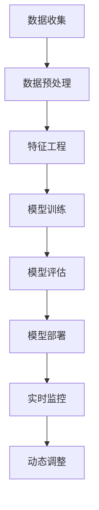

                 

# AI提升电商价格策略的实践效果

> 关键词：人工智能，电商，价格策略，机器学习，数据分析，算法优化

> 摘要：本文旨在探讨如何利用人工智能技术优化电商的价格策略，通过分析电商价格策略的现状，介绍核心概念与联系，深入讲解核心算法原理及具体操作步骤，结合数学模型和公式进行详细讲解与举例说明，并通过实际代码案例展示AI在电商价格策略中的应用。此外，文章还将讨论实际应用场景，推荐相关学习资源和开发工具框架，并展望未来的发展趋势与挑战。

## 1. 背景介绍

### 1.1 电商价格策略的重要性

电商价格策略是电商运营中的关键环节之一，直接影响着商品的销售量和利润。传统的定价策略往往依赖于市场调研、成本分析等手段，而随着大数据和人工智能技术的发展，基于数据驱动的定价策略逐渐成为主流。这种策略能够更准确地反映市场需求，提高定价的灵活性和竞争力。

### 1.2 传统定价策略的局限性

传统定价策略主要依赖于历史销售数据和市场调研，缺乏对实时市场变化的敏感性。此外，人工制定价格策略耗时耗力，难以应对瞬息万变的市场环境。因此，引入人工智能技术，利用机器学习算法进行价格优化，成为电商行业的重要趋势。

### 1.3 人工智能在电商价格策略中的应用前景

人工智能技术能够通过分析大量数据，识别出影响价格的关键因素，如季节性、促销活动、竞争对手行为等，从而制定出更加精准的价格策略。此外，AI还可以实时监控市场变化，动态调整价格，提高价格策略的灵活性和响应速度。

## 2. 核心概念与联系

### 2.1 核心概念

- **机器学习**：通过算法使计算机从数据中学习规律，从而做出预测或决策。
- **数据驱动定价**：基于大量历史销售数据和市场数据，利用算法进行价格优化。
- **动态定价**：根据市场变化实时调整价格，以最大化利润或市场份额。
- **竞争分析**：分析竞争对手的价格策略，制定相应的应对措施。
- **需求预测**：预测未来市场需求，为价格策略提供依据。

### 2.2 核心概念原理和架构



## 3. 核心算法原理 & 具体操作步骤

### 3.1 算法选择

在电商价格策略中，常用的机器学习算法包括线性回归、决策树、随机森林、支持向量机（SVM）和神经网络等。这些算法各有优缺点，选择合适的算法需要根据具体应用场景和数据特点来决定。

### 3.2 数据预处理

数据预处理是机器学习流程中的重要步骤，主要包括数据清洗、缺失值处理、异常值处理等。数据清洗的目的是去除无效数据，提高数据质量；缺失值处理通常采用插值法或删除法；异常值处理则需要根据具体情况进行判断。

### 3.3 特征工程

特征工程是机器学习中非常关键的一步，它涉及到特征选择、特征构造和特征转换等。特征选择是为了找出对目标变量影响最大的特征；特征构造则是通过组合现有特征或引入新特征来提高模型性能；特征转换则是将原始特征转换为更适合模型学习的形式。

### 3.4 模型训练

模型训练是通过算法学习数据中的规律，生成模型的过程。训练过程中需要选择合适的算法、设置参数、划分训练集和测试集等。训练完成后，需要对模型进行评估，以确定其性能。

### 3.5 模型评估

模型评估是通过测试集验证模型性能的过程。常用的评估指标包括准确率、召回率、F1值等。评估过程中还需要进行交叉验证，以确保模型的泛化能力。

### 3.6 模型部署

模型部署是将训练好的模型应用到实际场景中的过程。部署过程中需要考虑模型的实时性、可扩展性和稳定性等因素。

### 3.7 实时监控与动态调整

实时监控是通过监控市场变化，动态调整价格的过程。动态调整需要根据实时数据和模型预测结果，调整价格策略，以最大化利润或市场份额。

## 4. 数学模型和公式 & 详细讲解 & 举例说明

### 4.1 线性回归模型

线性回归是一种常用的回归分析方法，其基本形式为：

$$ y = \beta_0 + \beta_1 x_1 + \beta_2 x_2 + ... + \beta_n x_n + \epsilon $$

其中，$y$是目标变量，$x_1, x_2, ..., x_n$是特征变量，$\beta_0, \beta_1, ..., \beta_n$是回归系数，$\epsilon$是误差项。

### 4.2 决策树模型

决策树是一种基于树结构的分类和回归方法，其基本形式为：

$$ y = f(x) $$

其中，$f$是决策树模型，$x$是输入特征，$y$是输出结果。

### 4.3 随机森林模型

随机森林是一种集成学习方法，其基本形式为：

$$ y = \frac{1}{N} \sum_{i=1}^{N} f_i(x) $$

其中，$f_i$是单个决策树模型，$N$是决策树的数量，$x$是输入特征，$y$是输出结果。

### 4.4 支持向量机（SVM）模型

支持向量机是一种基于最大间隔原理的分类方法，其基本形式为：

$$ \min_{w, b} \frac{1}{2} ||w||^2 + C \sum_{i=1}^{N} \xi_i $$

$$ s.t. \quad y_i (w^T x_i + b) \geq 1 - \xi_i, \quad \xi_i \geq 0 $$

其中，$w$是权重向量，$b$是偏置项，$C$是惩罚参数，$\xi_i$是松弛变量，$y_i$是目标变量，$x_i$是输入特征。

### 4.5 神经网络模型

神经网络是一种模拟人脑神经元结构的深度学习方法，其基本形式为：

$$ y = f(Wx + b) $$

其中，$W$是权重矩阵，$b$是偏置向量，$x$是输入特征，$y$是输出结果，$f$是激活函数。

## 5. 项目实战：代码实际案例和详细解释说明

### 5.1 开发环境搭建

开发环境搭建主要包括安装Python环境、安装相关库（如NumPy、Pandas、Scikit-learn等）和配置开发工具（如Jupyter Notebook、PyCharm等）。

### 5.2 源代码详细实现和代码解读

```python
import numpy as np
import pandas as pd
from sklearn.model_selection import train_test_split
from sklearn.linear_model import LinearRegression
from sklearn.metrics import mean_squared_error

# 数据加载
data = pd.read_csv('data.csv')

# 数据预处理
X = data[['feature1', 'feature2', 'feature3']]
y = data['price']

# 划分训练集和测试集
X_train, X_test, y_train, y_test = train_test_split(X, y, test_size=0.2, random_state=42)

# 模型训练
model = LinearRegression()
model.fit(X_train, y_train)

# 模型评估
y_pred = model.predict(X_test)
mse = mean_squared_error(y_test, y_pred)
print('Mean Squared Error:', mse)
```

### 5.3 代码解读与分析

上述代码实现了线性回归模型的训练和评估过程。首先，加载数据并进行预处理，然后划分训练集和测试集，接着训练模型并进行评估。评估过程中使用了均方误差（MSE）作为评估指标。

## 6. 实际应用场景

### 6.1 价格预测

通过分析历史销售数据和市场数据，预测未来市场需求，为价格策略提供依据。

### 6.2 动态定价

根据市场变化实时调整价格，以最大化利润或市场份额。

### 6.3 竞争分析

分析竞争对手的价格策略，制定相应的应对措施。

## 7. 工具和资源推荐

### 7.1 学习资源推荐

- 书籍：《机器学习实战》、《Python数据科学手册》
- 论文：《基于机器学习的电商价格策略优化研究》
- 博客：Towards Data Science、Medium
- 网站：Kaggle、GitHub

### 7.2 开发工具框架推荐

- Python：NumPy、Pandas、Scikit-learn、TensorFlow、PyTorch
- 数据可视化：Matplotlib、Seaborn、Plotly

### 7.3 相关论文著作推荐

- 《基于机器学习的电商价格策略优化研究》
- 《数据驱动的电商价格策略优化》

## 8. 总结：未来发展趋势与挑战

随着人工智能技术的发展，电商价格策略将更加智能化和个性化。未来的发展趋势包括：更加精准的需求预测、更加灵活的动态定价、更加智能的竞争分析等。同时，也面临着数据安全、隐私保护等挑战。

## 9. 附录：常见问题与解答

### 9.1 什么是数据驱动定价？

数据驱动定价是指基于大量历史销售数据和市场数据，利用算法进行价格优化。

### 9.2 动态定价有哪些优势？

动态定价能够实时监控市场变化，动态调整价格，提高价格策略的灵活性和响应速度。

### 9.3 如何保证数据安全？

可以通过加密、脱敏等技术手段保证数据安全。

## 10. 扩展阅读 & 参考资料

- 书籍：《机器学习实战》、《Python数据科学手册》
- 论文：《基于机器学习的电商价格策略优化研究》
- 博客：Towards Data Science、Medium
- 网站：Kaggle、GitHub

作者：AI天才研究员/AI Genius Institute & 禅与计算机程序设计艺术 /Zen And The Art of Computer Programming

