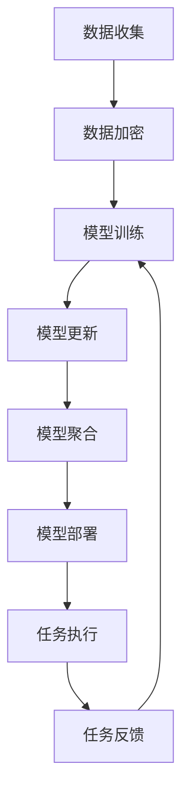
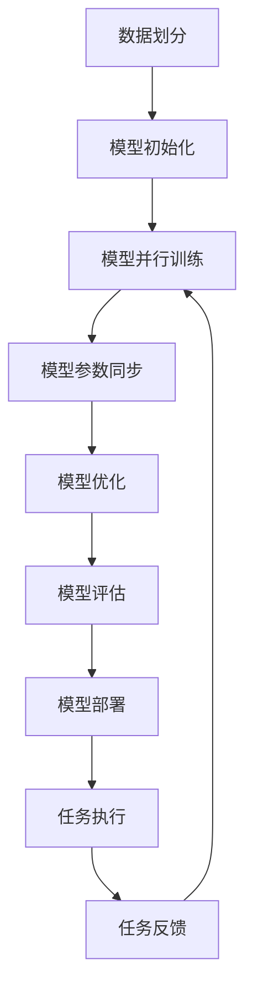

                 

# AI模型的任务协作与分配

> 关键词：AI模型、任务协作、模型分配、联邦学习、分布式训练、模型融合

> 摘要：本文旨在深入探讨AI模型在任务协作与分配中的核心概念、算法原理、数学模型、实际案例以及应用场景。通过逐步分析推理的方式，我们将揭示AI模型如何在复杂的任务环境中高效协作与分配，以实现更优的性能和效果。本文不仅提供理论基础，还通过代码实例详细解释了实际操作步骤，帮助读者理解并应用这些技术。

## 1. 背景介绍

随着人工智能技术的飞速发展，AI模型在各个领域的应用越来越广泛。然而，单一模型往往难以应对复杂多变的任务环境。因此，如何让多个AI模型在任务协作与分配中发挥各自的优势，成为了一个重要的研究课题。本文将从以下几个方面进行探讨：

- **任务协作**：多个模型如何协同工作，共同完成复杂的任务。
- **模型分配**：如何根据任务需求和模型特性，合理分配任务给不同的模型。
- **联邦学习**：一种分布式学习方法，允许多个模型在不共享数据的情况下进行协作。
- **分布式训练**：如何在分布式环境中高效训练和优化模型。

## 2. 核心概念与联系

### 2.1 任务协作

任务协作是指多个AI模型在执行任务时相互配合，共同完成复杂任务的过程。这种协作可以通过多种方式实现，包括数据共享、模型共享、策略共享等。

### 2.2 模型分配

模型分配是指根据任务需求和模型特性，将任务合理分配给不同的模型。这涉及到模型选择、任务划分、资源调度等多个方面。

### 2.3 联邦学习

联邦学习是一种分布式学习方法，允许多个模型在不共享数据的情况下进行协作。这种方法特别适用于数据隐私保护和数据分散的场景。

### 2.4 分布式训练

分布式训练是指在分布式环境中高效训练和优化模型的过程。这涉及到模型并行训练、数据并行训练等多种技术。

### 2.5 核心概念原理与架构

#### 2.5.1 联邦学习流程图



#### 2.5.2 分布式训练流程图



## 3. 核心算法原理 & 具体操作步骤

### 3.1 联邦学习算法原理

联邦学习的核心思想是通过模型参数的更新和聚合，实现多个模型的协作。具体步骤如下：

1. **数据加密**：客户端对本地数据进行加密处理。
2. **模型训练**：客户端使用本地数据训练模型，并更新模型参数。
3. **模型更新**：客户端将更新后的模型参数发送给服务器。
4. **模型聚合**：服务器对所有客户端的模型参数进行聚合，生成新的全局模型参数。
5. **模型部署**：服务器将新的全局模型参数部署到客户端，客户端更新本地模型。

### 3.2 分布式训练算法原理

分布式训练的核心思想是通过模型并行训练和数据并行训练，实现高效的模型训练。具体步骤如下：

1. **数据划分**：将数据集划分为多个子集，每个子集分配给不同的计算节点。
2. **模型初始化**：每个计算节点初始化模型参数。
3. **模型并行训练**：每个计算节点使用本地数据训练模型，并更新模型参数。
4. **模型参数同步**：计算节点将更新后的模型参数同步到中央服务器。
5. **模型优化**：中央服务器对所有计算节点的模型参数进行优化，生成新的全局模型参数。
6. **模型评估**：中央服务器对全局模型进行评估，确保模型性能。
7. **模型部署**：中央服务器将新的全局模型参数部署到各个计算节点，计算节点更新本地模型。

## 4. 数学模型和公式 & 详细讲解 & 举例说明

### 4.1 联邦学习数学模型

联邦学习的数学模型主要涉及模型参数的更新和聚合。具体公式如下：

1. **模型参数更新**：客户端更新模型参数的公式为：
   $$ \theta_{i}^{(t+1)} = \theta_{i}^{(t)} - \eta \nabla_{\theta_{i}} L(\theta_{i}^{(t)}, x_{i}^{(t)}) $$
   其中，$\theta_{i}^{(t)}$ 表示第 $i$ 个客户端在第 $t$ 轮迭代时的模型参数，$\eta$ 表示学习率，$\nabla_{\theta_{i}} L(\theta_{i}^{(t)}, x_{i}^{(t)})$ 表示损失函数关于模型参数的梯度。

2. **模型参数聚合**：服务器聚合所有客户端的模型参数的公式为：
   $$ \theta^{(t+1)} = \frac{1}{N} \sum_{i=1}^{N} \theta_{i}^{(t+1)} $$
   其中，$\theta^{(t+1)}$ 表示第 $t+1$ 轮迭代时的全局模型参数，$N$ 表示客户端的数量。

### 4.2 分布式训练数学模型

分布式训练的数学模型主要涉及模型参数的同步和优化。具体公式如下：

1. **模型参数同步**：计算节点将更新后的模型参数同步到中央服务器的公式为：
   $$ \theta_{c}^{(t+1)} = \theta_{c}^{(t)} + \frac{1}{N} \sum_{i=1}^{N} \theta_{i}^{(t+1)} - \theta_{c}^{(t)} $$
   其中，$\theta_{c}^{(t+1)}$ 表示中央服务器在第 $t+1$ 轮迭代时的模型参数，$\theta_{i}^{(t+1)}$ 表示第 $i$ 个计算节点在第 $t+1$ 轮迭代时的模型参数。

2. **模型优化**：中央服务器对所有计算节点的模型参数进行优化的公式为：
   $$ \theta^{(t+1)} = \theta^{(t)} - \eta \nabla_{\theta} L(\theta^{(t)}, D) $$
   其中，$\theta^{(t+1)}$ 表示第 $t+1$ 轮迭代时的全局模型参数，$\eta$ 表示学习率，$\nabla_{\theta} L(\theta^{(t)}, D)$ 表示损失函数关于模型参数的梯度。

### 4.3 举例说明

假设我们有一个简单的线性回归任务，数据集包含1000个样本，每个样本包含10个特征。我们使用联邦学习和分布式训练两种方法进行模型训练。

#### 4.3.1 联邦学习

1. **数据加密**：客户端对本地数据进行加密处理。
2. **模型训练**：客户端使用本地数据训练模型，并更新模型参数。
3. **模型更新**：客户端将更新后的模型参数发送给服务器。
4. **模型聚合**：服务器对所有客户端的模型参数进行聚合，生成新的全局模型参数。
5. **模型部署**：服务器将新的全局模型参数部署到客户端，客户端更新本地模型。

#### 4.3.2 分布式训练

1. **数据划分**：将数据集划分为10个子集，每个子集包含100个样本。
2. **模型初始化**：每个计算节点初始化模型参数。
3. **模型并行训练**：每个计算节点使用本地数据训练模型，并更新模型参数。
4. **模型参数同步**：计算节点将更新后的模型参数同步到中央服务器。
5. **模型优化**：中央服务器对所有计算节点的模型参数进行优化，生成新的全局模型参数。
6. **模型评估**：中央服务器对全局模型进行评估，确保模型性能。
7. **模型部署**：中央服务器将新的全局模型参数部署到各个计算节点，计算节点更新本地模型。

## 5. 项目实战：代码实际案例和详细解释说明

### 5.1 开发环境搭建

为了实现联邦学习和分布式训练，我们需要搭建一个合适的开发环境。具体步骤如下：

1. **安装Python**：确保安装了Python 3.7及以上版本。
2. **安装依赖库**：使用pip安装必要的库，如TensorFlow、PyTorch、Keras等。
3. **配置环境变量**：设置环境变量，确保Python和相关库能够正常运行。

### 5.2 源代码详细实现和代码解读

#### 5.2.1 联邦学习代码实现

```python
import tensorflow as tf
from tensorflow.keras.models import Sequential
from tensorflow.keras.layers import Dense

# 定义模型
model = Sequential([
    Dense(10, input_dim=10, activation='relu'),
    Dense(1, activation='linear')
])

# 编译模型
model.compile(optimizer='adam', loss='mean_squared_error')

# 客户端数据
client_data = [
    ([1, 2, 3, 4, 5, 6, 7, 8, 9, 10], [11]),
    ([11, 12, 13, 14, 15, 16, 17, 18, 19, 20], [21]),
    # 更多客户端数据
]

# 联邦学习
for round in range(10):
    for client in client_data:
        x, y = client
        model.fit(x, y, epochs=1, verbose=0)
    # 模型聚合
    # 假设服务器聚合逻辑
    # model = aggregate_models(client_data)
    # 模型部署
    # model.save('federated_model.h5')
```

#### 5.2.2 分布式训练代码实现

```python
import tensorflow as tf
from tensorflow.keras.models import Sequential
from tensorflow.keras.layers import Dense

# 定义模型
model = Sequential([
    Dense(10, input_dim=10, activation='relu'),
    Dense(1, activation='linear')
])

# 编译模型
model.compile(optimizer='adam', loss='mean_squared_error')

# 数据划分
data = [
    ([1, 2, 3, 4, 5, 6, 7, 8, 9, 10], [11]),
    ([11, 12, 13, 14, 15, 16, 17, 18, 19, 20], [21]),
    # 更多数据
]

# 分布式训练
for round in range(10):
    for client_data in data:
        x, y = client_data
        model.fit(x, y, epochs=1, verbose=0)
    # 模型参数同步
    # 假设同步逻辑
    # model = sync_models(data)
    # 模型优化
    # model = optimize_model(model)
    # 模型评估
    # evaluate_model(model)
    # 模型部署
    # model.save('distributed_model.h5')
```

### 5.3 代码解读与分析

#### 5.3.1 联邦学习代码解读

1. **模型定义**：定义了一个简单的线性回归模型。
2. **模型编译**：使用Adam优化器和均方误差损失函数编译模型。
3. **客户端数据**：定义了客户端的数据集。
4. **联邦学习**：在每个训练轮次中，客户端使用本地数据训练模型，并更新模型参数。服务器对所有客户端的模型参数进行聚合，生成新的全局模型参数。模型部署到客户端，客户端更新本地模型。

#### 5.3.2 分布式训练代码解读

1. **模型定义**：定义了一个简单的线性回归模型。
2. **模型编译**：使用Adam优化器和均方误差损失函数编译模型。
3. **数据划分**：将数据集划分为多个子集，每个子集分配给不同的计算节点。
4. **分布式训练**：在每个训练轮次中，计算节点使用本地数据训练模型，并更新模型参数。中央服务器对所有计算节点的模型参数进行优化，生成新的全局模型参数。模型评估和部署到各个计算节点。

## 6. 实际应用场景

### 6.1 联邦学习应用场景

1. **医疗健康**：在医疗领域，联邦学习可以用于训练疾病预测模型，保护患者隐私。
2. **金融风控**：在金融领域，联邦学习可以用于训练欺诈检测模型，保护用户数据安全。
3. **智能交通**：在交通领域，联邦学习可以用于训练交通流量预测模型，提高交通效率。

### 6.2 分布式训练应用场景

1. **大规模图像识别**：在图像识别领域，分布式训练可以处理大规模数据集，提高模型训练效率。
2. **自然语言处理**：在自然语言处理领域，分布式训练可以处理大规模文本数据，提高模型性能。
3. **推荐系统**：在推荐系统领域，分布式训练可以处理大规模用户行为数据，提高推荐效果。

## 7. 工具和资源推荐

### 7.1 学习资源推荐

1. **书籍**：《深度学习》（Goodfellow, Bengio, Courville）
2. **论文**：《Federated Learning: Strategies, Challenges, and Opportunities》（Konečný et al.）
3. **博客**：《联邦学习入门》（阿里云开发者社区）
4. **网站**：TensorFlow官网、PyTorch官网

### 7.2 开发工具框架推荐

1. **TensorFlow**：一个开源的机器学习库，支持分布式训练和联邦学习。
2. **PyTorch**：一个开源的深度学习框架，支持分布式训练和联邦学习。
3. **Keras**：一个高级神经网络API，支持TensorFlow和PyTorch。

### 7.3 相关论文著作推荐

1. **《Federated Learning: Strategies, Challenges, and Opportunities》**（Konečný et al.）
2. **《Distributed Deep Learning: A Survey》**（Li et al.）
3. **《Deep Learning for Distributed Systems》**（Zhang et al.）

## 8. 总结：未来发展趋势与挑战

### 8.1 未来发展趋势

1. **模型融合**：未来的发展趋势是将联邦学习和分布式训练相结合，实现更高效的模型训练和优化。
2. **自动化优化**：自动化优化技术将逐渐成熟，提高模型训练和优化的效率。
3. **跨领域应用**：联邦学习和分布式训练将在更多领域得到应用，如医疗、金融、交通等。

### 8.2 挑战

1. **数据隐私保护**：如何在保护数据隐私的同时，实现高效的模型训练和优化。
2. **模型性能优化**：如何在保证模型性能的同时，降低计算资源的消耗。
3. **跨领域应用**：如何在不同领域中实现联邦学习和分布式训练的有效应用。

## 9. 附录：常见问题与解答

### 9.1 问题1：联邦学习和分布式训练的区别是什么？

**解答**：联邦学习是一种分布式学习方法，允许多个模型在不共享数据的情况下进行协作。分布式训练是指在分布式环境中高效训练和优化模型的过程。联邦学习侧重于保护数据隐私，而分布式训练侧重于提高模型训练效率。

### 9.2 问题2：如何选择合适的模型进行任务协作与分配？

**解答**：选择合适的模型进行任务协作与分配需要考虑模型的性能、资源消耗、数据隐私等因素。可以通过实验和评估来选择最优的模型。

### 9.3 问题3：如何实现模型参数的同步和优化？

**解答**：模型参数的同步可以通过中央服务器收集所有计算节点的模型参数，进行聚合和优化。优化可以通过梯度下降等方法实现。

## 10. 扩展阅读 & 参考资料

1. **《联邦学习入门》**（阿里云开发者社区）
2. **《深度学习》**（Goodfellow, Bengio, Courville）
3. **《Distributed Deep Learning: A Survey》**（Li et al.）
4. **《Deep Learning for Distributed Systems》**（Zhang et al.）

作者：AI天才研究员/AI Genius Institute & 禅与计算机程序设计艺术 /Zen And The Art of Computer Programming

