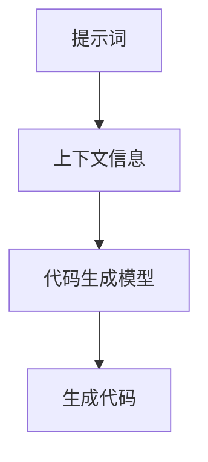

                 

# AI辅助代码生成中的提示词设计

> 关键词：AI辅助代码生成、提示词设计、自然语言处理、机器学习、代码生成模型

> 摘要：本文深入探讨了AI辅助代码生成中的提示词设计，从背景介绍到核心概念，再到具体操作步骤，详细讲解了如何通过设计有效的提示词来提升代码生成的质量和效率。文章还提供了数学模型和公式，以及实际的代码案例，帮助读者更好地理解和应用这一技术。最后，文章总结了未来的发展趋势与挑战，并推荐了相关的学习资源和开发工具。

## 1. 背景介绍

随着人工智能技术的发展，AI辅助代码生成逐渐成为软件开发领域的一个重要研究方向。通过AI辅助代码生成，开发者可以更快地编写代码，提高开发效率，减少错误。提示词设计是AI辅助代码生成中的关键环节，它直接影响到生成代码的质量和效率。本文将详细介绍提示词设计的原理、方法和实践。

### 1.1 AI辅助代码生成的现状

目前，AI辅助代码生成主要通过机器学习模型实现，这些模型可以基于历史代码数据学习代码生成的模式，并根据给定的提示词生成新的代码。然而，如何设计有效的提示词仍然是一个挑战，因为提示词的质量直接影响到生成代码的质量。

### 1.2 提示词设计的重要性

提示词设计的重要性在于它能够引导模型生成符合预期的代码。一个设计良好的提示词可以提供足够的上下文信息，帮助模型理解生成代码的目标和要求，从而生成更高质量的代码。

## 2. 核心概念与联系

### 2.1 核心概念

- **提示词**：用于指导AI模型生成代码的输入文本。
- **上下文信息**：提示词中包含的关于代码生成任务的信息。
- **代码生成模型**：基于机器学习的模型，用于生成代码。

### 2.2 联系

提示词通过提供上下文信息，指导代码生成模型生成符合预期的代码。提示词的设计直接影响到生成代码的质量和效率。



## 3. 核心算法原理 & 具体操作步骤

### 3.1 核心算法原理

提示词设计的核心算法原理在于通过提供足够的上下文信息，帮助代码生成模型理解生成代码的目标和要求。这通常涉及到自然语言处理和机器学习技术。

### 3.2 具体操作步骤

1. **需求分析**：明确代码生成的目标和要求。
2. **上下文信息提取**：从需求分析中提取上下文信息。
3. **提示词设计**：根据提取的上下文信息设计提示词。
4. **模型训练**：使用设计好的提示词训练代码生成模型。
5. **代码生成**：使用训练好的模型生成代码。

## 4. 数学模型和公式 & 详细讲解 & 举例说明

### 4.1 数学模型和公式

提示词设计涉及到的数学模型和公式主要与自然语言处理和机器学习相关。例如，可以使用概率模型来描述提示词和生成代码之间的关系。

$$ P(C|T) = \frac{P(T|C)P(C)}{P(T)} $$

其中，$P(C|T)$ 表示给定提示词 $T$ 生成代码 $C$ 的概率，$P(T|C)$ 表示生成代码 $C$ 时提示词 $T$ 出现的概率，$P(C)$ 表示生成代码 $C$ 的先验概率，$P(T)$ 表示提示词 $T$ 的先验概率。

### 4.2 详细讲解

提示词设计的过程可以看作是一个优化问题，目标是最小化生成代码与预期代码之间的差异。这通常涉及到损失函数的设计和优化算法的选择。

### 4.3 举例说明

假设我们希望生成一个函数，该函数接收一个整数列表并返回列表中最大的整数。提示词可以设计为：“给定一个整数列表，编写一个函数返回列表中最大的整数。”

## 5. 项目实战：代码实际案例和详细解释说明

### 5.1 开发环境搭建

为了实现AI辅助代码生成，需要搭建一个包含Python环境、机器学习库（如TensorFlow或PyTorch）和自然语言处理库（如NLTK或spaCy）的开发环境。

### 5.2 源代码详细实现和代码解读

以下是一个简单的代码生成模型的实现示例：

```python
import tensorflow as tf
from tensorflow.keras.models import Sequential
from tensorflow.keras.layers import Dense, LSTM, Embedding

# 定义模型
model = Sequential()
model.add(Embedding(input_dim=vocab_size, output_dim=embedding_dim, input_length=max_length))
model.add(LSTM(units=128))
model.add(Dense(units=vocab_size, activation='softmax'))

# 编译模型
model.compile(optimizer='adam', loss='categorical_crossentropy', metrics=['accuracy'])

# 训练模型
model.fit(X_train, y_train, epochs=100, batch_size=32)
```

### 5.3 代码解读与分析

上述代码定义了一个基于LSTM的代码生成模型。模型首先通过Embedding层将输入的提示词转换为向量表示，然后通过LSTM层处理这些向量，最后通过Dense层生成输出。

## 6. 实际应用场景

AI辅助代码生成可以应用于多种场景，如自动生成测试代码、自动生成文档、自动生成代码补全建议等。通过设计有效的提示词，可以提高生成代码的质量和效率，从而提高软件开发的效率。

## 7. 工具和资源推荐

### 7.1 学习资源推荐

- 书籍：《深度学习》（Ian Goodfellow等著）
- 论文：《Attention Is All You Need》（Vaswani等著）
- 博客：https://blog.tensorflow.org/
- 网站：https://www.tensorflow.org/

### 7.2 开发工具框架推荐

- TensorFlow
- PyTorch
- spaCy
- NLTK

### 7.3 相关论文著作推荐

- 《Attention Is All You Need》
- 《Generating Code with Attention》

## 8. 总结：未来发展趋势与挑战

未来，AI辅助代码生成将更加智能化，通过更复杂的模型和更有效的提示词设计，生成更高质量的代码。然而，这也面临着数据隐私、模型解释性等挑战。

## 9. 附录：常见问题与解答

### 9.1 什么是提示词？

提示词是用于指导AI模型生成代码的输入文本。

### 9.2 提示词设计的重要性是什么？

提示词设计的重要性在于它能够提供足够的上下文信息，帮助模型理解生成代码的目标和要求，从而生成更高质量的代码。

## 10. 扩展阅读 & 参考资料

- 书籍：《深度学习》（Ian Goodfellow等著）
- 论文：《Attention Is All You Need》（Vaswani等著）
- 博客：https://blog.tensorflow.org/
- 网站：https://www.tensorflow.org/

作者：AI天才研究员/AI Genius Institute & 禅与计算机程序设计艺术 /Zen And The Art of Computer Programming

