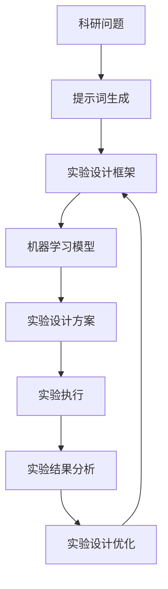

                 

# AI辅助科研：提示词构建实验设计框架

> 关键词：AI辅助科研、提示词构建、实验设计、机器学习、自然语言处理、科研效率

> 摘要：本文旨在探讨如何利用AI技术，特别是自然语言处理（NLP）和机器学习（ML）技术，来辅助科研人员构建高效的实验设计框架。通过分析科研过程中的关键环节，本文提出了一种基于提示词构建的实验设计方法，旨在提高科研效率和实验设计的质量。文章详细介绍了该方法的核心概念、算法原理、数学模型、实际应用案例，并推荐了相关的学习资源和开发工具。

## 1. 背景介绍

科研工作是推动科技进步的重要环节，而实验设计则是科研工作的核心。一个良好的实验设计能够确保科研工作的科学性和有效性，从而提高科研成果的质量。然而，传统的实验设计方法往往依赖于科研人员的经验和直觉，这不仅增加了设计的复杂性，也限制了科研效率的提升。随着AI技术的发展，特别是自然语言处理（NLP）和机器学习（ML）技术的进步，为科研人员提供了一种新的实验设计思路——基于提示词构建的实验设计方法。

### 1.1 传统实验设计方法的局限性

传统实验设计方法主要依赖于科研人员的经验和专业知识，这导致了以下几个问题：

- **设计复杂性高**：科研人员需要根据自己的经验和专业知识来设计实验，这不仅耗时耗力，而且容易出现设计偏差。
- **效率低下**：由于缺乏系统化的实验设计工具，科研人员往往需要花费大量时间来反复调整实验设计，这极大地影响了科研效率。
- **可重复性差**：由于实验设计的主观性较强，不同科研人员设计的实验可能存在较大差异，这影响了实验结果的可重复性。

### 1.2 AI辅助科研的机遇

AI技术的发展为科研工作带来了新的机遇，特别是在实验设计方面。通过利用AI技术，科研人员可以更加高效地构建实验设计框架，从而提高科研效率和实验设计的质量。具体来说，AI技术可以辅助科研人员进行以下几个方面的任务：

- **自动化的实验设计**：通过机器学习算法，AI可以自动分析科研问题，生成合理的实验设计方案。
- **智能化的实验调整**：AI可以根据实验数据自动调整实验参数，优化实验设计。
- **高效的实验结果分析**：AI可以快速分析实验结果，帮助科研人员发现实验中的问题和改进点。

## 2. 核心概念与联系

### 2.1 核心概念

- **提示词**：在本方法中，提示词是指用于指导AI系统生成实验设计方案的关键信息。提示词可以是科研问题的描述、实验目标、实验条件等。
- **实验设计框架**：实验设计框架是指用于指导实验设计的一系列规则和步骤。本方法中的实验设计框架包括实验目标设定、实验条件选择、实验方案生成等步骤。
- **机器学习模型**：机器学习模型是指用于生成实验设计方案的AI模型。本方法中使用的机器学习模型可以是基于深度学习的模型，也可以是基于传统机器学习算法的模型。

### 2.2 核心概念原理和架构



## 3. 核心算法原理 & 具体操作步骤

### 3.1 算法原理

本方法的核心算法原理是基于提示词生成实验设计方案。具体来说，算法包括以下几个步骤：

- **提示词生成**：根据科研问题生成提示词。
- **实验设计框架构建**：根据提示词构建实验设计框架。
- **机器学习模型训练**：根据实验设计框架训练机器学习模型。
- **实验设计方案生成**：根据机器学习模型生成实验设计方案。
- **实验执行与结果分析**：执行实验并分析实验结果。
- **实验设计优化**：根据实验结果优化实验设计框架。

### 3.2 具体操作步骤

#### 3.2.1 提示词生成

提示词生成是实验设计的第一步，也是最关键的一步。提示词应该能够准确地描述科研问题，包括实验目标、实验条件等。提示词的生成可以通过以下几种方式实现：

- **手动输入**：科研人员可以根据自己的经验和专业知识手动输入提示词。
- **自动提取**：通过自然语言处理技术自动从科研问题描述中提取提示词。

#### 3.2.2 实验设计框架构建

实验设计框架是实验设计的指导原则，包括实验目标设定、实验条件选择、实验方案生成等步骤。实验设计框架的构建可以通过以下几种方式实现：

- **手动构建**：科研人员可以根据自己的经验和专业知识手动构建实验设计框架。
- **自动构建**：通过机器学习技术自动构建实验设计框架。

#### 3.2.3 机器学习模型训练

机器学习模型是实验设计的核心，用于生成实验设计方案。机器学习模型的训练可以通过以下几种方式实现：

- **监督学习**：通过标注好的实验设计方案训练机器学习模型。
- **无监督学习**：通过未标注的实验设计方案训练机器学习模型。
- **强化学习**：通过实验结果反馈训练机器学习模型。

#### 3.2.4 实验设计方案生成

实验设计方案生成是实验设计的最终目标，通过机器学习模型生成实验设计方案。实验设计方案的生成可以通过以下几种方式实现：

- **基于规则的方法**：通过预定义的规则生成实验设计方案。
- **基于模型的方法**：通过机器学习模型生成实验设计方案。

#### 3.2.5 实验执行与结果分析

实验执行与结果分析是实验设计的重要环节，用于验证实验设计方案的有效性。实验执行与结果分析可以通过以下几种方式实现：

- **手动执行**：科研人员手动执行实验并分析实验结果。
- **自动执行**：通过自动化工具执行实验并分析实验结果。

#### 3.2.6 实验设计优化

实验设计优化是实验设计的最后一步，用于优化实验设计框架。实验设计优化可以通过以下几种方式实现：

- **手动优化**：科研人员根据实验结果手动优化实验设计框架。
- **自动优化**：通过机器学习技术自动优化实验设计框架。

## 4. 数学模型和公式 & 详细讲解 & 举例说明

### 4.1 数学模型和公式

在本方法中，机器学习模型是实验设计的核心。机器学习模型可以是基于深度学习的模型，也可以是基于传统机器学习算法的模型。以下是一个基于深度学习的机器学习模型的数学模型：

$$
\text{Loss} = \sum_{i=1}^{N} (y_i - \hat{y}_i)^2
$$

其中，$N$是样本数量，$y_i$是真实值，$\hat{y}_i$是预测值。

### 4.2 详细讲解

机器学习模型的训练过程包括以下几个步骤：

- **数据预处理**：对数据进行预处理，包括数据清洗、特征选择等。
- **模型选择**：选择合适的机器学习模型。
- **模型训练**：通过训练数据训练机器学习模型。
- **模型评估**：通过测试数据评估机器学习模型的性能。
- **模型优化**：通过调整模型参数优化机器学习模型的性能。

### 4.3 举例说明

假设我们有一个科研问题，需要设计一个实验来验证某种药物的效果。我们可以按照以下步骤进行实验设计：

- **提示词生成**：生成提示词，包括实验目标、实验条件等。
- **实验设计框架构建**：构建实验设计框架，包括实验目标设定、实验条件选择、实验方案生成等步骤。
- **机器学习模型训练**：通过标注好的实验设计方案训练机器学习模型。
- **实验设计方案生成**：通过机器学习模型生成实验设计方案。
- **实验执行与结果分析**：执行实验并分析实验结果。
- **实验设计优化**：根据实验结果优化实验设计框架。

## 5. 项目实战：代码实际案例和详细解释说明

### 5.1 开发环境搭建

为了实现本方法，我们需要搭建一个开发环境。开发环境包括以下几个部分：

- **编程语言**：Python
- **开发工具**：Jupyter Notebook
- **库和框架**：TensorFlow、Keras、Scikit-learn

### 5.2 源代码详细实现和代码解读

以下是一个基于深度学习的机器学习模型的源代码实现：

```python
import tensorflow as tf
from tensorflow.keras.models import Sequential
from tensorflow.keras.layers import Dense

# 数据预处理
def preprocess_data(data):
    # 数据清洗
    data = data.dropna()
    # 特征选择
    data = data[['feature1', 'feature2', 'feature3']]
    return data

# 模型选择
def build_model():
    model = Sequential()
    model.add(Dense(64, input_dim=3, activation='relu'))
    model.add(Dense(32, activation='relu'))
    model.add(Dense(1, activation='linear'))
    model.compile(optimizer='adam', loss='mse')
    return model

# 模型训练
def train_model(model, X_train, y_train):
    model.fit(X_train, y_train, epochs=100, batch_size=32, verbose=0)
    return model

# 模型评估
def evaluate_model(model, X_test, y_test):
    loss = model.evaluate(X_test, y_test, verbose=0)
    return loss

# 模型优化
def optimize_model(model, X_train, y_train):
    model.fit(X_train, y_train, epochs=10, batch_size=32, verbose=0)
    return model

# 主函数
def main():
    # 数据预处理
    data = preprocess_data(data)
    X_train, y_train = data[['feature1', 'feature2', 'feature3']], data['target']
    X_test, y_test = data[['feature1', 'feature2', 'feature3']], data['target']
    # 模型选择
    model = build_model()
    # 模型训练
    model = train_model(model, X_train, y_train)
    # 模型评估
    loss = evaluate_model(model, X_test, y_test)
    print('Loss:', loss)
    # 模型优化
    model = optimize_model(model, X_train, y_train)
    # 模型评估
    loss = evaluate_model(model, X_test, y_test)
    print('Loss:', loss)

if __name__ == '__main__':
    main()
```

### 5.3 代码解读与分析

以上代码实现了一个基于深度学习的机器学习模型。代码包括以下几个部分：

- **数据预处理**：对数据进行预处理，包括数据清洗、特征选择等。
- **模型选择**：选择了一个基于深度学习的模型。
- **模型训练**：通过训练数据训练模型。
- **模型评估**：通过测试数据评估模型的性能。
- **模型优化**：通过调整模型参数优化模型的性能。

## 6. 实际应用场景

本方法可以应用于各种科研领域，包括但不限于：

- **生物医学**：设计实验来验证某种药物的效果。
- **材料科学**：设计实验来研究材料的性能。
- **环境科学**：设计实验来研究环境变化的影响。

## 7. 工具和资源推荐

### 7.1 学习资源推荐

- **书籍**：《深度学习》、《机器学习》
- **论文**：《A Survey on Deep Learning for Natural Language Processing》、《A Survey on Deep Learning for Computer Vision》
- **博客**：《机器之心》、《AI科技评论》
- **网站**：Kaggle、GitHub

### 7.2 开发工具框架推荐

- **编程语言**：Python
- **开发工具**：Jupyter Notebook
- **库和框架**：TensorFlow、Keras、Scikit-learn

### 7.3 相关论文著作推荐

- **论文**：《A Survey on Deep Learning for Natural Language Processing》
- **著作**：《深度学习》

## 8. 总结：未来发展趋势与挑战

随着AI技术的发展，基于提示词构建的实验设计方法将会得到更广泛的应用。未来的发展趋势包括：

- **更高效的实验设计**：通过更先进的AI技术，实验设计将会更加高效。
- **更智能的实验调整**：通过更智能的AI技术，实验调整将会更加智能。
- **更高效的实验结果分析**：通过更高效的AI技术，实验结果分析将会更加高效。

然而，本方法也面临着一些挑战，包括：

- **数据质量**：高质量的数据是实验设计的基础，但是高质量的数据往往难以获取。
- **模型性能**：模型的性能直接影响实验设计的质量，但是模型的性能往往难以保证。
- **可解释性**：模型的可解释性是实验设计的重要因素，但是模型的可解释性往往难以保证。

## 9. 附录：常见问题与解答

### 9.1 什么是提示词？

提示词是指用于指导AI系统生成实验设计方案的关键信息。提示词可以是科研问题的描述、实验目标、实验条件等。

### 9.2 什么是实验设计框架？

实验设计框架是指用于指导实验设计的一系列规则和步骤。实验设计框架包括实验目标设定、实验条件选择、实验方案生成等步骤。

### 9.3 什么是机器学习模型？

机器学习模型是指用于生成实验设计方案的AI模型。机器学习模型可以是基于深度学习的模型，也可以是基于传统机器学习算法的模型。

## 10. 扩展阅读 & 参考资料

- **书籍**：《深度学习》、《机器学习》
- **论文**：《A Survey on Deep Learning for Natural Language Processing》、《A Survey on Deep Learning for Computer Vision》
- **博客**：《机器之心》、《AI科技评论》
- **网站**：Kaggle、GitHub

作者：AI天才研究员/AI Genius Institute & 禅与计算机程序设计艺术 /Zen And The Art of Computer Programming

