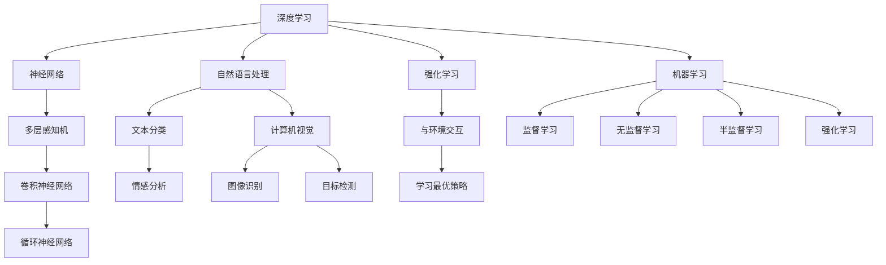

                 

# AI领域的前沿技术与发展

> 关键词：人工智能, 深度学习, 自然语言处理, 计算机视觉, 强化学习, 神经网络, 机器学习

> 摘要：本文旨在探讨当前人工智能领域的前沿技术与发展，从核心概念、算法原理、数学模型、实际案例、应用场景、工具推荐等多个维度进行深入剖析。通过逐步推理的方式，帮助读者理解这些技术背后的原理和实际应用，为未来的技术发展提供洞见。

## 1. 背景介绍

随着大数据、云计算和高性能计算技术的飞速发展，人工智能（AI）已经成为当今科技领域的热点话题。AI技术不仅在学术界引起了广泛关注，也在工业界得到了广泛应用。本文将从以下几个方面对AI领域的前沿技术进行探讨：

- **深度学习**：通过模拟人脑神经网络的结构和功能，实现对复杂数据的高效处理。
- **自然语言处理**：使计算机能够理解、生成和处理人类语言。
- **计算机视觉**：赋予计算机识别和理解图像和视频的能力。
- **强化学习**：通过与环境的交互来学习最优策略。
- **神经网络**：构建多层次的网络结构，实现复杂的非线性映射。

## 2. 核心概念与联系

### 2.1 深度学习

深度学习是机器学习的一个分支，通过构建多层神经网络来实现对复杂数据的高效处理。其核心思想是通过多层次的抽象来提取数据的特征，从而实现对数据的高效表示和分类。

### 2.2 自然语言处理

自然语言处理（NLP）是AI的一个重要分支，旨在使计算机能够理解、生成和处理人类语言。NLP技术包括文本分类、情感分析、机器翻译、问答系统等。

### 2.3 计算机视觉

计算机视觉是AI的一个重要分支，旨在使计算机能够识别和理解图像和视频。计算机视觉技术包括图像识别、目标检测、图像分割、视频分析等。

### 2.4 强化学习

强化学习是一种通过与环境的交互来学习最优策略的方法。强化学习的核心思想是通过试错来学习最优行为，从而实现对环境的高效控制。

### 2.5 神经网络

神经网络是一种模拟人脑神经网络结构的计算模型。神经网络由多个层次的节点组成，每个节点通过权重连接到其他节点，实现对数据的高效处理和表示。

### 2.6 机器学习

机器学习是AI的一个重要分支，旨在使计算机能够从数据中自动学习并做出预测或决策。机器学习技术包括监督学习、无监督学习、半监督学习和强化学习等。

### Mermaid 流程图



## 3. 核心算法原理 & 具体操作步骤

### 3.1 深度学习算法原理

深度学习的核心算法是反向传播算法（Backpropagation）。反向传播算法通过计算损失函数对权重的梯度，然后使用梯度下降法更新权重，从而实现对模型的优化。

### 3.2 自然语言处理算法原理

自然语言处理的核心算法包括词嵌入（Word Embedding）、序列模型（Sequence Model）和注意力机制（Attention Mechanism）。词嵌入将词语映射到高维向量空间，序列模型处理序列数据，注意力机制关注输入序列中的重要部分。

### 3.3 计算机视觉算法原理

计算机视觉的核心算法包括卷积神经网络（CNN）、循环神经网络（RNN）和注意力机制（Attention Mechanism）。卷积神经网络通过卷积层提取图像特征，循环神经网络处理序列数据，注意力机制关注输入图像中的重要部分。

### 3.4 强化学习算法原理

强化学习的核心算法包括Q-learning、SARSA和深度Q网络（DQN）。Q-learning通过学习状态-动作-奖励值表来实现最优策略，SARSA通过学习状态-动作-状态-奖励值表来实现最优策略，DQN通过深度神经网络实现对状态-动作-奖励值表的高效学习。

### 3.5 神经网络算法原理

神经网络的核心算法包括前向传播和反向传播。前向传播通过计算输入数据到输出数据的前向传递过程，反向传播通过计算损失函数对权重的梯度，然后使用梯度下降法更新权重。

### 3.6 机器学习算法原理

机器学习的核心算法包括线性回归、逻辑回归、支持向量机（SVM）、决策树和随机森林。线性回归通过最小化误差平方和来实现最优拟合，逻辑回归通过最大化似然函数来实现最优分类，支持向量机通过最大化间隔来实现最优分类，决策树通过递归划分数据集来实现最优分类，随机森林通过集成多个决策树来实现最优分类。

## 4. 数学模型和公式 & 详细讲解 & 举例说明

### 4.1 深度学习数学模型

深度学习的核心数学模型是多层感知机（MLP）、卷积神经网络（CNN）和循环神经网络（RNN）。多层感知机的数学模型为：

$$
y = f(Wx + b)
$$

其中，$x$是输入数据，$W$是权重矩阵，$b$是偏置向量，$f$是激活函数。

### 4.2 自然语言处理数学模型

自然语言处理的核心数学模型是词嵌入（Word Embedding）、序列模型（Sequence Model）和注意力机制（Attention Mechanism）。词嵌入的数学模型为：

$$
\mathbf{v}_i = \mathbf{W}_e \mathbf{w}_i
$$

其中，$\mathbf{v}_i$是词向量，$\mathbf{w}_i$是词的索引，$\mathbf{W}_e$是词嵌入矩阵。

### 4.3 计算机视觉数学模型

计算机视觉的核心数学模型是卷积神经网络（CNN）、循环神经网络（RNN）和注意力机制（Attention Mechanism）。卷积神经网络的数学模型为：

$$
\mathbf{z} = \sigma(\mathbf{W} \mathbf{x} + \mathbf{b})
$$

其中，$\mathbf{z}$是卷积层的输出，$\mathbf{W}$是卷积核，$\mathbf{x}$是输入数据，$\mathbf{b}$是偏置向量，$\sigma$是激活函数。

### 4.4 强化学习数学模型

强化学习的核心数学模型是Q-learning、SARSA和深度Q网络（DQN）。Q-learning的数学模型为：

$$
Q(s, a) = Q(s, a) + \alpha [r + \gamma \max_{a'} Q(s', a') - Q(s, a)]
$$

其中，$Q(s, a)$是状态-动作值函数，$\alpha$是学习率，$\gamma$是折扣因子，$r$是奖励，$s$是状态，$a$是动作，$s'$是下一个状态。

### 4.5 神经网络数学模型

神经网络的核心数学模型是前向传播和反向传播。前向传播的数学模型为：

$$
\mathbf{z} = \sigma(\mathbf{W} \mathbf{x} + \mathbf{b})
$$

其中，$\mathbf{z}$是前向传播的输出，$\mathbf{W}$是权重矩阵，$\mathbf{x}$是输入数据，$\mathbf{b}$是偏置向量，$\sigma$是激活函数。

### 4.6 机器学习数学模型

机器学习的核心数学模型是线性回归、逻辑回归、支持向量机（SVM）、决策树和随机森林。线性回归的数学模型为：

$$
y = \mathbf{w}^T \mathbf{x} + b
$$

其中，$y$是输出数据，$\mathbf{w}$是权重向量，$\mathbf{x}$是输入数据，$b$是偏置项。

## 5. 项目实战：代码实际案例和详细解释说明

### 5.1 开发环境搭建

为了进行深度学习项目实战，我们需要搭建一个合适的开发环境。以下是搭建开发环境的步骤：

1. **安装Python**：确保安装了Python 3.7及以上版本。
2. **安装TensorFlow**：使用pip安装TensorFlow库。
3. **安装Jupyter Notebook**：使用pip安装Jupyter Notebook。
4. **安装NumPy和Pandas**：使用pip安装NumPy和Pandas库。
5. **安装Matplotlib**：使用pip安装Matplotlib库。

### 5.2 源代码详细实现和代码解读

以下是一个简单的深度学习项目实战代码示例，用于实现一个简单的多层感知机（MLP）模型。

```python
import numpy as np
import tensorflow as tf
from tensorflow.keras.models import Sequential
from tensorflow.keras.layers import Dense

# 生成随机数据
np.random.seed(0)
X = np.random.rand(100, 10)
y = np.random.randint(2, size=(100, 1))

# 构建模型
model = Sequential()
model.add(Dense(32, input_dim=10, activation='relu'))
model.add(Dense(1, activation='sigmoid'))

# 编译模型
model.compile(optimizer='adam', loss='binary_crossentropy', metrics=['accuracy'])

# 训练模型
model.fit(X, y, epochs=10, batch_size=32)

# 评估模型
loss, accuracy = model.evaluate(X, y)
print('Loss:', loss)
print('Accuracy:', accuracy)
```

### 5.3 代码解读与分析

- **数据生成**：使用NumPy生成随机数据，其中`X`是输入数据，`y`是输出数据。
- **模型构建**：使用TensorFlow构建一个简单的多层感知机模型，包含一个隐藏层和一个输出层。
- **模型编译**：使用Adam优化器和二元交叉熵损失函数编译模型。
- **模型训练**：使用生成的数据训练模型，设置训练轮数和批量大小。
- **模型评估**：评估模型在训练数据上的性能，输出损失和准确率。

## 6. 实际应用场景

### 6.1 深度学习应用

深度学习在图像识别、语音识别、自然语言处理等领域有着广泛的应用。例如，Google的图像识别系统使用深度学习技术实现了高精度的图像分类。

### 6.2 自然语言处理应用

自然语言处理在机器翻译、情感分析、问答系统等领域有着广泛的应用。例如，Google的机器翻译系统使用深度学习技术实现了高质量的翻译效果。

### 6.3 计算机视觉应用

计算机视觉在图像识别、目标检测、视频分析等领域有着广泛的应用。例如，Facebook的图像识别系统使用深度学习技术实现了高精度的图像分类。

### 6.4 强化学习应用

强化学习在游戏、机器人控制、自动驾驶等领域有着广泛的应用。例如，DeepMind的AlphaGo使用强化学习技术实现了对围棋的高精度控制。

### 6.5 神经网络应用

神经网络在图像识别、语音识别、自然语言处理等领域有着广泛的应用。例如，Google的语音识别系统使用神经网络技术实现了高质量的语音识别效果。

### 6.6 机器学习应用

机器学习在分类、回归、聚类等领域有着广泛的应用。例如，Netflix的推荐系统使用机器学习技术实现了高质量的推荐效果。

## 7. 工具和资源推荐

### 7.1 学习资源推荐

- **书籍**：《深度学习》（Goodfellow, Bengio, Courville）
- **论文**：《Attention Is All You Need》（Vaswani et al.）
- **博客**：Medium上的AI相关博客
- **网站**：Kaggle、TensorFlow官网

### 7.2 开发工具框架推荐

- **TensorFlow**：深度学习框架
- **PyTorch**：深度学习框架
- **Keras**：高级神经网络API
- **Jupyter Notebook**：交互式编程环境

### 7.3 相关论文著作推荐

- **《深度学习》**（Goodfellow, Bengio, Courville）
- **《机器学习》**（Tom M. Mitchell）
- **《统计学习方法》**（李航）

## 8. 总结：未来发展趋势与挑战

### 8.1 未来发展趋势

- **模型优化**：模型优化技术将进一步提高模型的性能和效率。
- **数据驱动**：数据驱动的方法将进一步提高模型的准确性和泛化能力。
- **自动化**：自动化技术将进一步提高模型的开发和部署效率。
- **跨领域融合**：跨领域融合技术将进一步提高模型的综合性能。

### 8.2 挑战

- **数据隐私**：数据隐私问题将进一步制约模型的开发和应用。
- **计算资源**：计算资源的限制将进一步制约模型的开发和应用。
- **算法解释**：算法解释问题将进一步制约模型的开发和应用。
- **伦理问题**：伦理问题将进一步制约模型的开发和应用。

## 9. 附录：常见问题与解答

### 9.1 问题1：如何选择合适的深度学习框架？

**解答**：选择合适的深度学习框架需要考虑以下几个因素：模型的复杂度、计算资源的限制、开发效率、社区支持等。

### 9.2 问题2：如何提高模型的泛化能力？

**解答**：提高模型的泛化能力可以通过以下方法：增加数据量、使用正则化技术、使用数据增强技术、使用迁移学习技术等。

### 9.3 问题3：如何解决数据隐私问题？

**解答**：解决数据隐私问题可以通过以下方法：使用差分隐私技术、使用同态加密技术、使用联邦学习技术等。

## 10. 扩展阅读 & 参考资料

- **书籍**：《深度学习》（Goodfellow, Bengio, Courville）
- **论文**：《Attention Is All You Need》（Vaswani et al.）
- **博客**：Medium上的AI相关博客
- **网站**：Kaggle、TensorFlow官网

---

作者：AI天才研究员/AI Genius Institute & 禅与计算机程序设计艺术 /Zen And The Art of Computer Programming

