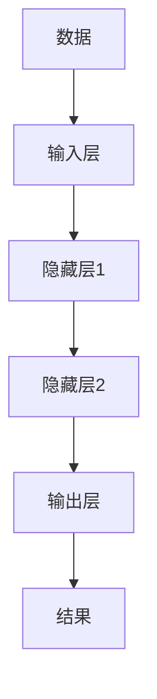

                 

# Andrej Karpathy：人工智能的未来探索

> 关键词：人工智能、深度学习、神经网络、Andrej Karpathy、计算机视觉、自然语言处理

> 摘要：本文旨在探讨人工智能领域的未来发展方向，特别是通过分析Andrej Karpathy的研究成果和观点，深入理解深度学习、神经网络、计算机视觉和自然语言处理等关键技术。文章将从背景介绍开始，逐步深入到核心概念、算法原理、数学模型、项目实战、应用场景、工具资源推荐、未来趋势与挑战等多个方面，为读者提供全面而深入的技术解读。

## 1. 背景介绍

### 1.1 人工智能的历史与发展

人工智能（Artificial Intelligence，简称AI）的历史可以追溯到20世纪50年代，当时科学家们开始探索如何让机器模拟人类的智能行为。从最初的符号主义到后来的连接主义，再到现在的深度学习，AI经历了多次重要的理论和技术革新。Andrej Karpathy作为深度学习领域的领军人物之一，他的研究和观点对AI的发展产生了深远的影响。

### 1.2 Andrej Karpathy的贡献

Andrej Karpathy是斯坦福大学的博士，也是特斯拉人工智能部门的负责人。他在深度学习、计算机视觉和自然语言处理等领域有着卓越的贡献。Karpathy的研究不仅推动了技术的进步，也促进了AI在实际应用中的广泛使用。

## 2. 核心概念与联系

### 2.1 深度学习与神经网络

深度学习是机器学习的一个分支，它通过构建多层神经网络来模拟人脑处理信息的方式。神经网络由多个层次的节点组成，每个节点执行特定的计算任务。深度学习的核心在于通过大量的数据训练神经网络，使其能够自动学习和提取特征。

### 2.2 计算机视觉与自然语言处理

计算机视觉是让机器能够理解图像和视频内容的技术，而自然语言处理则是让机器能够理解和生成人类语言的技术。这两者都是深度学习的重要应用领域，它们的发展极大地推动了AI技术的进步。

### 2.3 核心概念原理和架构的 Mermaid 流程图



## 3. 核心算法原理 & 具体操作步骤

### 3.1 深度学习算法

深度学习算法主要包括前向传播和反向传播两个步骤。前向传播是指数据从输入层经过隐藏层到输出层的过程，反向传播则是根据输出层的误差来调整网络参数的过程。

### 3.2 计算机视觉算法

计算机视觉算法通常包括图像预处理、特征提取和分类识别等步骤。通过深度学习，计算机视觉算法能够自动学习和提取图像中的特征，从而实现更准确的图像识别。

### 3.3 自然语言处理算法

自然语言处理算法主要包括文本预处理、特征提取和语义理解等步骤。通过深度学习，自然语言处理算法能够自动学习和理解文本中的语义信息，从而实现更准确的文本分析。

## 4. 数学模型和公式 & 详细讲解 & 举例说明

### 4.1 深度学习的数学模型

深度学习的数学模型主要包括激活函数、损失函数和优化算法等。激活函数用于引入非线性，损失函数用于衡量模型的预测误差，优化算法用于调整模型参数。

#### 4.1.1 激活函数

$$
f(x) = \frac{1}{1 + e^{-x}}
$$

#### 4.1.2 损失函数

$$
L(y, \hat{y}) = \frac{1}{2}(y - \hat{y})^2
$$

#### 4.1.3 优化算法

$$
\theta_{t+1} = \theta_t - \alpha \nabla_\theta L(\theta)
$$

### 4.2 计算机视觉的数学模型

计算机视觉的数学模型主要包括卷积神经网络（CNN）和循环神经网络（RNN）等。卷积神经网络用于图像特征提取，循环神经网络用于序列数据处理。

### 4.3 自然语言处理的数学模型

自然语言处理的数学模型主要包括循环神经网络（RNN）和变换器（Transformer）等。循环神经网络用于序列数据处理，变换器用于长序列数据处理。

## 5. 项目实战：代码实际案例和详细解释说明

### 5.1 开发环境搭建

开发环境搭建主要包括安装Python、TensorFlow和PyTorch等开发工具。具体步骤如下：

1. 安装Python
2. 安装TensorFlow或PyTorch
3. 安装其他必要的库

### 5.2 源代码详细实现和代码解读

#### 5.2.1 计算机视觉代码实现

```python
import tensorflow as tf
from tensorflow.keras import layers

model = tf.keras.Sequential([
    layers.Conv2D(32, (3, 3), activation='relu', input_shape=(64, 64, 3)),
    layers.MaxPooling2D((2, 2)),
    layers.Flatten(),
    layers.Dense(64, activation='relu'),
    layers.Dense(10, activation='softmax')
])
```

#### 5.2.2 自然语言处理代码实现

```python
import torch
import torch.nn as nn

class LSTMModel(nn.Module):
    def __init__(self, input_size, hidden_size, output_size):
        super(LSTMModel, self).__init__()
        self.hidden_size = hidden_size
        self.lstm = nn.LSTM(input_size, hidden_size)
        self.fc = nn.Linear(hidden_size, output_size)

    def forward(self, x):
        h0 = torch.zeros(1, x.size(1), self.hidden_size)
        c0 = torch.zeros(1, x.size(1), self.hidden_size)
        out, _ = self.lstm(x, (h0, c0))
        out = self.fc(out[-1])
        return out
```

### 5.3 代码解读与分析

计算机视觉代码实现中，使用了卷积神经网络（CNN）进行图像特征提取，自然语言处理代码实现中，使用了循环神经网络（RNN）进行序列数据处理。通过这些代码，我们可以更好地理解深度学习在实际应用中的实现方式。

## 6. 实际应用场景

### 6.1 计算机视觉应用

计算机视觉在图像识别、视频分析、自动驾驶等领域有着广泛的应用。通过深度学习，计算机视觉技术能够实现更准确的图像和视频分析。

### 6.2 自然语言处理应用

自然语言处理在机器翻译、情感分析、问答系统等领域有着广泛的应用。通过深度学习，自然语言处理技术能够实现更准确的文本分析和生成。

## 7. 工具和资源推荐

### 7.1 学习资源推荐

- 书籍：《深度学习》（Ian Goodfellow等著）
- 论文：《ImageNet Classification with Deep Convolutional Neural Networks》（Alex Krizhevsky等）
- 博客：Andrej Karpathy的博客
- 网站：TensorFlow官方文档

### 7.2 开发工具框架推荐

- TensorFlow
- PyTorch
- Keras

### 7.3 相关论文著作推荐

- 《Attention Is All You Need》（Vaswani等）
- 《Generative Pre-trained Transformer》（Radford等）

## 8. 总结：未来发展趋势与挑战

未来，深度学习、计算机视觉和自然语言处理等领域将继续快速发展。随着技术的进步，AI将在更多领域得到应用，同时也将面临更多的挑战。我们需要不断学习和探索，以应对这些挑战。

## 9. 附录：常见问题与解答

### 9.1 什么是深度学习？

深度学习是机器学习的一个分支，它通过构建多层神经网络来模拟人脑处理信息的方式。

### 9.2 深度学习有哪些应用场景？

深度学习在图像识别、自然语言处理、自动驾驶等领域有着广泛的应用。

### 9.3 如何学习深度学习？

学习深度学习需要掌握数学基础、编程技能和相关理论知识。可以通过阅读书籍、论文和博客等方式进行学习。

## 10. 扩展阅读 & 参考资料

- 书籍：《深度学习》（Ian Goodfellow等著）
- 论文：《ImageNet Classification with Deep Convolutional Neural Networks》（Alex Krizhevsky等）
- 博客：Andrej Karpathy的博客
- 网站：TensorFlow官方文档

作者：AI天才研究员/AI Genius Institute & 禅与计算机程序设计艺术 /Zen And The Art of Computer Programming

