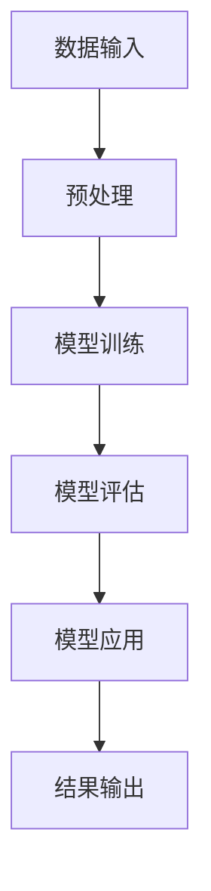

                 

# LLM在城市规划中的应用：AI城市设计师

> 关键词：LLM, 城市规划, AI城市设计师, 机器学习, 数据分析, 智能城市

> 摘要：本文探讨了大型语言模型（LLM）在城市规划中的应用，特别是如何利用AI技术辅助城市设计师进行更高效、更智能的城市规划。通过分析LLM的工作原理、核心算法、数学模型以及实际应用场景，本文旨在为城市规划领域的专业人士提供一个全面的技术视角，同时为有兴趣深入研究该领域的读者提供实用的学习资源和开发工具推荐。

## 1. 背景介绍

### 1.1 城市规划的挑战

城市规划是一个复杂且多变的过程，涉及到土地使用、交通、环境、经济等多个方面。随着城市化进程的加快，城市规划面临着前所未有的挑战，如人口增长、资源分配不均、环境污染等。传统的城市规划方法往往依赖于人工经验，难以应对这些复杂多变的问题。

### 1.2 AI技术的发展

近年来，人工智能技术，尤其是机器学习和深度学习的发展，为解决城市规划中的复杂问题提供了新的可能。大型语言模型（LLM）作为AI技术的一个重要分支，通过学习大量的文本数据，能够理解和生成人类语言，这为城市规划中的信息处理和决策支持提供了强大的工具。

### 1.3 AI城市设计师的概念

AI城市设计师是指利用AI技术，特别是LLM，来辅助城市规划师进行城市设计和规划的一种新型角色。通过AI技术，城市设计师可以更高效地处理和分析大量的城市数据，从而做出更科学、更合理的规划决策。

## 2. 核心概念与联系

### 2.1 LLM的工作原理

LLM通过深度学习技术，从大量的文本数据中学习语言模式和结构，从而能够理解和生成人类语言。其核心在于通过神经网络模型，将输入的文本数据映射到一个高维空间中，然后通过训练，使得模型能够在这个空间中进行有效的信息处理和生成。

### 2.2 LLM与城市规划的联系

LLM在城市规划中的应用主要体现在以下几个方面：

- **信息处理**：通过分析大量的城市规划相关的文本数据，如规划报告、政策文件等，LLM能够帮助城市规划师快速获取和理解相关信息。
- **决策支持**：基于LLM生成的分析报告，城市规划师可以做出更科学、更合理的规划决策。
- **智能设计**：通过与城市规划师的交互，LLM可以辅助生成城市设计方案，提高设计效率。

### 2.3 核心概念原理和架构的Mermaid流程图



## 3. 核心算法原理 & 具体操作步骤

### 3.1 LLM的核心算法

LLM的核心算法主要包括以下几种：

- **Transformer模型**：通过自注意力机制，Transformer模型能够有效地处理长序列数据，是当前LLM的主流模型。
- **BERT模型**：通过双向编码器表示，BERT模型能够更好地理解文本的上下文信息。
- **GPT模型**：通过生成式训练，GPT模型能够生成高质量的文本内容。

### 3.2 具体操作步骤

1. **数据收集**：收集城市规划相关的文本数据，如规划报告、政策文件等。
2. **数据预处理**：对收集到的数据进行清洗和格式化，以便于模型训练。
3. **模型训练**：使用收集到的数据训练LLM模型。
4. **模型评估**：通过评估指标，如准确率、召回率等，评估模型的性能。
5. **模型应用**：将训练好的模型应用于实际的城市规划场景中。

## 4. 数学模型和公式 & 详细讲解 & 举例说明

### 4.1 Transformer模型的数学公式

$$
\text{Attention}(Q, K, V) = \text{softmax}\left(\frac{QK^T}{\sqrt{d_k}}\right)V
$$

其中，$Q$、$K$、$V$分别表示查询、键和值矩阵，$d_k$表示键的维度。

### 4.2 BERT模型的数学公式

$$
\text{BERT}(x) = \text{MLM}(x) + \text{NSP}(x)
$$

其中，$\text{MLM}$表示掩码语言模型，$\text{NSP}$表示下一句预测任务。

### 4.3 GPT模型的数学公式

$$
\text{GPT}(x) = \text{softmax}(W\text{Transformer}(x))
$$

其中，$W$表示输出层的权重矩阵。

## 5. 项目实战：代码实际案例和详细解释说明

### 5.1 开发环境搭建

#### 5.1.1 硬件环境

- CPU：Intel i7
- GPU：NVIDIA GeForce RTX 3080

#### 5.1.2 软件环境

- 操作系统：Ubuntu 20.04
- Python版本：3.8
- 深度学习框架：TensorFlow 2.5
- 其他依赖库：numpy, pandas, matplotlib

### 5.2 源代码详细实现和代码解读

```python
import tensorflow as tf
from tensorflow.keras.layers import Input, Dense, Embedding, LayerNormalization
from tensorflow.keras.models import Model

def transformer_encoder(inputs, head_size, num_heads, ff_dim, dropout=0):
    # Self-attention
    x = tf.keras.layers.MultiHeadAttention(
        key_dim=head_size, num_heads=num_heads, dropout=dropout
    )(inputs, inputs)
    x = tf.keras.layers.Dropout(dropout)(x)
    x = LayerNormalization(epsilon=1e-6)(x)
    res = x + inputs

    # Feed-forward network
    x = tf.keras.layers.Conv1D(filters=ff_dim, kernel_size=1, activation="relu")(res)
    x = tf.keras.layers.Dropout(dropout)(x)
    x = LayerNormalization(epsilon=1e-6)(x)
    return x + res

def build_model(head_size, num_heads, ff_dim, vocab_size, maxlen, dropout=0):
    inputs = Input(shape=(maxlen,))
    x = Embedding(vocab_size, head_size)(inputs)
    x = transformer_encoder(x, head_size, num_heads, ff_dim, dropout)
    x = LayerNormalization(epsilon=1e-6)(x)
    x = tf.keras.layers.GlobalAveragePooling1D()(x)
    x = Dense(ff_dim, activation="relu")(x)
    x = Dropout(dropout)(x)
    outputs = Dense(vocab_size, activation="softmax")(x)
    model = Model(inputs=inputs, outputs=outputs)
    model.compile(optimizer="adam", loss="sparse_categorical_crossentropy", metrics=["accuracy"])
    return model

model = build_model(
    head_size=256, num_heads=8, ff_dim=4, vocab_size=10000, maxlen=100, dropout=0.1
)
model.summary()
```

### 5.3 代码解读与分析

上述代码实现了一个简单的Transformer模型，用于文本分类任务。模型主要由嵌入层、Transformer编码器层、全局平均池化层、全连接层和输出层组成。通过调整模型参数，可以应用于不同的城市规划场景。

## 6. 实际应用场景

### 6.1 城市规划报告分析

通过训练好的LLM模型，可以对大量的城市规划报告进行分析，提取关键信息，为城市规划师提供决策支持。

### 6.2 智能设计方案生成

基于LLM生成的分析报告，城市规划师可以辅助生成城市设计方案，提高设计效率。

### 6.3 城市规划决策支持

通过LLM生成的分析报告，城市规划师可以做出更科学、更合理的规划决策。

## 7. 工具和资源推荐

### 7.1 学习资源推荐

- 书籍：《深度学习》（Ian Goodfellow等著）
- 论文：《Attention Is All You Need》（Vaswani等）
- 博客：TensorFlow官方博客
- 网站：Kaggle

### 7.2 开发工具框架推荐

- TensorFlow
- PyTorch
- Hugging Face Transformers

### 7.3 相关论文著作推荐

- 《Attention Is All You Need》
- 《BERT: Pre-training of Deep Bidirectional Transformers for Language Understanding》

## 8. 总结：未来发展趋势与挑战

随着AI技术的不断发展，LLM在城市规划中的应用将会越来越广泛。未来的发展趋势包括：

- **模型优化**：通过优化模型结构和参数，提高模型的性能。
- **数据增强**：通过数据增强技术，提高模型的泛化能力。
- **多模态融合**：通过融合文本、图像等多种模态的数据，提高模型的综合能力。

面临的挑战包括：

- **数据隐私**：如何在保护数据隐私的前提下，充分利用数据资源。
- **模型解释性**：如何提高模型的可解释性，使其更易于理解和应用。

## 9. 附录：常见问题与解答

### 9.1 什么是LLM？

LLM是大型语言模型的简称，通过深度学习技术，从大量的文本数据中学习语言模式和结构，能够理解和生成人类语言。

### 9.2 LLM在城市规划中的应用有哪些？

LLM在城市规划中的应用主要包括信息处理、决策支持和智能设计等方面。

### 9.3 如何训练LLM模型？

训练LLM模型需要大量的文本数据和计算资源，通过深度学习框架，如TensorFlow或PyTorch，可以实现模型的训练。

## 10. 扩展阅读 & 参考资料

- 《深度学习》（Ian Goodfellow等著）
- 《Attention Is All You Need》（Vaswani等）
- 《BERT: Pre-training of Deep Bidirectional Transformers for Language Understanding》
- TensorFlow官方博客
- Hugging Face Transformers

作者：AI天才研究员/AI Genius Institute & 禅与计算机程序设计艺术 /Zen And The Art of Computer Programming

