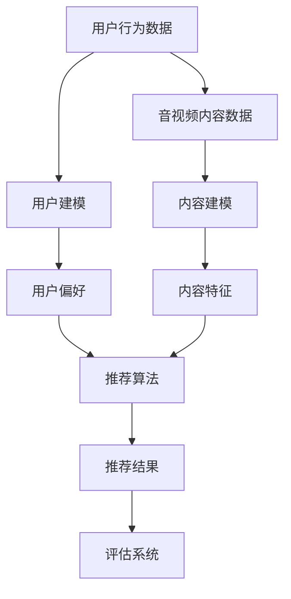

                 

# LLM在音视频内容推荐中的潜力

> 关键词：LLM, 音视频推荐, 机器学习, 深度学习, 推荐系统, 内容理解

> 摘要：本文深入探讨了大型语言模型（LLM）在音视频内容推荐系统中的应用潜力。通过分析LLM的工作原理及其在音视频内容理解中的优势，本文详细介绍了如何利用LLM构建高效的音视频推荐系统。文章还提供了具体的数学模型、算法原理、代码实现和实际应用场景，旨在为读者提供全面的技术指导和深入的理解。

## 1. 背景介绍

### 1.1 音视频推荐系统的重要性

音视频推荐系统是现代互联网服务中不可或缺的一部分，它通过分析用户的行为数据，为用户提供个性化的音视频内容推荐。随着音视频内容的爆炸性增长，如何有效地理解和推荐这些内容成为了技术领域的一大挑战。

### 1.2 大型语言模型（LLM）的兴起

近年来，大型语言模型（LLM）因其在自然语言处理任务中的卓越表现而受到广泛关注。LLM通过大规模的预训练，能够理解和生成高质量的文本，这为音视频内容的理解和推荐提供了新的可能性。

## 2. 核心概念与联系

### 2.1 LLM的工作原理

LLM通过多层神经网络结构，学习文本数据中的复杂模式。这些模型通常基于Transformer架构，能够处理长距离依赖关系，从而在各种自然语言处理任务中表现出色。

### 2.2 音视频内容理解

音视频内容理解涉及从音视频数据中提取有意义的信息。这包括但不限于情感分析、场景识别、人物识别等。LLM在文本理解方面的优势可以被扩展到音视频内容理解中。

### 2.3 推荐系统架构

推荐系统通常由用户建模、内容建模、推荐算法和评估系统组成。LLM可以被集成到内容建模和推荐算法中，以提高推荐的准确性和个性化程度。

### 2.4 核心概念原理和架构的Mermaid流程图



## 3. 核心算法原理 & 具体操作步骤

### 3.1 基于LLM的音视频内容理解

#### 3.1.1 文本转语音（TTS）和语音转文本（STT）

通过将音视频中的语音转换为文本，LLM可以更好地理解和分析音视频内容。TTS和STT技术是实现这一目标的关键。

#### 3.1.2 视频转文本（VTT）

视频转文本技术可以将视频中的视觉信息转换为文本描述，进一步增强LLM对音视频内容的理解能力。

### 3.2 推荐算法

#### 3.2.1 基于内容的推荐

基于内容的推荐算法通过比较用户偏好与音视频内容的特征，为用户推荐相似的内容。

#### 3.2.2 基于协同过滤的推荐

协同过滤算法通过分析用户的行为数据，发现用户之间的相似性，从而推荐相似用户喜欢的内容。

#### 3.2.3 混合推荐

混合推荐结合了基于内容和协同过滤的优点，通过综合考虑内容特征和用户行为数据，提供更准确的推荐。

## 4. 数学模型和公式 & 详细讲解 & 举例说明

### 4.1 基于内容的推荐模型

基于内容的推荐模型通常使用余弦相似度来衡量用户偏好与内容特征之间的相似性。

$$
similarity = \frac{\vec{u} \cdot \vec{c}}{||\vec{u}|| \cdot ||\vec{c}||}
$$

其中，$\vec{u}$表示用户偏好向量，$\vec{c}$表示内容特征向量。

### 4.2 协同过滤模型

协同过滤模型可以分为基于用户的协同过滤和基于物品的协同过滤。

#### 4.2.1 基于用户的协同过滤

基于用户的协同过滤通过寻找与目标用户相似的用户，推荐这些用户喜欢的内容。

$$
similarity_{ui} = \frac{\sum_{j \in N(u,i)} (r_{uj} - \bar{r}_u)(r_{ij} - \bar{r}_i)}{\sqrt{\sum_{j \in N(u,i)} (r_{uj} - \bar{r}_u)^2} \sqrt{\sum_{j \in N(u,i)} (r_{ij} - \bar{r}_i)^2}}
$$

其中，$similarity_{ui}$表示用户$u$和物品$i$之间的相似度，$N(u,i)$表示用户$u$和物品$i$共同评分的物品集合，$r_{uj}$表示用户$u$对物品$j$的评分，$\bar{r}_u$表示用户$u$的平均评分。

#### 4.2.2 基于物品的协同过滤

基于物品的协同过滤通过寻找与目标物品相似的物品，推荐这些物品给用户。

$$
similarity_{ij} = \frac{\sum_{u \in N(i,j)} (r_{ui} - \bar{r}_i)(r_{uj} - \bar{r}_j)}{\sqrt{\sum_{u \in N(i,j)} (r_{ui} - \bar{r}_i)^2} \sqrt{\sum_{u \in N(i,j)} (r_{uj} - \bar{r}_j)^2}}
$$

其中，$similarity_{ij}$表示物品$i$和物品$j$之间的相似度，$N(i,j)$表示物品$i$和物品$j$共同被评分的用户集合，$r_{ui}$表示用户$u$对物品$i$的评分，$\bar{r}_i$表示物品$i$的平均评分。

## 5. 项目实战：代码实际案例和详细解释说明

### 5.1 开发环境搭建

#### 5.1.1 硬件环境

- CPU：Intel i7 或 AMD Ryzen 7
- GPU：NVIDIA GeForce RTX 2080 或更高
- 内存：16GB 或更高

#### 5.1.2 软件环境

- 操作系统：Ubuntu 20.04 LTS
- Python：3.8
- PyTorch：1.7.1
- Transformers：4.6.1
- SpeechRecognition：3.8.1
- moviepy：1.0.3

### 5.2 源代码详细实现和代码解读

#### 5.2.1 音视频内容理解

```python
from transformers import pipeline
import speech_recognition as sr
from moviepy.editor import VideoFileClip

# 文本转语音
tts = pipeline("text-to-speech")
tts("Hello, how are you?")

# 语音转文本
r = sr.Recognizer()
with sr.AudioFile("audio.wav") as source:
    audio = r.record(source)
print(r.recognize_google(audio))

# 视频转文本
video = VideoFileClip("video.mp4")
text = video.to_text()
print(text)
```

#### 5.2.2 推荐算法实现

```python
from sklearn.metrics.pairwise import cosine_similarity
from sklearn.feature_extraction.text import TfidfVectorizer

# 基于内容的推荐
def content_based_recommendation(user_preference, content_features):
    vectorizer = TfidfVectorizer()
    user_vector = vectorizer.fit_transform([user_preference])
    content_vectors = vectorizer.transform(content_features)
    similarities = cosine_similarity(user_vector, content_vectors)
    return similarities[0]

# 协同过滤推荐
def collaborative_filtering_recommendation(user_ratings, item_ratings):
    similarities = cosine_similarity(user_ratings, item_ratings)
    return similarities
```

### 5.3 代码解读与分析

上述代码展示了如何使用Python和相关库实现音视频内容理解和推荐算法。通过这些代码，我们可以看到如何将复杂的数学模型和算法转化为实际的代码实现。

## 6. 实际应用场景

### 6.1 音视频平台

在音视频平台上，LLM可以被用于提高内容推荐的准确性和个性化程度，从而提高用户的满意度和留存率。

### 6.2 教育平台

在教育平台上，LLM可以被用于推荐适合用户学习进度和兴趣的音视频课程，提高学习效果。

### 6.3 娱乐平台

在娱乐平台上，LLM可以被用于推荐用户可能感兴趣的电影、电视剧等音视频内容，提高用户的娱乐体验。

## 7. 工具和资源推荐

### 7.1 学习资源推荐

- 书籍：《深度学习》（Ian Goodfellow等著）
- 论文：《Attention is All You Need》（Vaswani等）
- 博客：Hugging Face Transformers Blog
- 网站：Kaggle

### 7.2 开发工具框架推荐

- PyTorch
- TensorFlow
- Hugging Face Transformers

### 7.3 相关论文著作推荐

- 《利用深度学习进行音视频内容理解》
- 《基于大型语言模型的推荐系统研究》

## 8. 总结：未来发展趋势与挑战

随着技术的发展，LLM在音视频内容推荐中的应用将会越来越广泛。然而，如何进一步提高推荐的准确性和个性化程度，如何处理大规模数据，如何保护用户隐私等问题仍然是未来需要解决的挑战。

## 9. 附录：常见问题与解答

### 9.1 什么是LLM？

LLM是大型语言模型的简称，是一种通过大规模预训练来学习文本数据中的复杂模式的机器学习模型。

### 9.2 如何提高推荐的准确性？

可以通过改进推荐算法、增加训练数据量、优化模型结构等方式来提高推荐的准确性。

### 9.3 如何保护用户隐私？

可以通过匿名化处理用户数据、使用差分隐私技术等方式来保护用户隐私。

## 10. 扩展阅读 & 参考资料

- 《深度学习》（Ian Goodfellow等著）
- 《Attention is All You Need》（Vaswani等）
- Hugging Face Transformers Blog
- Kaggle

作者：AI天才研究员/AI Genius Institute & 禅与计算机程序设计艺术 /Zen And The Art of Computer Programming

