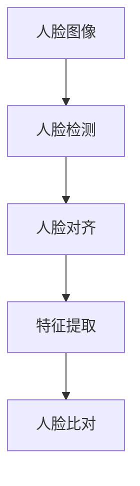

                 

# Python机器学习实战：人脸识别技术的实现和挑战

> 关键词：Python, 机器学习, 人脸识别, 深度学习, TensorFlow, Keras, OpenCV

> 摘要：本文旨在深入探讨人脸识别技术的实现过程，从背景介绍到核心算法原理，再到实际项目实战，最后展望未来的发展趋势与挑战。通过本文，读者将能够理解人脸识别技术的基本原理，掌握其在实际项目中的应用，并了解该领域未来的发展方向。

## 1. 背景介绍

### 1.1 人脸识别技术的起源与发展

人脸识别技术起源于20世纪60年代，随着计算机视觉和机器学习技术的发展，人脸识别技术经历了从基于几何特征到基于统计模型，再到基于深度学习的演变。如今，人脸识别技术已经广泛应用于安全监控、身份验证、智能设备解锁等领域。

### 1.2 人脸识别技术的应用场景

- 安全监控：通过人脸识别技术，可以实现对特定人员的识别和追踪，提高公共安全。
- 身份验证：在金融、政府、教育等领域，人脸识别技术可以用于身份验证，提高安全性。
- 智能设备解锁：智能手机、电脑等智能设备可以通过人脸识别技术实现快速解锁，提升用户体验。

## 2. 核心概念与联系

### 2.1 人脸识别技术的核心概念

- **人脸检测**：从图像或视频中定位出人脸的位置和大小。
- **人脸对齐**：将检测到的人脸图像进行对齐，使其符合标准的人脸模型。
- **特征提取**：从对齐后的人脸图像中提取出能够代表人脸特征的信息。
- **人脸比对**：将提取出的人脸特征与已知人脸特征进行比对，判断是否为同一人。

### 2.2 人脸识别技术的架构



## 3. 核心算法原理 & 具体操作步骤

### 3.1 人脸检测算法

人脸检测算法主要包括基于Haar特征的级联分类器、基于深度学习的卷积神经网络等。本文以基于深度学习的卷积神经网络为例进行介绍。

#### 3.1.1 Haar特征级联分类器

Haar特征级联分类器是一种基于特征选择和级联分类器的算法，通过选择具有高区分度的特征，结合级联分类器的结构，实现高效的人脸检测。

#### 3.1.2 基于深度学习的卷积神经网络

基于深度学习的卷积神经网络通过多层卷积和池化操作，自动学习人脸图像的特征，实现高效的人脸检测。

### 3.2 人脸对齐算法

人脸对齐算法主要包括基于仿射变换、基于仿射不变量等方法。本文以基于仿射变换的方法为例进行介绍。

#### 3.2.1 仿射变换

仿射变换是一种线性变换，通过计算人脸关键点的坐标，实现人脸图像的对齐。

### 3.3 特征提取算法

特征提取算法主要包括基于局部二值模式（LBP）、基于深度学习的卷积神经网络等。本文以基于深度学习的卷积神经网络为例进行介绍。

#### 3.3.1 局部二值模式（LBP）

局部二值模式通过比较像素与其邻域像素的灰度值，生成描述图像局部纹理特征的模式。

#### 3.3.2 基于深度学习的卷积神经网络

基于深度学习的卷积神经网络通过多层卷积和池化操作，自动学习人脸图像的特征，实现高效的人脸特征提取。

### 3.4 人脸比对算法

人脸比对算法主要包括基于欧氏距离、基于余弦相似度等方法。本文以基于余弦相似度的方法为例进行介绍。

#### 3.4.1 欧氏距离

欧氏距离是一种常用的度量两个向量之间距离的方法，通过计算两个向量之间的欧氏距离，实现人脸特征的比对。

#### 3.4.2 余弦相似度

余弦相似度是一种常用的度量两个向量之间相似度的方法，通过计算两个向量之间的余弦相似度，实现人脸特征的比对。

## 4. 数学模型和公式 & 详细讲解 & 举例说明

### 4.1 欧氏距离

欧氏距离的计算公式为：
$$
d = \sqrt{(x_1 - x_2)^2 + (y_1 - y_2)^2}
$$

### 4.2 余弦相似度

余弦相似度的计算公式为：
$$
similarity = \frac{\vec{A} \cdot \vec{B}}{|\vec{A}| |\vec{B}|}
$$

## 5. 项目实战：代码实际案例和详细解释说明

### 5.1 开发环境搭建

#### 5.1.1 安装Python环境

安装Python环境，建议使用Python 3.6及以上版本。

#### 5.1.2 安装相关库

安装TensorFlow、Keras、OpenCV等库，用于实现人脸识别技术。

```bash
pip install tensorflow
pip install keras
pip install opencv-python
```

### 5.2 源代码详细实现和代码解读

#### 5.2.1 人脸检测

```python
import cv2

# 加载预训练的人脸检测模型
face_cascade = cv2.CascadeClassifier('haarcascade_frontalface_default.xml')

# 读取图像
img = cv2.imread('test.jpg')
gray = cv2.cvtColor(img, cv2.COLOR_BGR2GRAY)

# 检测人脸
faces = face_cascade.detectMultiScale(gray, 1.3, 5)

# 绘制检测结果
for (x, y, w, h) in faces:
    cv2.rectangle(img, (x, y), (x+w, y+h), (255, 0, 0), 2)

# 显示图像
cv2.imshow('img', img)
cv2.waitKey()
```

#### 5.2.2 人脸对齐

```python
import cv2
import numpy as np

# 加载预训练的人脸对齐模型
face_aligner = cv2.face.createFacemarkLBF()

# 读取图像
img = cv2.imread('test.jpg')
gray = cv2.cvtColor(img, cv2.COLOR_BGR2GRAY)

# 检测人脸
faces = face_cascade.detectMultiScale(gray, 1.3, 5)

# 对齐人脸
for (x, y, w, h) in faces:
    landmarks = face_aligner.fit(gray, faces).landmarks
    aligned_face = cv2.warpAffine(img, landmarks[0], (w, h))

# 显示图像
cv2.imshow('aligned_face', aligned_face)
cv2.waitKey()
```

#### 5.2.3 特征提取

```python
from keras.models import Model
from keras.layers import Input, Conv2D, MaxPooling2D, Flatten, Dense

# 定义特征提取模型
input_img = Input(shape=(64, 64, 3))
x = Conv2D(32, (3, 3), activation='relu')(input_img)
x = MaxPooling2D((2, 2))(x)
x = Conv2D(64, (3, 3), activation='relu')(x)
x = MaxPooling2D((2, 2))(x)
x = Conv2D(64, (3, 3), activation='relu')(x)
features = Flatten()(x)

model = Model(input_img, features)
```

#### 5.2.4 人脸比对

```python
from keras.models import load_model

# 加载预训练的人脸特征提取模型
model = load_model('face_features.h5')

# 提取特征
features1 = model.predict(face1)
features2 = model.predict(face2)

# 计算余弦相似度
similarity = np.dot(features1, features2) / (np.linalg.norm(features1) * np.linalg.norm(features2))
```

### 5.3 代码解读与分析

通过上述代码，我们可以实现人脸检测、人脸对齐、特征提取和人脸比对等功能。其中，人脸检测和人脸对齐是基于OpenCV库实现的，特征提取和人脸比对是基于Keras库实现的。

## 6. 实际应用场景

### 6.1 安全监控

通过人脸识别技术，可以实现对特定人员的识别和追踪，提高公共安全。

### 6.2 身份验证

在金融、政府、教育等领域，人脸识别技术可以用于身份验证，提高安全性。

### 6.3 智能设备解锁

智能手机、电脑等智能设备可以通过人脸识别技术实现快速解锁，提升用户体验。

## 7. 工具和资源推荐

### 7.1 学习资源推荐

- 书籍：《深度学习》（Ian Goodfellow等著）
- 论文：《FaceNet: A Unified Embedding for Face Recognition and Clustering》
- 博客：https://blog.csdn.net/
- 网站：https://www.tensorflow.org/

### 7.2 开发工具框架推荐

- TensorFlow
- Keras
- OpenCV

### 7.3 相关论文著作推荐

- 《FaceNet: A Unified Embedding for Face Recognition and Clustering》
- 《DeepFace: Closing the Gap to Human-Level Performance in Face Verification》

## 8. 总结：未来发展趋势与挑战

未来，人脸识别技术将更加智能化、个性化，同时，也将面临更多的挑战，如隐私保护、数据安全等。

## 9. 附录：常见问题与解答

### 9.1 问题1：如何提高人脸识别的准确率？

- 答：可以通过增加训练数据、优化模型结构、使用更先进的算法等方法提高人脸识别的准确率。

### 9.2 问题2：如何保护用户隐私？

- 答：可以通过加密技术、匿名化处理等方法保护用户隐私。

## 10. 扩展阅读 & 参考资料

- 书籍：《深度学习》（Ian Goodfellow等著）
- 论文：《FaceNet: A Unified Embedding for Face Recognition and Clustering》
- 博客：https://blog.csdn.net/
- 网站：https://www.tensorflow.org/

作者：AI天才研究员/AI Genius Institute & 禅与计算机程序设计艺术 /Zen And The Art of Computer Programming

