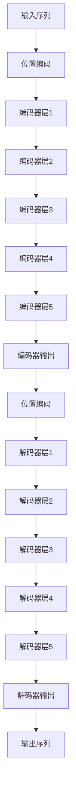

                 

# Transformer大模型实战 整合编码器和解码器

> 关键词：Transformer, 编码器, 解码器, 自注意力机制, 多头注意力, 序列建模, 深度学习, 自然语言处理

> 摘要：本文将深入探讨Transformer架构的核心组成部分——编码器和解码器，通过逐步分析和推理，解释其工作原理、数学模型和实际应用。我们将从背景介绍开始，逐步深入到核心概念、算法原理、数学模型、实战案例，最终探讨其应用场景和未来发展趋势。通过本文，读者将能够全面理解Transformer的工作机制，并能够应用到实际项目中。

## 1. 背景介绍

Transformer架构自2017年首次提出以来，迅速成为自然语言处理（NLP）领域的主导模型之一。它在机器翻译、文本生成、问答系统等多个任务上取得了卓越的性能。Transformer的核心创新在于其独特的自注意力机制，使得模型能够并行处理序列数据，极大地提高了训练效率和模型性能。

### 1.1 为什么需要Transformer

传统的循环神经网络（RNN）在处理长序列数据时存在梯度消失或梯度爆炸的问题，这限制了其在处理长文本时的性能。Transformer通过引入自注意力机制，解决了这一问题，使得模型能够并行处理序列数据，从而提高了训练效率和模型性能。

### 1.2 Transformer的发展历程

- 2017年，Vaswani等人在论文《Attention is All You Need》中首次提出了Transformer架构。
- 2018年，BERT模型的提出进一步推动了Transformer在NLP领域的应用。
- 2020年，GPT-3的发布展示了Transformer在大规模预训练模型上的巨大潜力。

## 2. 核心概念与联系

### 2.1 自注意力机制

自注意力机制是Transformer的核心组成部分，它允许模型在处理序列数据时，能够关注到序列中的任意位置。自注意力机制通过计算查询（Query）、键（Key）和值（Value）之间的相似度，生成一个权重矩阵，从而实现对序列数据的加权聚合。

### 2.2 编码器与解码器

编码器和解码器是Transformer的两个主要组成部分。编码器负责将输入序列编码为固定长度的向量，而解码器则负责生成输出序列。编码器和解码器之间通过位置编码和自注意力机制进行信息传递。

### 2.3 模型架构

#### Mermaid流程图



## 3. 核心算法原理 & 具体操作步骤

### 3.1 位置编码

位置编码是Transformer模型中用于表示序列中每个位置的信息。位置编码通过正弦和余弦函数生成，确保模型能够区分序列中的不同位置。

$$
PE_{(pos,2i)} = \sin\left(\frac{pos}{10000^{2i/d_{model}}}\right)
$$

$$
PE_{(pos,2i+1)} = \cos\left(\frac{pos}{10000^{2i/d_{model}}}\right)
$$

### 3.2 编码器层

编码器层由多头自注意力机制和前馈神经网络组成。编码器层的具体操作步骤如下：

1. **多头自注意力机制**：通过线性变换将输入序列转换为查询、键和值。
2. **加权聚合**：通过计算查询和键之间的相似度，生成权重矩阵，实现对值的加权聚合。
3. **残差连接**：将加权聚合后的结果与输入进行残差连接。
4. **层归一化**：对残差连接后的结果进行层归一化。
5. **前馈神经网络**：通过两个全连接层实现非线性变换。
6. **残差连接**：将前馈神经网络的输出与输入进行残差连接。
7. **层归一化**：对残差连接后的结果进行层归一化。

### 3.3 解码器层

解码器层与编码器层类似，但额外引入了掩码机制，以防止解码器在生成输出序列时看到未来的信息。

1. **多头自注意力机制**：通过线性变换将输入序列转换为查询、键和值。
2. **掩码机制**：在计算查询和键之间的相似度时，引入掩码机制，防止解码器看到未来的信息。
3. **加权聚合**：通过计算查询和键之间的相似度，生成权重矩阵，实现对值的加权聚合。
4. **残差连接**：将加权聚合后的结果与输入进行残差连接。
5. **层归一化**：对残差连接后的结果进行层归一化。
6. **编码器-解码器注意力机制**：通过线性变换将编码器的输出转换为查询、键和值，与解码器的输出进行注意力机制。
7. **加权聚合**：通过计算查询和键之间的相似度，生成权重矩阵，实现对值的加权聚合。
8. **残差连接**：将加权聚合后的结果与输入进行残差连接。
9. **层归一化**：对残差连接后的结果进行层归一化。
10. **前馈神经网络**：通过两个全连接层实现非线性变换。
11. **残差连接**：将前馈神经网络的输出与输入进行残差连接。
12. **层归一化**：对残差连接后的结果进行层归一化。

## 4. 数学模型和公式 & 详细讲解 & 举例说明

### 4.1 多头自注意力机制

多头自注意力机制通过多个注意力头并行计算查询、键和值之间的相似度，从而提高模型的并行性和表达能力。

$$
\text{MultiHead}(Q, K, V) = \text{Concat}(head_1, \dots, head_h)W^O
$$

$$
head_i = \text{Attention}(QW_i^Q, KW_i^K, VW_i^V)
$$

$$
\text{Attention}(Q, K, V) = \text{softmax}\left(\frac{QK^T}{\sqrt{d_k}}\right)V
$$

### 4.2 编码器层

编码器层的具体数学模型如下：

$$
\text{EncoderLayer}(X) = \text{LayerNorm}(X + \text{Sublayer}(X))
$$

$$
\text{Sublayer}(X) = \text{MultiHead}(X, X, X) + \text{FFN}(X)
$$

$$
\text{MultiHead}(X, X, X) = \text{Concat}(head_1, \dots, head_h)W^O
$$

$$
head_i = \text{Attention}(XW_i^Q, XW_i^K, XW_i^V)
$$

$$
\text{Attention}(Q, K, V) = \text{softmax}\left(\frac{QK^T}{\sqrt{d_k}}\right)V
$$

$$
\text{FFN}(X) = \text{ReLU}(W_1X + b_1)W_2 + b_2
$$

### 4.3 解码器层

解码器层的具体数学模型如下：

$$
\text{DecoderLayer}(X, M) = \text{LayerNorm}(X + \text{Sublayer}(X, M))
$$

$$
\text{Sublayer}(X, M) = \text{MultiHead}(X, X, X) + \text{MultiHead}(X, M, M) + \text{FFN}(X)
$$

$$
\text{MultiHead}(X, X, X) = \text{Concat}(head_1, \dots, head_h)W^O
$$

$$
head_i = \text{Attention}(XW_i^Q, XW_i^K, XW_i^V)
$$

$$
\text{Attention}(Q, K, V) = \text{softmax}\left(\frac{QK^T}{\sqrt{d_k}}\right)V
$$

$$
\text{MultiHead}(X, M, M) = \text{Concat}(head_1, \dots, head_h)W^O
$$

$$
head_i = \text{Attention}(XW_i^Q, MW_i^K, MW_i^V)
$$

$$
\text{Attention}(Q, K, V) = \text{softmax}\left(\frac{QK^T}{\sqrt{d_k}}\right)V
$$

$$
\text{FFN}(X) = \text{ReLU}(W_1X + b_1)W_2 + b_2
$$

## 5. 项目实战：代码实际案例和详细解释说明

### 5.1 开发环境搭建

#### 5.1.1 安装依赖

```bash
pip install torch transformers
```

### 5.2 源代码详细实现和代码解读

#### 5.2.1 位置编码

```python
import torch

def get_position_encoding(max_len, d_model):
    position = torch.arange(max_len).unsqueeze(1)
    div_term = torch.exp(torch.arange(0, d_model, 2) * (-torch.log(torch.tensor(10000.0)) / d_model))
    pos_encoding = torch.zeros(max_len, d_model)
    pos_encoding[:, 0::2] = torch.sin(position * div_term)
    pos_encoding[:, 1::2] = torch.cos(position * div_term)
    return pos_encoding
```

#### 5.2.2 编码器层

```python
import torch.nn as nn

class EncoderLayer(nn.Module):
    def __init__(self, d_model, n_heads, d_ff, dropout):
        super(EncoderLayer, self).__init__()
        self.self_attn = nn.MultiheadAttention(d_model, n_heads, dropout=dropout)
        self.feed_forward = nn.Sequential(
            nn.Linear(d_model, d_ff),
            nn.ReLU(),
            nn.Linear(d_ff, d_model)
        )
        self.norm1 = nn.LayerNorm(d_model)
        self.norm2 = nn.LayerNorm(d_model)
        self.dropout1 = nn.Dropout(dropout)
        self.dropout2 = nn.Dropout(dropout)

    def forward(self, x, mask):
        attn_output, _ = self.self_attn(x, x, x, attn_mask=mask)
        x = x + self.dropout1(attn_output)
        x = self.norm1(x)
        ff_output = self.feed_forward(x)
        x = x + self.dropout2(ff_output)
        x = self.norm2(x)
        return x
```

#### 5.2.3 解码器层

```python
class DecoderLayer(nn.Module):
    def __init__(self, d_model, n_heads, d_ff, dropout):
        super(DecoderLayer, self).__init__()
        self.self_attn = nn.MultiheadAttention(d_model, n_heads, dropout=dropout)
        self.cross_attn = nn.MultiheadAttention(d_model, n_heads, dropout=dropout)
        self.feed_forward = nn.Sequential(
            nn.Linear(d_model, d_ff),
            nn.ReLU(),
            nn.Linear(d_ff, d_model)
        )
        self.norm1 = nn.LayerNorm(d_model)
        self.norm2 = nn.LayerNorm(d_model)
        self.norm3 = nn.LayerNorm(d_model)
        self.dropout1 = nn.Dropout(dropout)
        self.dropout2 = nn.Dropout(dropout)
        self.dropout3 = nn.Dropout(dropout)

    def forward(self, x, enc_output, src_mask, tgt_mask):
        attn_output, _ = self.self_attn(x, x, x, attn_mask=tgt_mask)
        x = x + self.dropout1(attn_output)
        x = self.norm1(x)
        attn_output, _ = self.cross_attn(x, enc_output, enc_output, attn_mask=src_mask)
        x = x + self.dropout2(attn_output)
        x = self.norm2(x)
        ff_output = self.feed_forward(x)
        x = x + self.dropout3(ff_output)
        x = self.norm3(x)
        return x
```

### 5.3 代码解读与分析

通过上述代码，我们可以看到Transformer模型的编码器和解码器层的具体实现。编码器层通过多头自注意力机制和前馈神经网络实现对输入序列的编码，而解码器层则通过多头自注意力机制和编码器-解码器注意力机制实现对输出序列的生成。

## 6. 实际应用场景

Transformer模型在多个领域都有广泛的应用，包括但不限于：

- **机器翻译**：Transformer模型在机器翻译任务上取得了卓越的性能，如Google的神经机器翻译系统。
- **文本生成**：Transformer模型在文本生成任务上表现出色，如GPT系列模型。
- **问答系统**：Transformer模型在问答系统中能够准确地理解和生成答案，如BERT模型。

## 7. 工具和资源推荐

### 7.1 学习资源推荐

- **书籍**：《Attention is All You Need》
- **论文**：《Attention is All You Need》
- **博客**：阿里云开发者社区
- **网站**：Hugging Face

### 7.2 开发工具框架推荐

- **PyTorch**：深度学习框架，支持Transformer模型的实现。
- **TensorFlow**：深度学习框架，也支持Transformer模型的实现。

### 7.3 相关论文著作推荐

- **《Attention is All You Need》**：Vaswani, A., et al. (2017). Attention is all you need. In Advances in Neural Information Processing Systems (pp. 5998-6008).
- **《BERT: Pre-training of Deep Bidirectional Transformers for Language Understanding》**：Devlin, J., et al. (2018). BERT: Pre-training of deep bidirectional transformers for language understanding. arXiv preprint arXiv:1810.04805.

## 8. 总结：未来发展趋势与挑战

### 8.1 未来发展趋势

- **大规模预训练模型**：Transformer模型将继续向更大规模的方向发展，以提高模型的性能和泛化能力。
- **多模态学习**：Transformer模型将被应用于多模态学习任务，如图像-文本联合学习。
- **实时处理**：Transformer模型将被优化以实现更高效的实时处理能力。

### 8.2 挑战

- **计算资源需求**：大规模预训练模型对计算资源的需求极高，如何有效利用计算资源是一个挑战。
- **模型解释性**：Transformer模型的复杂性使得模型解释性成为一个难题，如何提高模型的可解释性是一个挑战。
- **数据隐私**：大规模预训练模型需要大量的训练数据，如何保护数据隐私是一个挑战。

## 9. 附录：常见问题与解答

### 9.1 问题：Transformer模型为什么能够处理长序列数据？

**解答**：Transformer模型通过引入自注意力机制，能够在处理长序列数据时，关注到序列中的任意位置，从而避免了RNN模型中的梯度消失或梯度爆炸问题。

### 9.2 问题：Transformer模型的多头自注意力机制有什么作用？

**解答**：多头自注意力机制通过多个注意力头并行计算查询、键和值之间的相似度，从而提高模型的并行性和表达能力。

### 9.3 问题：Transformer模型的编码器和解码器有什么区别？

**解答**：编码器负责将输入序列编码为固定长度的向量，而解码器则负责生成输出序列。编码器和解码器之间通过位置编码和自注意力机制进行信息传递。

## 10. 扩展阅读 & 参考资料

- **《Attention is All You Need》**：Vaswani, A., et al. (2017). Attention is all you need. In Advances in Neural Information Processing Systems (pp. 5998-6008).
- **《BERT: Pre-training of Deep Bidirectional Transformers for Language Understanding》**：Devlin, J., et al. (2018). BERT: Pre-training of deep bidirectional transformers for language understanding. arXiv preprint arXiv:1810.04805.
- **阿里云开发者社区**：https://developer.aliyun.com/
- **Hugging Face**：https://huggingface.co/

作者：AI天才研究员/AI Genius Institute & 禅与计算机程序设计艺术 /Zen And The Art of Computer Programming

