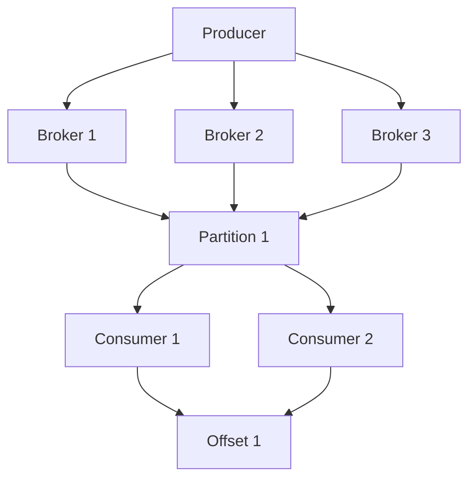

                 

# 【AI大数据计算原理与代码实例讲解】Kafka

> 关键词：Kafka, 大数据, 消息队列, 分布式系统, 消息传递, 高效处理, 可靠性, 扩展性, 实时数据处理

> 摘要：本文将深入探讨Kafka的核心原理、架构设计、核心算法以及实际应用案例。通过逐步分析和推理，我们将揭示Kafka如何在大数据处理中发挥关键作用，以及如何通过代码实例来实现和优化Kafka的功能。本文旨在为读者提供一个全面而深入的理解，帮助他们在实际项目中更好地应用Kafka。

## 1. 背景介绍

Kafka是一个开源的分布式流处理平台，最初由LinkedIn开发，现已成为Apache软件基金会的顶级项目。Kafka的设计目标是提供一个高吞吐量、低延迟的消息传递系统，适用于实时数据处理、日志聚合、监控系统等场景。Kafka的核心特性包括高吞吐量、可靠性、扩展性、实时性等，使其成为大数据处理领域不可或缺的工具。

### 1.1 Kafka的发展历程

- **2011年**：LinkedIn内部开发Kafka，用于处理内部日志数据。
- **2012年**：Kafka开源，成为Apache项目。
- **2013年**：Kafka 0.8版本发布，引入了多分区和多副本机制，增强了数据可靠性。
- **2015年**：Kafka 0.10版本发布，引入了Kafka Streams API，增强了流处理能力。
- **2018年**：Kafka 2.0版本发布，引入了Kafka Connect，增强了数据集成能力。

### 1.2 Kafka的应用场景

- **实时数据处理**：Kafka可以实时处理大量数据，适用于实时分析、监控系统等场景。
- **日志聚合**：Kafka可以收集和聚合来自多个源的日志数据，便于集中管理和分析。
- **监控系统**：Kafka可以实时监控系统状态，及时发现和处理异常。
- **推荐系统**：Kafka可以实时处理用户行为数据，支持个性化推荐系统。
- **金融交易**：Kafka可以实时处理金融交易数据，支持高频交易系统。

## 2. 核心概念与联系

### 2.1 Kafka的基本概念

- **Topic**：Kafka中的数据组织单位，可以看作是一个消息队列。
- **Partition**：Topic的物理存储单位，每个Partition是一个有序的日志文件。
- **Broker**：Kafka集群中的一个节点，负责存储和转发消息。
- **Consumer**：Kafka的消费者，用于订阅和消费消息。
- **Producer**：Kafka的生产者，用于发送消息到Topic。
- **Offset**：消息在Partition中的位置标识，用于消息的定位和消费。

### 2.2 Kafka的架构设计

#### 2.2.1 Kafka架构图



### 2.3 Kafka的核心特性

- **高吞吐量**：Kafka通过批量发送和并行处理，实现了高吞吐量。
- **可靠性**：Kafka通过多副本机制，确保数据的可靠性和持久性。
- **扩展性**：Kafka通过水平扩展，可以轻松增加Broker节点，提高系统处理能力。
- **实时性**：Kafka通过低延迟的消息传递机制，实现了实时数据处理。

## 3. 核心算法原理 & 具体操作步骤

### 3.1 Kafka的生产者机制

- **消息发送**：生产者将消息发送到指定的Topic和Partition。
- **消息序列化**：生产者将消息序列化为字节流，以便在网络中传输。
- **消息压缩**：生产者可以对消息进行压缩，以减少网络传输的负担。
- **消息发送策略**：生产者可以选择同步或异步发送消息，同步发送可以确保消息被成功发送，异步发送可以提高发送效率。

### 3.2 Kafka的消费者机制

- **消息订阅**：消费者订阅一个或多个Topic。
- **消息拉取**：消费者从Broker拉取消息，通过Offset定位消息的位置。
- **消息消费**：消费者消费消息，并处理消息内容。
- **消息确认**：消费者确认消息已被成功处理，Broker根据确认信息决定是否删除消息。

### 3.3 Kafka的多副本机制

- **副本选举**：Kafka通过ZooKeeper选举主副本，主副本负责数据的写入和读取。
- **数据同步**：主副本将数据同步到从副本，确保数据的一致性。
- **故障恢复**：当主副本故障时，ZooKeeper选举新的主副本，从副本自动升级为主副本。

## 4. 数学模型和公式 & 详细讲解 & 举例说明

### 4.1 Kafka的吞吐量模型

Kafka的吞吐量可以通过以下公式计算：

$$
\text{吞吐量} = \frac{\text{消息数量}}{\text{时间}}
$$

### 4.2 Kafka的可靠性模型

Kafka的可靠性可以通过以下公式计算：

$$
\text{可靠性} = \frac{\text{成功发送的消息数量}}{\text{总发送的消息数量}}
$$

### 4.3 Kafka的扩展性模型

Kafka的扩展性可以通过以下公式计算：

$$
\text{扩展性} = \frac{\text{处理能力}}{\text{节点数量}}
$$

### 4.4 举例说明

假设我们有一个Kafka集群，包含3个Broker节点，每个节点有10个Partition。我们发送10000条消息到一个Topic，每个Partition有1000条消息。假设每个消息的大小为1KB，网络带宽为100MB/s。

- **吞吐量**：10000条消息 / 1秒 = 10000条消息/秒
- **可靠性**：10000条消息 / 10000条消息 = 1
- **扩展性**：10000条消息/秒 / 3个节点 = 3333条消息/秒/节点

## 5. 项目实战：代码实际案例和详细解释说明

### 5.1 开发环境搭建

#### 5.1.1 安装Kafka

1. **下载Kafka**：访问Kafka官网下载最新版本的Kafka。
2. **解压文件**：将下载的文件解压到指定目录。
3. **配置环境变量**：将Kafka的bin目录添加到系统环境变量中。
4. **启动Kafka**：在终端中运行`bin/kafka-server-start.sh config/server.properties`启动Kafka。

#### 5.1.2 安装ZooKeeper

1. **下载ZooKeeper**：访问ZooKeeper官网下载最新版本的ZooKeeper。
2. **解压文件**：将下载的文件解压到指定目录。
3. **配置环境变量**：将ZooKeeper的bin目录添加到系统环境变量中。
4. **启动ZooKeeper**：在终端中运行`bin/zkServer.sh start`启动ZooKeeper。

### 5.2 源代码详细实现和代码解读

#### 5.2.1 生产者代码

```java
import org.apache.kafka.clients.producer.KafkaProducer;
import org.apache.kafka.clients.producer.ProducerRecord;

import java.util.Properties;

public class KafkaProducerExample {
    public static void main(String[] args) {
        Properties props = new Properties();
        props.put("bootstrap.servers", "localhost:9092");
        props.put("key.serializer", "org.apache.kafka.common.serialization.StringSerializer");
        props.put("value.serializer", "org.apache.kafka.common.serialization.StringSerializer");

        KafkaProducer<String, String> producer = new KafkaProducer<>(props);

        for (int i = 0; i < 1000; i++) {
            String key = "key" + i;
            String value = "value" + i;
            ProducerRecord<String, String> record = new ProducerRecord<>("my-topic", key, value);
            producer.send(record);
        }

        producer.close();
    }
}
```

#### 5.2.2 消费者代码

```java
import org.apache.kafka.clients.consumer.ConsumerRecord;
import org.apache.kafka.clients.consumer.ConsumerRecords;
import org.apache.kafka.clients.consumer.KafkaConsumer;

import java.time.Duration;
import java.util.Arrays;
import java.util.Properties;

public class KafkaConsumerExample {
    public static void main(String[] args) {
        Properties props = new Properties();
        props.put("bootstrap.servers", "localhost:9092");
        props.put("group.id", "test-group");
        props.put("enable.auto.commit", "true");
        props.put("auto.commit.interval.ms", "1000");
        props.put("key.deserializer", "org.apache.kafka.common.serialization.StringDeserializer");
        props.put("value.deserializer", "org.apache.kafka.common.serialization.StringDeserializer");

        KafkaConsumer<String, String> consumer = new KafkaConsumer<>(props);
        consumer.subscribe(Arrays.asList("my-topic"));

        while (true) {
            ConsumerRecords<String, String> records = consumer.poll(Duration.ofMillis(100));
            for (ConsumerRecord<String, String> record : records) {
                System.out.printf("offset = %d, key = %s, value = %s%n", record.offset(), record.key(), record.value());
            }
        }
    }
}
```

### 5.3 代码解读与分析

- **生产者代码**：生产者代码通过KafkaProducer发送消息到指定的Topic。代码中定义了生产者的配置属性，包括Bootstrap服务器地址、键和值的序列化器等。生产者发送1000条消息到`my-topic`。
- **消费者代码**：消费者代码通过KafkaConsumer订阅指定的Topic。代码中定义了消费者的配置属性，包括Bootstrap服务器地址、组ID、自动提交偏移量等。消费者通过poll方法拉取消息，并处理消息内容。

## 6. 实际应用场景

### 6.1 实时数据处理

Kafka可以实时处理大量数据，适用于实时分析、监控系统等场景。例如，Kafka可以实时处理用户行为数据，支持个性化推荐系统。

### 6.2 日志聚合

Kafka可以收集和聚合来自多个源的日志数据，便于集中管理和分析。例如，Kafka可以收集来自多个服务器的日志数据，便于集中管理和分析。

### 6.3 监控系统

Kafka可以实时监控系统状态，及时发现和处理异常。例如，Kafka可以实时监控服务器状态，及时发现和处理异常。

### 6.4 推荐系统

Kafka可以实时处理用户行为数据，支持个性化推荐系统。例如，Kafka可以实时处理用户行为数据，支持个性化推荐系统。

### 6.5 金融交易

Kafka可以实时处理金融交易数据，支持高频交易系统。例如，Kafka可以实时处理金融交易数据，支持高频交易系统。

## 7. 工具和资源推荐

### 7.1 学习资源推荐

- **书籍**：《Kafka实战》、《Kafka权威指南》
- **论文**：《Kafka: A Distributed Streaming Platform》
- **博客**：Kafka官方博客、Kafka社区博客
- **网站**：Kafka官网、Kafka社区

### 7.2 开发工具框架推荐

- **IDE**：IntelliJ IDEA、Eclipse
- **构建工具**：Maven、Gradle
- **测试框架**：JUnit、TestNG

### 7.3 相关论文著作推荐

- **论文**：《Kafka: A Distributed Streaming Platform》
- **著作**：《Kafka实战》、《Kafka权威指南》

## 8. 总结：未来发展趋势与挑战

### 8.1 未来发展趋势

- **实时处理能力**：Kafka将继续提高实时处理能力，支持更复杂的数据处理场景。
- **扩展性**：Kafka将继续提高扩展性，支持更大规模的数据处理。
- **安全性**：Kafka将继续提高安全性，支持更复杂的安全需求。
- **集成能力**：Kafka将继续提高集成能力，支持更复杂的数据集成场景。

### 8.2 挑战

- **数据安全**：Kafka需要解决数据安全问题，确保数据的完整性和隐私性。
- **性能优化**：Kafka需要解决性能优化问题，提高系统的处理能力和响应速度。
- **容错机制**：Kafka需要解决容错机制问题，提高系统的可靠性和稳定性。
- **数据一致性**：Kafka需要解决数据一致性问题，确保数据的一致性和可靠性。

## 9. 附录：常见问题与解答

### 9.1 问题1：Kafka如何保证数据的可靠性？

**解答**：Kafka通过多副本机制，确保数据的可靠性和持久性。主副本将数据同步到从副本，确保数据的一致性。当主副本故障时，ZooKeeper选举新的主副本，从副本自动升级为主副本。

### 9.2 问题2：Kafka如何提高扩展性？

**解答**：Kafka通过水平扩展，可以轻松增加Broker节点，提高系统处理能力。每个Broker节点可以存储和转发消息，提高系统的处理能力和响应速度。

### 9.3 问题3：Kafka如何提高实时处理能力？

**解答**：Kafka通过低延迟的消息传递机制，实现了实时数据处理。Kafka可以实时处理大量数据，适用于实时分析、监控系统等场景。

## 10. 扩展阅读 & 参考资料

- **书籍**：《Kafka实战》、《Kafka权威指南》
- **论文**：《Kafka: A Distributed Streaming Platform》
- **博客**：Kafka官方博客、Kafka社区博客
- **网站**：Kafka官网、Kafka社区

---

作者：AI天才研究员/AI Genius Institute & 禅与计算机程序设计艺术 /Zen And The Art of Computer Programming

