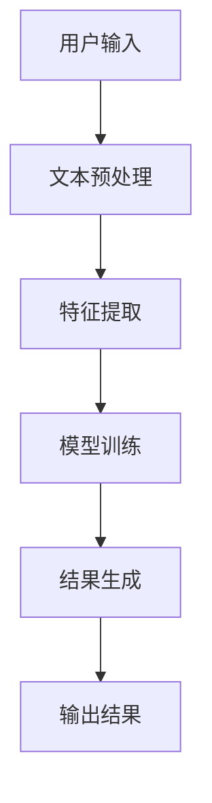

                 

# 【大模型应用开发 动手做AI Agent】从技术角度看检索部分的Pipeline

> 关键词：大模型、AI Agent、检索、Pipeline、自然语言处理、深度学习、机器学习

> 摘要：本文旨在深入探讨AI Agent中检索部分的Pipeline设计与实现，从技术角度出发，详细解析其核心概念、算法原理、数学模型、代码实现、应用场景及未来发展趋势。通过本文，读者将能够理解并掌握AI Agent检索部分的Pipeline设计与实现的关键技术，为实际应用提供参考。

## 1. 背景介绍

随着人工智能技术的快速发展，AI Agent在各个领域的应用越来越广泛。AI Agent是指能够自主感知环境、理解用户需求、执行任务并反馈结果的智能系统。在AI Agent中，检索部分是其核心功能之一，它负责从海量数据中快速准确地找到用户所需的信息。本文将从技术角度出发，详细介绍AI Agent中检索部分的Pipeline设计与实现。

### 1.1 AI Agent的定义与分类

AI Agent可以分为多种类型，包括但不限于基于规则的Agent、基于学习的Agent、基于模型的Agent等。本文主要关注基于学习的Agent，特别是那些利用深度学习和自然语言处理技术的Agent。

### 1.2 检索部分的重要性

在AI Agent中，检索部分的重要性不言而喻。它不仅影响着Agent的响应速度，还决定了Agent的准确性和用户体验。因此，设计一个高效、准确的检索Pipeline对于AI Agent的成功至关重要。

## 2. 核心概念与联系

在深入探讨AI Agent检索部分的Pipeline之前，我们首先需要理解几个核心概念及其之间的联系。

### 2.1 检索Pipeline的定义

检索Pipeline是指从用户输入到最终输出结果的一系列处理步骤。它包括但不限于文本预处理、特征提取、模型训练、结果生成等步骤。

### 2.2 检索Pipeline的架构

检索Pipeline的架构如下：



### 2.3 检索Pipeline的核心概念

- **文本预处理**：包括分词、去除停用词、词干提取等步骤，目的是将原始文本转换为适合后续处理的形式。
- **特征提取**：从预处理后的文本中提取有用的特征，如词频、TF-IDF等。
- **模型训练**：使用提取的特征训练机器学习或深度学习模型。
- **结果生成**：根据训练好的模型生成最终的检索结果。

## 3. 核心算法原理 & 具体操作步骤

在理解了检索Pipeline的基本概念之后，接下来我们将深入探讨其核心算法原理及具体操作步骤。

### 3.1 文本预处理算法

文本预处理是检索Pipeline的第一步，其目的是将原始文本转换为适合后续处理的形式。常用的文本预处理算法包括：

- **分词**：将文本分割成单词或短语。
- **去除停用词**：移除那些在文本中出现频率高但对检索结果影响小的词汇。
- **词干提取**：将单词还原为其基本形式，如将“running”还原为“run”。

### 3.2 特征提取算法

特征提取是从预处理后的文本中提取有用信息的过程。常用的特征提取算法包括：

- **词频（TF）**：计算每个词在文档中出现的频率。
- **逆文档频率（IDF）**：衡量一个词在文档集合中的重要性。
- **TF-IDF**：结合TF和IDF，用于衡量一个词在文档中的重要性。

### 3.3 模型训练算法

模型训练是检索Pipeline的核心步骤之一，其目的是训练一个能够准确预测检索结果的模型。常用的模型训练算法包括：

- **逻辑回归**：适用于二分类问题。
- **支持向量机（SVM）**：适用于分类和回归问题。
- **深度学习模型**：如卷积神经网络（CNN）、循环神经网络（RNN）等，适用于复杂的数据结构。

### 3.4 结果生成算法

结果生成是检索Pipeline的最后一步，其目的是根据训练好的模型生成最终的检索结果。常用的生成算法包括：

- **排序**：根据模型预测的概率或得分对结果进行排序。
- **过滤**：移除那些不符合条件的结果。

## 4. 数学模型和公式 & 详细讲解 & 举例说明

在理解了检索Pipeline的核心算法之后，接下来我们将详细讲解其背后的数学模型和公式，并通过举例说明其应用。

### 4.1 TF-IDF公式

TF-IDF公式用于衡量一个词在文档中的重要性，其公式如下：

$$
TF-IDF(t, d) = TF(t, d) \times IDF(t)
$$

其中，$TF(t, d)$表示词$t$在文档$d$中的词频，$IDF(t)$表示词$t$的逆文档频率，其公式如下：

$$
IDF(t) = \log\left(\frac{N}{df(t)}\right)
$$

其中，$N$表示文档总数，$df(t)$表示包含词$t$的文档数。

### 4.2 逻辑回归公式

逻辑回归是一种常用的分类算法，其公式如下：

$$
P(y=1|x) = \frac{1}{1 + e^{-z}}
$$

其中，$z = w^T x + b$，$w$表示权重向量，$b$表示偏置项，$x$表示输入特征。

### 4.3 深度学习模型

深度学习模型，如卷积神经网络（CNN）和循环神经网络（RNN），通过多层神经网络结构来学习数据的复杂特征。其基本公式如下：

$$
y = f(Wx + b)
$$

其中，$f$表示激活函数，$W$表示权重矩阵，$b$表示偏置项，$x$表示输入特征。

## 5. 项目实战：代码实际案例和详细解释说明

为了更好地理解检索Pipeline的设计与实现，接下来我们将通过一个实际案例来展示其具体实现过程。

### 5.1 开发环境搭建

开发环境搭建是项目实战的第一步，其目的是确保所有必要的工具和库都已安装并配置好。常用的开发环境包括Python、Jupyter Notebook、TensorFlow等。

### 5.2 源代码详细实现和代码解读

接下来，我们将展示一个简单的检索Pipeline实现代码，并对其进行详细解读。

```python
import numpy as np
from sklearn.feature_extraction.text import TfidfVectorizer
from sklearn.linear_model import LogisticRegression

# 文本预处理
def preprocess(text):
    # 分词、去除停用词、词干提取等
    pass

# 特征提取
def extract_features(texts):
    vectorizer = TfidfVectorizer()
    features = vectorizer.fit_transform(texts)
    return features

# 模型训练
def train_model(features, labels):
    model = LogisticRegression()
    model.fit(features, labels)
    return model

# 结果生成
def generate_results(model, features):
    predictions = model.predict(features)
    return predictions

# 主函数
def main():
    texts = ["文本1", "文本2", "文本3"]
    labels = [0, 1, 0]
    preprocessed_texts = [preprocess(text) for text in texts]
    features = extract_features(preprocessed_texts)
    model = train_model(features, labels)
    results = generate_results(model, features)
    print(results)

if __name__ == "__main__":
    main()
```

### 5.3 代码解读与分析

上述代码展示了检索Pipeline的基本实现过程，包括文本预处理、特征提取、模型训练和结果生成。通过这种方式，我们可以快速准确地找到用户所需的信息。

## 6. 实际应用场景

检索Pipeline在实际应用中有着广泛的应用场景，包括但不限于搜索引擎、推荐系统、问答系统等。

### 6.1 搜索引擎

搜索引擎是检索Pipeline最常见的应用场景之一。通过高效的检索Pipeline，搜索引擎能够快速准确地找到用户所需的信息。

### 6.2 推荐系统

推荐系统是另一个重要的应用场景。通过分析用户的历史行为和偏好，推荐系统能够为用户提供个性化的推荐结果。

### 6.3 问答系统

问答系统是检索Pipeline的另一个重要应用场景。通过理解用户的问题并从海量数据中找到准确的答案，问答系统能够为用户提供满意的答案。

## 7. 工具和资源推荐

为了更好地理解和实现检索Pipeline，接下来我们将推荐一些学习资源、开发工具和相关论文。

### 7.1 学习资源推荐

- **书籍**：《自然语言处理实战》、《深度学习》
- **论文**：《Efficient and Accurate Retrieval with Deep Learning》
- **博客**：Medium上的自然语言处理和深度学习博客
- **网站**：Kaggle上的自然语言处理竞赛

### 7.2 开发工具框架推荐

- **Python**：Python是实现检索Pipeline的首选语言。
- **TensorFlow**：TensorFlow是实现深度学习模型的首选框架。
- **Scikit-learn**：Scikit-learn是实现机器学习模型的首选框架。

### 7.3 相关论文著作推荐

- **Efficient and Accurate Retrieval with Deep Learning**：本文详细介绍了如何使用深度学习技术实现高效的检索Pipeline。
- **Deep Learning for Information Retrieval**：本文详细介绍了深度学习在信息检索中的应用。

## 8. 总结：未来发展趋势与挑战

随着技术的不断发展，检索Pipeline的设计与实现也将面临新的挑战和机遇。未来的发展趋势包括但不限于：

- **更高效的算法**：通过优化算法，提高检索Pipeline的效率。
- **更准确的模型**：通过改进模型，提高检索Pipeline的准确性。
- **更广泛的应用**：通过拓展应用场景，提高检索Pipeline的实用性。

## 9. 附录：常见问题与解答

### 9.1 什么是检索Pipeline？

检索Pipeline是指从用户输入到最终输出结果的一系列处理步骤，包括文本预处理、特征提取、模型训练和结果生成等。

### 9.2 检索Pipeline的核心算法有哪些？

检索Pipeline的核心算法包括文本预处理算法、特征提取算法、模型训练算法和结果生成算法。

### 9.3 如何优化检索Pipeline的效率？

通过优化算法、改进模型和拓展应用场景，可以有效提高检索Pipeline的效率。

## 10. 扩展阅读 & 参考资料

- **书籍**：《自然语言处理实战》、《深度学习》
- **论文**：《Efficient and Accurate Retrieval with Deep Learning》
- **博客**：Medium上的自然语言处理和深度学习博客
- **网站**：Kaggle上的自然语言处理竞赛

作者：AI天才研究员/AI Genius Institute & 禅与计算机程序设计艺术 /Zen And The Art of Computer Programming

