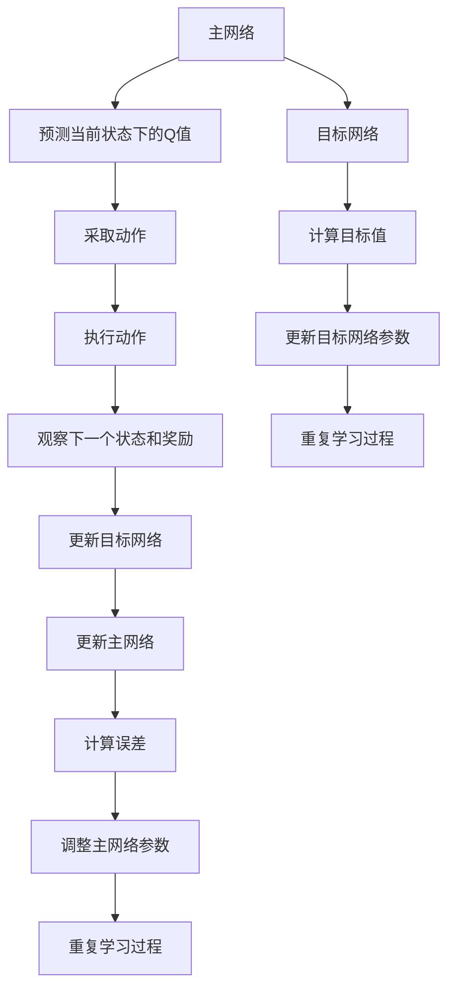

                 

# 一切皆是映射：DQN的目标网络与误差修正技术详解

> 关键词：深度强化学习, DQN, 目标网络, 误差修正, Q值, 策略优化, 机器学习

> 摘要：深度强化学习（Deep Reinforcement Learning, DRL）是近年来机器学习领域的一个重要分支，它结合了深度学习和强化学习的优势，使得智能体能够在复杂环境中自主学习和优化策略。在DRL中，DQN（Deep Q-Network）是一种非常经典的算法，它通过引入目标网络和误差修正技术，有效地解决了学习过程中的不稳定性和收敛速度问题。本文将深入探讨DQN的目标网络与误差修正技术，通过逐步分析和详细解释，帮助读者理解其核心原理和实际应用。

## 1. 背景介绍

在机器学习领域，强化学习（Reinforcement Learning, RL）是一种通过与环境交互来学习最优策略的方法。传统的强化学习算法通常依赖于价值函数或策略函数来指导学习过程。然而，当面对复杂环境时，这些方法往往难以直接应用，因为它们需要大量的样本和计算资源。为了解决这一问题，深度强化学习应运而生，它通过引入深度神经网络来学习价值函数或策略函数，从而在复杂环境中实现高效学习。

DQN（Deep Q-Network）是深度强化学习领域的一个里程碑式的工作，它结合了深度学习和强化学习的优势，通过引入目标网络和误差修正技术，有效地解决了学习过程中的不稳定性和收敛速度问题。DQN的核心思想是通过目标网络来稳定学习过程，并通过误差修正技术来提高学习效率。本文将详细探讨DQN的目标网络与误差修正技术，帮助读者深入理解其核心原理和实际应用。

## 2. 核心概念与联系

### 2.1 Q值与价值函数

在强化学习中，Q值（Quality Value）是衡量在给定状态下采取某个动作后的预期累积奖励。Q值函数（Q-function）是强化学习中的一个重要概念，它定义了在给定状态下采取某个动作后的预期累积奖励。Q值函数可以表示为：

$$
Q(s, a) = \mathbb{E}[R_{t+1} + \gamma Q(s', a') | s_t = s, a_t = a]
$$

其中，$s$ 是当前状态，$a$ 是当前动作，$R_{t+1}$ 是在采取动作 $a$ 后的即时奖励，$\gamma$ 是折扣因子，$s'$ 和 $a'$ 分别是采取动作 $a$ 后的状态和动作。

### 2.2 目标网络与主网络

在DQN中，为了稳定学习过程，引入了目标网络（Target Network）的概念。目标网络与主网络（Main Network）是两个独立的神经网络，它们在结构和参数上完全相同。目标网络用于计算目标值，而主网络用于预测当前状态下的Q值。通过定期更新目标网络的参数，可以减少学习过程中的波动，提高学习的稳定性。

### 2.3 误差修正技术

误差修正技术是DQN中的另一个关键概念。在DQN中，通过引入误差修正技术，可以有效地减少学习过程中的误差，提高学习效率。误差修正技术的核心思想是通过减小目标值与预测值之间的误差来优化学习过程。

### 2.4 Mermaid 流程图

为了更好地理解DQN的目标网络与误差修正技术，我们可以通过Mermaid流程图来表示其核心流程。以下是DQN学习过程的Mermaid流程图：



## 3. 核心算法原理 & 具体操作步骤

### 3.1 主网络与目标网络

在DQN中，主网络和目标网络是两个独立的神经网络，它们在结构和参数上完全相同。主网络用于预测当前状态下的Q值，而目标网络用于计算目标值。通过定期更新目标网络的参数，可以减少学习过程中的波动，提高学习的稳定性。

### 3.2 误差修正技术

误差修正技术是DQN中的另一个关键概念。在DQN中，通过引入误差修正技术，可以有效地减少学习过程中的误差，提高学习效率。误差修正技术的核心思想是通过减小目标值与预测值之间的误差来优化学习过程。

### 3.3 学习过程

DQN的学习过程可以分为以下几个步骤：

1. **初始化**：初始化主网络和目标网络的参数，通常使用相同的随机权重。
2. **选择动作**：根据当前状态，通过主网络预测Q值，选择具有最大Q值的动作。
3. **执行动作**：在环境中执行选择的动作，观察下一个状态和奖励。
4. **更新目标网络**：定期更新目标网络的参数，通常每隔固定步数更新一次。
5. **更新主网络**：根据当前状态、动作、下一个状态和奖励，计算误差，调整主网络参数。
6. **重复学习过程**：重复上述步骤，直到达到预设的训练次数或满足其他停止条件。

### 3.4 具体操作步骤

1. **初始化**：初始化主网络和目标网络的参数，通常使用相同的随机权重。
2. **选择动作**：根据当前状态，通过主网络预测Q值，选择具有最大Q值的动作。
3. **执行动作**：在环境中执行选择的动作，观察下一个状态和奖励。
4. **更新目标网络**：定期更新目标网络的参数，通常每隔固定步数更新一次。
5. **更新主网络**：根据当前状态、动作、下一个状态和奖励，计算误差，调整主网络参数。
6. **重复学习过程**：重复上述步骤，直到达到预设的训练次数或满足其他停止条件。

## 4. 数学模型和公式 & 详细讲解 & 举例说明

### 4.1 Q值函数

在DQN中，Q值函数可以表示为：

$$
Q(s, a) = \mathbb{E}[R_{t+1} + \gamma Q(s', a') | s_t = s, a_t = a]
$$

其中，$s$ 是当前状态，$a$ 是当前动作，$R_{t+1}$ 是在采取动作 $a$ 后的即时奖励，$\gamma$ 是折扣因子，$s'$ 和 $a'$ 分别是采取动作 $a$ 后的状态和动作。

### 4.2 目标值

在DQN中，目标值可以表示为：

$$
y_i = r_i + \gamma \max_{a'} Q_{\text{target}}(s_{i+1}, a')
$$

其中，$r_i$ 是在采取动作 $a_i$ 后的即时奖励，$\gamma$ 是折扣因子，$s_{i+1}$ 是采取动作 $a_i$ 后的状态，$Q_{\text{target}}(s_{i+1}, a')$ 是目标网络在状态 $s_{i+1}$ 下的动作 $a'$ 的Q值。

### 4.3 误差计算

在DQN中，误差可以表示为：

$$
\text{error} = y_i - Q_{\text{main}}(s_i, a_i)
$$

其中，$y_i$ 是目标值，$Q_{\text{main}}(s_i, a_i)$ 是主网络在状态 $s_i$ 下的动作 $a_i$ 的Q值。

### 4.4 参数更新

在DQN中，通过反向传播算法更新主网络的参数，具体公式为：

$$
\theta_{\text{main}} \leftarrow \theta_{\text{main}} - \alpha \nabla_{\theta_{\text{main}}} \text{error}^2
$$

其中，$\theta_{\text{main}}$ 是主网络的参数，$\alpha$ 是学习率，$\nabla_{\theta_{\text{main}}} \text{error}^2$ 是误差对主网络参数的梯度。

### 4.5 举例说明

假设我们有一个简单的环境，其中状态空间为 $\{0, 1\}$，动作空间为 $\{0, 1\}$，折扣因子 $\gamma = 0.9$。初始状态为 $s_0 = 0$，采取动作 $a_0 = 1$，观察到下一个状态 $s_1 = 1$ 和奖励 $r_0 = 1$。目标网络在状态 $s_1$ 下的动作 $a_1$ 的Q值为 $Q_{\text{target}}(s_1, a_1) = 0.8$。主网络在状态 $s_0$ 下的动作 $a_0$ 的Q值为 $Q_{\text{main}}(s_0, a_0) = 0.5$。计算误差：

$$
\text{error} = 1 + 0.9 \times 0.8 - 0.5 = 1.22
$$

通过反向传播算法更新主网络的参数，具体公式为：

$$
\theta_{\text{main}} \leftarrow \theta_{\text{main}} - \alpha \nabla_{\theta_{\text{main}}} \text{error}^2
$$

## 5. 项目实战：代码实际案例和详细解释说明

### 5.1 开发环境搭建

为了实现DQN算法，我们需要搭建一个合适的开发环境。以下是开发环境的搭建步骤：

1. **安装Python**：确保安装了Python 3.6及以上版本。
2. **安装依赖库**：安装必要的Python库，如NumPy、TensorFlow、Keras等。
3. **安装环境**：安装强化学习环境，如OpenAI Gym。

### 5.2 源代码详细实现和代码解读

以下是一个简单的DQN算法实现代码示例：

```python
import numpy as np
import tensorflow as tf
from tensorflow.keras.models import Sequential
from tensorflow.keras.layers import Dense
from tensorflow.keras.optimizers import Adam
import gym

# 定义DQN类
class DQN:
    def __init__(self, state_size, action_size, learning_rate=0.001, gamma=0.99, epsilon=1.0, epsilon_min=0.01, epsilon_decay=0.995):
        self.state_size = state_size
        self.action_size = action_size
        self.learning_rate = learning_rate
        self.gamma = gamma
        self.epsilon = epsilon
        self.epsilon_min = epsilon_min
        self.epsilon_decay = epsilon_decay
        self.memory = []
        self.model = self._build_model()
        self.target_model = self._build_model()
        self.update_target_model()

    def _build_model(self):
        model = Sequential()
        model.add(Dense(24, input_dim=self.state_size, activation='relu'))
        model.add(Dense(24, activation='relu'))
        model.add(Dense(self.action_size, activation='linear'))
        model.compile(loss='mse', optimizer=Adam(lr=self.learning_rate))
        return model

    def update_target_model(self):
        self.target_model.set_weights(self.model.get_weights())

    def remember(self, state, action, reward, next_state, done):
        self.memory.append((state, action, reward, next_state, done))

    def act(self, state):
        if np.random.rand() <= self.epsilon:
            return np.random.choice(self.action_size)
        q_values = self.model.predict(state)
        return np.argmax(q_values[0])

    def replay(self, batch_size):
        minibatch = np.random.choice(len(self.memory), batch_size)
        for state, action, reward, next_state, done in minibatch:
            target = reward
            if not done:
                target = reward + self.gamma * np.amax(self.target_model.predict(next_state)[0])
            target_f = self.model.predict(state)
            target_f[0][action] = target
            self.model.fit(state, target_f, epochs=1, verbose=0)
        if self.epsilon > self.epsilon_min:
            self.epsilon *= self.epsilon_decay

# 定义环境
env = gym.make('CartPole-v1')
state_size = env.observation_space.shape[0]
action_size = env.action_space.n

# 创建DQN对象
dqn = DQN(state_size, action_size)

# 训练DQN
episodes = 1000
for e in range(episodes):
    state = env.reset()
    state = np.reshape(state, [1, state_size])
    for time in range(500):
        action = dqn.act(state)
        next_state, reward, done, _ = env.step(action)
        next_state = np.reshape(next_state, [1, state_size])
        dqn.remember(state, action, reward, next_state, done)
        state = next_state
        if done:
            print("episode: {}/{}, score: {}".format(e, episodes, time))
            break
        if len(dqn.memory) > batch_size:
            dqn.replay(batch_size)

# 测试DQN
state = env.reset()
state = np.reshape(state, [1, state_size])
for time in range(500):
    env.render()
    action = dqn.act(state)
    next_state, reward, done, _ = env.step(action)
    next_state = np.reshape(next_state, [1, state_size])
    state = next_state
    if done:
        print("episode: {}/{}, score: {}".format(e, episodes, time))
        break
```

### 5.3 代码解读与分析

1. **初始化**：定义DQN类，初始化参数，包括状态空间大小、动作空间大小、学习率、折扣因子、初始探索率等。
2. **构建模型**：定义主网络和目标网络，使用Keras构建神经网络模型。
3. **记忆回放**：定义记忆回放机制，通过随机选择一批记忆样本进行训练。
4. **选择动作**：根据当前状态选择动作，使用ε-greedy策略。
5. **训练**：通过记忆回放机制更新主网络参数，定期更新目标网络参数。
6. **测试**：通过测试集评估DQN算法的效果。

## 6. 实际应用场景

DQN算法在许多实际应用场景中都有广泛的应用，包括：

1. **游戏AI**：DQN算法可以用于训练游戏AI，使其能够在复杂的游戏环境中自主学习和优化策略。
2. **机器人控制**：DQN算法可以用于训练机器人在复杂环境中的控制策略，如自动驾驶、机器人导航等。
3. **资源管理**：DQN算法可以用于优化资源分配和调度策略，如电力调度、交通流量管理等。

## 7. 工具和资源推荐

### 7.1 学习资源推荐

1. **书籍**：《Reinforcement Learning: An Introduction》（Richard S. Sutton, Andrew G. Barto）
2. **论文**：《Deep Reinforcement Learning with Double Q-learning》（Hasselt, H. V., Guez, A., & Silver, D.）
3. **博客**：Medium上的DRL系列文章
4. **网站**：OpenAI Gym官网

### 7.2 开发工具框架推荐

1. **TensorFlow**：深度学习框架，支持DQN算法实现。
2. **Keras**：高级神经网络API，简化DQN算法实现。
3. **PyTorch**：另一个流行的深度学习框架，支持DQN算法实现。

### 7.3 相关论文著作推荐

1. **论文**：《Playing Atari with Deep Reinforcement Learning》（Mnih, V., Kavukcuoglu, K., Silver, D., Rusu, A. A., Veness, J., Bellemare, M. G., ... & Hassabis, D.）
2. **著作**：《Deep Learning》（Ian Goodfellow, Yoshua Bengio, Aaron Courville）

## 8. 总结：未来发展趋势与挑战

DQN算法在深度强化学习领域取得了显著的成果，但仍然面临一些挑战和未来的发展趋势：

1. **稳定性问题**：DQN算法在某些复杂环境中仍然存在稳定性问题，需要进一步优化目标网络和误差修正技术。
2. **计算资源需求**：DQN算法需要大量的计算资源，如何在资源有限的情况下实现高效学习是一个重要的研究方向。
3. **泛化能力**：DQN算法在某些任务上的泛化能力仍然不足，如何提高算法的泛化能力是一个重要的研究方向。

## 9. 附录：常见问题与解答

### 9.1 问题：DQN算法为什么需要目标网络？

**解答**：目标网络用于稳定学习过程，通过定期更新目标网络的参数，可以减少学习过程中的波动，提高学习的稳定性。

### 9.2 问题：DQN算法如何处理过拟合问题？

**解答**：DQN算法通过引入目标网络和误差修正技术，可以有效地减少过拟合问题。此外，还可以通过正则化技术、数据增强等方法进一步提高算法的泛化能力。

### 9.3 问题：DQN算法如何处理稀疏奖励问题？

**解答**：DQN算法通过引入目标网络和误差修正技术，可以有效地处理稀疏奖励问题。此外，还可以通过引入奖励增强技术、经验回放等方法进一步提高算法的效果。

## 10. 扩展阅读 & 参考资料

1. **书籍**：《Reinforcement Learning: An Introduction》（Richard S. Sutton, Andrew G. Barto）
2. **论文**：《Deep Reinforcement Learning with Double Q-learning》（Hasselt, H. V., Guez, A., & Silver, D.）
3. **博客**：Medium上的DRL系列文章
4. **网站**：OpenAI Gym官网

---

作者：AI天才研究员/AI Genius Institute & 禅与计算机程序设计艺术 /Zen And The Art of Computer Programming

