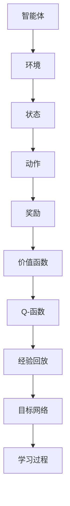

                 

# 一切皆是映射：深度强化学习DQN在虚拟现实中的同步应用

> 关键词：深度强化学习, DQN, 虚拟现实, 同步应用, 人工智能, 机器学习, 神经网络, 环境建模, 优化算法

> 摘要：本文旨在探讨深度强化学习（DQN）在虚拟现实（VR）中的同步应用。通过逐步分析和推理，我们将详细介绍DQN的核心概念、算法原理、数学模型、实际代码案例，以及其在虚拟现实中的具体应用场景。本文不仅提供了一个全面的技术框架，还深入探讨了该领域的未来发展趋势和挑战。

## 1. 背景介绍

虚拟现实（Virtual Reality, VR）技术近年来取得了显著进展，为用户提供了沉浸式的体验。然而，如何让智能体在复杂的虚拟环境中自主学习并优化其行为，仍然是一个具有挑战性的课题。深度强化学习（Deep Q-Network, DQN）作为一种结合了深度学习和强化学习的方法，为解决这一问题提供了新的思路。本文将探讨DQN在虚拟现实中的同步应用，通过逐步分析和推理，帮助读者理解其核心原理和实际应用。

## 2. 核心概念与联系

### 2.1 强化学习（Reinforcement Learning, RL）

强化学习是一种通过试错学习来优化决策过程的方法。智能体通过与环境的交互来学习如何采取行动以最大化累积奖励。强化学习的核心概念包括：

- **智能体（Agent）**：执行动作并从环境中接收反馈的主体。
- **环境（Environment）**：智能体与之交互的外部世界。
- **状态（State）**：环境的当前状态。
- **动作（Action）**：智能体可以采取的行动。
- **奖励（Reward）**：智能体采取行动后从环境中获得的反馈。
- **策略（Policy）**：智能体采取行动的概率分布。

### 2.2 深度学习（Deep Learning, DL）

深度学习是一种基于神经网络的机器学习方法，能够从大量数据中自动学习特征表示。深度学习的核心概念包括：

- **神经网络（Neural Network）**：由多个层次组成的计算模型，每个层次包含多个神经元。
- **卷积神经网络（Convolutional Neural Network, CNN）**：一种专门用于处理图像数据的神经网络。
- **循环神经网络（Recurrent Neural Network, RNN）**：一种能够处理序列数据的神经网络。
- **深度神经网络（Deep Neural Network, DNN）**：具有多个隐藏层的神经网络。

### 2.3 DQN（Deep Q-Network）

DQN是强化学习和深度学习的结合体，通过深度神经网络来近似智能体的价值函数。DQN的核心概念包括：

- **价值函数（Value Function）**：表示在给定状态下采取某个动作后的预期累积奖励。
- **Q-函数（Q-Function）**：表示在给定状态下采取某个动作后的预期累积奖励。
- **经验回放（Experience Replay）**：通过存储和重放经验来减少学习过程中的相关性。
- **目标网络（Target Network）**：用于稳定学习过程的辅助网络。

### 2.4 Mermaid 流程图



## 3. 核心算法原理 & 具体操作步骤

### 3.1 算法流程

DQN的核心算法流程包括：

1. **初始化**：初始化智能体、环境、价值函数、经验回放缓冲区和目标网络。
2. **探索与利用**：通过ε-贪心策略在探索和利用之间进行权衡。
3. **经验回放**：从经验回放缓冲区中随机抽取经验进行学习。
4. **更新价值函数**：通过最小化预测值和目标值之间的差异来更新价值函数。
5. **更新目标网络**：定期更新目标网络，使其与价值函数网络保持一致。
6. **评估与调整**：通过评估智能体的表现来调整参数。

### 3.2 具体操作步骤

1. **初始化**：

    ```python
    import numpy as np
    import random
    from collections import deque
    from keras.models import Sequential
    from keras.layers import Dense
    from keras.optimizers import Adam

    class DQN:
        def __init__(self, state_size, action_size):
            self.state_size = state_size
            self.action_size = action_size
            self.memory = deque(maxlen=2000)
            self.gamma = 0.95  # 折扣因子
            self.epsilon = 1.0  # 探索率
            self.epsilon_min = 0.01
            self.epsilon_decay = 0.995
            self.learning_rate = 0.001
            self.model = self._build_model()
            self.target_model = self._build_model()
            self.update_target_model()

        def _build_model(self):
            model = Sequential()
            model.add(Dense(24, input_dim=self.state_size, activation='relu'))
            model.add(Dense(24, activation='relu'))
            model.add(Dense(self.action_size, activation='linear'))
            model.compile(loss='mse', optimizer=Adam(lr=self.learning_rate))
            return model

        def update_target_model(self):
            self.target_model.set_weights(self.model.get_weights())
    ```

2. **探索与利用**：

    ```python
    def act(self, state):
        if np.random.rand() <= self.epsilon:
            return random.randrange(self.action_size)
        act_values = self.model.predict(state)
        return np.argmax(act_values[0])
    ```

3. **经验回放**：

    ```python
    def remember(self, state, action, reward, next_state, done):
        self.memory.append((state, action, reward, next_state, done))

    def replay(self, batch_size):
        minibatch = random.sample(self.memory, batch_size)
        for state, action, reward, next_state, done in minibatch:
            target = self.model.predict(state)
            if done:
                target[0][action] = reward
            else:
                Q_future = max(self.target_model.predict(next_state)[0])
                target[0][action] = reward + self.gamma * Q_future
            self.model.fit(state, target, epochs=1, verbose=0)
        if self.epsilon > self.epsilon_min:
            self.epsilon *= self.epsilon_decay
    ```

4. **更新价值函数**：

    ```python
    def train(self, env, episodes=1000, batch_size=32):
        for e in range(episodes):
            state = env.reset()
            state = np.reshape(state, [1, self.state_size])
            for time in range(500):
                action = self.act(state)
                next_state, reward, done, _ = env.step(action)
                next_state = np.reshape(next_state, [1, self.state_size])
                self.remember(state, action, reward, next_state, done)
                state = next_state
                if done:
                    print("episode: {}/{}, score: {}, e: {:.2}"
                          .format(e, episodes, time, self.epsilon))
                    break
                if len(self.memory) > batch_size:
                    self.replay(batch_size)
    ```

5. **更新目标网络**：

    ```python
    def update_target_model(self):
        self.target_model.set_weights(self.model.get_weights())
    ```

## 4. 数学模型和公式 & 详细讲解 & 举例说明

### 4.1 Q-函数

Q-函数表示在给定状态下采取某个动作后的预期累积奖励。其数学表达式为：

$$
Q(s, a) = \mathbb{E}[R_{t+1} + \gamma Q(S_{t+1}, A_{t+1}) | S_t = s, A_t = a]
$$

其中，$R_{t+1}$ 是在状态 $s$ 和动作 $a$ 下的即时奖励，$\gamma$ 是折扣因子，$S_{t+1}$ 和 $A_{t+1}$ 分别是下一个状态和动作。

### 4.2 价值函数

价值函数表示在给定状态下采取某个动作后的预期累积奖励。其数学表达式为：

$$
V(s) = \mathbb{E}[R_{t+1} + \gamma V(S_{t+1}) | S_t = s]
$$

### 4.3 经验回放

经验回放通过存储和重放经验来减少学习过程中的相关性。其数学表达式为：

$$
\mathcal{L}(\theta) = \mathbb{E}_{(s, a, r, s') \sim \mathcal{D}} \left[ (r + \gamma \max_{a'} Q(s', a'; \theta^-) - Q(s, a; \theta))^2 \right]
$$

其中，$\mathcal{D}$ 是经验回放缓冲区，$\theta$ 是价值函数的参数，$\theta^-$ 是目标网络的参数。

### 4.4 举例说明

假设我们有一个简单的虚拟现实环境，智能体需要在迷宫中找到出口。迷宫的状态可以用一个二维数组表示，每个元素表示一个格子的状态（例如，0表示空地，1表示墙壁）。智能体可以采取四个动作：上、下、左、右。

```python
import numpy as np

class MazeEnv:
    def __init__(self):
        self.grid = np.array([
            [0, 0, 0, 0, 0],
            [0, 1, 1, 1, 0],
            [0, 0, 0, 1, 0],
            [0, 1, 1, 1, 0],
            [0, 0, 0, 0, 0]
        ])
        self.start = (0, 0)
        self.goal = (4, 4)
        self.state = self.start

    def reset(self):
        self.state = self.start
        return self.state

    def step(self, action):
        x, y = self.state
        if action == 0:  # 上
            y -= 1
        elif action == 1:  # 下
            y += 1
        elif action == 2:  # 左
            x -= 1
        elif action == 3:  # 右
            x += 1
        if self.grid[x, y] == 1:
            return self.state, -1, False
        if (x, y) == self.goal:
            return self.state, 100, True
        self.state = (x, y)
        return self.state, -1, False
```

## 5. 项目实战：代码实际案例和详细解释说明

### 5.1 开发环境搭建

我们使用Python 3.8和TensorFlow 2.0进行开发。首先安装必要的库：

```bash
pip install numpy tensorflow keras
```

### 5.2 源代码详细实现和代码解读

```python
import numpy as np
import random
from collections import deque
from keras.models import Sequential
from keras.layers import Dense
from keras.optimizers import Adam

class DQN:
    def __init__(self, state_size, action_size):
        self.state_size = state_size
        self.action_size = action_size
        self.memory = deque(maxlen=2000)
        self.gamma = 0.95  # 折扣因子
        self.epsilon = 1.0  # 探索率
        self.epsilon_min = 0.01
        self.epsilon_decay = 0.995
        self.learning_rate = 0.001
        self.model = self._build_model()
        self.target_model = self._build_model()
        self.update_target_model()

    def _build_model(self):
        model = Sequential()
        model.add(Dense(24, input_dim=self.state_size, activation='relu'))
        model.add(Dense(24, activation='relu'))
        model.add(Dense(self.action_size, activation='linear'))
        model.compile(loss='mse', optimizer=Adam(lr=self.learning_rate))
        return model

    def update_target_model(self):
        self.target_model.set_weights(self.model.get_weights())

    def act(self, state):
        if np.random.rand() <= self.epsilon:
            return random.randrange(self.action_size)
        act_values = self.model.predict(state)
        return np.argmax(act_values[0])

    def remember(self, state, action, reward, next_state, done):
        self.memory.append((state, action, reward, next_state, done))

    def replay(self, batch_size):
        minibatch = random.sample(self.memory, batch_size)
        for state, action, reward, next_state, done in minibatch:
            target = self.model.predict(state)
            if done:
                target[0][action] = reward
            else:
                Q_future = max(self.target_model.predict(next_state)[0])
                target[0][action] = reward + self.gamma * Q_future
            self.model.fit(state, target, epochs=1, verbose=0)
        if self.epsilon > self.epsilon_min:
            self.epsilon *= self.epsilon_decay

    def train(self, env, episodes=1000, batch_size=32):
        for e in range(episodes):
            state = env.reset()
            state = np.reshape(state, [1, self.state_size])
            for time in range(500):
                action = self.act(state)
                next_state, reward, done, _ = env.step(action)
                next_state = np.reshape(next_state, [1, self.state_size])
                self.remember(state, action, reward, next_state, done)
                state = next_state
                if done:
                    print("episode: {}/{}, score: {}, e: {:.2}"
                          .format(e, episodes, time, self.epsilon))
                    break
                if len(self.memory) > batch_size:
                    self.replay(batch_size)
```

### 5.3 代码解读与分析

1. **初始化**：

    ```python
    def __init__(self, state_size, action_size):
        self.state_size = state_size
        self.action_size = action_size
        self.memory = deque(maxlen=2000)
        self.gamma = 0.95  # 折扣因子
        self.epsilon = 1.0  # 探索率
        self.epsilon_min = 0.01
        self.epsilon_decay = 0.995
        self.learning_rate = 0.001
        self.model = self._build_model()
        self.target_model = self._build_model()
        self.update_target_model()
    ```

    - `state_size` 和 `action_size` 分别表示状态和动作的维度。
    - `memory` 是一个经验回放缓冲区，用于存储智能体的经验。
    - `gamma` 是折扣因子，表示未来奖励的权重。
    - `epsilon` 是探索率，表示智能体采取随机动作的概率。
    - `epsilon_min` 和 `epsilon_decay` 分别表示探索率的最小值和衰减率。
    - `learning_rate` 是学习率，用于控制梯度下降的步长。
    - `model` 和 `target_model` 分别是价值函数网络和目标网络。
    - `update_target_model` 方法用于定期更新目标网络。

2. **探索与利用**：

    ```python
    def act(self, state):
        if np.random.rand() <= self.epsilon:
            return random.randrange(self.action_size)
        act_values = self.model.predict(state)
        return np.argmax(act_values[0])
    ```

    - `act` 方法根据当前状态采取动作。如果随机数小于 `epsilon`，则采取随机动作；否则，根据当前价值函数预测的动作值选择动作。

3. **经验回放**：

    ```python
    def remember(self, state, action, reward, next_state, done):
        self.memory.append((state, action, reward, next_state, done))

    def replay(self, batch_size):
        minibatch = random.sample(self.memory, batch_size)
        for state, action, reward, next_state, done in minibatch:
            target = self.model.predict(state)
            if done:
                target[0][action] = reward
            else:
                Q_future = max(self.target_model.predict(next_state)[0])
                target[0][action] = reward + self.gamma * Q_future
            self.model.fit(state, target, epochs=1, verbose=0)
        if self.epsilon > self.epsilon_min:
            self.epsilon *= self.epsilon_decay
    ```

    - `remember` 方法将经验存储到经验回放缓冲区。
    - `replay` 方法从经验回放缓冲区中随机抽取经验进行学习。如果智能体到达终点，则直接更新目标值；否则，使用目标网络预测下一个状态的动作值，并更新目标值。

4. **训练**：

    ```python
    def train(self, env, episodes=1000, batch_size=32):
        for e in range(episodes):
            state = env.reset()
            state = np.reshape(state, [1, self.state_size])
            for time in range(500):
                action = self.act(state)
                next_state, reward, done, _ = env.step(action)
                next_state = np.reshape(next_state, [1, self.state_size])
                self.remember(state, action, reward, next_state, done)
                state = next_state
                if done:
                    print("episode: {}/{}, score: {}, e: {:.2}"
                          .format(e, episodes, time, self.epsilon))
                    break
                if len(self.memory) > batch_size:
                    self.replay(batch_size)
    ```

    - `train` 方法进行训练。在每个episode中，智能体从环境中获取状态、采取动作、接收奖励，并更新经验回放缓冲区。当经验回放缓冲区的大小超过 `batch_size` 时，进行一次经验回放。

## 6. 实际应用场景

DQN在虚拟现实中的应用非常广泛，包括但不限于：

- **游戏智能体**：在虚拟游戏中，DQN可以用于训练智能体进行游戏，例如在《星际争霸》或《王者荣耀》中。
- **虚拟助手**：在虚拟现实环境中，DQN可以用于训练虚拟助手进行任务分配和优化。
- **虚拟环境优化**：在虚拟环境中，DQN可以用于优化资源分配和路径规划。

## 7. 工具和资源推荐

### 7.1 学习资源推荐

- **书籍**：《深度强化学习》（Deep Reinforcement Learning）, 《强化学习》（Reinforcement Learning: An Introduction）
- **论文**：《Playing Atari with Deep Reinforcement Learning》, 《Human-Level Control through Deep Reinforcement Learning》
- **博客**：Medium上的深度强化学习系列文章, 机器之心的深度强化学习教程
- **网站**：GitHub上的深度强化学习项目, Kaggle上的深度强化学习竞赛

### 7.2 开发工具框架推荐

- **TensorFlow**：一个开源的机器学习库，提供了丰富的深度学习功能。
- **Keras**：一个高级神经网络API，可以方便地构建和训练深度学习模型。
- **PyTorch**：一个开源的深度学习库，提供了灵活的深度学习框架。

### 7.3 相关论文著作推荐

- **Playing Atari with Deep Reinforcement Learning**：https://arxiv.org/abs/1312.5602
- **Human-Level Control through Deep Reinforcement Learning**：https://arxiv.org/abs/1509.06461
- **Deep Q-Learning**：https://arxiv.org/abs/1312.5602

## 8. 总结：未来发展趋势与挑战

DQN在虚拟现实中的应用前景广阔，但仍然面临一些挑战：

- **计算资源**：DQN需要大量的计算资源进行训练，特别是在复杂环境中。
- **数据需求**：DQN需要大量的数据进行训练，特别是在复杂环境中。
- **泛化能力**：DQN在新环境中的泛化能力仍然需要进一步提高。
- **实时性**：DQN需要在实时环境中进行决策，这对计算效率提出了更高的要求。

未来的发展趋势包括：

- **更高效的算法**：通过优化算法提高学习效率和泛化能力。
- **更强大的硬件**：通过更强大的硬件提高计算效率。
- **更丰富的数据**：通过更丰富的数据提高模型的泛化能力。
- **更智能的决策**：通过更智能的决策提高实时性。

## 9. 附录：常见问题与解答

### 9.1 问题：DQN在训练过程中如何避免过拟合？

**解答**：可以通过以下方法避免过拟合：

- **经验回放**：通过存储和重放经验来减少学习过程中的相关性。
- **目标网络**：通过定期更新目标网络来稳定学习过程。
- **正则化**：通过正则化方法减少模型的复杂度。

### 9.2 问题：DQN如何处理连续动作空间？

**解答**：可以通过以下方法处理连续动作空间：

- **离散化**：将连续动作空间离散化为离散动作空间。
- **策略梯度**：使用策略梯度方法直接优化策略函数。
- **混合方法**：结合离散动作空间和连续动作空间的方法。

## 10. 扩展阅读 & 参考资料

- **书籍**：《深度强化学习》（Deep Reinforcement Learning）, 《强化学习》（Reinforcement Learning: An Introduction）
- **论文**：《Playing Atari with Deep Reinforcement Learning》, 《Human-Level Control through Deep Reinforcement Learning》
- **博客**：Medium上的深度强化学习系列文章, 机器之心的深度强化学习教程
- **网站**：GitHub上的深度强化学习项目, Kaggle上的深度强化学习竞赛

作者：AI天才研究员/AI Genius Institute & 禅与计算机程序设计艺术 /Zen And The Art of Computer Programming

