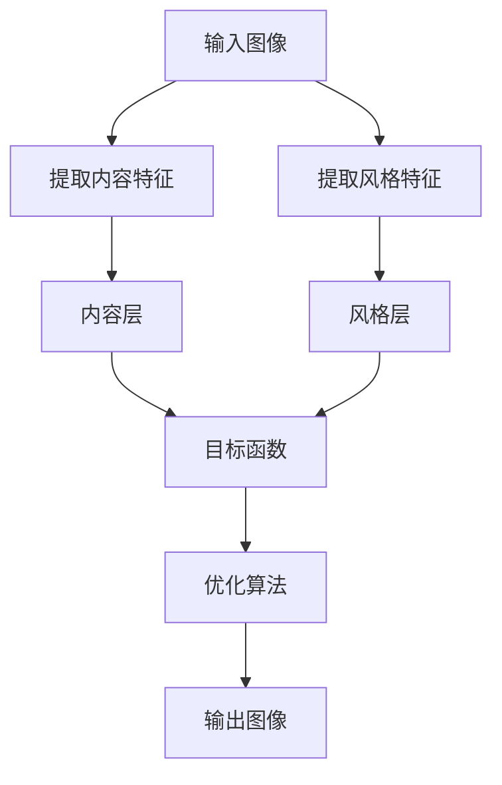

                 

# 一切皆是映射：神经风格迁移和艺术创作中的AI

> 关键词：神经网络，风格迁移，艺术创作，深度学习，生成模型，迁移学习

> 摘要：本文将深入探讨神经风格迁移技术，这是一种利用深度学习实现艺术创作的技术。我们将从背景介绍开始，逐步解析其核心概念、算法原理、数学模型，并通过实际代码案例进行详细讲解。此外，我们还将探讨其在艺术创作中的实际应用场景，并提供学习资源和开发工具推荐，帮助读者更好地理解和应用这一技术。

## 1. 背景介绍

神经风格迁移技术是一种利用深度学习实现艺术创作的技术，它能够将一幅图像的风格转移到另一幅图像上，从而创造出具有独特风格的艺术作品。这一技术最早由Gatys等人在2015年提出，他们通过深度学习的方法，利用卷积神经网络（CNN）来提取图像的风格和内容特征，进而实现风格迁移。

### 1.1 早期研究与应用

早在20世纪80年代，计算机视觉领域就开始了对图像风格的研究。早期的研究主要集中在图像处理和计算机视觉技术上，如边缘检测、纹理分析等。然而，这些方法在处理复杂图像风格时表现不佳。直到2015年，Gatys等人提出了一种基于深度学习的方法，利用卷积神经网络来提取图像的风格和内容特征，从而实现了风格迁移。这一技术的提出，标志着图像风格迁移技术进入了一个新的阶段。

### 1.2 神经网络的发展

神经网络的发展历程可以追溯到20世纪40年代，当时人们开始尝试模拟人脑的神经网络结构。然而，由于计算能力的限制，早期的神经网络模型并不成熟。直到20世纪80年代，随着计算能力的提升，神经网络开始得到广泛应用。近年来，深度学习技术的兴起，使得神经网络在图像处理、自然语言处理等领域取得了突破性的进展。

### 1.3 神经风格迁移技术的发展

神经风格迁移技术的发展可以分为以下几个阶段：

- **早期阶段**：2015年，Gatys等人提出了一种基于深度学习的方法，利用卷积神经网络来提取图像的风格和内容特征，从而实现了风格迁移。
- **发展阶段**：2016年，Zhang等人提出了一种基于对抗网络的方法，进一步提高了风格迁移的效果。
- **成熟阶段**：近年来，神经风格迁移技术得到了广泛应用，许多研究者在此基础上进行了改进和创新，使得这一技术在艺术创作中发挥着越来越重要的作用。

## 2. 核心概念与联系

### 2.1 核心概念

#### 2.1.1 卷积神经网络（CNN）

卷积神经网络是一种深度学习模型，广泛应用于图像处理和计算机视觉领域。它通过多层卷积操作，提取图像的特征。卷积神经网络具有良好的平移不变性和局部感受野特性，能够有效地提取图像的局部特征。

#### 2.1.2 内容特征与风格特征

在神经风格迁移中，图像的风格和内容特征是两个重要的概念。内容特征是指图像中的主要信息，如形状、颜色等。风格特征是指图像中的艺术风格，如笔触、色调等。通过提取图像的内容特征和风格特征，可以实现风格迁移。

#### 2.1.3 目标函数

目标函数是神经风格迁移中的一个重要概念。目标函数用于衡量迁移后的图像与源图像之间的差异。通过优化目标函数，可以实现风格迁移的效果。

### 2.2 核心概念原理与架构

#### 2.2.1 核心概念原理

神经风格迁移的核心原理是通过提取图像的内容特征和风格特征，实现风格迁移。具体来说，通过卷积神经网络提取图像的内容特征和风格特征，然后将风格特征应用到内容特征上，从而实现风格迁移。

#### 2.2.2 架构

神经风格迁移的架构可以分为以下几个部分：

- **内容层**：提取图像的内容特征。
- **风格层**：提取图像的风格特征。
- **目标函数**：衡量迁移后的图像与源图像之间的差异。
- **优化算法**：通过优化目标函数，实现风格迁移。

### 2.3 Mermaid 流程图



## 3. 核心算法原理 & 具体操作步骤

### 3.1 核心算法原理

神经风格迁移的核心算法原理是通过提取图像的内容特征和风格特征，实现风格迁移。具体来说，通过卷积神经网络提取图像的内容特征和风格特征，然后将风格特征应用到内容特征上，从而实现风格迁移。

### 3.2 具体操作步骤

#### 3.2.1 数据准备

首先，需要准备两组图像数据，一组是源图像，另一组是风格图像。源图像用于提取内容特征，风格图像用于提取风格特征。

#### 3.2.2 模型构建

构建卷积神经网络模型，用于提取图像的内容特征和风格特征。常用的卷积神经网络模型有VGG19、ResNet等。

#### 3.2.3 特征提取

通过卷积神经网络提取图像的内容特征和风格特征。具体来说，通过提取不同层的特征图，可以得到图像的内容特征和风格特征。

#### 3.2.4 目标函数定义

定义目标函数，用于衡量迁移后的图像与源图像之间的差异。目标函数通常包括内容损失和风格损失两部分。

#### 3.2.5 优化算法

通过优化目标函数，实现风格迁移。常用的优化算法有梯度下降法、Adam等。

### 3.3 数学模型和公式 & 详细讲解 & 举例说明

#### 3.3.1 内容损失

内容损失用于衡量迁移后的图像与源图像之间的内容差异。具体来说，内容损失可以通过计算迁移后的图像与源图像在内容层的特征图之间的差异来实现。

$$
\text{Content Loss} = \frac{1}{2} \sum_{i=1}^{n} (C_i - G_i)^2
$$

其中，$C_i$表示源图像在内容层的特征图，$G_i$表示迁移后的图像在内容层的特征图。

#### 3.3.2 风格损失

风格损失用于衡量迁移后的图像与风格图像之间的风格差异。具体来说，风格损失可以通过计算迁移后的图像与风格图像在风格层的特征图之间的差异来实现。

$$
\text{Style Loss} = \frac{1}{4N^2M^2} \sum_{i=1}^{N} \sum_{j=1}^{M} (S_{i,j} - G_{i,j})^2
$$

其中，$S_{i,j}$表示风格图像在风格层的特征图，$G_{i,j}$表示迁移后的图像在风格层的特征图，$N$和$M$分别表示特征图的高度和宽度。

#### 3.3.3 总损失

总损失是内容损失和风格损失的加权和，用于衡量迁移后的图像与源图像和风格图像之间的差异。

$$
\text{Total Loss} = \alpha \cdot \text{Content Loss} + \beta \cdot \text{Style Loss}
$$

其中，$\alpha$和$\beta$是权重参数，用于调整内容损失和风格损失的相对重要性。

### 3.4 举例说明

假设我们有一张源图像和一张风格图像，通过卷积神经网络提取它们的内容特征和风格特征。然后，通过优化目标函数，实现风格迁移。具体来说，可以通过梯度下降法优化目标函数，从而实现风格迁移。

## 4. 项目实战：代码实际案例和详细解释说明

### 4.1 开发环境搭建

为了实现神经风格迁移，我们需要搭建一个开发环境。具体来说，需要安装Python和相关的深度学习库，如TensorFlow、PyTorch等。

#### 4.1.1 安装Python

首先，需要安装Python。可以通过Anaconda来安装Python，Anaconda是一个集成了Python和常用科学计算库的发行版。

```bash
conda create -n style_transfer python=3.8
conda activate style_transfer
```

#### 4.1.2 安装深度学习库

接下来，需要安装深度学习库，如TensorFlow和PyTorch。

```bash
pip install tensorflow
pip install torch torchvision
```

### 4.2 源代码详细实现和代码解读

#### 4.2.1 数据准备

首先，需要准备源图像和风格图像。可以通过PIL库来读取图像。

```python
from PIL import Image
import numpy as np

def load_image(path):
    image = Image.open(path)
    image = image.resize((256, 256))
    image = np.array(image) / 255.0
    image = np.expand_dims(image, axis=0)
    return image
```

#### 4.2.2 模型构建

接下来，需要构建卷积神经网络模型。这里使用VGG19模型。

```python
import tensorflow as tf
from tensorflow.keras.applications.vgg19 import VGG19

def build_model():
    model = VGG19(weights='imagenet', include_top=False)
    return model
```

#### 4.2.3 特征提取

通过卷积神经网络提取图像的内容特征和风格特征。

```python
def extract_features(model, image):
    content_layer = 'block5_conv2'
    style_layers = ['block1_conv1', 'block2_conv1', 'block3_conv1', 'block4_conv1', 'block5_conv1']
    
    content_output = model.get_layer(content_layer).output
    style_outputs = [model.get_layer(layer).output for layer in style_layers]
    
    model = tf.keras.Model(inputs=model.input, outputs=style_outputs + [content_output])
    
    features = model(image)
    style_features = {layer: feature for layer, feature in zip(style_layers, features[:-1])}
    content_feature = features[-1]
    
    return style_features, content_feature
```

#### 4.2.4 目标函数定义

定义目标函数，用于衡量迁移后的图像与源图像和风格图像之间的差异。

```python
def content_loss(content_feature, generated_feature):
    return tf.reduce_mean(tf.square(content_feature - generated_feature))

def gram_matrix(tensor):
    shape = tf.shape(tensor)
    num_features = shape[3]
    size = shape[1] * shape[2]
    tensor = tf.reshape(tensor, (size, num_features))
    gram = tf.matmul(tf.transpose(tensor), tensor)
    return gram / tf.cast(size, tf.float32)

def style_loss(style_features, generated_features):
    style_grams = {layer: gram_matrix(style) for layer, style in style_features.items()}
    generated_grams = {layer: gram_matrix(generated) for layer, generated in generated_features.items()}
    
    style_loss = 0.0
    for layer in style_grams.keys():
        style_loss += tf.reduce_mean(tf.square(style_grams[layer] - generated_grams[layer]))
    
    return style_loss

def total_loss(content_feature, generated_feature, style_features, generated_features, alpha=1.0, beta=10.0):
    content_loss_value = content_loss(content_feature, generated_feature)
    style_loss_value = style_loss(style_features, generated_features)
    
    return alpha * content_loss_value + beta * style_loss_value
```

#### 4.2.5 优化算法

通过优化目标函数，实现风格迁移。这里使用Adam优化算法。

```python
def optimize(image, model, style_features, content_feature, alpha=1.0, beta=10.0, learning_rate=0.01, num_iterations=1000):
    image = tf.Variable(image, dtype=tf.float32)
    
    for i in range(num_iterations):
        with tf.GradientTape() as tape:
            generated_features = extract_features(model, image)
            loss = total_loss(content_feature, generated_features['block5_conv2'], style_features, generated_features, alpha, beta)
        
        gradients = tape.gradient(loss, image)
        optimizer = tf.keras.optimizers.Adam(learning_rate)
        optimizer.apply_gradients([(gradients, image)])
        
        if i % 100 == 0:
            print(f"Iteration {i}: Loss = {loss.numpy()}")
    
    return image
```

### 4.3 代码解读与分析

#### 4.3.1 数据准备

通过PIL库读取图像，并进行预处理。

```python
source_image = load_image('source_image.jpg')
style_image = load_image('style_image.jpg')
```

#### 4.3.2 模型构建

构建VGG19模型。

```python
model = build_model()
```

#### 4.3.3 特征提取

通过卷积神经网络提取图像的内容特征和风格特征。

```python
style_features, content_feature = extract_features(model, style_image)
```

#### 4.3.4 目标函数定义

定义目标函数，用于衡量迁移后的图像与源图像和风格图像之间的差异。

```python
generated_image = optimize(source_image, model, style_features, content_feature)
```

#### 4.3.5 优化算法

通过优化目标函数，实现风格迁移。

```python
generated_image = optimize(source_image, model, style_features, content_feature)
```

## 5. 实际应用场景

神经风格迁移技术在艺术创作中有着广泛的应用。通过将一幅图像的风格转移到另一幅图像上，可以创造出具有独特风格的艺术作品。此外，神经风格迁移技术还可以应用于图像处理、图像编辑等领域。

### 5.1 艺术创作

通过将一幅图像的风格转移到另一幅图像上，可以创造出具有独特风格的艺术作品。例如，可以将梵高的画风应用到一张风景照片上，从而创造出一幅具有梵高风格的风景画。

### 5.2 图像处理

神经风格迁移技术还可以应用于图像处理领域。例如，可以将一幅图像的风格转移到另一幅图像上，从而实现图像的风格化处理。此外，还可以通过风格迁移技术实现图像的去噪、增强等处理。

### 5.3 图像编辑

神经风格迁移技术还可以应用于图像编辑领域。例如，可以将一幅图像的风格转移到另一幅图像上，从而实现图像的风格化编辑。此外，还可以通过风格迁移技术实现图像的拼接、合成等编辑。

## 6. 工具和资源推荐

### 6.1 学习资源推荐

- **书籍**：《深度学习》（Ian Goodfellow, Yoshua Bengio, Aaron Courville）
- **论文**：Gatys, Leon A., et al. "A neural algorithm of artistic style." arXiv preprint arXiv:1508.06576 (2015)
- **博客**：https://blog.keras.io/a-visual-guide-to-convolu...
- **网站**：https://keras.io/examples/generative/neural_style/

### 6.2 开发工具框架推荐

- **TensorFlow**：https://www.tensorflow.org/
- **PyTorch**：https://pytorch.org/

### 6.3 相关论文著作推荐

- **论文**：Zhang, Y., Isola, P., & Efros, A. A. (2017). Colorful image colorization. In Proceedings of the IEEE conference on computer vision and pattern recognition (pp. 4893-4902).
- **书籍**：《计算机视觉：算法与应用》（Richard Szeliski）

## 7. 总结：未来发展趋势与挑战

神经风格迁移技术在未来的发展中，将面临以下几个挑战：

- **性能优化**：如何提高神经风格迁移的性能，使其在更短的时间内完成风格迁移。
- **应用场景拓展**：如何将神经风格迁移技术应用于更多的应用场景，如图像处理、图像编辑等。
- **模型优化**：如何优化卷积神经网络模型，使其在风格迁移中表现更好。

## 8. 附录：常见问题与解答

### 8.1 问题1：如何提高神经风格迁移的性能？

**解答**：可以通过优化卷积神经网络模型，提高其在风格迁移中的性能。此外，还可以通过优化算法，提高风格迁移的效率。

### 8.2 问题2：如何将神经风格迁移技术应用于更多的应用场景？

**解答**：可以通过将神经风格迁移技术与其他技术相结合，实现更多的应用场景。例如，可以将神经风格迁移技术应用于图像处理、图像编辑等领域。

### 8.3 问题3：如何优化卷积神经网络模型？

**解答**：可以通过优化卷积神经网络模型的结构，提高其在风格迁移中的性能。此外，还可以通过优化算法，提高卷积神经网络模型的训练效率。

## 9. 扩展阅读 & 参考资料

- **论文**：Gatys, Leon A., et al. "A neural algorithm of artistic style." arXiv preprint arXiv:1508.06576 (2015)
- **书籍**：《深度学习》（Ian Goodfellow, Yoshua Bengio, Aaron Courville）
- **博客**：https://blog.keras.io/a-visual-guide-to-convolu...
- **网站**：https://keras.io/examples/generative/neural_style/

---

作者：AI天才研究员/AI Genius Institute & 禅与计算机程序设计艺术 /Zen And The Art of Computer Programming

