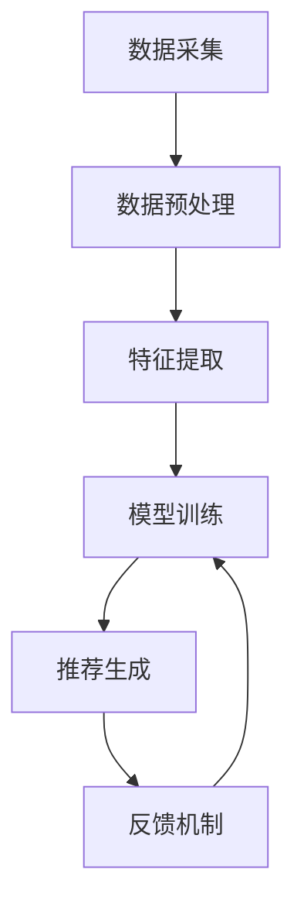

                 

# 个性化推荐系统的技术挑战

> 关键词：个性化推荐、机器学习、协同过滤、深度学习、用户行为分析、算法优化

> 摘要：个性化推荐系统是现代互联网应用的核心组成部分，它通过分析用户行为和偏好，为用户提供定制化的推荐内容。本文将深入探讨个性化推荐系统的技术挑战，从背景介绍、核心概念与联系、核心算法原理、数学模型和公式、项目实战、实际应用场景、工具和资源推荐，以及未来发展趋势与挑战等方面进行详细分析，旨在为读者提供全面的技术洞察和实践指导。

## 1. 背景介绍

个性化推荐系统已经成为现代互联网应用不可或缺的一部分。随着大数据和机器学习技术的发展，个性化推荐系统能够根据用户的兴趣、行为和偏好，提供更加精准和个性化的推荐内容。这不仅提升了用户体验，也为企业带来了巨大的商业价值。然而，个性化推荐系统面临着诸多技术挑战，包括数据稀疏性、冷启动问题、实时性要求、公平性和隐私保护等。

## 2. 核心概念与联系

### 2.1 个性化推荐系统概述

个性化推荐系统是一种基于用户行为和偏好，为用户提供定制化内容的系统。其核心目标是通过分析用户的历史行为数据，预测用户可能感兴趣的内容，并推荐给用户。个性化推荐系统广泛应用于电子商务、社交媒体、新闻资讯、视频流媒体等领域。

### 2.2 核心概念

- **用户行为数据**：用户在系统中的各种行为记录，如点击、购买、评论、点赞等。
- **用户偏好**：用户对特定内容的兴趣和喜好。
- **推荐算法**：用于分析用户行为数据，预测用户偏好，并生成推荐列表的算法。
- **推荐列表**：根据推荐算法生成的，包含用户可能感兴趣的内容列表。

### 2.3 核心概念原理与架构

个性化推荐系统通常由以下几个部分组成：

- **数据采集**：收集用户在系统中的行为数据。
- **数据预处理**：清洗和转换原始数据，使其适合后续处理。
- **特征提取**：从用户行为数据中提取有用的特征。
- **模型训练**：使用机器学习算法训练推荐模型。
- **推荐生成**：根据训练好的模型生成推荐列表。
- **反馈机制**：收集用户对推荐结果的反馈，用于模型优化。

以下是个性化推荐系统的Mermaid流程图：



## 3. 核心算法原理 & 具体操作步骤

### 3.1 基于内容的推荐

基于内容的推荐算法通过分析用户历史行为数据中的内容特征，为用户推荐与其历史行为相似的内容。具体操作步骤如下：

1. **特征提取**：从用户历史行为数据中提取内容特征，如商品类别、标签、描述等。
2. **相似度计算**：计算用户历史行为数据与候选推荐内容之间的相似度。
3. **推荐生成**：根据相似度排序，生成推荐列表。

### 3.2 协同过滤

协同过滤算法通过分析用户之间的相似性或物品之间的相似性，为用户推荐相似用户或相似物品。具体操作步骤如下：

1. **用户相似度计算**：计算用户之间的相似度，常用的方法有余弦相似度、皮尔逊相关系数等。
2. **物品相似度计算**：计算物品之间的相似度，常用的方法有余弦相似度、皮尔逊相关系数等。
3. **推荐生成**：根据相似度计算结果，生成推荐列表。

### 3.3 深度学习推荐

深度学习推荐算法通过构建复杂的神经网络模型，从用户行为数据中学习到更深层次的特征表示。具体操作步骤如下：

1. **数据预处理**：将用户行为数据转换为适合神经网络输入的格式。
2. **模型构建**：构建深度神经网络模型，如多层感知机（MLP）、卷积神经网络（CNN）、循环神经网络（RNN）等。
3. **模型训练**：使用用户行为数据训练深度神经网络模型。
4. **推荐生成**：根据训练好的模型生成推荐列表。

## 4. 数学模型和公式 & 详细讲解 & 举例说明

### 4.1 基于内容的推荐

基于内容的推荐算法的核心是计算内容之间的相似度。常用的方法是余弦相似度和皮尔逊相关系数。

- **余弦相似度**：计算两个向量之间的夹角余弦值，范围在-1到1之间，值越大表示相似度越高。

$$
\text{cosine similarity} = \frac{\mathbf{A} \cdot \mathbf{B}}{\|\mathbf{A}\| \|\mathbf{B}\|}
$$

- **皮尔逊相关系数**：衡量两个变量之间的线性相关程度，范围在-1到1之间，值越大表示相关性越高。

$$
\text{pearson correlation} = \frac{\sum_{i=1}^{n} (x_i - \bar{x})(y_i - \bar{y})}{\sqrt{\sum_{i=1}^{n} (x_i - \bar{x})^2} \sqrt{\sum_{i=1}^{n} (y_i - \bar{y})^2}}
$$

### 4.2 协同过滤

协同过滤算法的核心是计算用户之间的相似度或物品之间的相似度。常用的方法是余弦相似度和皮尔逊相关系数。

- **用户相似度计算**：计算用户之间的相似度。

$$
\text{user similarity} = \frac{\sum_{i=1}^{n} (r_{ui} - \bar{r}_u)(r_{vi} - \bar{r}_v)}{\sqrt{\sum_{i=1}^{n} (r_{ui} - \bar{r}_u)^2} \sqrt{\sum_{i=1}^{n} (r_{vi} - \bar{r}_v)^2}}
$$

- **物品相似度计算**：计算物品之间的相似度。

$$
\text{item similarity} = \frac{\sum_{u=1}^{m} (r_{ui} - \bar{r}_i)(r_{uj} - \bar{r}_j)}{\sqrt{\sum_{u=1}^{m} (r_{ui} - \bar{r}_i)^2} \sqrt{\sum_{u=1}^{m} (r_{uj} - \bar{r}_j)^2}}
$$

### 4.3 深度学习推荐

深度学习推荐算法的核心是构建复杂的神经网络模型，从用户行为数据中学习到更深层次的特征表示。常用的方法是多层感知机（MLP）、卷积神经网络（CNN）、循环神经网络（RNN）等。

- **多层感知机（MLP）**：通过多层全连接神经网络学习用户行为数据的特征表示。

$$
\mathbf{y} = \sigma(\mathbf{W}_2 \sigma(\mathbf{W}_1 \mathbf{x} + \mathbf{b}_1) + \mathbf{b}_2)
$$

- **卷积神经网络（CNN）**：通过卷积层和池化层学习用户行为数据的空间特征表示。

$$
\mathbf{z} = \sigma(\mathbf{W} \mathbf{x} + \mathbf{b})
$$

- **循环神经网络（RNN）**：通过循环层学习用户行为数据的时间序列特征表示。

$$
\mathbf{h}_t = \sigma(\mathbf{W} \mathbf{x}_t + \mathbf{U} \mathbf{h}_{t-1} + \mathbf{b})
$$

## 5. 项目实战：代码实际案例和详细解释说明

### 5.1 开发环境搭建

为了实现个性化推荐系统，我们需要搭建一个合适的开发环境。这里以Python为例，使用TensorFlow和Keras库进行深度学习推荐系统的开发。

1. **安装Python和相关库**：

```bash
pip install tensorflow keras numpy pandas scikit-learn
```

2. **创建项目目录结构**：

```
recommendation_system/
├── data/
│   ├── train.csv
│   ├── test.csv
├── src/
│   ├── data_preprocessing.py
│   ├── model.py
│   ├── train.py
│   ├── evaluate.py
├── requirements.txt
└── README.md
```

### 5.2 源代码详细实现和代码解读

#### 5.2.1 数据预处理

```python
# src/data_preprocessing.py
import pandas as pd

def load_data(file_path):
    data = pd.read_csv(file_path)
    return data

def preprocess_data(data):
    # 数据清洗和转换
    data = data.dropna()
    data['user_id'] = data['user_id'].astype(int)
    data['item_id'] = data['item_id'].astype(int)
    data['rating'] = data['rating'].astype(float)
    return data

def split_data(data, test_size=0.2):
    train_data, test_data = train_test_split(data, test_size=test_size)
    return train_data, test_data
```

#### 5.2.2 模型构建

```python
# src/model.py
import tensorflow as tf
from tensorflow.keras.models import Model
from tensorflow.keras.layers import Input, Dense, Embedding, Flatten, Concatenate

def build_model(user_count, item_count, embedding_dim):
    user_input = Input(shape=(1,), name='user_input')
    item_input = Input(shape=(1,), name='item_input')

    user_embedding = Embedding(user_count, embedding_dim, name='user_embedding')(user_input)
    item_embedding = Embedding(item_count, embedding_dim, name='item_embedding')(item_input)

    user_flatten = Flatten()(user_embedding)
    item_flatten = Flatten()(item_embedding)

    concat = Concatenate()([user_flatten, item_flatten])

    dense1 = Dense(64, activation='relu')(concat)
    dense2 = Dense(32, activation='relu')(dense1)
    output = Dense(1, activation='linear')(dense2)

    model = Model(inputs=[user_input, item_input], outputs=output)
    model.compile(optimizer='adam', loss='mse')

    return model
```

#### 5.2.3 模型训练

```python
# src/train.py
from src.data_preprocessing import load_data, preprocess_data, split_data
from src.model import build_model
from sklearn.model_selection import train_test_split

def train_model(train_data, test_data, user_count, item_count, embedding_dim, epochs=10):
    model = build_model(user_count, item_count, embedding_dim)
    model.fit([train_data['user_id'], train_data['item_id']], train_data['rating'], epochs=epochs, validation_data=([test_data['user_id'], test_data['item_id']], test_data['rating']))
    return model
```

#### 5.2.4 代码解读与分析

上述代码实现了基于内容的推荐系统。首先，我们通过`data_preprocessing.py`进行数据预处理，包括数据清洗和转换。然后，我们通过`model.py`构建一个简单的多层感知机（MLP）模型，该模型包含两个全连接层。最后，我们通过`train.py`训练模型，并在训练过程中使用验证集进行评估。

## 6. 实际应用场景

个性化推荐系统在多个领域有着广泛的应用，包括：

- **电子商务**：根据用户的购买历史和浏览行为，推荐相关商品。
- **社交媒体**：根据用户的兴趣和行为，推荐相关的内容和用户。
- **新闻资讯**：根据用户的阅读历史，推荐相关新闻和文章。
- **视频流媒体**：根据用户的观看历史，推荐相关视频内容。

## 7. 工具和资源推荐

### 7.1 学习资源推荐

- **书籍**：《推荐系统实践》、《机器学习》、《深度学习》
- **论文**：《Collaborative Filtering for Implicit Feedback Datasets》、《Deep Learning for Recommender Systems》
- **博客**：阿里云开发者社区、GitHub上的推荐系统项目
- **网站**：Kaggle、GitHub

### 7.2 开发工具框架推荐

- **Python库**：TensorFlow、Keras、Scikit-learn
- **开发框架**：Django、Flask

### 7.3 相关论文著作推荐

- **论文**：《A Survey of Recommender Systems》、《Deep Learning for Recommender Systems》
- **著作**：《推荐系统实践》、《机器学习》

## 8. 总结：未来发展趋势与挑战

个性化推荐系统在未来将继续面临诸多挑战，包括数据稀疏性、冷启动问题、实时性要求、公平性和隐私保护等。为了应对这些挑战，我们需要不断优化推荐算法，提高推荐系统的准确性和实时性，同时确保用户隐私和数据安全。

## 9. 附录：常见问题与解答

### 9.1 问题1：如何解决数据稀疏性问题？

**解答**：可以通过引入协同过滤、深度学习等方法，从多维度学习用户行为数据的特征表示，提高推荐系统的准确性和泛化能力。

### 9.2 问题2：如何解决冷启动问题？

**解答**：可以通过引入社交网络信息、用户行为序列信息等，为新用户和新物品提供初始推荐，逐步积累用户行为数据，提高推荐系统的推荐效果。

### 9.3 问题3：如何提高推荐系统的实时性？

**解答**：可以通过引入在线学习、增量学习等方法，实时更新推荐模型，提高推荐系统的实时性和响应速度。

## 10. 扩展阅读 & 参考资料

- **书籍**：《推荐系统实践》、《机器学习》、《深度学习》
- **论文**：《Collaborative Filtering for Implicit Feedback Datasets》、《Deep Learning for Recommender Systems》
- **网站**：Kaggle、GitHub

---

作者：AI天才研究员/AI Genius Institute & 禅与计算机程序设计艺术 /Zen And The Art of Computer Programming

