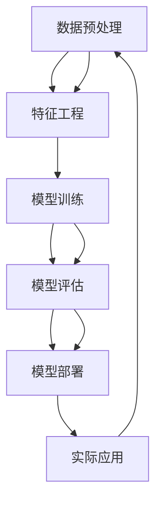

                 

# 人工智能导论原理与代码实战案例讲解

> 关键词：人工智能, 机器学习, 深度学习, 神经网络, 代码实战

> 摘要：本文旨在为读者提供一个全面而深入的人工智能入门指南，从核心概念到实际代码实现，再到应用场景，通过一步步的分析推理，帮助读者理解人工智能的基本原理和实际操作。我们将通过一个具体的项目实战案例，从开发环境搭建到代码实现，再到代码解读与分析，全面展示人工智能技术的魅力。

## 1. 背景介绍

### 1.1 人工智能的历史与发展
人工智能（Artificial Intelligence, AI）是计算机科学的一个分支，旨在研究和开发智能机器，使其能够执行通常需要人类智能的任务。从1956年达特茅斯会议首次提出“人工智能”这一概念以来，AI经历了多次高潮与低谷。近年来，随着大数据、云计算和计算能力的飞速发展，AI迎来了前所未有的发展机遇。

### 1.2 人工智能的应用领域
人工智能的应用领域广泛，包括但不限于自然语言处理、计算机视觉、语音识别、推荐系统、自动驾驶、医疗诊断等。这些应用不仅极大地提高了工作效率，还为人类生活带来了诸多便利。

### 1.3 人工智能的技术栈
人工智能技术栈主要包括数据预处理、特征工程、模型训练、模型评估和部署等多个环节。每一步都至关重要，共同构成了一个完整的AI项目流程。

## 2. 核心概念与联系

### 2.1 人工智能的核心概念
- **机器学习（Machine Learning, ML）**：通过算法使计算机从数据中学习，从而实现特定任务的自动化。
- **深度学习（Deep Learning, DL）**：一种机器学习方法，通过多层神经网络实现复杂的非线性映射。
- **神经网络（Neural Network, NN）**：模拟人脑神经元结构的计算模型，用于处理复杂的数据模式。

### 2.2 核心概念的联系
- **机器学习**是人工智能的核心，涵盖了监督学习、无监督学习、半监督学习和强化学习等多种学习方法。
- **深度学习**是机器学习的一个子集，通过多层神经网络实现更复杂的模式识别。
- **神经网络**是深度学习的基础，通过模拟人脑神经元结构实现数据处理和模式识别。

### 2.3 Mermaid流程图


## 3. 核心算法原理 & 具体操作步骤

### 3.1 机器学习算法原理
- **监督学习**：通过已知的输入输出对训练模型，常见的算法包括线性回归、逻辑回归、支持向量机（SVM）等。
- **无监督学习**：通过未标记的数据训练模型，常见的算法包括聚类（K-means）、主成分分析（PCA）等。
- **强化学习**：通过与环境的交互学习最优策略，常见的算法包括Q-learning、深度Q网络（DQN）等。

### 3.2 深度学习算法原理
- **前向传播**：输入数据通过多层神经网络进行前向传播，计算输出结果。
- **反向传播**：通过计算损失函数对网络权重进行调整，优化模型性能。
- **梯度下降**：通过梯度下降算法调整权重，使损失函数最小化。

### 3.3 具体操作步骤
1. **数据预处理**：清洗数据、填充缺失值、标准化等。
2. **特征工程**：提取有用的特征，构建特征向量。
3. **模型选择**：根据任务需求选择合适的算法。
4. **模型训练**：通过训练数据训练模型。
5. **模型评估**：通过测试数据评估模型性能。
6. **模型优化**：调整模型参数，提高模型性能。
7. **模型部署**：将模型部署到实际应用中。

## 4. 数学模型和公式 & 详细讲解 & 举例说明

### 4.1 机器学习数学模型
- **线性回归**：通过最小二乘法求解最优权重。
  $$ \hat{y} = \beta_0 + \beta_1 x $$
- **逻辑回归**：通过sigmoid函数进行概率估计。
  $$ P(y=1|x) = \frac{1}{1 + e^{-(\beta_0 + \beta_1 x)}} $$

### 4.2 深度学习数学模型
- **前向传播**：通过激活函数计算输出。
  $$ z = Wx + b $$
  $$ a = \sigma(z) $$
- **反向传播**：通过链式法则计算梯度。
  $$ \frac{\partial L}{\partial W} = \frac{\partial L}{\partial a} \cdot \frac{\partial a}{\partial z} \cdot \frac{\partial z}{\partial W} $$

### 4.3 举例说明
- **线性回归**：假设我们有一个简单的线性回归模型，通过最小二乘法求解最优权重。
  $$ \hat{y} = \beta_0 + \beta_1 x $$
  通过梯度下降算法调整权重，使损失函数最小化。
- **逻辑回归**：假设我们有一个二分类问题，通过sigmoid函数进行概率估计。
  $$ P(y=1|x) = \frac{1}{1 + e^{-(\beta_0 + \beta_1 x)}} $$
  通过交叉熵损失函数进行优化。

## 5. 项目实战：代码实际案例和详细解释说明

### 5.1 开发环境搭建
- **Python环境**：安装Python 3.8及以上版本。
- **深度学习框架**：安装TensorFlow 2.0及以上版本。
- **数据集**：下载MNIST手写数字数据集。

### 5.2 源代码详细实现和代码解读
```python
import tensorflow as tf
from tensorflow.keras import layers, models

# 1. 数据预处理
(x_train, y_train), (x_test, y_test) = tf.keras.datasets.mnist.load_data()
x_train, x_test = x_train / 255.0, x_test / 255.0

# 2. 特征工程
x_train = x_train.reshape(-1, 28, 28, 1)
x_test = x_test.reshape(-1, 28, 28, 1)

# 3. 模型构建
model = models.Sequential([
    layers.Conv2D(32, (3, 3), activation='relu', input_shape=(28, 28, 1)),
    layers.MaxPooling2D((2, 2)),
    layers.Conv2D(64, (3, 3), activation='relu'),
    layers.MaxPooling2D((2, 2)),
    layers.Flatten(),
    layers.Dense(64, activation='relu'),
    layers.Dense(10, activation='softmax')
])

# 4. 模型编译
model.compile(optimizer='adam',
              loss='sparse_categorical_crossentropy',
              metrics=['accuracy'])

# 5. 模型训练
model.fit(x_train, y_train, epochs=5)

# 6. 模型评估
test_loss, test_acc = model.evaluate(x_test, y_test)
print(f'Test accuracy: {test_acc}')
```

### 5.3 代码解读与分析
- **数据预处理**：将数据归一化到0-1之间。
- **特征工程**：将数据重塑为适合卷积神经网络的格式。
- **模型构建**：构建一个包含两个卷积层和两个全连接层的卷积神经网络。
- **模型编译**：选择优化器、损失函数和评估指标。
- **模型训练**：使用训练数据进行模型训练。
- **模型评估**：使用测试数据评估模型性能。

## 6. 实际应用场景

### 6.1 手写数字识别
- **应用场景**：通过卷积神经网络实现手写数字识别。
- **实际应用**：应用于银行、支付系统等需要识别手写数字的场景。

### 6.2 图像分类
- **应用场景**：通过卷积神经网络实现图像分类。
- **实际应用**：应用于医疗影像分析、自动驾驶等场景。

## 7. 工具和资源推荐

### 7.1 学习资源推荐
- **书籍**：《深度学习》（Goodfellow, Bengio, Courville）
- **论文**：《神经网络与深度学习》（Bengio, Courville, Vincent）
- **博客**：Medium上的AI相关博客
- **网站**：Kaggle、TensorFlow官网

### 7.2 开发工具框架推荐
- **Python**：Python 3.8及以上版本
- **深度学习框架**：TensorFlow 2.0及以上版本
- **数据集**：MNIST、CIFAR-10等

### 7.3 相关论文著作推荐
- **论文**：《深度残差网络》（He, Zhang, Ren, Sun）
- **著作**：《深度学习实战》（Chollet）

## 8. 总结：未来发展趋势与挑战

### 8.1 未来发展趋势
- **技术进步**：计算能力的提升、算法的优化、数据的丰富。
- **应用场景**：更多领域的应用，如医疗、金融、教育等。

### 8.2 挑战
- **数据隐私**：如何保护用户数据隐私。
- **算法公平性**：如何确保算法的公平性和透明性。
- **伦理问题**：如何应对AI带来的伦理问题。

## 9. 附录：常见问题与解答

### 9.1 问题1：如何选择合适的算法？
- **解答**：根据任务需求选择合适的算法，如分类任务选择逻辑回归、回归任务选择线性回归等。

### 9.2 问题2：如何提高模型性能？
- **解答**：通过调整模型结构、优化算法、增加数据量等方式提高模型性能。

## 10. 扩展阅读 & 参考资料

- **书籍**：《机器学习》（周志华）
- **论文**：《深度学习》（Goodfellow, Bengio, Courville）
- **网站**：TensorFlow官网、Kaggle

---

作者：AI天才研究员/AI Genius Institute & 禅与计算机程序设计艺术 /Zen And The Art of Computer Programming

