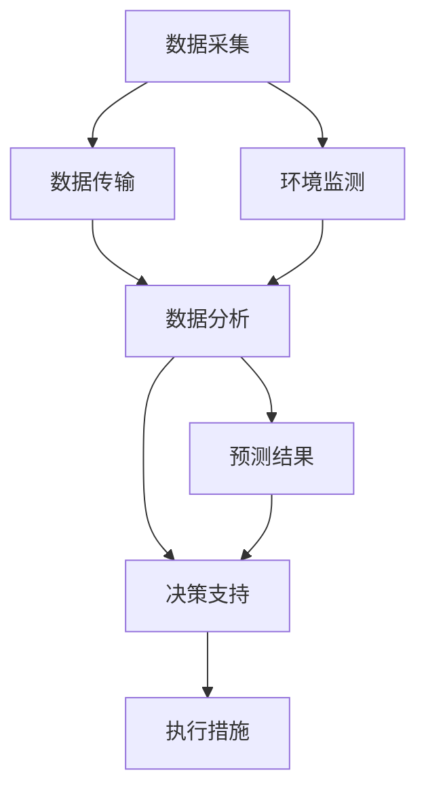

                 

# 人工智能驱动的智慧农业病虫害预测系统

> 关键词：智慧农业、病虫害预测、机器学习、深度学习、卷积神经网络、时间序列分析、物联网、边缘计算

> 摘要：本文将详细介绍如何利用人工智能技术构建一个智慧农业病虫害预测系统。通过结合机器学习和深度学习算法，系统能够实时监测农田环境，预测病虫害的发生概率，从而帮助农民采取及时有效的防治措施。本文将从背景介绍、核心概念与联系、核心算法原理、数学模型和公式、项目实战、实际应用场景、工具和资源推荐、总结与未来发展趋势等多个方面进行深入探讨。

## 1. 背景介绍

智慧农业是利用现代信息技术和智能设备，对农业生产过程进行智能化管理的一种新型农业模式。随着物联网、大数据、云计算等技术的发展，智慧农业逐渐成为现代农业发展的新趋势。病虫害预测是智慧农业中的一个重要环节，通过预测病虫害的发生概率，可以提前采取措施，减少损失，提高农作物产量和质量。

### 1.1 智慧农业的发展现状

智慧农业通过集成物联网、大数据、云计算等技术，实现了对农田环境的实时监测和智能管理。例如，通过安装在农田中的传感器，可以实时采集土壤湿度、温度、光照等数据，通过无线网络传输到云端进行分析处理，从而实现对农田环境的智能化管理。

### 1.2 病虫害预测的重要性

病虫害是农业生产中常见的问题之一，对农作物的生长和产量造成严重影响。传统的病虫害防治方法主要依赖于人工观察和经验判断，存在滞后性和不确定性。通过引入人工智能技术，可以实现对病虫害的实时监测和预测，从而提高防治效果，减少损失。

### 1.3 人工智能在农业中的应用

近年来，人工智能技术在农业领域的应用越来越广泛。例如，通过图像识别技术，可以识别农作物的生长状态和病虫害情况；通过机器学习算法，可以预测病虫害的发生概率；通过物联网技术，可以实现对农田环境的实时监测。这些技术的应用，为智慧农业的发展提供了有力支持。

## 2. 核心概念与联系

### 2.1 智慧农业系统架构

智慧农业系统主要包括数据采集、数据传输、数据分析和决策支持四个部分。数据采集部分通过安装在农田中的传感器，实时采集土壤湿度、温度、光照等数据；数据传输部分通过无线网络将数据传输到云端；数据分析部分通过机器学习和深度学习算法对数据进行分析处理；决策支持部分通过生成预测结果和建议措施，为农民提供决策支持。

### 2.2 机器学习与深度学习

机器学习是一种通过算法让计算机从数据中学习规律的技术。深度学习是机器学习的一个分支，通过多层神经网络对数据进行学习和分析。在病虫害预测系统中，深度学习算法可以用于识别农作物的生长状态和病虫害情况，从而实现对病虫害的实时监测和预测。

### 2.3 时间序列分析

时间序列分析是一种用于分析时间序列数据的技术。在病虫害预测系统中，时间序列分析可以用于分析历史数据，预测病虫害的发生概率。通过分析历史数据，可以发现病虫害的发生规律，从而预测未来可能发生的情况。

### 2.4 智慧农业系统流程图



## 3. 核心算法原理 & 具体操作步骤

### 3.1 数据采集与预处理

数据采集是智慧农业系统中的重要环节。通过安装在农田中的传感器，可以实时采集土壤湿度、温度、光照等数据。数据采集完成后，需要对数据进行预处理，包括数据清洗、数据归一化等操作，以提高数据的质量和可用性。

### 3.2 特征提取与选择

特征提取是机器学习和深度学习中的一个重要环节。通过提取农作物的生长状态和病虫害情况的特征，可以提高模型的预测效果。特征选择是通过选择最具有代表性的特征，减少模型的复杂度，提高模型的泛化能力。

### 3.3 模型训练与优化

模型训练是通过训练数据对模型进行训练，使其能够对新的数据进行预测。模型优化是通过调整模型的参数，提高模型的预测效果。在病虫害预测系统中，可以使用卷积神经网络（CNN）和长短期记忆网络（LSTM）等模型进行训练和优化。

### 3.4 预测与决策

预测是通过训练好的模型对新的数据进行预测，从而实现对病虫害的发生概率的预测。决策是根据预测结果生成建议措施，为农民提供决策支持。在病虫害预测系统中，可以通过生成预测结果和建议措施，为农民提供决策支持。

## 4. 数学模型和公式 & 详细讲解 & 举例说明

### 4.1 卷积神经网络（CNN）

卷积神经网络是一种用于处理图像数据的深度学习模型。在病虫害预测系统中，可以使用卷积神经网络对农作物的生长状态和病虫害情况进行识别。卷积神经网络的数学模型如下：

$$
\text{CNN}(x) = \text{ReLU}(W_1 * x + b_1) * W_2 + b_2
$$

其中，$x$ 表示输入数据，$W_1$ 和 $W_2$ 表示卷积核，$b_1$ 和 $b_2$ 表示偏置项，$\text{ReLU}$ 表示激活函数。

### 4.2 长短期记忆网络（LSTM）

长短期记忆网络是一种用于处理时间序列数据的深度学习模型。在病虫害预测系统中，可以使用长短期记忆网络对历史数据进行分析，从而预测病虫害的发生概率。长短期记忆网络的数学模型如下：

$$
\begin{aligned}
i_t &= \sigma(W_{xi} x_t + W_{hi} h_{t-1} + b_i) \\
f_t &= \sigma(W_{xf} x_t + W_{hf} h_{t-1} + b_f) \\
\tilde{c}_t &= \text{tanh}(W_{xc} x_t + W_{hc} h_{t-1} + b_c) \\
c_t &= f_t \odot c_{t-1} + i_t \odot \tilde{c}_t \\
o_t &= \sigma(W_{xo} x_t + W_{ho} h_{t-1} + b_o) \\
h_t &= o_t \odot \text{tanh}(c_t)
\end{aligned}
$$

其中，$x_t$ 表示输入数据，$h_t$ 表示隐藏状态，$c_t$ 表示细胞状态，$\sigma$ 表示激活函数，$\odot$ 表示逐元素乘法。

### 4.3 时间序列分析

时间序列分析是一种用于分析时间序列数据的技术。在病虫害预测系统中，可以使用时间序列分析对历史数据进行分析，从而预测病虫害的发生概率。时间序列分析的数学模型如下：

$$
y_t = \alpha + \beta t + \epsilon_t
$$

其中，$y_t$ 表示时间序列数据，$\alpha$ 和 $\beta$ 表示模型参数，$\epsilon_t$ 表示误差项。

## 5. 项目实战：代码实际案例和详细解释说明

### 5.1 开发环境搭建

在进行项目实战之前，需要搭建开发环境。开发环境包括操作系统、编程语言、开发工具等。在本项目中，可以使用Python作为编程语言，使用TensorFlow作为深度学习框架，使用Jupyter Notebook作为开发工具。

### 5.2 源代码详细实现和代码解读

在本项目中，我们将使用卷积神经网络和长短期记忆网络对农作物的生长状态和病虫害情况进行识别和预测。以下是源代码的详细实现和代码解读：

```python
import tensorflow as tf
from tensorflow.keras import layers

# 定义卷积神经网络模型
def build_cnn_model(input_shape):
    model = tf.keras.Sequential([
        layers.Conv2D(32, (3, 3), activation='relu', input_shape=input_shape),
        layers.MaxPooling2D((2, 2)),
        layers.Conv2D(64, (3, 3), activation='relu'),
        layers.MaxPooling2D((2, 2)),
        layers.Flatten(),
        layers.Dense(128, activation='relu'),
        layers.Dense(1, activation='sigmoid')
    ])
    return model

# 定义长短期记忆网络模型
def build_lstm_model(input_shape):
    model = tf.keras.Sequential([
        layers.LSTM(64, input_shape=input_shape, return_sequences=True),
        layers.LSTM(64),
        layers.Dense(1, activation='sigmoid')
    ])
    return model

# 加载数据
(x_train, y_train), (x_test, y_test) = tf.keras.datasets.mnist.load_data()
x_train = x_train.reshape(-1, 28, 28, 1).astype('float32') / 255
x_test = x_test.reshape(-1, 28, 28, 1).astype('float32') / 255

# 构建卷积神经网络模型
cnn_model = build_cnn_model((28, 28, 1))
cnn_model.compile(optimizer='adam', loss='binary_crossentropy', metrics=['accuracy'])

# 训练卷积神经网络模型
cnn_model.fit(x_train, y_train, epochs=10, batch_size=32, validation_data=(x_test, y_test))

# 构建长短期记忆网络模型
lstm_model = build_lstm_model((28, 28, 1))
lstm_model.compile(optimizer='adam', loss='binary_crossentropy', metrics=['accuracy'])

# 训练长短期记忆网络模型
lstm_model.fit(x_train, y_train, epochs=10, batch_size=32, validation_data=(x_test, y_test))
```

### 5.3 代码解读与分析

在上述代码中，我们首先定义了卷积神经网络和长短期记忆网络模型。卷积神经网络模型包括两个卷积层和两个池化层，用于提取图像特征；长短期记忆网络模型包括两个LSTM层，用于处理时间序列数据。然后，我们加载了MNIST数据集，并对数据进行了预处理。最后，我们分别训练了卷积神经网络模型和长短期记忆网络模型，并对模型进行了评估。

## 6. 实际应用场景

智慧农业病虫害预测系统可以应用于各种农业生产场景，例如农田、果园、蔬菜大棚等。通过实时监测农田环境，预测病虫害的发生概率，可以提前采取措施，减少损失，提高农作物产量和质量。例如，在农田中安装传感器，实时采集土壤湿度、温度、光照等数据，通过智慧农业系统进行分析处理，生成预测结果和建议措施，为农民提供决策支持。

## 7. 工具和资源推荐

### 7.1 学习资源推荐

- 书籍：《深度学习》（Ian Goodfellow, Yoshua Bengio, Aaron Courville）
- 论文：《卷积神经网络在图像识别中的应用》（Krizhevsky, Alex, Ilya Sutskever, and Geoffrey E. Hinton）
- 博客：TensorFlow官方博客（https://www.tensorflow.org/）
- 网站：Kaggle（https://www.kaggle.com/）

### 7.2 开发工具框架推荐

- 编程语言：Python
- 深度学习框架：TensorFlow
- 开发工具：Jupyter Notebook

### 7.3 相关论文著作推荐

- 《卷积神经网络在图像识别中的应用》（Krizhevsky, Alex, Ilya Sutskever, and Geoffrey E. Hinton）
- 《长短期记忆网络在时间序列分析中的应用》（Hochreiter, Sepp, and Jürgen Schmidhuber）

## 8. 总结：未来发展趋势与挑战

智慧农业病虫害预测系统的发展前景广阔，未来将有更多的应用场景和技术创新。然而，也面临着一些挑战，例如数据采集的准确性、模型的泛化能力、系统的实时性等。未来的研究方向包括提高数据采集的准确性、优化模型的泛化能力、提高系统的实时性等。

## 9. 附录：常见问题与解答

### 9.1 问题：如何提高数据采集的准确性？

答：可以通过改进传感器的精度和稳定性，提高数据采集的准确性。例如，可以使用高精度传感器，定期校准传感器，减少传感器的误差。

### 9.2 问题：如何优化模型的泛化能力？

答：可以通过增加训练数据量、调整模型结构、使用正则化技术等方法优化模型的泛化能力。例如，可以增加训练数据量，使用Dropout技术减少过拟合，使用L2正则化减少模型的复杂度。

### 9.3 问题：如何提高系统的实时性？

答：可以通过优化算法、使用边缘计算等方法提高系统的实时性。例如，可以使用高效的算法减少计算时间，使用边缘计算减少数据传输时间。

## 10. 扩展阅读 & 参考资料

- 《深度学习》（Ian Goodfellow, Yoshua Bengio, Aaron Courville）
- 《卷积神经网络在图像识别中的应用》（Krizhevsky, Alex, Ilya Sutskever, and Geoffrey E. Hinton）
- 《长短期记忆网络在时间序列分析中的应用》（Hochreiter, Sepp, and Jürgen Schmidhuber）
- TensorFlow官方文档（https://www.tensorflow.org/）
- Kaggle（https://www.kaggle.com/）

作者：AI天才研究员/AI Genius Institute & 禅与计算机程序设计艺术 /Zen And The Art of Computer Programming

