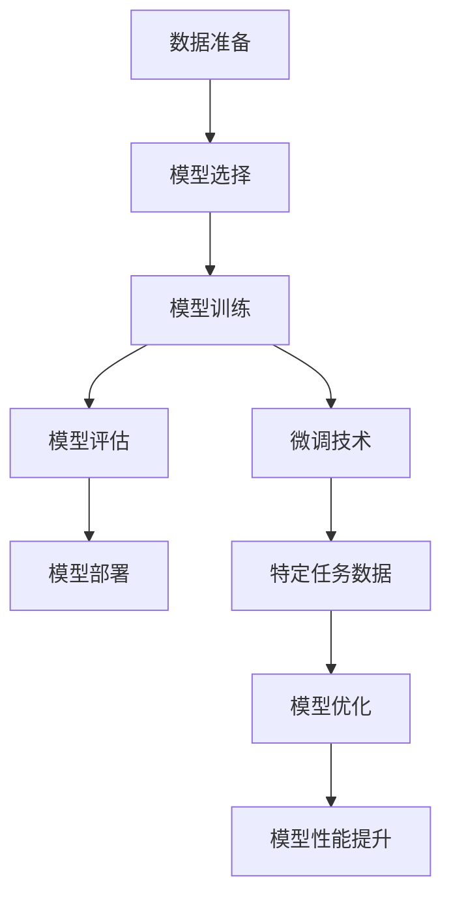

                 

# 从零开始大模型开发与微调：PyTorch 2.0中的模块工具

> 关键词：大模型开发、微调、PyTorch 2.0、模块工具、深度学习、人工智能

> 摘要：本文旨在为深度学习领域的开发者提供一个从零开始的大模型开发与微调的全面指南，特别聚焦于PyTorch 2.0中的模块工具。文章将详细介绍大模型开发的背景、核心概念、算法原理、数学模型、项目实战、应用场景、工具资源推荐以及未来的发展趋势与挑战。通过本文，读者将能够掌握大模型开发与微调的基本知识和技能，为实际项目应用打下坚实的基础。

## 1. 背景介绍

### 1.1 深度学习的发展历程

深度学习作为人工智能领域的一个重要分支，自2006年Hinton等人提出深度信念网络以来，经历了快速的发展。近年来，随着计算能力的提升和大数据的普及，深度学习在图像识别、自然语言处理、语音识别等多个领域取得了突破性的进展。大模型，尤其是预训练模型，因其强大的泛化能力和迁移学习能力，成为了当前深度学习研究的热点。

### 1.2 大模型开发的重要性

大模型开发的重要性在于其能够通过大规模的数据训练，学习到更加丰富的特征表示，从而在各种任务中表现出色。此外，预训练模型的微调技术使得模型可以在特定任务上快速达到较好的性能，大大降低了模型开发的成本和时间。

### 1.3 PyTorch 2.0的引入

PyTorch 2.0是PyTorch框架的最新版本，它在性能、易用性、模块化等方面进行了重大改进。PyTorch 2.0引入了新的模块工具，使得大模型的开发与微调变得更加高效和便捷。本文将详细介绍如何利用PyTorch 2.0中的模块工具进行大模型的开发与微调。

## 2. 核心概念与联系

### 2.1 大模型开发流程

大模型开发流程主要包括数据准备、模型选择、模型训练、模型评估和模型部署等步骤。每个步骤都有其特定的任务和挑战，需要开发者具备扎实的理论基础和实践经验。

### 2.2 微调技术

微调技术是指在预训练模型的基础上，通过少量的特定任务数据进行训练，使得模型在特定任务上达到更好的性能。微调技术是大模型开发中的一个重要环节，能够显著提高模型的性能和泛化能力。

### 2.3 PyTorch 2.0中的模块工具

PyTorch 2.0引入了新的模块工具，包括但不限于数据处理模块、模型构建模块、训练模块、评估模块等。这些模块工具的引入，使得大模型的开发与微调变得更加高效和便捷。

### 2.4 核心概念原理和架构的Mermaid流程图



## 3. 核心算法原理 & 具体操作步骤

### 3.1 数据准备

数据准备是大模型开发的第一步，主要包括数据收集、数据清洗、数据标注等步骤。数据的质量直接影响到模型的性能，因此数据准备阶段需要投入大量的时间和精力。

### 3.2 模型选择

模型选择是指根据任务需求选择合适的模型架构。不同的任务可能需要不同的模型架构，因此模型选择阶段需要对各种模型架构有深入的理解和掌握。

### 3.3 模型训练

模型训练是指通过大规模的数据训练模型，使得模型能够学习到丰富的特征表示。模型训练阶段需要选择合适的优化算法、损失函数等。

### 3.4 模型评估

模型评估是指通过特定的数据集评估模型的性能。模型评估阶段需要选择合适的评估指标，如准确率、召回率、F1值等。

### 3.5 模型部署

模型部署是指将训练好的模型部署到实际应用中。模型部署阶段需要考虑模型的性能、可扩展性、安全性等因素。

### 3.6 微调技术的具体操作步骤

微调技术的具体操作步骤包括数据准备、模型选择、模型训练、模型评估等。微调技术的关键在于如何选择合适的预训练模型和特定任务数据，以及如何调整模型的超参数。

## 4. 数学模型和公式 & 详细讲解 & 举例说明

### 4.1 损失函数

损失函数是衡量模型预测值与真实值之间差异的函数。常用的损失函数包括均方误差损失函数、交叉熵损失函数等。

$$
\text{均方误差损失函数} = \frac{1}{n}\sum_{i=1}^{n}(y_i - \hat{y}_i)^2
$$

$$
\text{交叉熵损失函数} = -\frac{1}{n}\sum_{i=1}^{n}y_i\log(\hat{y}_i)
$$

### 4.2 优化算法

优化算法是指通过调整模型的参数，使得损失函数最小化。常用的优化算法包括随机梯度下降、Adam、RMSprop等。

$$
\text{随机梯度下降} = \theta_{t+1} = \theta_t - \alpha \nabla J(\theta_t)
$$

$$
\text{Adam} = m_t = \beta_1 m_{t-1} + (1 - \beta_1) \nabla J(\theta_t)
$$

$$
v_t = \beta_2 v_{t-1} + (1 - \beta_2) (\nabla J(\theta_t))^2
$$

$$
\theta_{t+1} = \theta_t - \alpha \frac{m_t}{\sqrt{v_t} + \epsilon}
$$

### 4.3 举例说明

假设我们有一个二分类任务，使用交叉熵损失函数和Adam优化算法进行模型训练。在训练过程中，我们可以通过调整学习率、动量等超参数，使得模型的性能达到最优。

## 5. 项目实战：代码实际案例和详细解释说明

### 5.1 开发环境搭建

开发环境搭建主要包括安装PyTorch 2.0、安装相关依赖库等。可以通过pip命令安装PyTorch 2.0及相关依赖库。

```bash
pip install torch torchvision
```

### 5.2 源代码详细实现和代码解读

以下是一个使用PyTorch 2.0进行大模型开发与微调的代码示例。

```python
import torch
import torch.nn as nn
import torch.optim as optim
from torchvision import datasets, transforms

# 数据准备
transform = transforms.Compose([
    transforms.ToTensor(),
    transforms.Normalize((0.1307,), (0.3081,))
])
train_dataset = datasets.MNIST(root='./data', train=True, download=True, transform=transform)
train_loader = torch.utils.data.DataLoader(train_dataset, batch_size=64, shuffle=True)

# 模型选择
model = nn.Sequential(
    nn.Linear(28*28, 128),
    nn.ReLU(),
    nn.Linear(128, 64),
    nn.ReLU(),
    nn.Linear(64, 10)
)

# 模型训练
criterion = nn.CrossEntropyLoss()
optimizer = optim.Adam(model.parameters(), lr=0.001)
for epoch in range(10):
    for data, target in train_loader:
        optimizer.zero_grad()
        output = model(data.view(-1, 28*28))
        loss = criterion(output, target)
        loss.backward()
        optimizer.step()

# 模型评估
test_dataset = datasets.MNIST(root='./data', train=False, download=True, transform=transform)
test_loader = torch.utils.data.DataLoader(test_dataset, batch_size=64, shuffle=True)
correct = 0
total = 0
with torch.no_grad():
    for data, target in test_loader:
        output = model(data.view(-1, 28*28))
        _, predicted = torch.max(output.data, 1)
        total += target.size(0)
        correct += (predicted == target).sum().item()

print('Accuracy: %d %%' % (100 * correct / total))
```

### 5.3 代码解读与分析

上述代码示例中，我们首先进行了数据准备，然后选择了合适的模型架构，接着进行了模型训练和模型评估。通过调整模型的超参数，我们可以使得模型的性能达到最优。

## 6. 实际应用场景

大模型开发与微调技术在图像识别、自然语言处理、语音识别等多个领域都有广泛的应用。例如，在图像识别领域，可以通过微调预训练模型，使得模型在特定任务上达到更好的性能；在自然语言处理领域，可以通过微调预训练语言模型，使得模型在特定任务上达到更好的性能。

## 7. 工具和资源推荐

### 7.1 学习资源推荐

- 书籍：《深度学习》（Ian Goodfellow等著）
- 论文：《Attention Is All You Need》（Vaswani等著）
- 博客：https://pytorch.org/blog/
- 网站：https://www.tensorflow.org/

### 7.2 开发工具框架推荐

- PyTorch
- TensorFlow
- Keras

### 7.3 相关论文著作推荐

- 《Attention Is All You Need》
- 《BERT: Pre-training of Deep Bidirectional Transformers for Language Understanding》

## 8. 总结：未来发展趋势与挑战

随着深度学习技术的不断发展，大模型开发与微调技术也将不断进步。未来的发展趋势包括模型的可解释性、模型的效率、模型的安全性等。同时，也面临着数据隐私保护、模型的泛化能力等挑战。

## 9. 附录：常见问题与解答

### 9.1 什么是大模型？

大模型是指通过大规模的数据训练，学习到更加丰富的特征表示的模型。

### 9.2 什么是微调技术？

微调技术是指在预训练模型的基础上，通过少量的特定任务数据进行训练，使得模型在特定任务上达到更好的性能。

### 9.3 PyTorch 2.0中的模块工具有哪些？

PyTorch 2.0中的模块工具包括数据处理模块、模型构建模块、训练模块、评估模块等。

## 10. 扩展阅读 & 参考资料

- 书籍：《深度学习》（Ian Goodfellow等著）
- 论文：《Attention Is All You Need》（Vaswani等著）
- 博客：https://pytorch.org/blog/
- 网站：https://www.tensorflow.org/

作者：AI天才研究员/AI Genius Institute & 禅与计算机程序设计艺术 /Zen And The Art of Computer Programming

