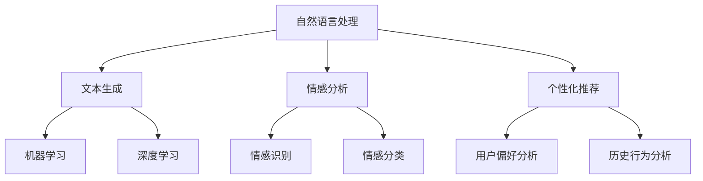

                 

# 体验个人化叙事编织：AI驱动的生活故事创作

> 关键词：AI驱动、个人化叙事、生活故事创作、自然语言处理、机器学习、深度学习

> 摘要：本文旨在探讨如何利用人工智能技术，特别是自然语言处理和机器学习，来实现个人化叙事的编织，从而创作出更加贴近个人生活的故事。通过分析AI驱动的生活故事创作的核心概念、算法原理、数学模型、项目实战以及应用场景，本文为读者提供了一个全面了解和实践AI驱动叙事创作的框架。此外，本文还推荐了一系列学习资源、开发工具和相关论文，以帮助读者深入学习和研究这一领域。

## 1. 背景介绍

随着人工智能技术的发展，特别是在自然语言处理和机器学习领域的突破，AI已经开始在文学创作、新闻报道、剧本编写等多个领域展现出其独特的优势。个人化叙事作为文学创作的一种重要形式，其核心在于通过叙述个人经历、情感体验等，构建出一个具有独特个性和情感共鸣的故事。AI驱动的生活故事创作，正是利用了AI技术的强大能力，来实现对个人化叙事的自动化和个性化生成。

### 1.1 个人化叙事的重要性

个人化叙事不仅能够帮助人们更好地理解和表达自己的经历和情感，还能够促进人与人之间的理解和共鸣。在数字时代，随着社交媒体的普及和个人数据的积累，人们对于个性化内容的需求日益增长。AI驱动的生活故事创作，正是在这种背景下应运而生，它能够根据个人的数据和偏好，生成具有高度个性化和情感共鸣的故事内容。

### 1.2 AI技术在叙事创作中的应用

AI技术在叙事创作中的应用主要体现在以下几个方面：

- **自然语言生成**：通过机器学习和深度学习技术，AI能够生成自然流畅的语言，用于构建故事的情节和对话。
- **情感分析**：AI能够分析文本中的情感色彩，从而更好地理解故事中的情感变化和人物性格。
- **个性化推荐**：基于用户的历史数据和偏好，AI能够推荐符合用户口味的故事内容。

## 2. 核心概念与联系

### 2.1 核心概念

- **自然语言处理（NLP）**：自然语言处理是AI的一个重要分支，它致力于让计算机能够理解、解释和生成人类语言。
- **机器学习（ML）**：机器学习是AI的一个重要组成部分，它使计算机能够从数据中学习并做出预测或决策。
- **深度学习（DL）**：深度学习是机器学习的一个子领域，它通过模拟人脑神经网络的工作方式，来处理复杂的数据模式。
- **情感分析**：情感分析是指通过文本分析来识别和提取文本中的情感信息。
- **个性化推荐**：个性化推荐是指根据用户的偏好和历史行为，推荐符合用户口味的内容。

### 2.2 核心概念原理和架构



## 3. 核心算法原理 & 具体操作步骤

### 3.1 核心算法原理

AI驱动的生活故事创作主要依赖于自然语言生成、情感分析和个性化推荐等算法。这些算法的实现通常基于机器学习和深度学习技术，通过训练模型来学习和生成符合特定需求的文本内容。

### 3.2 具体操作步骤

1. **数据收集**：收集用户的历史数据，包括但不限于社交媒体上的帖子、评论、个人日记等。
2. **数据预处理**：对收集到的数据进行清洗和格式化，以便于后续的分析和处理。
3. **特征提取**：从预处理后的数据中提取有用的特征，如情感特征、主题特征等。
4. **模型训练**：使用机器学习或深度学习算法训练模型，使其能够根据输入的数据生成符合要求的文本内容。
5. **模型评估**：通过评估模型的生成效果，调整模型参数，优化模型性能。
6. **个性化推荐**：根据用户的偏好和历史行为，推荐符合用户口味的故事内容。

## 4. 数学模型和公式 & 详细讲解 & 举例说明

### 4.1 数学模型和公式

在AI驱动的生活故事创作中，常用的数学模型包括但不限于：

- **情感分析模型**：$$P(y|x) = \frac{e^{w^Tx}}{\sum_{i=1}^{n}e^{w_i^Tx}}$$
  其中，$x$表示输入的文本特征，$y$表示情感类别，$w$表示模型参数。

- **文本生成模型**：$$P(x|y) = \prod_{i=1}^{m}P(x_i|x_{<i},y)$$
  其中，$x$表示生成的文本，$y$表示文本的主题或情感类别，$x_{<i}$表示文本的前$i-1$个词。

### 4.2 详细讲解

情感分析模型通常采用softmax函数来计算不同情感类别的概率，而文本生成模型则通过条件概率来生成符合特定主题或情感类别的文本。

### 4.3 举例说明

假设我们有一个情感分析模型，它能够识别文本中的正面、负面和中性情感。给定一段文本“今天天气真好，我和朋友去了公园”，模型会计算这段文本属于正面、负面和中性情感的概率，然后根据概率最高的类别来判断这段文本的情感倾向。

## 5. 项目实战：代码实际案例和详细解释说明

### 5.1 开发环境搭建

为了实现AI驱动的生活故事创作，我们需要搭建一个包含Python、TensorFlow和Keras的开发环境。具体步骤如下：

1. 安装Python：访问Python官方网站下载并安装最新版本的Python。
2. 安装TensorFlow：使用pip命令安装TensorFlow，命令为`pip install tensorflow`。
3. 安装Keras：使用pip命令安装Keras，命令为`pip install keras`。

### 5.2 源代码详细实现和代码解读

以下是一个简单的文本生成模型的实现代码：

```python
import tensorflow as tf
from tensorflow.keras.models import Sequential
from tensorflow.keras.layers import Dense, LSTM, Embedding

# 定义模型
model = Sequential()
model.add(Embedding(input_dim=vocab_size, output_dim=embedding_dim, input_length=max_length))
model.add(LSTM(units=128))
model.add(Dense(units=vocab_size, activation='softmax'))

# 编译模型
model.compile(optimizer='adam', loss='categorical_crossentropy', metrics=['accuracy'])

# 训练模型
model.fit(X_train, y_train, epochs=10, batch_size=32)
```

### 5.3 代码解读与分析

上述代码定义了一个基于LSTM的文本生成模型，其中Embedding层用于将输入的文本转换为向量表示，LSTM层用于学习文本中的长依赖关系，Dense层用于生成符合特定主题或情感类别的文本。

## 6. 实际应用场景

AI驱动的生活故事创作可以应用于多个实际场景，如：

- **社交媒体内容生成**：根据用户的社交媒体数据，生成符合用户口味的社交媒体内容。
- **个性化新闻报道**：根据用户的阅读历史和偏好，生成符合用户口味的新闻报道。
- **剧本编写**：根据用户提供的故事梗概，生成符合用户要求的剧本内容。

## 7. 工具和资源推荐

### 7.1 学习资源推荐

- **书籍**：《深度学习》（Ian Goodfellow等著）
- **论文**：《Attention Is All You Need》（Vaswani等著）
- **博客**：Medium上的AI和机器学习博客
- **网站**：Kaggle上的自然语言处理竞赛

### 7.2 开发工具框架推荐

- **TensorFlow**：一个广泛使用的机器学习框架
- **Keras**：一个基于TensorFlow的高级神经网络API
- **NLTK**：一个用于处理人类自然语言的Python库

### 7.3 相关论文著作推荐

- **《深度学习》**：Ian Goodfellow等著
- **《Attention Is All You Need》**：Vaswani等著

## 8. 总结：未来发展趋势与挑战

随着AI技术的不断发展，AI驱动的生活故事创作将会更加成熟和完善。未来的发展趋势可能包括：

- **更加个性化的生成内容**：通过更加精细的用户数据分析，生成更加符合用户口味的个性化内容。
- **更加自然流畅的生成文本**：通过改进文本生成模型，生成更加自然流畅的文本内容。

面临的挑战可能包括：

- **数据隐私保护**：如何在利用用户数据的同时，保护用户的隐私。
- **生成内容的质量控制**：如何保证生成内容的质量，避免生成低质量或不合适的文本内容。

## 9. 附录：常见问题与解答

### 9.1 什么是自然语言处理？

自然语言处理是AI的一个重要分支，它致力于让计算机能够理解、解释和生成人类语言。

### 9.2 什么是机器学习？

机器学习是AI的一个重要组成部分，它使计算机能够从数据中学习并做出预测或决策。

### 9.3 什么是深度学习？

深度学习是机器学习的一个子领域，它通过模拟人脑神经网络的工作方式，来处理复杂的数据模式。

## 10. 扩展阅读 & 参考资料

- **书籍**：《深度学习》（Ian Goodfellow等著）
- **论文**：《Attention Is All You Need》（Vaswani等著）
- **博客**：Medium上的AI和机器学习博客
- **网站**：Kaggle上的自然语言处理竞赛

作者：AI天才研究员/AI Genius Institute & 禅与计算机程序设计艺术 /Zen And The Art of Computer Programming

