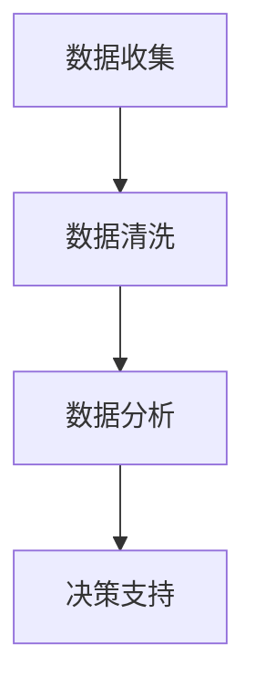

                 

# 信息差的商业模式创新之路：大数据驱动的变革之旅

> 关键词：大数据、信息差、商业模式创新、数据驱动、人工智能

> 摘要：本文探讨了大数据如何通过消除信息差来推动商业模式的创新。从背景介绍到核心概念，再到算法原理、数学模型、项目实战、应用场景、工具资源推荐，最后总结未来发展趋势与挑战，本文旨在为读者提供一个全面而深入的理解，如何利用大数据技术来实现商业模式的创新和优化。

## 1. 背景介绍

### 1.1 信息差的概念

信息差是指在信息不对称的情况下，不同个体或群体之间获取信息的差异。这种差异可能导致决策失误、资源浪费等问题。在商业环境中，信息差的存在往往会导致市场效率低下，企业难以准确把握市场需求，从而影响其竞争力。

### 1.2 大数据的兴起

随着互联网技术的发展，数据量呈指数级增长，大数据技术应运而生。大数据不仅包括结构化数据，还包括非结构化数据，如文本、图像、视频等。大数据技术能够处理海量数据，从中提取有价值的信息，为决策提供支持。

### 1.3 商业模式创新的必要性

在信息时代，商业模式创新成为企业保持竞争力的关键。传统的商业模式往往依赖于有限的信息资源，而大数据技术的出现为企业提供了全新的视角和工具，使得企业能够更好地理解市场、客户和竞争对手，从而实现商业模式的创新。

## 2. 核心概念与联系

### 2.1 信息差与商业模式的关系

信息差的存在使得企业在市场中处于不利地位，而大数据技术的应用则能够缩小甚至消除这种信息差，从而为企业提供更多的商业机会。通过大数据分析，企业可以更准确地预测市场趋势，更好地理解客户需求，从而制定更有效的商业策略。

### 2.2 大数据技术的核心概念

大数据技术的核心在于数据的收集、存储、处理和分析。通过这些技术，企业可以从海量数据中提取有价值的信息，为决策提供支持。大数据技术包括数据挖掘、机器学习、自然语言处理等。

### 2.3 信息差消除的流程

信息差的消除需要经过数据收集、数据清洗、数据分析和决策支持四个步骤。通过这些步骤，企业可以更好地理解市场和客户，从而制定更有效的商业策略。



## 3. 核心算法原理 & 具体操作步骤

### 3.1 数据挖掘算法

数据挖掘是大数据技术的核心之一，它通过分析数据来发现模式和趋势。常见的数据挖掘算法包括关联规则学习、聚类分析、分类和回归等。

### 3.2 机器学习算法

机器学习是另一种重要的大数据技术，它通过训练模型来预测未来趋势。常见的机器学习算法包括决策树、支持向量机、神经网络等。

### 3.3 具体操作步骤

1. 数据收集：从各种来源收集数据，包括社交媒体、网站日志、传感器数据等。
2. 数据清洗：去除无效数据，处理缺失值和异常值。
3. 数据分析：使用数据挖掘和机器学习算法来分析数据。
4. 决策支持：根据分析结果来制定商业策略。

## 4. 数学模型和公式 & 详细讲解 & 举例说明

### 4.1 数据挖掘模型

数据挖掘模型包括关联规则学习、聚类分析、分类和回归等。这些模型可以帮助企业发现数据中的模式和趋势。

#### 4.1.1 关联规则学习

关联规则学习是一种数据挖掘技术，它通过分析数据来发现不同项之间的关联。例如，通过分析购物篮数据，可以发现哪些商品经常一起被购买。

$$
\text{支持度} = \frac{\text{包含项集的事务数}}{\text{总事务数}}
$$

$$
\text{置信度} = \frac{\text{包含项集的事务数}}{\text{包含前件的事务数}}
$$

#### 4.1.2 聚类分析

聚类分析是一种无监督学习技术，它通过将数据分成不同的组来发现数据中的模式。例如，通过分析客户数据，可以将客户分成不同的群体。

$$
\text{距离} = \sqrt{\sum_{i=1}^{n}(x_i - y_i)^2}
$$

### 4.2 机器学习模型

机器学习模型包括决策树、支持向量机、神经网络等。这些模型可以帮助企业预测未来趋势。

#### 4.2.1 决策树

决策树是一种监督学习技术，它通过构建树形结构来预测未来趋势。例如，通过分析客户数据，可以预测哪些客户更有可能购买产品。

$$
\text{信息增益} = \text{熵} - \text{条件熵}
$$

#### 4.2.2 神经网络

神经网络是一种深度学习技术，它通过模拟人脑神经元的工作方式来预测未来趋势。例如，通过分析图像数据，可以识别图像中的物体。

$$
\text{激活函数} = \frac{1}{1 + e^{-x}}
$$

## 5. 项目实战：代码实际案例和详细解释说明

### 5.1 开发环境搭建

开发环境包括操作系统、编程语言、开发工具和库等。例如，可以使用Python作为编程语言，使用Jupyter Notebook作为开发工具，使用Pandas和Scikit-learn作为库。

### 5.2 源代码详细实现和代码解读

以下是一个使用Python和Scikit-learn进行数据挖掘的示例代码：

```python
import pandas as pd
from sklearn.model_selection import train_test_split
from sklearn.tree import DecisionTreeClassifier
from sklearn.metrics import accuracy_score

# 加载数据
data = pd.read_csv('data.csv')

# 数据预处理
X = data.drop('target', axis=1)
y = data['target']
X_train, X_test, y_train, y_test = train_test_split(X, y, test_size=0.2, random_state=42)

# 训练模型
model = DecisionTreeClassifier()
model.fit(X_train, y_train)

# 预测
y_pred = model.predict(X_test)

# 评估
accuracy = accuracy_score(y_test, y_pred)
print('Accuracy:', accuracy)
```

### 5.3 代码解读与分析

这段代码首先加载数据，然后进行数据预处理，包括划分训练集和测试集。接着，使用决策树算法训练模型，并使用测试集进行预测。最后，评估模型的准确性。

## 6. 实际应用场景

### 6.1 电子商务

在电子商务中，大数据技术可以帮助企业更好地理解客户需求，从而提供更个性化的服务。例如，通过分析用户行为数据，可以推荐用户可能感兴趣的商品。

### 6.2 金融行业

在金融行业中，大数据技术可以帮助企业更好地评估风险，从而制定更有效的风险管理策略。例如，通过分析客户数据，可以预测哪些客户更有可能违约。

### 6.3 医疗健康

在医疗健康领域，大数据技术可以帮助企业更好地理解疾病趋势，从而制定更有效的医疗策略。例如，通过分析医疗数据，可以预测哪些患者更有可能患上某种疾病。

## 7. 工具和资源推荐

### 7.1 学习资源推荐

- 书籍：《大数据时代》、《机器学习实战》
- 论文：《大数据分析与应用》、《机器学习在金融领域的应用》
- 博客：Kaggle、Medium
- 网站：Coursera、edX

### 7.2 开发工具框架推荐

- Python：Pandas、Scikit-learn、TensorFlow
- R：dplyr、ggplot2、caret

### 7.3 相关论文著作推荐

- 《大数据分析与应用》
- 《机器学习在金融领域的应用》

## 8. 总结：未来发展趋势与挑战

随着大数据技术的不断发展，信息差的消除将成为企业实现商业模式创新的关键。未来，大数据技术将更加成熟，能够处理更复杂的数据，提供更准确的预测。然而，这也带来了新的挑战，包括数据隐私、数据安全等问题。

## 9. 附录：常见问题与解答

### 9.1 什么是大数据？

大数据是指海量的数据，包括结构化数据和非结构化数据。大数据技术能够处理这些数据，从中提取有价值的信息。

### 9.2 什么是信息差？

信息差是指在信息不对称的情况下，不同个体或群体之间获取信息的差异。

### 9.3 如何消除信息差？

通过大数据技术，企业可以从海量数据中提取有价值的信息，从而消除信息差。

## 10. 扩展阅读 & 参考资料

- 书籍：《大数据时代》、《机器学习实战》
- 论文：《大数据分析与应用》、《机器学习在金融领域的应用》
- 博客：Kaggle、Medium
- 网站：Coursera、edX

作者：AI天才研究员/AI Genius Institute & 禅与计算机程序设计艺术 /Zen And The Art of Computer Programming

