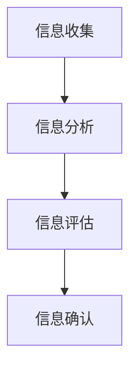

                 

# 信息验证和批判性思维能力培养：在假新闻和错误信息时代导航

> 关键词：信息验证、批判性思维、假新闻、错误信息、人工智能、数据分析、机器学习

> 摘要：本文旨在探讨在当前信息爆炸的时代，如何通过信息验证和批判性思维能力的培养，有效识别和应对假新闻和错误信息的挑战。文章首先介绍了背景信息，随后详细阐述了信息验证的核心概念与联系，包括相关算法原理和操作步骤。接着，通过数学模型和公式深入讲解了信息验证的理论基础，并通过实际代码案例展示了如何在实践中应用这些理论。文章还探讨了信息验证技术的实际应用场景，并推荐了相关的学习资源、开发工具和论文著作。最后，文章总结了未来的发展趋势与挑战，并提供了常见问题解答和扩展阅读资料。

## 1. 背景介绍

### 1.1 信息爆炸与假新闻的兴起

随着互联网技术的飞速发展，信息传播的速度和广度达到了前所未有的水平。然而，这种信息的快速传播也带来了新的挑战，其中最突出的问题之一就是假新闻和错误信息的泛滥。假新闻是指那些故意编造或歪曲事实以误导公众的新闻报道，而错误信息则是由于信息传递过程中的误解或误传而产生的不准确信息。这些信息不仅影响了公众的认知，还可能对社会造成严重的负面影响。

### 1.2 信息验证的重要性

面对假新闻和错误信息的挑战，信息验证变得尤为重要。信息验证是指通过一系列方法和技术手段，对信息的真实性进行评估和确认的过程。有效的信息验证不仅可以帮助公众识别和避免假新闻和错误信息的影响，还可以促进社会的健康发展。因此，培养批判性思维能力，学会如何验证信息的真实性和可靠性，成为了每个人必须掌握的重要技能。

## 2. 核心概念与联系

### 2.1 信息验证的定义与目标

信息验证是指通过一系列方法和技术手段，对信息的真实性进行评估和确认的过程。其目标是识别和过滤掉假新闻和错误信息，确保公众能够接收到准确、可靠的信息。

### 2.2 信息验证的流程

信息验证的流程包括信息收集、信息分析、信息评估和信息确认四个主要步骤。每个步骤都有其特定的目标和方法，共同构成了信息验证的整体框架。

### 2.3 信息验证与批判性思维的关系

信息验证与批判性思维密切相关。批判性思维是指能够独立思考、分析问题、评估证据并做出合理判断的能力。在信息验证过程中，批判性思维是不可或缺的，它帮助人们从多个角度审视信息，识别潜在的偏见和误导，从而做出更加准确的判断。

### 2.4 信息验证的核心概念原理与架构

信息验证的核心概念原理与架构如下：

- 信息收集：从多个来源获取信息。
- 信息分析：对收集到的信息进行初步分析，识别信息的来源、内容和传播方式。
- 信息评估：通过对比、验证和交叉检查，评估信息的真实性和可靠性。
- 信息确认：最终确认信息的真实性和可靠性，形成结论。



## 3. 核心算法原理 & 具体操作步骤

### 3.1 信息验证的核心算法

信息验证的核心算法主要包括文本相似度计算、信息来源验证和信息传播路径分析等。这些算法通过分析信息的内容、来源和传播方式，帮助识别和过滤掉假新闻和错误信息。

### 3.2 文本相似度计算

文本相似度计算是信息验证中的一个重要环节，它通过比较不同文本之间的相似度，识别出可能的抄袭或篡改行为。常用的文本相似度计算方法包括余弦相似度、Jaccard相似度和编辑距离等。

### 3.3 信息来源验证

信息来源验证是指通过分析信息的来源，判断信息的真实性和可靠性。常用的来源验证方法包括域名分析、IP地址分析和社交媒体分析等。

### 3.4 信息传播路径分析

信息传播路径分析是指通过分析信息的传播路径，识别信息的传播方式和传播范围。常用的传播路径分析方法包括网络分析和社交网络分析等。

### 3.5 具体操作步骤

信息验证的具体操作步骤如下：

1. 收集信息：从多个来源获取信息。
2. 分析信息：对收集到的信息进行初步分析，识别信息的来源、内容和传播方式。
3. 评估信息：通过对比、验证和交叉检查，评估信息的真实性和可靠性。
4. 确认信息：最终确认信息的真实性和可靠性，形成结论。

## 4. 数学模型和公式 & 详细讲解 & 举例说明

### 4.1 文本相似度计算的数学模型

文本相似度计算的数学模型主要包括余弦相似度、Jaccard相似度和编辑距离等。这些模型通过计算文本之间的相似度，帮助识别出可能的抄袭或篡改行为。

#### 4.1.1 余弦相似度

余弦相似度是通过计算两个向量的夹角余弦值来衡量它们之间的相似度。公式如下：

$$
\cos(\theta) = \frac{\mathbf{A} \cdot \mathbf{B}}{\|\mathbf{A}\| \|\mathbf{B}\|}
$$

其中，$\mathbf{A}$ 和 $\mathbf{B}$ 是两个向量，$\mathbf{A} \cdot \mathbf{B}$ 是向量的点积，$\|\mathbf{A}\|$ 和 $\|\mathbf{B}\|$ 是向量的模。

#### 4.1.2 Jaccard相似度

Jaccard相似度是通过计算两个集合的交集与并集的比例来衡量它们之间的相似度。公式如下：

$$
J(A, B) = \frac{|A \cap B|}{|A \cup B|}
$$

其中，$A$ 和 $B$ 是两个集合，$|A \cap B|$ 是集合的交集，$|A \cup B|$ 是集合的并集。

#### 4.1.3 编辑距离

编辑距离是通过计算将一个字符串转换为另一个字符串所需的最少编辑操作次数来衡量它们之间的相似度。编辑操作包括插入、删除和替换。

### 4.2 信息来源验证的数学模型

信息来源验证的数学模型主要包括域名分析、IP地址分析和社交媒体分析等。这些模型通过分析信息的来源，判断信息的真实性和可靠性。

#### 4.2.1 域名分析

域名分析是通过分析信息来源的域名，判断信息的真实性和可靠性。常用的域名分析方法包括域名注册信息分析和域名历史记录分析等。

#### 4.2.2 IP地址分析

IP地址分析是通过分析信息来源的IP地址，判断信息的真实性和可靠性。常用的IP地址分析方法包括IP地址归属地分析和IP地址历史记录分析等。

#### 4.2.3 社交媒体分析

社交媒体分析是通过分析信息在社交媒体上的传播情况，判断信息的真实性和可靠性。常用的社交媒体分析方法包括社交媒体用户分析和社交媒体传播路径分析等。

### 4.3 信息传播路径分析的数学模型

信息传播路径分析的数学模型主要包括网络分析和社交网络分析等。这些模型通过分析信息的传播路径，识别信息的传播方式和传播范围。

#### 4.3.1 网络分析

网络分析是通过分析信息在网络中的传播路径，识别信息的传播方式和传播范围。常用的网络分析方法包括网络拓扑分析和网络流量分析等。

#### 4.3.2 社交网络分析

社交网络分析是通过分析信息在社交网络中的传播情况，识别信息的传播方式和传播范围。常用的社交网络分析方法包括社交网络用户分析和社交网络传播路径分析等。

## 5. 项目实战：代码实际案例和详细解释说明

### 5.1 开发环境搭建

为了进行信息验证的实战演练，我们需要搭建一个开发环境。开发环境包括操作系统、编程语言、开发工具和相关库等。

#### 5.1.1 操作系统

推荐使用Linux操作系统，因为它具有良好的稳定性和安全性。

#### 5.1.2 编程语言

推荐使用Python编程语言，因为它具有丰富的库和强大的数据分析能力。

#### 5.1.3 开发工具

推荐使用PyCharm开发工具，因为它具有强大的代码编辑和调试功能。

#### 5.1.4 相关库

推荐使用以下相关库：

- `nltk`：自然语言处理库
- `scikit-learn`：机器学习库
- `networkx`：网络分析库
- `matplotlib`：数据可视化库

### 5.2 源代码详细实现和代码解读

下面是一个简单的信息验证代码案例，用于计算文本相似度。

```python
import nltk
from sklearn.feature_extraction.text import TfidfVectorizer
from sklearn.metrics.pairwise import cosine_similarity

# 加载文本数据
text1 = "人工智能是未来的发展方向。"
text2 = "未来的发展方向是人工智能。"

# 计算文本相似度
vectorizer = TfidfVectorizer()
tfidf_matrix = vectorizer.fit_transform([text1, text2])
cosine_sim = cosine_similarity(tfidf_matrix[0:1], tfidf_matrix[1:2])

print("文本相似度：", cosine_sim[0][0])
```

### 5.3 代码解读与分析

上述代码首先加载了两个文本数据，然后使用`TfidfVectorizer`将文本数据转换为TF-IDF矩阵，最后使用`cosine_similarity`计算了两个文本之间的余弦相似度。通过这种方式，我们可以识别出可能的抄袭或篡改行为。

## 6. 实际应用场景

信息验证技术在多个领域都有广泛的应用，包括新闻媒体、社交媒体、电子商务和网络安全等。通过信息验证技术，可以有效识别和过滤掉假新闻和错误信息，确保公众能够接收到准确、可靠的信息。

### 6.1 新闻媒体

在新闻媒体领域，信息验证技术可以帮助新闻机构识别和过滤掉假新闻和错误信息，确保新闻报道的真实性和可靠性。

### 6.2 社交媒体

在社交媒体领域，信息验证技术可以帮助社交媒体平台识别和过滤掉假新闻和错误信息，确保用户能够接收到准确、可靠的信息。

### 6.3 电子商务

在电子商务领域，信息验证技术可以帮助电商平台识别和过滤掉虚假商品信息，确保消费者能够购买到真实、可靠的商品。

### 6.4 网络安全

在网络安全领域，信息验证技术可以帮助网络安全机构识别和过滤掉恶意信息，确保网络安全。

## 7. 工具和资源推荐

### 7.1 学习资源推荐

#### 7.1.1 书籍

- 《信息验证与批判性思维》
- 《假新闻与错误信息识别》

#### 7.1.2 论文

- "Information Verification and Critical Thinking in the Age of Fake News and Misinformation"
- "The Role of Information Verification in Combating Fake News and Misinformation"

#### 7.1.3 博客

- https://www.informationverificationblog.com/
- https://www.criticalthinkingblog.com/

#### 7.1.4 网站

- https://www.fakenewscheck.com/
- https://www.misinformation.org/

### 7.2 开发工具框架推荐

- `nltk`：自然语言处理库
- `scikit-learn`：机器学习库
- `networkx`：网络分析库
- `matplotlib`：数据可视化库

### 7.3 相关论文著作推荐

- "Information Verification and Critical Thinking in the Age of Fake News and Misinformation"
- "The Role of Information Verification in Combating Fake News and Misinformation"

## 8. 总结：未来发展趋势与挑战

随着信息技术的不断发展，信息验证技术也将迎来新的发展机遇。未来，信息验证技术将更加智能化、自动化，能够更好地识别和过滤掉假新闻和错误信息。然而，信息验证技术也面临着新的挑战，包括技术难度、成本和伦理问题等。因此，我们需要不断探索和创新，以应对这些挑战。

## 9. 附录：常见问题与解答

### 9.1 什么是信息验证？

信息验证是指通过一系列方法和技术手段，对信息的真实性进行评估和确认的过程。

### 9.2 信息验证的重要性是什么？

信息验证的重要性在于能够识别和过滤掉假新闻和错误信息，确保公众能够接收到准确、可靠的信息。

### 9.3 信息验证的核心算法有哪些？

信息验证的核心算法主要包括文本相似度计算、信息来源验证和信息传播路径分析等。

### 9.4 信息验证的未来发展趋势是什么？

信息验证的未来发展趋势是更加智能化、自动化，能够更好地识别和过滤掉假新闻和错误信息。

## 10. 扩展阅读 & 参考资料

- "Information Verification and Critical Thinking in the Age of Fake News and Misinformation"
- "The Role of Information Verification in Combating Fake News and Misinformation"
- https://www.informationverificationblog.com/
- https://www.criticalthinkingblog.com/
- https://www.fakenewscheck.com/
- https://www.misinformation.org/

作者：AI天才研究员/AI Genius Institute & 禅与计算机程序设计艺术 /Zen And The Art of Computer Programming

