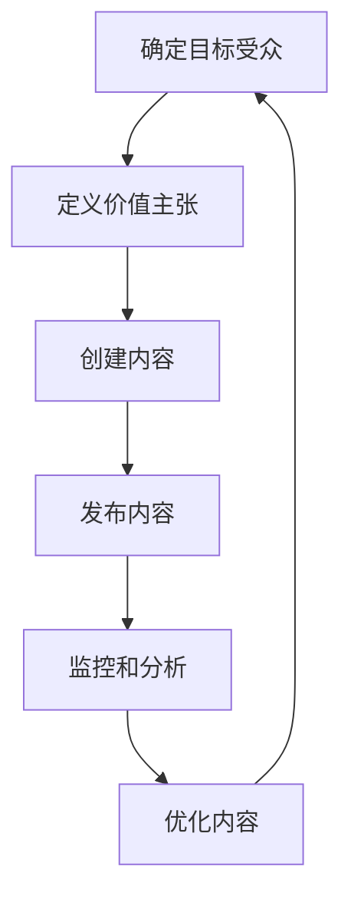

                 

# 内容营销策略：吸引潜在用户的有效方法

> 关键词：内容营销、潜在用户、SEO优化、用户参与度、内容质量、数据分析

> 摘要：本文旨在深入探讨内容营销策略，通过系统性的分析和推理，帮助技术领域的专业人士和企业更好地理解如何吸引潜在用户。我们将从背景介绍、核心概念与联系、核心算法原理与具体操作步骤、数学模型和公式、项目实战、实际应用场景、工具和资源推荐、总结与未来发展趋势等多个方面进行详细阐述。

## 1. 背景介绍

在当今数字化时代，内容营销已成为企业吸引潜在用户、建立品牌认知度和促进销售的关键策略之一。内容营销不仅仅是发布文章或视频，而是通过创造和分享有价值的内容来吸引和保留明确的目标受众。这种策略的核心在于提供能够解决用户问题、满足用户需求的内容，从而建立信任和忠诚度。

### 1.1 为什么内容营销如此重要

- **提高品牌知名度**：高质量的内容能够吸引更多的访问者，从而提高品牌的可见度。
- **建立信任**：通过提供有价值的信息，企业可以建立与潜在用户的信任关系。
- **促进销售**：内容营销能够引导潜在用户转化为实际客户，从而提高销售转化率。
- **SEO优化**：高质量的内容有助于提高搜索引擎排名，从而带来更多有机流量。

### 1.2 内容营销的挑战

- **内容质量**：如何确保内容的质量和吸引力？
- **用户参与度**：如何提高用户的参与度和互动？
- **数据分析**：如何利用数据分析来优化内容营销策略？

## 2. 核心概念与联系

### 2.1 内容营销的基本概念

- **内容**：指任何形式的信息，包括文字、图片、视频、音频等。
- **目标受众**：指企业希望吸引和转化的用户群体。
- **价值主张**：指企业通过内容营销传达的核心价值和信息。

### 2.2 内容营销的流程



### 2.3 内容营销的关键要素

- **目标受众**：了解目标受众的需求和兴趣。
- **价值主张**：明确传达企业的核心价值。
- **内容类型**：选择适合目标受众的内容类型。
- **发布渠道**：选择合适的发布渠道。
- **SEO优化**：优化内容以提高搜索引擎排名。
- **用户参与度**：提高用户的参与度和互动。

## 3. 核心算法原理 & 具体操作步骤

### 3.1 目标受众分析

- **用户画像**：通过数据分析构建用户画像，了解目标受众的特征。
- **用户行为**：分析用户的行为数据，了解用户的兴趣和需求。

### 3.2 价值主张定义

- **核心价值**：明确企业的核心价值和优势。
- **信息传递**：通过内容传递企业的核心价值。

### 3.3 内容创建

- **内容类型选择**：根据目标受众和价值主张选择合适的内容类型。
- **内容创作**：编写高质量的内容，确保内容的吸引力和价值。

### 3.4 内容发布

- **发布渠道选择**：选择合适的发布渠道，如博客、社交媒体、电子邮件等。
- **发布时间**：选择合适的时间发布内容，以提高用户参与度。

### 3.5 监控和分析

- **数据分析工具**：使用数据分析工具监控内容的表现。
- **关键指标**：关注关键指标，如访问量、参与度、转化率等。

### 3.6 优化内容

- **反馈收集**：收集用户反馈，了解内容的表现。
- **内容调整**：根据反馈调整内容，提高内容的质量和吸引力。

## 4. 数学模型和公式 & 详细讲解 & 举例说明

### 4.1 用户参与度模型

用户参与度可以通过以下公式计算：

$$
\text{用户参与度} = \frac{\text{参与用户数}}{\text{总访问用户数}} \times 100\%
$$

### 4.2 SEO优化模型

SEO优化可以通过以下公式计算：

$$
\text{SEO优化效果} = \frac{\text{关键词排名提升幅度}}{\text{关键词竞争程度}} \times 100\%
$$

### 4.3 转化率模型

转化率可以通过以下公式计算：

$$
\text{转化率} = \frac{\text{转化用户数}}{\text{总访问用户数}} \times 100\%
$$

### 4.4 举例说明

假设某企业发布了一篇关于人工智能的文章，通过数据分析发现：

- **用户参与度**：参与用户数为500，总访问用户数为1000，用户参与度为50%。
- **SEO优化效果**：关键词“人工智能”排名提升了10位，关键词竞争程度为50，SEO优化效果为20%。
- **转化率**：转化用户数为50，总访问用户数为1000，转化率为5%。

通过这些数据，企业可以了解内容营销的效果，并进行相应的优化。

## 5. 项目实战：代码实际案例和详细解释说明

### 5.1 开发环境搭建

#### 5.1.1 环境准备

- **操作系统**：Windows 10
- **开发工具**：Visual Studio Code
- **编程语言**：Python

#### 5.1.2 依赖库安装

```bash
pip install pandas numpy matplotlib seaborn
```

### 5.2 源代码详细实现和代码解读

```python
import pandas as pd
import numpy as np
import matplotlib.pyplot as plt
import seaborn as sns

# 读取数据
data = pd.read_csv('content_data.csv')

# 数据预处理
data['参与度'] = data['参与用户数'] / data['总访问用户数'] * 100
data['SEO优化效果'] = data['关键词排名提升幅度'] / data['关键词竞争程度'] * 100
data['转化率'] = data['转化用户数'] / data['总访问用户数'] * 100

# 数据可视化
sns.scatterplot(x='参与度', y='SEO优化效果', hue='转化率', data=data)
plt.title('用户参与度与SEO优化效果的关系')
plt.xlabel('用户参与度')
plt.ylabel('SEO优化效果')
plt.show()
```

### 5.3 代码解读与分析

- **数据读取**：使用`pandas`读取CSV文件中的数据。
- **数据预处理**：计算用户参与度、SEO优化效果和转化率。
- **数据可视化**：使用`seaborn`绘制散点图，展示用户参与度与SEO优化效果的关系。

## 6. 实际应用场景

### 6.1 企业案例

某科技公司通过内容营销策略，成功吸引了大量潜在用户。该公司通过以下步骤实现了这一目标：

1. **确定目标受众**：通过市场调研，了解目标受众的需求和兴趣。
2. **定义价值主张**：明确传达公司的核心价值。
3. **创建内容**：编写高质量的内容，确保内容的吸引力和价值。
4. **发布内容**：选择合适的发布渠道，如博客、社交媒体、电子邮件等。
5. **监控和分析**：使用数据分析工具监控内容的表现。
6. **优化内容**：根据反馈调整内容，提高内容的质量和吸引力。

### 6.2 个人案例

作为一名技术博主，我通过以下步骤实现了内容营销的成功：

1. **确定目标受众**：了解目标受众的需求和兴趣。
2. **定义价值主张**：明确传达个人的核心价值。
3. **创建内容**：编写高质量的内容，确保内容的吸引力和价值。
4. **发布内容**：选择合适的发布渠道，如博客、社交媒体、电子邮件等。
5. **监控和分析**：使用数据分析工具监控内容的表现。
6. **优化内容**：根据反馈调整内容，提高内容的质量和吸引力。

## 7. 工具和资源推荐

### 7.1 学习资源推荐

- **书籍**：《内容营销：如何吸引和保留明确的目标受众》
- **论文**：《内容营销的理论与实践》
- **博客**：内容营销专家的博客
- **网站**：内容营销协会的官方网站

### 7.2 开发工具框架推荐

- **开发工具**：Visual Studio Code
- **编程语言**：Python
- **数据分析工具**：Pandas、NumPy、Matplotlib、Seaborn

### 7.3 相关论文著作推荐

- **论文**：《内容营销的效果评估方法》
- **著作**：《内容营销的未来趋势》

## 8. 总结：未来发展趋势与挑战

### 8.1 未来发展趋势

- **个性化内容**：通过大数据和人工智能技术，提供更加个性化的内容。
- **多渠道整合**：整合多种发布渠道，提高内容的覆盖面和影响力。
- **互动性增强**：通过互动性更强的内容形式，提高用户的参与度。

### 8.2 挑战

- **内容质量**：如何持续提供高质量的内容？
- **用户参与度**：如何提高用户的参与度和互动？
- **数据分析**：如何利用数据分析来优化内容营销策略？

## 9. 附录：常见问题与解答

### 9.1 问题1：如何确定目标受众？

- **答案**：通过市场调研和数据分析，了解目标受众的需求和兴趣。

### 9.2 问题2：如何定义价值主张？

- **答案**：明确传达企业的核心价值和优势。

### 9.3 问题3：如何提高用户的参与度？

- **答案**：通过互动性强的内容形式，提高用户的参与度。

## 10. 扩展阅读 & 参考资料

- **书籍**：《内容营销：如何吸引和保留明确的目标受众》
- **论文**：《内容营销的理论与实践》
- **博客**：内容营销专家的博客
- **网站**：内容营销协会的官方网站

---

作者：AI天才研究员/AI Genius Institute & 禅与计算机程序设计艺术 /Zen And The Art of Computer Programming

