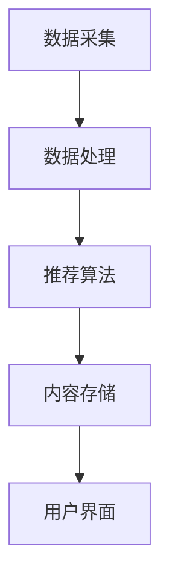

                 

# 创业公司的内容分发策略

> 关键词：内容分发、创业公司、算法优化、用户增长、数据分析

> 摘要：本文旨在探讨创业公司在内容分发策略上的最佳实践，通过分析内容分发的核心概念、算法原理、数学模型、项目实战、应用场景、工具资源推荐以及未来发展趋势，为创业公司提供一套全面的内容分发策略指南。文章将逐步深入，从理论到实践，帮助读者理解并应用内容分发策略，以促进用户增长和业务发展。

## 1. 背景介绍

在当今互联网时代，内容分发已经成为创业公司获取用户、提升用户粘性、实现商业价值的重要手段。随着社交媒体、短视频平台、新闻资讯网站等各类内容平台的兴起，内容分发策略的重要性日益凸显。然而，如何制定有效的内容分发策略，以满足不同用户群体的需求，实现精准推送，成为创业公司面临的一大挑战。

### 1.1 内容分发的重要性

内容分发的重要性体现在以下几个方面：

- **用户获取**：通过精准的内容分发，可以吸引目标用户群体，实现用户获取。
- **用户粘性**：高质量的内容能够提升用户粘性，增加用户活跃度。
- **商业价值**：通过内容分发，可以实现广告投放、电商转化等商业价值。

### 1.2 内容分发面临的挑战

内容分发面临的挑战主要包括：

- **用户需求多样化**：不同用户群体的需求各异，如何满足多样化需求是挑战之一。
- **信息过载**：信息量庞大，如何从海量信息中筛选出有价值的内容是挑战之一。
- **算法优化**：如何优化推荐算法，实现精准推送，是内容分发的核心挑战。

## 2. 核心概念与联系

### 2.1 内容分发的核心概念

内容分发涉及多个核心概念，包括用户画像、内容标签、推荐算法等。

- **用户画像**：通过收集用户行为数据，构建用户画像，了解用户兴趣偏好。
- **内容标签**：对内容进行分类和标签化，便于推荐算法匹配。
- **推荐算法**：根据用户画像和内容标签，实现内容的精准推荐。

### 2.2 内容分发的架构

内容分发的架构包括数据采集、数据处理、推荐算法、内容存储、用户界面等模块。



## 3. 核心算法原理 & 具体操作步骤

### 3.1 推荐算法原理

推荐算法是内容分发的核心，常见的推荐算法包括基于内容的推荐、协同过滤推荐、深度学习推荐等。

- **基于内容的推荐**：根据用户历史行为，推荐相似内容。
- **协同过滤推荐**：根据用户行为相似性，推荐相似用户喜欢的内容。
- **深度学习推荐**：利用深度学习模型，学习用户和内容的特征，实现推荐。

### 3.2 推荐算法的具体操作步骤

推荐算法的具体操作步骤如下：

1. **数据预处理**：清洗、归一化数据。
2. **特征提取**：提取用户和内容的特征。
3. **模型训练**：训练推荐模型。
4. **模型评估**：评估模型性能。
5. **模型部署**：部署推荐模型。

## 4. 数学模型和公式 & 详细讲解 & 举例说明

### 4.1 基于内容的推荐算法

基于内容的推荐算法通过计算用户历史行为与候选内容的相似度，推荐相似内容。相似度计算公式如下：

$$
similarity = \frac{\sum_{i=1}^{n}(x_i - \bar{x})(y_i - \bar{y})}{\sqrt{\sum_{i=1}^{n}(x_i - \bar{x})^2} \sqrt{\sum_{i=1}^{n}(y_i - \bar{y})^2}}
$$

其中，$x_i$ 和 $y_i$ 分别表示用户历史行为和候选内容的特征值，$\bar{x}$ 和 $\bar{y}$ 分别表示特征值的平均值。

### 4.2 协同过滤推荐算法

协同过滤推荐算法通过计算用户行为相似度，推荐相似用户喜欢的内容。相似度计算公式如下：

$$
similarity = \frac{\sum_{i=1}^{n}(x_i - \bar{x})(y_i - \bar{y})}{\sqrt{\sum_{i=1}^{n}(x_i - \bar{x})^2} \sqrt{\sum_{i=1}^{n}(y_i - \bar{y})^2}}
$$

其中，$x_i$ 和 $y_i$ 分别表示用户行为特征值，$\bar{x}$ 和 $\bar{y}$ 分别表示特征值的平均值。

### 4.3 深度学习推荐算法

深度学习推荐算法通过学习用户和内容的特征，实现推荐。常用的深度学习模型包括神经网络、卷积神经网络、循环神经网络等。

## 5. 项目实战：代码实际案例和详细解释说明

### 5.1 开发环境搭建

开发环境搭建包括安装Python、Jupyter Notebook、TensorFlow等工具。

```bash
pip install python
pip install jupyter
pip install tensorflow
```

### 5.2 源代码详细实现和代码解读

以下是一个基于内容的推荐算法的Python实现示例：

```python
import numpy as np

def cosine_similarity(x, y):
    return np.dot(x, y) / (np.linalg.norm(x) * np.linalg.norm(y))

user_history = [1, 2, 3, 4, 5]
content_features = [[1, 2, 3], [4, 5, 6], [7, 8, 9], [10, 11, 12], [13, 14, 15]]

similarities = []
for content in content_features:
    similarity = cosine_similarity(user_history, content)
    similarities.append(similarity)

recommended_content = np.argmax(similarities)
print("推荐内容：", recommended_content)
```

### 5.3 代码解读与分析

上述代码实现了基于内容的推荐算法，通过计算用户历史行为与候选内容的余弦相似度，推荐相似内容。

## 6. 实际应用场景

### 6.1 社交媒体

在社交媒体中，通过内容分发策略，可以实现精准推送，提升用户活跃度和粘性。

### 6.2 短视频平台

在短视频平台中，通过内容分发策略，可以实现个性化推荐，提升用户观看时长和粘性。

### 6.3 新闻资讯网站

在新闻资讯网站中，通过内容分发策略，可以实现精准推送，提升用户阅读量和粘性。

## 7. 工具和资源推荐

### 7.1 学习资源推荐

- 书籍：《推荐系统实践》、《深度学习》
- 论文：《Collaborative Filtering for Implicit Feedback Datasets》
- 博客：Medium、Towards Data Science
- 网站：Kaggle、GitHub

### 7.2 开发工具框架推荐

- Python：TensorFlow、PyTorch
- Java：Spark MLlib
- JavaScript：Node.js

### 7.3 相关论文著作推荐

- 《Collaborative Filtering for Implicit Feedback Datasets》
- 《Deep Learning for Recommender Systems》

## 8. 总结：未来发展趋势与挑战

未来内容分发的发展趋势包括个性化推荐、多模态推荐、实时推荐等。同时，面临的挑战包括数据隐私保护、算法公平性、模型可解释性等。

## 9. 附录：常见问题与解答

### 9.1 什么是内容分发？

内容分发是指通过算法，将合适的内容推送给合适的用户。

### 9.2 内容分发的核心挑战是什么？

内容分发的核心挑战包括用户需求多样化、信息过载、算法优化等。

### 9.3 如何评估推荐算法的性能？

推荐算法的性能可以通过准确率、召回率、F1值等指标进行评估。

## 10. 扩展阅读 & 参考资料

- 书籍：《推荐系统实践》、《深度学习》
- 论文：《Collaborative Filtering for Implicit Feedback Datasets》
- 博客：Medium、Towards Data Science
- 网站：Kaggle、GitHub

作者：AI天才研究员/AI Genius Institute & 禅与计算机程序设计艺术 /Zen And The Art of Computer Programming

