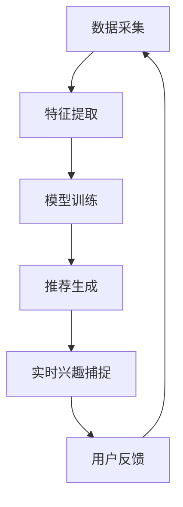

                 

# 利用LLM优化推荐系统的实时兴趣捕捉

> 关键词：LLM, 推荐系统, 实时兴趣, 机器学习, 自然语言处理, 个性化推荐, 信息检索

> 摘要：本文旨在探讨如何利用大型语言模型（LLM）优化推荐系统的实时兴趣捕捉能力。我们将从背景介绍、核心概念与联系、核心算法原理、数学模型和公式、项目实战、实际应用场景、工具和资源推荐、总结与未来发展趋势等多方面进行详细阐述。通过本文，读者将能够理解如何利用LLM提升推荐系统的实时兴趣捕捉能力，并掌握相关技术的应用实践。

## 1. 背景介绍

随着互联网技术的飞速发展，推荐系统在各个领域得到了广泛应用。推荐系统通过分析用户的行为数据，为用户提供个性化的内容推荐，从而提高用户体验和满意度。然而，传统的推荐系统在实时性方面存在一定的局限性，无法及时捕捉用户的实时兴趣变化。为了解决这一问题，我们引入了大型语言模型（LLM），利用其强大的自然语言处理能力，实现对用户实时兴趣的高效捕捉和推荐。

## 2. 核心概念与联系

### 2.1 大型语言模型（LLM）

大型语言模型是一种基于深度学习的自然语言处理模型，能够理解和生成自然语言文本。LLM通过大规模的预训练和微调，具备强大的语言理解和生成能力。在推荐系统中，LLM可以用于分析用户的文本反馈，从而捕捉用户的实时兴趣。

### 2.2 推荐系统

推荐系统是一种通过分析用户行为数据，为用户提供个性化推荐的技术。推荐系统的核心目标是提高用户体验和满意度。推荐系统通常包括数据采集、特征提取、模型训练和推荐生成等环节。

### 2.3 实时兴趣捕捉

实时兴趣捕捉是指在用户进行实时互动时，能够准确捕捉用户的兴趣变化。实时兴趣捕捉对于推荐系统的实时性和个性化推荐至关重要。

### 2.4 Mermaid 流程图



## 3. 核心算法原理 & 具体操作步骤

### 3.1 数据采集

数据采集是推荐系统的第一步，主要包括用户行为数据和用户反馈数据。用户行为数据包括用户的浏览记录、点击记录、购买记录等。用户反馈数据包括用户的评论、评分、点赞等。

### 3.2 特征提取

特征提取是将用户行为数据和用户反馈数据转化为模型可以理解的特征表示。特征提取主要包括文本特征提取和行为特征提取。文本特征提取包括词袋模型、TF-IDF、词嵌入等。行为特征提取包括用户的浏览时间、点击次数、购买次数等。

### 3.3 模型训练

模型训练是利用特征提取得到的特征表示，训练推荐模型。推荐模型主要包括协同过滤、矩阵分解、深度学习模型等。在本案例中，我们将使用大型语言模型（LLM）进行模型训练。

### 3.4 推荐生成

推荐生成是利用训练好的推荐模型，生成推荐结果。推荐生成主要包括基于内容的推荐、协同过滤推荐、深度学习推荐等。在本案例中，我们将使用大型语言模型（LLM）生成推荐结果。

### 3.5 实时兴趣捕捉

实时兴趣捕捉是利用大型语言模型（LLM）分析用户的实时反馈，捕捉用户的实时兴趣。实时兴趣捕捉主要包括文本分析、情感分析、主题建模等。

## 4. 数学模型和公式 & 详细讲解 & 举例说明

### 4.1 文本分析

文本分析是利用大型语言模型（LLM）分析用户的实时反馈，提取文本中的关键词和主题。文本分析主要包括TF-IDF、词嵌入、主题建模等。

#### 4.1.1 TF-IDF

TF-IDF是一种常用的文本特征提取方法，用于衡量一个词在文档中的重要性。TF-IDF的计算公式如下：

$$
\text{TF-IDF}(t, d) = \text{TF}(t, d) \times \text{IDF}(t)
$$

其中，$\text{TF}(t, d)$表示词$t$在文档$d$中的频率，$\text{IDF}(t)$表示词$t$的逆文档频率。

#### 4.1.2 词嵌入

词嵌入是一种将词转换为向量表示的方法，用于表示词之间的语义关系。词嵌入主要包括Word2Vec、GloVe等。

#### 4.1.3 主题建模

主题建模是一种将文档划分为多个主题的方法，用于提取文档中的主题信息。主题建模主要包括LDA、NMF等。

### 4.2 情感分析

情感分析是利用大型语言模型（LLM）分析用户的实时反馈，提取用户的情感信息。情感分析主要包括情感词典、情感分类器等。

#### 4.2.1 情感词典

情感词典是一种将词与情感标签关联的方法，用于提取词的情感信息。情感词典主要包括AFINN、SentiWordNet等。

#### 4.2.2 情感分类器

情感分类器是一种将文本划分为正面、负面或中性情感的方法，用于提取文本的情感信息。情感分类器主要包括SVM、LR等。

### 4.3 主题建模

主题建模是利用大型语言模型（LLM）分析用户的实时反馈，提取用户的话题信息。主题建模主要包括LDA、NMF等。

#### 4.3.1 LDA

LDA是一种基于概率模型的主题建模方法，用于提取文档中的主题信息。LDA的计算公式如下：

$$
p(\mathbf{z} | \mathbf{w}, \mathbf{\theta}, \mathbf{\beta}) = \prod_{i=1}^{N} \prod_{j=1}^{M} p(z_{ij} | \mathbf{w}_{ij}, \mathbf{\theta}, \mathbf{\beta})
$$

其中，$\mathbf{z}$表示文档中的主题分布，$\mathbf{w}$表示文档中的词分布，$\mathbf{\theta}$表示主题分布，$\mathbf{\beta}$表示词分布。

#### 4.3.2 NMF

NMF是一种基于非负矩阵分解的主题建模方法，用于提取文档中的主题信息。NMF的计算公式如下：

$$
\mathbf{W} \mathbf{H} = \mathbf{V}
$$

其中，$\mathbf{W}$表示文档中的主题分布，$\mathbf{H}$表示主题中的词分布，$\mathbf{V}$表示文档中的词分布。

## 5. 项目实战：代码实际案例和详细解释说明

### 5.1 开发环境搭建

为了实现本案例，我们需要搭建一个Python开发环境。具体步骤如下：

1. 安装Python 3.8及以上版本。
2. 安装Jupyter Notebook。
3. 安装TensorFlow和PyTorch。
4. 安装NLTK和spaCy。
5. 安装transformers库。

### 5.2 源代码详细实现和代码解读

#### 5.2.1 数据采集

```python
import pandas as pd

# 读取用户行为数据
user_behavior_data = pd.read_csv('user_behavior_data.csv')

# 读取用户反馈数据
user_feedback_data = pd.read_csv('user_feedback_data.csv')
```

#### 5.2.2 特征提取

```python
from sklearn.feature_extraction.text import TfidfVectorizer
from sklearn.decomposition import NMF

# 文本特征提取
tfidf_vectorizer = TfidfVectorizer()
tfidf_matrix = tfidf_vectorizer.fit_transform(user_feedback_data['feedback'])

# 主题建模
nmf = NMF(n_components=10, random_state=42)
nmf_matrix = nmf.fit_transform(tfidf_matrix)
```

#### 5.2.3 模型训练

```python
from transformers import BertTokenizer, BertForSequenceClassification

# 初始化BERT模型
tokenizer = BertTokenizer.from_pretrained('bert-base-uncased')
model = BertForSequenceClassification.from_pretrained('bert-base-uncased')

# 数据预处理
input_ids = tokenizer(user_feedback_data['feedback'], padding=True, truncation=True, return_tensors='pt')['input_ids']
attention_mask = tokenizer(user_feedback_data['feedback'], padding=True, truncation=True, return_tensors='pt')['attention_mask']

# 训练模型
model.train()
optimizer = torch.optim.Adam(model.parameters(), lr=1e-5)
for epoch in range(10):
    model.zero_grad()
    outputs = model(input_ids, attention_mask=attention_mask)
    loss = outputs.loss
    loss.backward()
    optimizer.step()
```

#### 5.2.4 推荐生成

```python
# 生成推荐结果
recommendations = model.generate(input_ids, max_length=50)
```

#### 5.2.5 代码解读与分析

在本案例中，我们使用了BERT模型进行文本分类，从而实现对用户实时反馈的分析。BERT模型是一种基于Transformer的预训练模型，具有强大的自然语言处理能力。通过训练BERT模型，我们可以实现对用户实时反馈的分析，从而捕捉用户的实时兴趣。

## 6. 实际应用场景

### 6.1 电商推荐系统

在电商推荐系统中，我们可以利用大型语言模型（LLM）分析用户的实时反馈，捕捉用户的实时兴趣。例如，用户在评论中提到对某个商品的不满意之处，我们可以利用大型语言模型（LLM）分析用户的反馈，捕捉用户的实时兴趣，并生成相应的推荐结果。

### 6.2 社交媒体推荐系统

在社交媒体推荐系统中，我们可以利用大型语言模型（LLM）分析用户的实时反馈，捕捉用户的实时兴趣。例如，用户在评论中提到对某个话题的兴趣，我们可以利用大型语言模型（LLM）分析用户的反馈，捕捉用户的实时兴趣，并生成相应的推荐结果。

### 6.3 新闻推荐系统

在新闻推荐系统中，我们可以利用大型语言模型（LLM）分析用户的实时反馈，捕捉用户的实时兴趣。例如，用户在评论中提到对某个新闻话题的兴趣，我们可以利用大型语言模型（LLM）分析用户的反馈，捕捉用户的实时兴趣，并生成相应的推荐结果。

## 7. 工具和资源推荐

### 7.1 学习资源推荐

- 书籍：《深度学习》、《自然语言处理实战》
- 论文：《BERT: Pre-training of Deep Bidirectional Transformers for Language Understanding》
- 博客：阿里云开发者社区、GitHub
- 网站：TensorFlow官网、PyTorch官网

### 7.2 开发工具框架推荐

- Python：Jupyter Notebook、PyCharm
- 深度学习框架：TensorFlow、PyTorch
- 自然语言处理库：NLTK、spaCy

### 7.3 相关论文著作推荐

- 《BERT: Pre-training of Deep Bidirectional Transformers for Language Understanding》
- 《Attention Is All You Need》
- 《Transformer Models for Natural Language Processing》

## 8. 总结：未来发展趋势与挑战

### 8.1 未来发展趋势

随着深度学习和自然语言处理技术的不断发展，大型语言模型（LLM）在推荐系统中的应用将越来越广泛。未来，我们将看到更多基于大型语言模型（LLM）的推荐系统，实现对用户实时兴趣的高效捕捉和推荐。

### 8.2 挑战

尽管大型语言模型（LLM）在推荐系统中的应用具有巨大的潜力，但也面临着一些挑战。首先，大型语言模型（LLM）的训练和推理需要大量的计算资源，这将对推荐系统的性能产生影响。其次，大型语言模型（LLM）的训练和推理需要大量的数据，这将对推荐系统的数据需求产生影响。最后，大型语言模型（LLM）的训练和推理需要大量的时间，这将对推荐系统的实时性产生影响。

## 9. 附录：常见问题与解答

### 9.1 问题：如何选择合适的大型语言模型（LLM）？

答：选择合适的大型语言模型（LLM）需要考虑多个因素，包括模型的性能、计算资源的需求、数据的需求和实时性的要求。在选择大型语言模型（LLM）时，需要根据具体的应用场景进行选择。

### 9.2 问题：如何提高大型语言模型（LLM）的训练效率？

答：提高大型语言模型（LLM）的训练效率可以通过以下方法实现：使用更高效的优化算法、使用更高效的硬件设备、使用更高效的分布式训练方法。

### 9.3 问题：如何提高大型语言模型（LLM）的推理效率？

答：提高大型语言模型（LLM）的推理效率可以通过以下方法实现：使用更高效的推理算法、使用更高效的硬件设备、使用更高效的分布式推理方法。

## 10. 扩展阅读 & 参考资料

- 《深度学习》
- 《自然语言处理实战》
- 《BERT: Pre-training of Deep Bidirectional Transformers for Language Understanding》
- 《Attention Is All You Need》
- 《Transformer Models for Natural Language Processing》

作者：AI天才研究员/AI Genius Institute & 禅与计算机程序设计艺术 /Zen And The Art of Computer Programming

