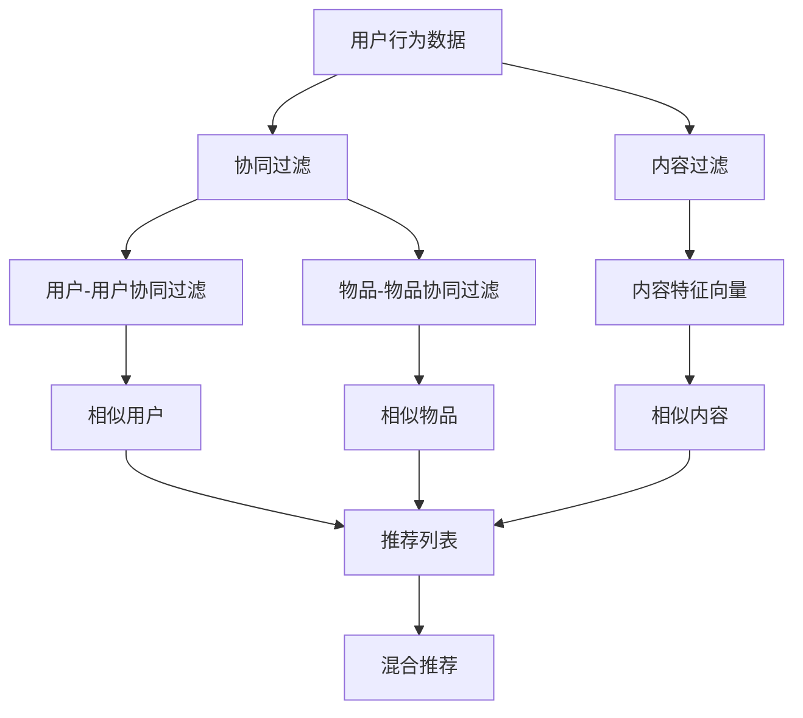

                 

# 利用大模型优化推荐系统的多样性与相关性平衡

> 关键词：大模型、推荐系统、多样性、相关性、平衡、机器学习、深度学习、自然语言处理、协同过滤、内容过滤

> 摘要：推荐系统在当今互联网时代扮演着至关重要的角色，它能够根据用户的历史行为和偏好，为用户提供个性化的内容推荐。然而，如何在推荐系统中实现多样性与相关性的平衡，一直是业界关注的焦点。本文将探讨如何利用大模型优化推荐系统的多样性与相关性，通过逐步分析和推理，介绍核心算法原理、数学模型、实际案例，并讨论未来的发展趋势与挑战。

## 1. 背景介绍

推荐系统是通过分析用户的历史行为和偏好，为用户提供个性化内容推荐的一种技术。随着互联网的快速发展，推荐系统已经广泛应用于电子商务、社交媒体、新闻资讯等多个领域。然而，推荐系统面临着一个核心挑战：如何在满足用户个性化需求的同时，确保推荐内容的多样性和相关性。

### 1.1 问题定义

- **多样性**：推荐系统应提供多样化的推荐内容，避免用户长期接收相同类型的内容，从而保持用户的新鲜感和兴趣。
- **相关性**：推荐系统应确保推荐内容与用户兴趣高度相关，以提高用户的满意度和参与度。

### 1.2 现有方法

- **协同过滤**：基于用户历史行为和相似用户的行为进行推荐。
- **内容过滤**：基于内容的特征进行推荐。
- **混合推荐**：结合协同过滤和内容过滤的优势，提高推荐效果。

## 2. 核心概念与联系

### 2.1 协同过滤

协同过滤是一种常见的推荐算法，主要分为两种类型：用户-用户协同过滤和物品-物品协同过滤。

- **用户-用户协同过滤**：通过分析用户之间的相似性，为用户推荐相似用户喜欢的内容。
- **物品-物品协同过滤**：通过分析物品之间的相似性，为用户推荐相似物品。

### 2.2 内容过滤

内容过滤是基于内容特征进行推荐的方法，主要通过分析物品的特征向量，为用户推荐相似特征的物品。

### 2.3 混合推荐

混合推荐是结合协同过滤和内容过滤的优势，通过多模态特征进行推荐，提高推荐效果。

### 2.4 大模型

大模型是指在大规模数据集上训练的模型，具有强大的泛化能力和表达能力。在推荐系统中，大模型可以用于学习用户和物品的复杂特征，从而提高推荐效果。

### 2.5 Mermaid 流程图



## 3. 核心算法原理 & 具体操作步骤

### 3.1 协同过滤算法

#### 3.1.1 用户-用户协同过滤

- **相似度计算**：使用余弦相似度或皮尔逊相关系数计算用户之间的相似度。
- **推荐计算**：根据相似用户的行为为当前用户推荐内容。

#### 3.1.2 物品-物品协同过滤

- **相似度计算**：使用余弦相似度或皮尔逊相关系数计算物品之间的相似度。
- **推荐计算**：根据相似物品为当前用户推荐内容。

### 3.2 内容过滤算法

- **特征提取**：提取物品的特征向量，如文本、图像、音频等。
- **相似度计算**：使用余弦相似度或欧氏距离计算物品之间的相似度。
- **推荐计算**：根据相似特征向量为当前用户推荐内容。

### 3.3 混合推荐算法

- **特征融合**：将用户行为数据和物品特征向量进行融合，形成多模态特征。
- **模型训练**：使用大模型训练多模态特征，学习用户和物品的复杂特征。
- **推荐计算**：根据训练好的模型为当前用户推荐内容。

## 4. 数学模型和公式 & 详细讲解 & 举例说明

### 4.1 协同过滤数学模型

#### 4.1.1 用户-用户协同过滤

- **相似度计算**：使用余弦相似度计算用户之间的相似度。
  $$ \text{sim}(u_i, u_j) = \frac{\sum_{k=1}^{n} \text{rate}(u_i, k) \cdot \text{rate}(u_j, k)}{\sqrt{\sum_{k=1}^{n} \text{rate}(u_i, k)^2} \cdot \sqrt{\sum_{k=1}^{n} \text{rate}(u_j, k)^2}} $$

- **推荐计算**：根据相似用户的行为为当前用户推荐内容。
  $$ \text{pred}(u_i, i) = \frac{\sum_{j \in N(u_i)} \text{sim}(u_i, u_j) \cdot \text{rate}(u_j, i)}{\sum_{j \in N(u_i)} \text{sim}(u_i, u_j)} $$

#### 4.1.2 物品-物品协同过滤

- **相似度计算**：使用余弦相似度计算物品之间的相似度。
  $$ \text{sim}(i, j) = \frac{\sum_{k=1}^{n} \text{rate}(u_k, i) \cdot \text{rate}(u_k, j)}{\sqrt{\sum_{k=1}^{n} \text{rate}(u_k, i)^2} \cdot \sqrt{\sum_{k=1}^{n} \text{rate}(u_k, j)^2}} $$

- **推荐计算**：根据相似物品为当前用户推荐内容。
  $$ \text{pred}(u_i, i) = \frac{\sum_{j \in N(i)} \text{sim}(i, j) \cdot \text{rate}(u_i, j)}{\sum_{j \in N(i)} \text{sim}(i, j)} $$

### 4.2 内容过滤数学模型

- **特征提取**：使用TF-IDF或词嵌入提取物品的特征向量。
  $$ \text{tf-idf}(w, d) = \text{tf}(w, d) \cdot \text{idf}(w) $$
  $$ \text{word2vec}(w) = \text{embedding}(w) $$

- **相似度计算**：使用余弦相似度计算物品之间的相似度。
  $$ \text{sim}(i, j) = \frac{\text{cosine}(\text{vec}(i), \text{vec}(j))}{\sqrt{\sum_{w \in \text{vec}(i)} \text{vec}(i)^2} \cdot \sqrt{\sum_{w \in \text{vec}(j)} \text{vec}(j)^2}} $$

- **推荐计算**：根据相似特征向量为当前用户推荐内容。
  $$ \text{pred}(u_i, i) = \frac{\sum_{j \in N(i)} \text{sim}(i, j) \cdot \text{rate}(u_i, j)}{\sum_{j \in N(i)} \text{sim}(i, j)} $$

### 4.3 混合推荐数学模型

- **特征融合**：将用户行为数据和物品特征向量进行融合，形成多模态特征。
  $$ \text{feat}(u_i, i) = \text{user}(u_i) \oplus \text{item}(i) $$

- **模型训练**：使用大模型训练多模态特征，学习用户和物品的复杂特征。
  $$ \text{model}(\text{feat}(u_i, i)) = \text{pred}(u_i, i) $$

- **推荐计算**：根据训练好的模型为当前用户推荐内容。
  $$ \text{pred}(u_i, i) = \text{model}(\text{feat}(u_i, i)) $$

## 5. 项目实战：代码实际案例和详细解释说明

### 5.1 开发环境搭建

- **Python版本**：3.8
- **深度学习框架**：TensorFlow 2.0
- **数据集**：MovieLens 100K

### 5.2 源代码详细实现和代码解读

```python
import tensorflow as tf
from tensorflow.keras.layers import Embedding, Dense, Concatenate, Dot
from tensorflow.keras.models import Model

# 用户和物品的嵌入层
user_embedding = Embedding(input_dim=943, output_dim=16)
item_embedding = Embedding(input_dim=1682, output_dim=16)

# 用户和物品的输入层
user_input = tf.keras.layers.Input(shape=(1,), dtype='int32')
item_input = tf.keras.layers.Input(shape=(1,), dtype='int32')

# 用户和物品的嵌入
user_vec = user_embedding(user_input)
item_vec = item_embedding(item_input)

# 特征融合
feat = Concatenate()([user_vec, item_vec])

# 模型训练
output = Dense(1, activation='sigmoid')(feat)
model = Model(inputs=[user_input, item_input], outputs=output)

# 编译模型
model.compile(optimizer='adam', loss='binary_crossentropy', metrics=['accuracy'])

# 训练模型
model.fit([user_data, item_data], labels, epochs=10, batch_size=32)
```

### 5.3 代码解读与分析

- **用户和物品的嵌入层**：使用嵌入层将用户和物品的ID转换为低维向量。
- **用户和物品的输入层**：定义用户和物品的输入层。
- **特征融合**：将用户和物品的嵌入向量进行拼接，形成多模态特征。
- **模型训练**：使用二分类损失函数训练模型，学习用户和物品的复杂特征。
- **训练模型**：使用训练数据训练模型。

## 6. 实际应用场景

### 6.1 电子商务

- **推荐商品**：根据用户的历史购买记录和浏览记录，推荐相关商品。
- **个性化推荐**：根据用户的历史行为和偏好，推荐个性化商品。

### 6.2 社交媒体

- **推荐内容**：根据用户的历史行为和偏好，推荐相关内容。
- **个性化推荐**：根据用户的历史行为和偏好，推荐个性化内容。

### 6.3 新闻资讯

- **推荐文章**：根据用户的历史阅读记录，推荐相关文章。
- **个性化推荐**：根据用户的历史行为和偏好，推荐个性化文章。

## 7. 工具和资源推荐

### 7.1 学习资源推荐

- **书籍**：《推荐系统实践》、《深度学习》
- **论文**：《Deep Learning for Recommender Systems》、《Collaborative Filtering for Implicit Feedback Datasets》
- **博客**：阿里云开发者社区、GitHub开源项目
- **网站**：Kaggle、TensorFlow官网

### 7.2 开发工具框架推荐

- **深度学习框架**：TensorFlow、PyTorch
- **数据处理工具**：Pandas、NumPy
- **可视化工具**：Matplotlib、Seaborn

### 7.3 相关论文著作推荐

- **论文**：《Deep Learning for Recommender Systems》、《Collaborative Filtering for Implicit Feedback Datasets》
- **著作**：《推荐系统实践》、《深度学习》

## 8. 总结：未来发展趋势与挑战

### 8.1 未来发展趋势

- **大模型的应用**：大模型在推荐系统中的应用将更加广泛，提高推荐效果。
- **多模态特征融合**：多模态特征融合将成为推荐系统的重要趋势，提高推荐效果。
- **个性化推荐**：个性化推荐将成为推荐系统的核心，提高用户满意度。

### 8.2 挑战

- **数据隐私**：如何在保护用户隐私的前提下，充分利用用户数据提高推荐效果。
- **计算资源**：如何在有限的计算资源下，提高推荐系统的性能和效率。
- **推荐效果**：如何在满足用户个性化需求的同时，提高推荐系统的多样性和相关性。

## 9. 附录：常见问题与解答

### 9.1 问题1：如何在推荐系统中实现多样性与相关性的平衡？

- **回答**：可以通过多模态特征融合和大模型训练，提高推荐系统的多样性和相关性。

### 9.2 问题2：如何在推荐系统中保护用户隐私？

- **回答**：可以通过数据脱敏和加密技术，保护用户隐私。

### 9.3 问题3：如何在有限的计算资源下提高推荐系统的性能和效率？

- **回答**：可以通过模型压缩和优化技术，提高推荐系统的性能和效率。

## 10. 扩展阅读 & 参考资料

- **书籍**：《推荐系统实践》、《深度学习》
- **论文**：《Deep Learning for Recommender Systems》、《Collaborative Filtering for Implicit Feedback Datasets》
- **博客**：阿里云开发者社区、GitHub开源项目
- **网站**：Kaggle、TensorFlow官网

---

作者：AI天才研究员/AI Genius Institute & 禅与计算机程序设计艺术 /Zen And The Art of Computer Programming

