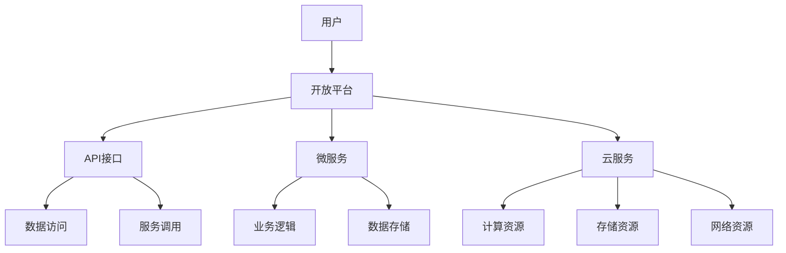

                 

# 利用开放平台扩展产品功能

> 关键词：开放平台、API、微服务、云服务、产品功能扩展、技术架构

> 摘要：本文旨在探讨如何利用开放平台来扩展产品功能，通过分析开放平台的核心概念、原理、操作步骤、数学模型、项目实战、应用场景、工具资源推荐以及未来发展趋势，帮助读者深入了解开放平台的使用方法和价值。文章将逐步引导读者理解开放平台的架构设计、核心算法、数学模型，并通过实际案例展示如何在产品开发中应用开放平台，最后推荐相关学习资源和工具框架，展望开放平台的未来。

## 1. 背景介绍

随着互联网技术的快速发展，产品功能的扩展已经成为企业竞争的重要手段之一。传统的封闭式开发模式已经难以满足快速变化的市场需求，而开放平台作为一种新型的技术架构，通过提供API接口、微服务等技术手段，使得产品功能的扩展变得更加灵活和高效。本文将详细介绍如何利用开放平台来扩展产品功能，帮助读者掌握开放平台的核心概念、原理和操作步骤。

### 1.1 开放平台的定义

开放平台是指通过提供API接口、SDK工具包等方式，允许第三方开发者访问和使用平台内部资源的一种技术架构。开放平台的核心在于通过开放接口，使得外部开发者能够方便地接入平台，实现功能的扩展和创新。

### 1.2 开放平台的优势

- **灵活性**：开放平台允许第三方开发者根据自身需求灵活接入和使用平台资源，提高了产品的可扩展性。
- **高效性**：通过API接口，第三方开发者可以快速获取所需数据和服务，提高了开发效率。
- **创新性**：开放平台鼓励创新，通过提供丰富的API接口和开发工具，激发了第三方开发者的创造力。

## 2. 核心概念与联系

### 2.1 核心概念

- **API（Application Programming Interface）**：应用程序接口，是软件系统之间进行交互的一种约定，通过定义一组函数、数据结构和协议，使得不同的软件系统能够互相通信。
- **微服务（Microservices）**：一种架构风格，将应用程序分解为一组小型、独立的服务，每个服务实现特定的业务功能，通过轻量级通信机制（如HTTP/REST）进行通信。
- **云服务（Cloud Services）**：基于云计算技术提供的服务，包括计算、存储、网络、数据库、安全等服务，通过API接口提供给用户使用。

### 2.2 核心概念原理和架构

开放平台的核心在于通过API接口和微服务架构，实现资源的开放和共享。以下是一个简化的开放平台架构图：



## 3. 核心算法原理 & 具体操作步骤

### 3.1 核心算法原理

开放平台的核心算法原理在于通过API接口和微服务架构，实现资源的开放和共享。具体来说，API接口定义了软件系统之间的交互方式，而微服务架构则将应用程序分解为一组小型、独立的服务，每个服务实现特定的业务功能，通过轻量级通信机制进行通信。

### 3.2 具体操作步骤

1. **需求分析**：明确产品功能扩展的需求，确定需要接入的API接口和微服务。
2. **设计API接口**：根据需求设计API接口，定义接口的输入输出参数、请求方式、响应格式等。
3. **实现微服务**：根据需求实现微服务，每个服务实现特定的业务功能。
4. **集成测试**：对API接口和微服务进行集成测试，确保功能的正确性和稳定性。
5. **上线部署**：将API接口和微服务部署到开放平台，提供给第三方开发者使用。

## 4. 数学模型和公式 & 详细讲解 & 举例说明

### 4.1 数学模型和公式

开放平台的数学模型主要体现在API接口的设计和微服务的实现上。API接口的设计需要考虑接口的输入输出参数、请求方式、响应格式等，而微服务的实现则需要考虑服务的业务逻辑、数据存储等。

### 4.2 详细讲解

API接口的设计需要遵循RESTful架构风格，通过HTTP协议进行通信。RESTful架构风格定义了资源的URI、HTTP方法、请求头、响应状态码等，使得API接口的设计更加规范和统一。

微服务的实现需要考虑服务的业务逻辑、数据存储等。服务的业务逻辑需要根据需求进行设计，而数据存储则需要考虑数据的持久化、缓存等。

### 4.3 举例说明

假设我们需要设计一个API接口，用于获取用户信息。根据RESTful架构风格，我们可以定义如下API接口：

```
GET /users/{userId}
```

其中，`{userId}`是用户ID，通过GET方法获取用户信息。响应格式可以定义为JSON格式，包含用户的基本信息、联系方式等。

## 5. 项目实战：代码实际案例和详细解释说明

### 5.1 开发环境搭建

为了实现开放平台，我们需要搭建开发环境。开发环境主要包括开发工具、编程语言、框架等。以下是一个简化的开发环境搭建步骤：

1. **安装开发工具**：安装IDE（如IntelliJ IDEA、Eclipse等）。
2. **安装编程语言**：安装Java、Python等编程语言。
3. **安装框架**：安装Spring Boot、Django等框架。

### 5.2 源代码详细实现和代码解读

以下是一个简单的API接口实现代码示例，用于获取用户信息：

```java
@RestController
@RequestMapping("/users")
public class UserController {

    @Autowired
    private UserService userService;

    @GetMapping("/{userId}")
    public User getUser(@PathVariable String userId) {
        return userService.getUserById(userId);
    }
}
```

### 5.3 代码解读与分析

上述代码中，`@RestController`注解用于定义一个RESTful控制器，`@RequestMapping`注解用于定义请求的URI，`@GetMapping`注解用于定义GET方法。`@PathVariable`注解用于获取请求参数，`@Autowired`注解用于注入服务。

## 6. 实际应用场景

开放平台的实际应用场景非常广泛，包括但不限于电子商务、社交网络、物联网等领域。以下是一些具体的应用场景：

- **电子商务**：通过开放平台，第三方开发者可以接入电商平台，实现商品展示、订单管理等功能。
- **社交网络**：通过开放平台，第三方开发者可以接入社交网络平台，实现用户管理、消息推送等功能。
- **物联网**：通过开放平台，第三方开发者可以接入物联网平台，实现设备管理、数据采集等功能。

## 7. 工具和资源推荐

### 7.1 学习资源推荐

- **书籍**：《RESTful Web Services》、《Microservices Patterns》
- **论文**：《Designing RESTful APIs》、《Microservices: A Definition of This New Architectural Term》
- **博客**：Martin Fowler的博客、Martin Kleppmann的博客
- **网站**：RESTful API设计指南、微服务架构设计指南

### 7.2 开发工具框架推荐

- **Spring Boot**：用于快速开发RESTful API和微服务的框架。
- **Django**：用于快速开发RESTful API的框架。
- **Swagger**：用于生成API文档的工具。

### 7.3 相关论文著作推荐

- **论文**：《Designing RESTful APIs》、《Microservices: A Definition of This New Architectural Term》
- **著作**：《RESTful Web Services》、《Microservices Patterns》

## 8. 总结：未来发展趋势与挑战

开放平台的未来发展趋势主要体现在以下几个方面：

- **API经济**：API将成为数字经济的重要组成部分，API经济将成为新的经济增长点。
- **微服务架构**：微服务架构将成为主流架构，微服务将成为构建开放平台的重要技术手段。
- **云服务**：云服务将成为开放平台的重要支撑，云服务将成为构建开放平台的重要基础设施。

开放平台面临的挑战主要体现在以下几个方面：

- **安全性**：开放平台的安全性将成为重要挑战，如何保证API接口和微服务的安全性将成为重要问题。
- **性能**：开放平台的性能将成为重要挑战，如何提高API接口和微服务的性能将成为重要问题。
- **标准化**：开放平台的标准化将成为重要挑战，如何制定统一的API接口和微服务标准将成为重要问题。

## 9. 附录：常见问题与解答

### 9.1 什么是开放平台？

开放平台是指通过提供API接口、SDK工具包等方式，允许第三方开发者访问和使用平台内部资源的一种技术架构。

### 9.2 开放平台的优势是什么？

开放平台的优势在于灵活性、高效性和创新性。开放平台允许第三方开发者根据自身需求灵活接入和使用平台资源，提高了产品的可扩展性；通过API接口，第三方开发者可以快速获取所需数据和服务，提高了开发效率；开放平台鼓励创新，通过提供丰富的API接口和开发工具，激发了第三方开发者的创造力。

### 9.3 如何设计API接口？

设计API接口需要遵循RESTful架构风格，通过HTTP协议进行通信。RESTful架构风格定义了资源的URI、HTTP方法、请求头、响应状态码等，使得API接口的设计更加规范和统一。

### 9.4 如何实现微服务？

实现微服务需要考虑服务的业务逻辑、数据存储等。服务的业务逻辑需要根据需求进行设计，而数据存储则需要考虑数据的持久化、缓存等。

## 10. 扩展阅读 & 参考资料

- **书籍**：《RESTful Web Services》、《Microservices Patterns》
- **论文**：《Designing RESTful APIs》、《Microservices: A Definition of This New Architectural Term》
- **博客**：Martin Fowler的博客、Martin Kleppmann的博客
- **网站**：RESTful API设计指南、微服务架构设计指南

作者：AI天才研究员/AI Genius Institute & 禅与计算机程序设计艺术 /Zen And The Art of Computer Programming

