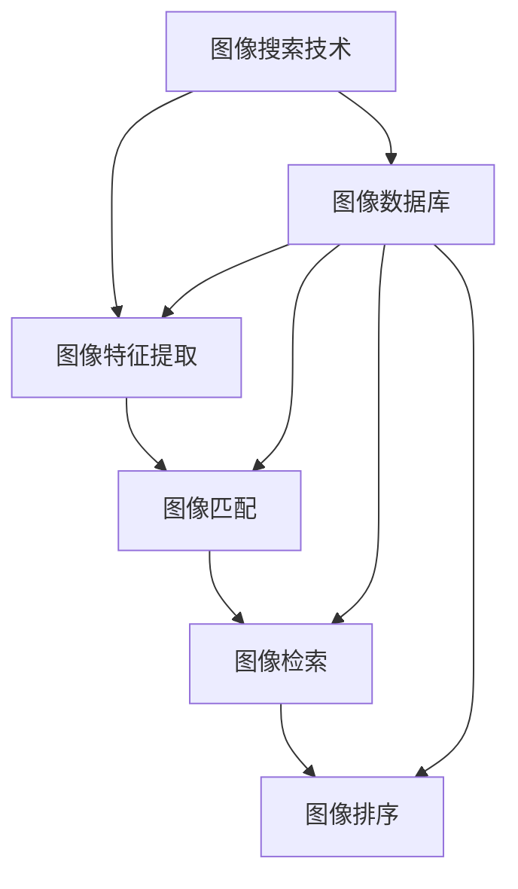

                 

# 图像搜索技术在电商领域的应用：发展趋势与未来

> 关键词：图像搜索，电商应用，深度学习，计算机视觉，推荐系统，用户体验

> 摘要：本文将深入探讨图像搜索技术在电商领域的应用，从背景介绍、核心概念与联系、核心算法原理、数学模型和公式、项目实战、实际应用场景、工具和资源推荐、未来发展趋势与挑战等多个方面进行详细分析。通过本文，读者将能够全面理解图像搜索技术在电商领域的应用现状与未来发展方向，为相关领域的研究和实践提供有价值的参考。

## 1. 背景介绍

随着互联网技术的飞速发展，电子商务已成为人们日常生活的重要组成部分。在电商领域，用户通过搜索商品信息来满足自己的需求。传统的文本搜索方式虽然能够提供一定的便利，但其局限性也日益显现。例如，用户可能无法准确描述商品特征，或者搜索结果与用户需求不匹配。为了解决这些问题，图像搜索技术应运而生。图像搜索技术通过分析和理解图像内容，为用户提供更加直观和准确的商品搜索体验。本文将从图像搜索技术在电商领域的应用出发，探讨其发展趋势与未来。

## 2. 核心概念与联系

### 2.1 图像搜索技术概述

图像搜索技术是指通过图像识别和理解技术，从大量图像数据中检索出与用户需求匹配的图像。其主要应用场景包括商品搜索、图像分类、图像检索等。图像搜索技术的核心在于图像特征提取、图像匹配和图像检索算法。

### 2.2 图像特征提取

图像特征提取是图像搜索技术中的关键步骤之一。图像特征提取的目标是从图像中提取出能够表征图像内容的特征向量。常用的图像特征提取方法包括局部特征提取和全局特征提取。局部特征提取方法如SIFT（Scale-Invariant Feature Transform）、SURF（Speeded-Up Robust Features）等，通过检测图像中的关键点和描述子来提取特征。全局特征提取方法如HOG（Histogram of Oriented Gradients）、LBP（Local Binary Patterns）等，通过计算图像的全局统计特性来提取特征。

### 2.3 图像匹配

图像匹配是图像搜索技术中的另一个关键步骤。图像匹配的目标是将提取出的图像特征与数据库中的图像特征进行匹配，从而找到与用户需求匹配的图像。常用的图像匹配方法包括基于距离度量的方法和基于相似度度量的方法。基于距离度量的方法如欧氏距离、曼哈顿距离等，通过计算特征向量之间的距离来衡量图像之间的相似度。基于相似度度量的方法如余弦相似度、Jaccard相似度等，通过计算特征向量之间的相似度来衡量图像之间的相似度。

### 2.4 图像检索

图像检索是图像搜索技术中的最终目标。图像检索的目标是根据用户输入的查询图像，从大量图像数据中检索出与查询图像匹配的图像。图像检索算法通常包括图像特征提取、图像匹配和图像排序等步骤。图像检索算法的核心在于如何有效地提取图像特征、匹配图像特征和排序检索结果。常用的图像检索算法包括基于内容的图像检索（CBIR，Content-Based Image Retrieval）、基于深度学习的图像检索等。

### 2.5 图像搜索技术流程图



## 3. 核心算法原理 & 具体操作步骤

### 3.1 图像特征提取算法

图像特征提取算法是图像搜索技术中的关键步骤之一。常用的图像特征提取算法包括SIFT、SURF、HOG、LBP等。以SIFT算法为例，其具体操作步骤如下：

1. **关键点检测**：通过检测图像中的关键点来提取特征。关键点检测算法通常包括尺度空间极值检测、非极大值抑制等步骤。
2. **描述子提取**：通过计算关键点周围的梯度方向直方图来提取描述子。描述子提取算法通常包括梯度方向直方图、梯度幅值直方图等步骤。
3. **特征向量生成**：通过组合关键点和描述子来生成特征向量。特征向量生成算法通常包括特征向量归一化、特征向量降维等步骤。

### 3.2 图像匹配算法

图像匹配算法是图像搜索技术中的另一个关键步骤。常用的图像匹配算法包括基于距离度量的方法和基于相似度度量的方法。以基于距离度量的方法为例，其具体操作步骤如下：

1. **特征向量计算**：通过计算图像特征向量来表示图像内容。特征向量计算算法通常包括特征向量归一化、特征向量降维等步骤。
2. **距离度量计算**：通过计算特征向量之间的距离来衡量图像之间的相似度。距离度量计算算法通常包括欧氏距离、曼哈顿距离等步骤。
3. **匹配结果生成**：通过比较特征向量之间的距离来生成匹配结果。匹配结果生成算法通常包括匹配结果排序、匹配结果筛选等步骤。

### 3.3 图像检索算法

图像检索算法是图像搜索技术中的最终目标。常用的图像检索算法包括基于内容的图像检索（CBIR）和基于深度学习的图像检索。以基于深度学习的图像检索为例，其具体操作步骤如下：

1. **图像特征提取**：通过深度学习模型提取图像特征。图像特征提取算法通常包括卷积神经网络（CNN）、循环神经网络（RNN）等步骤。
2. **图像匹配**：通过计算图像特征之间的距离来衡量图像之间的相似度。图像匹配算法通常包括余弦相似度、Jaccard相似度等步骤。
3. **图像排序**：通过比较图像特征之间的距离来生成排序结果。图像排序算法通常包括排序算法、筛选算法等步骤。

## 4. 数学模型和公式 & 详细讲解 & 举例说明

### 4.1 图像特征提取数学模型

图像特征提取数学模型通常包括特征向量生成和特征向量降维等步骤。以SIFT算法为例，其数学模型如下：

1. **特征向量生成**：通过组合关键点和描述子来生成特征向量。特征向量生成公式如下：

    $$ \mathbf{f} = \left[ \mathbf{d}_1, \mathbf{d}_2, \ldots, \mathbf{d}_n \right] $$

    其中，$\mathbf{d}_i$ 表示第 $i$ 个关键点的描述子。

2. **特征向量降维**：通过主成分分析（PCA）等方法对特征向量进行降维。特征向量降维公式如下：

    $$ \mathbf{f}' = \mathbf{W} \mathbf{f} $$

    其中，$\mathbf{W}$ 表示降维矩阵。

### 4.2 图像匹配数学模型

图像匹配数学模型通常包括距离度量计算和匹配结果生成等步骤。以基于距离度量的方法为例，其数学模型如下：

1. **距离度量计算**：通过计算特征向量之间的距离来衡量图像之间的相似度。距离度量计算公式如下：

    $$ d(\mathbf{f}_1, \mathbf{f}_2) = \sqrt{\sum_{i=1}^{n} (f_{1i} - f_{2i})^2} $$

    其中，$\mathbf{f}_1$ 和 $\mathbf{f}_2$ 分别表示两个图像的特征向量。

2. **匹配结果生成**：通过比较特征向量之间的距离来生成匹配结果。匹配结果生成公式如下：

    $$ \mathbf{r} = \arg\min_{\mathbf{f}_2} d(\mathbf{f}_1, \mathbf{f}_2) $$

    其中，$\mathbf{r}$ 表示与 $\mathbf{f}_1$ 匹配的图像特征向量。

### 4.3 图像检索数学模型

图像检索数学模型通常包括图像特征提取、图像匹配和图像排序等步骤。以基于深度学习的图像检索为例，其数学模型如下：

1. **图像特征提取**：通过深度学习模型提取图像特征。图像特征提取公式如下：

    $$ \mathbf{f} = \mathbf{f}(\mathbf{x}) $$

    其中，$\mathbf{x}$ 表示输入图像，$\mathbf{f}(\mathbf{x})$ 表示提取出的图像特征。

2. **图像匹配**：通过计算图像特征之间的距离来衡量图像之间的相似度。图像匹配公式如下：

    $$ d(\mathbf{f}_1, \mathbf{f}_2) = \cos(\mathbf{f}_1, \mathbf{f}_2) $$

    其中，$\cos(\mathbf{f}_1, \mathbf{f}_2)$ 表示 $\mathbf{f}_1$ 和 $\mathbf{f}_2$ 之间的余弦相似度。

3. **图像排序**：通过比较图像特征之间的距离来生成排序结果。图像排序公式如下：

    $$ \mathbf{r} = \arg\min_{\mathbf{f}_2} d(\mathbf{f}_1, \mathbf{f}_2) $$

    其中，$\mathbf{r}$ 表示与 $\mathbf{f}_1$ 匹配的图像特征向量。

## 5. 项目实战：代码实际案例和详细解释说明

### 5.1 开发环境搭建

为了实现图像搜索技术在电商领域的应用，我们需要搭建一个完整的开发环境。开发环境包括操作系统、编程语言、开发工具和依赖库等。以Python为例，其开发环境搭建步骤如下：

1. **操作系统**：选择一个支持Python的主流操作系统，如Windows、macOS或Linux。
2. **编程语言**：选择Python作为开发语言。
3. **开发工具**：选择一个支持Python的集成开发环境（IDE），如PyCharm、VSCode等。
4. **依赖库**：安装必要的依赖库，如NumPy、Pillow、OpenCV等。

### 5.2 源代码详细实现和代码解读

以基于深度学习的图像检索为例，其源代码实现步骤如下：

1. **数据集准备**：准备一个包含大量图像的数据集，如ImageNet、COCO等。
2. **模型训练**：使用深度学习模型对数据集进行训练，提取图像特征。模型训练代码如下：

    ```python
    import torch
    import torchvision.models as models

    # 加载预训练的ResNet模型
    model = models.resnet50(pretrained=True)

    # 删除最后一层全连接层
    model = torch.nn.Sequential(*list(model.children())[:-1])

    # 将模型设置为评估模式
    model.eval()
    ```

3. **图像特征提取**：通过深度学习模型提取图像特征。图像特征提取代码如下：

    ```python
    import torch
    import torchvision.transforms as transforms

    # 定义图像预处理函数
    transform = transforms.Compose([
        transforms.Resize(256),
        transforms.CenterCrop(224),
        transforms.ToTensor(),
        transforms.Normalize(mean=[0.485, 0.456, 0.406], std=[0.229, 0.224, 0.225]),
    ])

    # 加载图像
    image = Image.open('image.jpg')

    # 预处理图像
    image = transform(image)

    # 扩展图像维度
    image = image.unsqueeze(0)

    # 提取图像特征
    with torch.no_grad():
        feature = model(image)
    ```

4. **图像匹配**：通过计算图像特征之间的距离来衡量图像之间的相似度。图像匹配代码如下：

    ```python
    import torch.nn.functional as F

    # 计算余弦相似度
    similarity = F.cosine_similarity(feature1, feature2)
    ```

5. **图像排序**：通过比较图像特征之间的距离来生成排序结果。图像排序代码如下：

    ```python
    import torch

    # 计算所有图像特征之间的距离
    distances = torch.cdist(features, features)

    # 生成排序结果
    sorted_indices = torch.argsort(distances, dim=1)
    ```

### 5.3 代码解读与分析

通过上述代码实现，我们可以看到图像搜索技术在电商领域的应用。首先，我们需要准备一个包含大量图像的数据集，并使用深度学习模型对数据集进行训练，提取图像特征。然后，我们可以通过计算图像特征之间的距离来衡量图像之间的相似度，并生成排序结果。最后，我们可以通过比较图像特征之间的距离来生成匹配结果。

## 6. 实际应用场景

图像搜索技术在电商领域的实际应用场景非常广泛。例如，用户可以通过上传一张商品图片来搜索相似的商品，或者通过搜索关键词来找到相关商品。此外，图像搜索技术还可以应用于商品推荐、商品分类、商品搜索等场景。通过图像搜索技术，用户可以更加直观和准确地找到自己需要的商品，从而提高用户体验和满意度。

## 7. 工具和资源推荐

### 7.1 学习资源推荐

1. **书籍**：《计算机视觉：算法与应用》（Computer Vision: Algorithms and Applications）和《深度学习》（Deep Learning）。
2. **论文**：《基于深度学习的图像检索》（Image Retrieval with Deep Learning）和《基于内容的图像检索》（Content-Based Image Retrieval）。
3. **博客**：《图像搜索技术在电商领域的应用》（Image Search Technology in E-commerce）和《深度学习在图像检索中的应用》（Application of Deep Learning in Image Retrieval）。
4. **网站**：ImageNet、COCO等图像数据集网站。

### 7.2 开发工具框架推荐

1. **编程语言**：Python。
2. **开发工具**：PyCharm、VSCode等。
3. **依赖库**：NumPy、Pillow、OpenCV、torch等。

### 7.3 相关论文著作推荐

1. **论文**：《基于深度学习的图像检索》（Image Retrieval with Deep Learning）和《基于内容的图像检索》（Content-Based Image Retrieval）。
2. **著作**：《计算机视觉：算法与应用》（Computer Vision: Algorithms and Applications）和《深度学习》（Deep Learning）。

## 8. 总结：未来发展趋势与挑战

图像搜索技术在电商领域的应用前景广阔，未来的发展趋势主要体现在以下几个方面：

1. **深度学习技术的进一步应用**：随着深度学习技术的不断发展，图像搜索技术将更加准确和高效。
2. **多模态数据的融合**：图像搜索技术将与文本、语音等多模态数据进行融合，提供更加丰富和准确的搜索结果。
3. **个性化推荐系统的结合**：图像搜索技术将与个性化推荐系统进行结合，为用户提供更加个性化的搜索体验。
4. **用户体验的提升**：图像搜索技术将不断提升用户体验，提高用户满意度和忠诚度。

然而，图像搜索技术在电商领域的应用也面临着一些挑战，主要包括：

1. **数据隐私保护**：图像搜索技术需要处理大量的用户数据，如何保护用户隐私成为一个重要问题。
2. **计算资源的消耗**：图像搜索技术需要大量的计算资源，如何降低计算资源的消耗成为一个重要问题。
3. **算法的鲁棒性**：图像搜索技术需要具备较强的鲁棒性，能够应对各种复杂场景和挑战。

## 9. 附录：常见问题与解答

### 9.1 问题1：如何处理图像数据集？

**解答**：处理图像数据集的方法包括数据清洗、数据增强、数据归一化等。数据清洗可以去除无效和重复的数据；数据增强可以增加数据量和多样性；数据归一化可以提高模型的泛化能力。

### 9.2 问题2：如何提高图像搜索技术的准确性？

**解答**：提高图像搜索技术的准确性的方法包括改进特征提取算法、优化匹配算法、引入多模态数据等。改进特征提取算法可以提高特征的表示能力；优化匹配算法可以提高匹配的准确性；引入多模态数据可以提高搜索结果的多样性。

### 9.3 问题3：如何保护用户隐私？

**解答**：保护用户隐私的方法包括数据脱敏、数据加密、数据匿名化等。数据脱敏可以去除敏感信息；数据加密可以保护数据的安全性；数据匿名化可以保护用户的隐私。

## 10. 扩展阅读 & 参考资料

1. **书籍**：《计算机视觉：算法与应用》（Computer Vision: Algorithms and Applications）和《深度学习》（Deep Learning）。
2. **论文**：《基于深度学习的图像检索》（Image Retrieval with Deep Learning）和《基于内容的图像检索》（Content-Based Image Retrieval）。
3. **博客**：《图像搜索技术在电商领域的应用》（Image Search Technology in E-commerce）和《深度学习在图像检索中的应用》（Application of Deep Learning in Image Retrieval）。
4. **网站**：ImageNet、COCO等图像数据集网站。

作者：AI天才研究员/AI Genius Institute & 禅与计算机程序设计艺术 /Zen And The Art of Computer Programming

