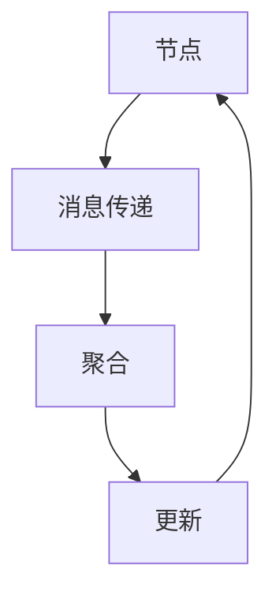

                 

# 图神经网络在社交网络分析中的应用

> 关键词：图神经网络, 社交网络, 社交分析, 社交关系, 社交行为, 社交影响力, 社交网络分析

> 摘要：本文将深入探讨图神经网络（GNN）在社交网络分析中的应用。通过逐步分析和推理，我们将介绍图神经网络的基本概念、核心算法原理、数学模型、实际案例，以及其在社交网络分析中的具体应用。此外，我们还将讨论未来的发展趋势和挑战，并提供学习资源和开发工具推荐。

## 1. 背景介绍

社交网络已经成为人们日常生活中不可或缺的一部分。从Facebook、Twitter到LinkedIn，这些社交平台不仅改变了人们的交流方式，还为社交网络分析提供了丰富的数据资源。社交网络分析旨在从社交网络中提取有价值的信息，帮助我们更好地理解社交行为、社交关系和社交影响力。然而，传统的社交网络分析方法往往难以处理复杂的关系结构和非线性特征，而图神经网络（GNN）则能够有效地解决这些问题。

## 2. 核心概念与联系

### 2.1 图的基本概念

图是由节点（Vertex）和边（Edge）组成的数学结构。节点代表实体（如用户、帖子），边代表实体之间的关系（如关注、点赞）。图神经网络通过学习图结构中的节点特征，来预测节点属性或边属性。

### 2.2 图神经网络的基本原理

图神经网络是一种深度学习模型，用于处理图结构数据。GNN的核心思想是通过迭代地传播节点特征，使其能够捕捉到图中的局部和全局结构信息。GNN的主要步骤包括消息传递、聚合和更新。

### 2.3 图神经网络的架构

图神经网络的架构可以分为以下几部分：

- **消息传递（Message Passing）**：节点通过边向邻居节点发送消息。
- **聚合（Aggregation）**：节点收集邻居节点的消息，并进行聚合操作。
- **更新（Update）**：节点根据聚合后的消息更新自己的特征。

以下是图神经网络的Mermaid流程图：



## 3. 核心算法原理 & 具体操作步骤

### 3.1 消息传递

消息传递是图神经网络中最基本的操作。每个节点向其邻居节点发送消息，消息通常包含节点的特征信息。消息传递的具体步骤如下：

1. **初始化**：每个节点初始化其特征向量。
2. **消息传递**：每个节点向其邻居节点发送消息。
3. **聚合**：每个节点收集邻居节点的消息，并进行聚合操作。
4. **更新**：每个节点根据聚合后的消息更新自己的特征向量。

### 3.2 聚合操作

聚合操作是消息传递后的关键步骤。常见的聚合操作包括：

- **平均聚合**：将邻居节点的消息取平均值。
- **加权平均聚合**：根据边的权重进行加权平均。
- **池化操作**：通过池化操作减少节点特征的维度。

### 3.3 更新操作

更新操作是图神经网络的核心步骤。常见的更新操作包括：

- **线性变换**：通过线性变换更新节点特征。
- **非线性变换**：通过非线性激活函数（如ReLU）更新节点特征。
- **归一化**：通过归一化操作确保节点特征的稳定性。

## 4. 数学模型和公式 & 详细讲解 & 举例说明

### 4.1 消息传递公式

消息传递公式可以表示为：

$$
h_i^{(l+1)} = \sigma \left( W \cdot \left( \sum_{j \in \mathcal{N}(i)} h_j^{(l)} \cdot A_{ij} \right) + b \right)
$$

其中，$h_i^{(l)}$ 表示第 $l$ 层节点 $i$ 的特征向量，$W$ 和 $b$ 分别表示线性变换的权重和偏置，$\sigma$ 表示激活函数，$\mathcal{N}(i)$ 表示节点 $i$ 的邻居节点集合，$A_{ij}$ 表示节点 $i$ 和节点 $j$ 之间的边权重。

### 4.2 聚合操作公式

常见的聚合操作公式包括：

- **平均聚合**：

  $$
  h_i^{(l+1)} = \sigma \left( W \cdot \left( \frac{1}{|\mathcal{N}(i)|} \sum_{j \in \mathcal{N}(i)} h_j^{(l)} \cdot A_{ij} \right) + b \right)
  $$

- **加权平均聚合**：

  $$
  h_i^{(l+1)} = \sigma \left( W \cdot \left( \sum_{j \in \mathcal{N}(i)} h_j^{(l)} \cdot A_{ij} \right) + b \right)
  $$

### 4.3 更新操作公式

常见的更新操作公式包括：

- **线性变换**：

  $$
  h_i^{(l+1)} = W \cdot h_i^{(l)} + b
  $$

- **非线性变换**：

  $$
  h_i^{(l+1)} = \sigma \left( W \cdot h_i^{(l)} + b \right)
  $$

- **归一化**：

  $$
  h_i^{(l+1)} = \frac{h_i^{(l+1)}}{\| h_i^{(l+1)} \|_2}
  $$

## 5. 项目实战：代码实际案例和详细解释说明

### 5.1 开发环境搭建

为了实现图神经网络，我们需要安装以下库：

- **PyTorch**：深度学习框架
- **DGL**：图神经网络库

安装步骤如下：

```bash
pip install torch dgl
```

### 5.2 源代码详细实现和代码解读

以下是一个简单的图神经网络实现示例：

```python
import torch
import dgl
import torch.nn as nn
import torch.nn.functional as F

class GraphConvolution(nn.Module):
    def __init__(self, in_features, out_features):
        super(GraphConvolution, self).__init__()
        self.weight = nn.Parameter(torch.FloatTensor(in_features, out_features))
        self.bias = nn.Parameter(torch.FloatTensor(out_features))
        self.reset_parameters()

    def reset_parameters(self):
        stdv = 1. / math.sqrt(self.weight.size(1))
        self.weight.data.uniform_(-stdv, stdv)
        if self.bias is not None:
            self.bias.data.uniform_(-stdv, stdv)

    def forward(self, input, adj):
        support = torch.mm(input, self.weight)
        output = torch.spmm(adj, support)
        if self.bias is not None:
            return output + self.bias
        else:
            return output

class GCN(nn.Module):
    def __init__(self, in_features, hidden_features, out_features):
        super(GCN, self).__init__()
        self.gc1 = GraphConvolution(in_features, hidden_features)
        self.gc2 = GraphConvolution(hidden_features, out_features)

    def forward(self, g, features):
        h = F.relu(self.gc1(g, features))
        h = self.gc2(g, h)
        return h

# 创建图
g = dgl.graph(([0, 1, 2, 3, 4, 5], [1, 2, 3, 4, 5, 0]))
features = torch.FloatTensor([[1], [2], [3], [4], [5], [6]])

# 创建模型
model = GCN(1, 16, 1)

# 训练模型
optimizer = torch.optim.Adam(model.parameters(), lr=0.01, weight_decay=5e-4)
loss_fn = nn.MSELoss()

for epoch in range(200):
    model.train()
    optimizer.zero_grad()
    output = model(g, features)
    loss = loss_fn(output, g.ndata['label'])
    loss.backward()
    optimizer.step()

# 预测
model.eval()
output = model(g, features)
print(output)
```

### 5.3 代码解读与分析

- **GraphConvolution类**：定义了一个图卷积层，用于实现消息传递、聚合和更新操作。
- **GCN类**：定义了一个图神经网络模型，包含两个图卷积层。
- **创建图**：使用DGL库创建一个简单的图结构。
- **训练模型**：使用PyTorch框架训练图神经网络模型。
- **预测**：使用训练好的模型进行预测。

## 6. 实际应用场景

图神经网络在社交网络分析中的应用非常广泛，包括：

- **社交影响力分析**：通过分析用户之间的关系，预测用户的社交影响力。
- **社交行为预测**：预测用户的行为，如点赞、评论等。
- **社交网络推荐**：根据用户的社交关系，推荐相关的用户或内容。

## 7. 工具和资源推荐

### 7.1 学习资源推荐

- **书籍**：《图神经网络：原理与应用》
- **论文**：《Graph Neural Networks: A Review of Methods and Applications》
- **博客**：阿里云开发者社区
- **网站**：DGL官网

### 7.2 开发工具框架推荐

- **PyTorch**：深度学习框架
- **DGL**：图神经网络库

### 7.3 相关论文著作推荐

- **论文**：《Semi-Supervised Classification with Graph Convolutional Networks》
- **著作**：《Deep Learning with Graphs》

## 8. 总结：未来发展趋势与挑战

图神经网络在社交网络分析中的应用前景广阔，但仍然面临一些挑战：

- **计算复杂性**：图神经网络的计算复杂性较高，需要高效的算法和硬件支持。
- **数据隐私**：社交网络数据涉及用户隐私，需要保护用户数据的安全。
- **模型泛化能力**：如何提高图神经网络的泛化能力，使其能够更好地适应不同的社交网络场景。

## 9. 附录：常见问题与解答

### 9.1 问题：图神经网络与传统机器学习的区别是什么？

**解答**：图神经网络与传统机器学习的主要区别在于处理数据的结构。传统机器学习通常处理的是结构化数据，如表格数据；而图神经网络处理的是图结构数据，能够更好地捕捉节点之间的关系。

### 9.2 问题：如何提高图神经网络的计算效率？

**解答**：可以通过以下方法提高图神经网络的计算效率：

- **稀疏矩阵运算**：使用稀疏矩阵进行计算，减少不必要的计算。
- **硬件加速**：使用GPU进行并行计算，提高计算速度。
- **模型剪枝**：通过剪枝减少模型的复杂性，降低计算成本。

## 10. 扩展阅读 & 参考资料

- **论文**：《Graph Neural Networks: A Review of Methods and Applications》
- **书籍**：《图神经网络：原理与应用》
- **网站**：DGL官网

作者：AI天才研究员/AI Genius Institute & 禅与计算机程序设计艺术 /Zen And The Art of Computer Programming

