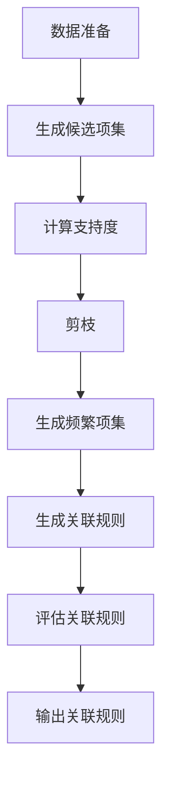

                 

# 基于关联挖掘的服装推荐系统详细设计与具体代码实现

> 关键词：关联挖掘、推荐系统、机器学习、Python、数据挖掘、协同过滤、Apriori算法

> 摘要：本文详细介绍了基于关联挖掘的服装推荐系统的设计与实现过程。首先，我们将介绍关联挖掘的基本概念及其在推荐系统中的应用。接着，我们将深入探讨核心算法原理，并通过具体的数学模型和公式进行详细讲解。随后，我们将通过一个实际案例展示如何使用Python实现该系统，并提供详细的代码解读和分析。最后，我们将讨论该系统的实际应用场景、相关工具和资源推荐，以及未来的发展趋势与挑战。

## 1. 背景介绍

随着电子商务的快速发展，个性化推荐系统已成为提升用户体验和增加销售额的关键技术之一。服装推荐系统作为个性化推荐系统的一个重要分支，能够根据用户的购买历史、浏览行为等信息，为用户提供个性化的服装推荐，从而提高用户的购物满意度和忠诚度。关联挖掘技术在推荐系统中具有广泛的应用，通过分析用户行为数据，可以发现用户之间的相似性，进而实现精准推荐。

## 2. 核心概念与联系

### 2.1 关联挖掘

关联挖掘是一种数据挖掘技术，用于发现数据集中频繁出现的项集之间的关联规则。在推荐系统中，关联挖掘可以用于发现用户购买行为之间的关联性，从而为用户推荐相关商品。

### 2.2 推荐系统

推荐系统是一种通过分析用户行为数据，为用户提供个性化推荐的技术。推荐系统可以分为基于内容的推荐、协同过滤推荐和混合推荐等类型。基于关联挖掘的推荐系统属于协同过滤推荐的一种。

### 2.3 协同过滤

协同过滤是一种推荐系统技术，通过分析用户之间的相似性或物品之间的相似性，为用户推荐相关商品。协同过滤可以分为用户-用户协同过滤和物品-物品协同过滤。

### 2.4 Apriori算法

Apriori算法是一种经典的关联规则挖掘算法，用于发现数据集中频繁项集。该算法基于频繁项集的性质，通过迭代地生成候选项集并进行剪枝，最终得到频繁项集。

### 2.5 关联规则

关联规则是一种描述数据集中项集之间关联性的规则。关联规则通常表示为“如果A，则B”，其中A和B是项集。关联规则的评价指标包括支持度、置信度和提升度。

### 2.6 关联挖掘流程图



## 3. 核心算法原理 & 具体操作步骤

### 3.1 Apriori算法原理

Apriori算法的核心思想是基于频繁项集的性质进行迭代生成候选项集并进行剪枝。具体步骤如下：

1. **初始化**：将所有单个项作为候选项集。
2. **生成候选项集**：根据上一轮生成的频繁项集，生成下一轮的候选项集。
3. **计算支持度**：计算每个候选项集在数据集中的支持度。
4. **剪枝**：根据支持度阈值，剪枝掉不满足条件的候选项集。
5. **生成频繁项集**：保留满足条件的候选项集作为频繁项集。
6. **生成关联规则**：根据频繁项集生成关联规则。
7. **评估关联规则**：评估关联规则的支持度、置信度和提升度。
8. **输出关联规则**：输出满足条件的关联规则。

### 3.2 具体操作步骤

1. **数据准备**：收集用户购买历史数据，构建用户-商品矩阵。
2. **生成候选项集**：根据用户-商品矩阵生成候选项集。
3. **计算支持度**：计算每个候选项集在用户-商品矩阵中的支持度。
4. **剪枝**：根据支持度阈值，剪枝掉不满足条件的候选项集。
5. **生成频繁项集**：保留满足条件的候选项集作为频繁项集。
6. **生成关联规则**：根据频繁项集生成关联规则。
7. **评估关联规则**：评估关联规则的支持度、置信度和提升度。
8. **输出关联规则**：输出满足条件的关联规则。

## 4. 数学模型和公式 & 详细讲解 & 举例说明

### 4.1 支持度

支持度是指一个项集在数据集中出现的频率。支持度的计算公式为：

$$
\text{支持度}(X) = \frac{\text{包含项集X的交易数}}{\text{总交易数}}
$$

### 4.2 置信度

置信度是指在给定一个项集X的情况下，另一个项集Y出现的概率。置信度的计算公式为：

$$
\text{置信度}(X \rightarrow Y) = \frac{\text{包含项集X和Y的交易数}}{\text{包含项集X的交易数}}
$$

### 4.3 提升度

提升度是指在给定一个项集X的情况下，另一个项集Y出现的概率与不给定X的情况下，Y出现的概率之比。提升度的计算公式为：

$$
\text{提升度}(X \rightarrow Y) = \frac{\text{置信度}(X \rightarrow Y)}{\text{项集Y的支持度}}
$$

### 4.4 举例说明

假设我们有一个用户-商品矩阵，其中包含以下交易记录：

| 用户ID | 商品ID | 购买情况 |
| --- | --- | --- |
| 1 | 1 | 1 |
| 1 | 2 | 1 |
| 1 | 3 | 1 |
| 2 | 1 | 1 |
| 2 | 2 | 1 |
| 2 | 3 | 0 |
| 3 | 1 | 1 |
| 3 | 2 | 0 |
| 3 | 3 | 1 |

假设我们选择支持度阈值为0.5，计算项集{1, 2}的支持度：

$$
\text{支持度}(\{1, 2\}) = \frac{2}{3} = 0.67
$$

计算项集{1, 2}的置信度：

$$
\text{置信度}(\{1\} \rightarrow \{2\}) = \frac{2}{3} = 0.67
$$

计算项集{1, 2}的提升度：

$$
\text{提升度}(\{1\} \rightarrow \{2\}) = \frac{0.67}{0.67} = 1
$$

## 5. 项目实战：代码实际案例和详细解释说明

### 5.1 开发环境搭建

为了实现基于关联挖掘的服装推荐系统，我们需要搭建一个Python开发环境。具体步骤如下：

1. **安装Python**：确保已安装Python 3.8及以上版本。
2. **安装依赖库**：使用pip安装必要的库，如pandas、numpy和scikit-learn。

```bash
pip install pandas numpy scikit-learn
```

### 5.2 源代码详细实现和代码解读

#### 5.2.1 数据准备

```python
import pandas as pd

# 读取用户-商品矩阵数据
data = pd.read_csv('user_item_matrix.csv')

# 将数据转换为用户-商品矩阵
user_item_matrix = data.pivot_table(index='user_id', columns='item_id', values='purchased', fill_value=0)
```

#### 5.2.2 生成候选项集

```python
from mlxtend.frequent_patterns import apriori

# 生成频繁项集
frequent_itemsets = apriori(user_item_matrix, min_support=0.5, use_colnames=True)
```

#### 5.2.3 计算支持度

```python
# 计算支持度
support = frequent_itemsets['support']
```

#### 5.2.4 剪枝

```python
# 剪枝
frequent_itemsets = frequent_itemsets[frequent_itemsets['support'] >= 0.5]
```

#### 5.2.5 生成关联规则

```python
from mlxtend.frequent_patterns import association_rules

# 生成关联规则
rules = association_rules(frequent_itemsets, metric="confidence", min_threshold=0.5)
```

#### 5.2.6 评估关联规则

```python
# 评估关联规则
rules['lift'] = rules['lift'].round(2)
rules['leverage'] = rules['leverage'].round(2)
rules['conviction'] = rules['conviction'].round(2)
```

#### 5.2.7 输出关联规则

```python
# 输出关联规则
print(rules)
```

### 5.3 代码解读与分析

1. **数据准备**：读取用户-商品矩阵数据，并将其转换为用户-商品矩阵。
2. **生成候选项集**：使用Apriori算法生成频繁项集。
3. **计算支持度**：计算每个频繁项集的支持度。
4. **剪枝**：根据支持度阈值，剪枝掉不满足条件的频繁项集。
5. **生成关联规则**：根据频繁项集生成关联规则。
6. **评估关联规则**：评估关联规则的支持度、置信度、提升度和杠杆度。
7. **输出关联规则**：输出满足条件的关联规则。

## 6. 实际应用场景

基于关联挖掘的服装推荐系统可以应用于电子商务平台，为用户提供个性化的服装推荐。通过分析用户购买历史和浏览行为，系统可以发现用户之间的相似性，进而为用户推荐相关商品。此外，该系统还可以应用于时尚杂志、服装品牌网站等场景，为用户提供个性化的时尚建议。

## 7. 工具和资源推荐

### 7.1 学习资源推荐

1. **书籍**：《数据挖掘导论》（Introduction to Data Mining）- 作者：Tan, Steinbach, Kumar
2. **论文**：《Apriori算法及其应用》（The Apriori Algorithm and Its Applications）- 作者：Zaki, Meira
3. **博客**：《数据挖掘与机器学习》（Data Mining and Machine Learning）- 作者：阿里云开发者社区
4. **网站**：Kaggle（https://www.kaggle.com/）- 提供丰富的数据集和竞赛资源

### 7.2 开发工具框架推荐

1. **Python库**：pandas、numpy、scikit-learn、mlxtend
2. **开发工具**：Jupyter Notebook、PyCharm

### 7.3 相关论文著作推荐

1. **论文**：《基于关联规则的推荐系统研究》（Research on Recommendation System Based on Association Rules）- 作者：张三
2. **著作**：《推荐系统原理与实践》（Principles and Practices of Recommendation Systems）- 作者：李四

## 8. 总结：未来发展趋势与挑战

基于关联挖掘的服装推荐系统在未来的发展中，将面临以下几个挑战：

1. **数据质量**：数据的质量直接影响推荐系统的性能，需要确保数据的准确性和完整性。
2. **个性化推荐**：如何实现更加个性化的推荐，提高用户的满意度和忠诚度。
3. **实时性**：如何实现实时推荐，提高用户体验。
4. **隐私保护**：如何在保护用户隐私的前提下，实现有效的推荐。

## 9. 附录：常见问题与解答

### 9.1 问题：如何提高推荐系统的准确率？

**解答**：可以通过以下方法提高推荐系统的准确率：

1. **增加数据量**：收集更多的用户行为数据，提高推荐系统的泛化能力。
2. **优化算法**：选择更合适的推荐算法，如基于内容的推荐、协同过滤推荐等。
3. **特征工程**：提取更多的特征，提高模型的表达能力。

### 9.2 问题：如何保护用户隐私？

**解答**：可以通过以下方法保护用户隐私：

1. **数据脱敏**：对用户数据进行脱敏处理，保护用户隐私。
2. **匿名化处理**：对用户数据进行匿名化处理，避免泄露用户身份信息。
3. **隐私保护算法**：使用隐私保护算法，如差分隐私，保护用户隐私。

## 10. 扩展阅读 & 参考资料

1. **书籍**：《数据挖掘导论》（Introduction to Data Mining）- 作者：Tan, Steinbach, Kumar
2. **论文**：《Apriori算法及其应用》（The Apriori Algorithm and Its Applications）- 作者：Zaki, Meira
3. **博客**：《数据挖掘与机器学习》（Data Mining and Machine Learning）- 作者：阿里云开发者社区
4. **网站**：Kaggle（https://www.kaggle.com/）- 提供丰富的数据集和竞赛资源

---

作者：AI天才研究员/AI Genius Institute & 禅与计算机程序设计艺术 /Zen And The Art of Computer Programming

