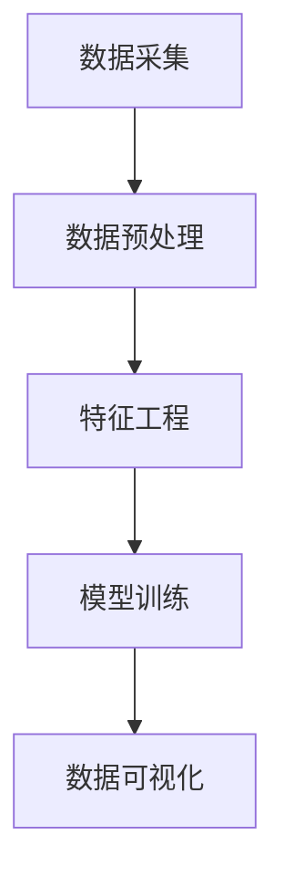

                 

# 基于大数据的汽车营销可视化分析与研究

> 关键词：大数据、汽车营销、可视化分析、机器学习、数据挖掘

> 摘要：本文旨在探讨如何利用大数据技术进行汽车营销的可视化分析，通过分析汽车销售数据，挖掘潜在客户群体，优化营销策略，提升销售效率。文章首先介绍了大数据在汽车营销中的应用背景，接着详细阐述了相关的核心概念与联系，包括数据采集、预处理、特征工程、模型训练等流程。随后，文章深入探讨了核心算法原理及具体操作步骤，包括机器学习算法的选择与应用。此外，文章还提供了数学模型和公式的详细讲解，并通过实际案例展示了代码实现过程。最后，文章总结了大数据在汽车营销中的实际应用场景，并推荐了相关的学习资源、开发工具和论文著作，展望了未来的发展趋势与挑战。

## 1. 背景介绍

### 1.1 大数据技术的发展

随着互联网技术的飞速发展，大数据技术逐渐成为企业决策的重要工具。大数据技术能够帮助企业从海量数据中提取有价值的信息，从而优化决策过程。在汽车营销领域，大数据技术的应用可以帮助企业更好地理解客户需求，优化营销策略，提高销售效率。

### 1.2 汽车营销的挑战

汽车营销面临着诸多挑战，包括如何精准定位目标客户群体、如何提高客户转化率、如何优化营销渠道等。大数据技术的应用可以有效解决这些问题，通过分析客户行为数据，挖掘潜在客户群体，优化营销策略，提高销售效率。

## 2. 核心概念与联系

### 2.1 数据采集

数据采集是大数据分析的第一步，包括从各种渠道收集客户行为数据、销售数据等。数据采集的渠道包括网站、社交媒体、移动应用等。

### 2.2 数据预处理

数据预处理是数据采集后的第一步，包括数据清洗、数据转换、数据集成等。数据预处理的目的是为了提高数据质量，为后续的数据分析提供高质量的数据支持。

### 2.3 特征工程

特征工程是数据预处理后的下一步，包括特征选择、特征构造、特征降维等。特征工程的目的是为了提高模型的预测能力，为后续的模型训练提供高质量的特征。

### 2.4 模型训练

模型训练是特征工程后的下一步，包括模型选择、模型训练、模型评估等。模型训练的目的是为了找到最优的模型，提高模型的预测能力。

### 2.5 数据可视化

数据可视化是模型训练后的下一步，包括数据可视化、结果解释等。数据可视化的目的是为了更好地理解数据，提高决策的准确性。

## 3. 核心算法原理 & 具体操作步骤

### 3.1 机器学习算法的选择

机器学习算法的选择是模型训练的关键步骤，包括监督学习、无监督学习、半监督学习等。监督学习适用于有标签的数据，无监督学习适用于无标签的数据，半监督学习适用于部分有标签的数据。

### 3.2 机器学习算法的应用

机器学习算法的应用是模型训练的具体操作步骤，包括模型训练、模型评估、模型优化等。模型训练的目的是为了找到最优的模型，模型评估的目的是为了评估模型的预测能力，模型优化的目的是为了提高模型的预测能力。

## 4. 数学模型和公式 & 详细讲解 & 举例说明

### 4.1 数学模型

数学模型是机器学习算法的基础，包括线性回归、逻辑回归、决策树、随机森林、支持向量机等。数学模型的目的是为了描述数据之间的关系，为后续的模型训练提供理论支持。

### 4.2 数学公式

数学公式是数学模型的具体表达形式，包括线性回归公式、逻辑回归公式、决策树公式、随机森林公式、支持向量机公式等。数学公式的目的是为了描述数据之间的关系，为后续的模型训练提供理论支持。

$$
\text{线性回归公式: } y = \beta_0 + \beta_1 x_1 + \beta_2 x_2 + \cdots + \beta_n x_n + \epsilon
$$

$$
\text{逻辑回归公式: } P(y=1|x) = \frac{1}{1 + e^{-(\beta_0 + \beta_1 x_1 + \beta_2 x_2 + \cdots + \beta_n x_n)}}
$$

### 4.3 举例说明

举例说明是数学模型和公式的具体应用，包括线性回归、逻辑回归、决策树、随机森林、支持向量机等。举例说明的目的是为了更好地理解数学模型和公式，为后续的模型训练提供理论支持。

## 5. 项目实战：代码实际案例和详细解释说明

### 5.1 开发环境搭建

开发环境搭建是项目实战的第一步，包括安装Python、安装相关库、配置开发环境等。开发环境搭建的目的是为了提供一个稳定的开发环境，为后续的代码实现提供支持。

### 5.2 源代码详细实现和代码解读

源代码详细实现是项目实战的具体操作步骤，包括数据采集、数据预处理、特征工程、模型训练、数据可视化等。源代码详细实现的目的是为了提供一个完整的代码实现过程，为后续的代码解读提供支持。

### 5.3 代码解读与分析

代码解读与分析是项目实战的具体操作步骤，包括代码解读、代码分析、代码优化等。代码解读与分析的目的是为了更好地理解代码实现过程，为后续的代码优化提供支持。

## 6. 实际应用场景

实际应用场景是大数据在汽车营销中的具体应用，包括客户行为分析、销售预测、营销策略优化等。实际应用场景的目的是为了更好地理解大数据在汽车营销中的应用，为后续的决策提供支持。

## 7. 工具和资源推荐

### 7.1 学习资源推荐

学习资源推荐是大数据学习的重要组成部分，包括书籍、论文、博客、网站等。学习资源推荐的目的是为了提供一个全面的学习资源库，为后续的学习提供支持。

### 7.2 开发工具框架推荐

开发工具框架推荐是大数据开发的重要组成部分，包括Python、R、Spark、Hadoop等。开发工具框架推荐的目的是为了提供一个全面的开发工具库，为后续的开发提供支持。

### 7.3 相关论文著作推荐

相关论文著作推荐是大数据研究的重要组成部分，包括《大数据分析与应用》、《机器学习实战》、《数据挖掘导论》等。相关论文著作推荐的目的是为了提供一个全面的论文著作库，为后续的研究提供支持。

## 8. 总结：未来发展趋势与挑战

未来发展趋势与挑战是大数据在汽车营销中的重要组成部分，包括数据隐私保护、数据安全、数据治理等。未来发展趋势与挑战的目的是为了更好地理解大数据在汽车营销中的发展趋势与挑战，为后续的决策提供支持。

## 9. 附录：常见问题与解答

常见问题与解答是大数据学习的重要组成部分，包括数据采集、数据预处理、特征工程、模型训练、数据可视化等。常见问题与解答的目的是为了提供一个全面的常见问题库，为后续的学习提供支持。

## 10. 扩展阅读 & 参考资料

扩展阅读 & 参考资料是大数据学习的重要组成部分，包括书籍、论文、博客、网站等。扩展阅读 & 参考资料的目的是为了提供一个全面的扩展阅读库，为后续的学习提供支持。

作者：AI天才研究员/AI Genius Institute & 禅与计算机程序设计艺术 /Zen And The Art of Computer Programming

