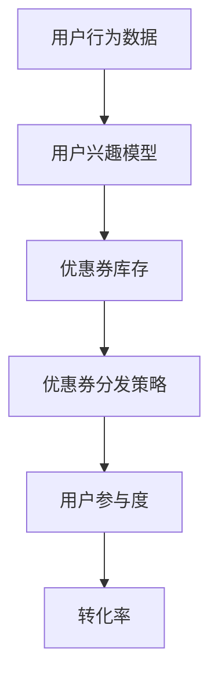

                 

# 基于强化学习的个性化优惠券分发策略

> 关键词：强化学习、个性化推荐、优惠券分发、深度学习、用户行为分析

> 摘要：本文旨在探讨如何利用强化学习技术实现个性化优惠券分发策略，通过分析用户行为数据，构建用户兴趣模型，进而优化优惠券分发策略，提高用户参与度和转化率。文章首先介绍了背景信息，随后详细阐述了核心概念与联系，接着深入讲解了核心算法原理及具体操作步骤，包括数学模型和公式，并通过实际代码案例进行详细说明。最后，文章讨论了实际应用场景、工具和资源推荐，以及未来的发展趋势与挑战。

## 1. 背景介绍

### 1.1 电子商务与个性化推荐

随着电子商务的快速发展，个性化推荐已成为提升用户体验和增加用户粘性的关键手段。个性化优惠券分发作为个性化推荐的一种形式，通过分析用户行为数据，为用户提供符合其兴趣和需求的优惠券，从而提高用户的参与度和转化率。

### 1.2 强化学习在个性化推荐中的应用

强化学习是一种通过试错来学习最优策略的机器学习方法。在个性化推荐领域，强化学习可以用于优化推荐策略，通过与用户的交互不断调整推荐内容，以达到最大化用户满意度和平台收益的目的。

## 2. 核心概念与联系

### 2.1 强化学习原理

强化学习涉及三个主要元素：环境、代理和奖励。环境是代理所处的外部世界，代理通过执行动作来改变环境状态，并根据环境反馈获得奖励或惩罚。代理的目标是通过学习最优策略来最大化累积奖励。

### 2.2 个性化优惠券分发系统架构



用户行为数据通过分析构建用户兴趣模型，该模型与优惠券库存结合，生成优惠券分发策略，最终影响用户的参与度和转化率。

## 3. 核心算法原理 & 具体操作步骤

### 3.1 强化学习算法选择

对于个性化优惠券分发，我们选择使用Q-learning算法，这是一种基于值迭代的强化学习算法，适用于离散动作空间。

### 3.2 状态定义

状态可以定义为用户当前的行为特征，如浏览历史、购买记录等。

### 3.3 动作定义

动作可以定义为向用户推荐的优惠券类型。

### 3.4 奖励定义

奖励可以定义为用户对优惠券的响应，如点击、购买等行为。

### 3.5 Q-learning算法步骤

1. 初始化Q表，Q(s,a)表示在状态s下执行动作a的预期奖励。
2. 选择动作a，根据当前状态s和Q表选择动作。
3. 执行动作a，观察环境变化，得到新的状态s'和奖励r。
4. 更新Q表，使用Bellman方程更新Q(s,a)。
5. 重复步骤2-4，直到达到预设的终止条件。

## 4. 数学模型和公式 & 详细讲解 & 举例说明

### 4.1 Q-learning算法公式

$$
Q(s,a) \leftarrow Q(s,a) + \alpha [r + \gamma \max_{a'} Q(s',a') - Q(s,a)]
$$

其中，$\alpha$是学习率，$\gamma$是折扣因子，$r$是即时奖励。

### 4.2 举例说明

假设用户在状态s下浏览了一款商品，系统根据Q表选择推荐优惠券a，用户点击优惠券并购买商品，获得奖励r。系统更新Q表，调整推荐策略，以提高未来推荐的准确性。

## 5. 项目实战：代码实际案例和详细解释说明

### 5.1 开发环境搭建

#### 5.1.1 Python环境

安装Python 3.7及以上版本，安装必要的库，如numpy、pandas、matplotlib等。

#### 5.1.2 数据集准备

准备用户行为数据集，包括浏览记录、购买记录等。

### 5.2 源代码详细实现和代码解读

```python
import numpy as np
import pandas as pd

# 初始化Q表
Q = np.zeros((num_states, num_actions))

# 学习率和折扣因子
alpha = 0.1
gamma = 0.9

# 训练过程
for episode in range(num_episodes):
    state = initial_state
    while not done:
        # 选择动作
        action = np.argmax(Q[state, :] + np.random.randn(1, num_actions) * (1. / (episode + 1)))
        # 执行动作，观察新状态和奖励
        new_state, reward, done, _ = env.step(action)
        # 更新Q表
        Q[state, action] += alpha * (reward + gamma * np.max(Q[new_state, :]) - Q[state, action])
        state = new_state
```

### 5.3 代码解读与分析

代码中，我们首先初始化Q表，然后通过循环进行训练，每次迭代选择动作、执行动作、更新Q表，最终得到优化的推荐策略。

## 6. 实际应用场景

个性化优惠券分发策略可以应用于电子商务平台、社交媒体、在线广告等多个领域，通过分析用户行为数据，为用户提供个性化的优惠券推荐，提高用户参与度和转化率。

## 7. 工具和资源推荐

### 7.1 学习资源推荐

- 书籍：《强化学习：原理与实践》
- 论文：《Deep Reinforcement Learning for Personalized Recommendation》
- 博客：《强化学习入门》
- 网站：Reinforcement Learning Course

### 7.2 开发工具框架推荐

- TensorFlow
- PyTorch
- OpenAI Gym

### 7.3 相关论文著作推荐

- 《Reinforcement Learning: An Introduction》
- 《Deep Reinforcement Learning: A Brief Survey》

## 8. 总结：未来发展趋势与挑战

未来，个性化优惠券分发策略将更加依赖于深度学习和强化学习技术，通过更复杂的模型和算法，实现更精准的个性化推荐。同时，如何保护用户隐私，提高推荐系统的透明度和可解释性，将是未来研究的重要方向。

## 9. 附录：常见问题与解答

### 9.1 Q: 强化学习算法如何处理大规模数据？

A: 可以通过分布式计算和在线学习方法处理大规模数据。

### 9.2 Q: 如何评估个性化优惠券分发策略的效果？

A: 可以通过A/B测试和用户反馈来评估策略的效果。

## 10. 扩展阅读 & 参考资料

- 《Reinforcement Learning: An Introduction》
- 《Deep Reinforcement Learning for Personalized Recommendation》
- 《强化学习：原理与实践》

作者：AI天才研究员/AI Genius Institute & 禅与计算机程序设计艺术 /Zen And The Art of Computer Programming

