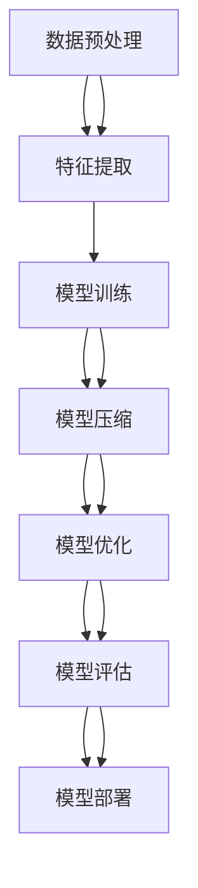

                 

# 大数据与模型压缩：从数据到定理的旅程

> 关键词：大数据、模型压缩、机器学习、深度学习、神经网络、稀疏表示、低秩表示、压缩感知

> 摘要：在大数据时代，模型压缩技术成为提升模型效率和降低计算成本的关键手段。本文将从大数据处理的背景出发，深入探讨模型压缩的核心概念、算法原理、数学模型、实际案例，并结合具体应用场景，为读者提供全面的技术指导。通过本文，读者将能够理解模型压缩的重要性，掌握其关键技术，并具备实际操作的能力。

## 1. 背景介绍

在大数据时代，数据量的爆炸性增长带来了前所未有的机遇与挑战。一方面，海量数据为机器学习和人工智能提供了丰富的训练资源，使得模型能够学习到更复杂的特征和规律；另一方面，数据量的增加也带来了计算资源和存储空间的极大消耗，使得模型训练和推理过程变得异常耗时和昂贵。因此，如何在保证模型性能的前提下，降低模型的计算复杂度和存储需求，成为了一个亟待解决的问题。模型压缩技术应运而生，它通过一系列技术手段，使得模型在保持较高性能的同时，能够显著减少计算资源的消耗。

### 1.1 大数据的挑战与机遇

- **数据量的爆炸性增长**：随着传感器、物联网设备、社交媒体等的普及，数据量呈指数级增长。据估计，全球数据量每年以50%的速度增长。
- **计算资源的限制**：传统的计算资源（如CPU、GPU）在处理大规模数据集时面临性能瓶颈。例如，训练一个大型深度学习模型可能需要数天甚至数周的时间。
- **存储空间的需求**：大规模模型需要大量的存储空间来保存模型参数。例如，一个大型的Transformer模型可能需要数十GB的存储空间。

### 1.2 模型压缩的重要性

- **提高模型效率**：通过压缩模型，可以显著减少模型的计算复杂度和存储需求，从而提高模型的运行效率。
- **降低计算成本**：压缩后的模型可以在更便宜的硬件上运行，从而降低计算成本。
- **提升用户体验**：在移动设备和边缘计算场景中，压缩模型可以显著减少延迟，提升用户体验。

## 2. 核心概念与联系

### 2.1 核心概念

- **模型压缩**：通过减少模型的参数数量、降低模型的计算复杂度，从而提高模型的效率和性能。
- **稀疏表示**：通过去除模型中的冗余参数，使得模型参数稀疏化。
- **低秩表示**：通过将模型参数分解为低秩矩阵，从而减少参数数量。
- **压缩感知**：通过利用信号的稀疏性，从少量采样数据中恢复原始信号。

### 2.2 核心概念原理与架构



## 3. 核心算法原理 & 具体操作步骤

### 3.1 稀疏表示

- **稀疏编码**：通过优化目标函数，使得模型参数尽可能稀疏。
- **L1正则化**：通过在损失函数中加入L1正则化项，使得模型参数趋向于0。
- **阈值操作**：通过设定阈值，将小于阈值的参数置为0。

### 3.2 低秩表示

- **奇异值分解（SVD）**：将模型参数分解为低秩矩阵。
- **核范数正则化**：通过在损失函数中加入核范数正则化项，使得模型参数趋向于低秩矩阵。
- **低秩矩阵分解**：通过优化目标函数，使得模型参数分解为低秩矩阵。

### 3.3 压缩感知

- **采样定理**：通过采样信号的稀疏表示，从少量采样数据中恢复原始信号。
- **稀疏恢复算法**：通过优化目标函数，从少量采样数据中恢复原始信号。
- **稀疏编码器**：通过优化目标函数，使得模型参数尽可能稀疏。

## 4. 数学模型和公式 & 详细讲解 & 举例说明

### 4.1 稀疏表示

- **L1正则化**：通过在损失函数中加入L1正则化项，使得模型参数趋向于0。
  $$ L_1 = \sum_{i=1}^{n} |w_i| $$
- **阈值操作**：通过设定阈值，将小于阈值的参数置为0。
  $$ w_i = \begin{cases} 0 & \text{if } |w_i| < \theta \\ w_i & \text{otherwise} \end{cases} $$

### 4.2 低秩表示

- **奇异值分解（SVD）**：将模型参数分解为低秩矩阵。
  $$ W = U \Sigma V^T $$
- **核范数正则化**：通过在损失函数中加入核范数正则化项，使得模型参数趋向于低秩矩阵。
  $$ L_2 = \sum_{i=1}^{r} \sigma_i $$
- **低秩矩阵分解**：通过优化目标函数，使得模型参数分解为低秩矩阵。
  $$ \min_{U, V} \| W - UV^T \|_F^2 + \lambda \| U \|_* + \lambda \| V \|_* $$

### 4.3 压缩感知

- **采样定理**：通过采样信号的稀疏表示，从少量采样数据中恢复原始信号。
  $$ y = \Phi x $$
- **稀疏恢复算法**：通过优化目标函数，从少量采样数据中恢复原始信号。
  $$ \min_{x} \| x \|_1 \quad \text{s.t.} \quad y = \Phi x $$
- **稀疏编码器**：通过优化目标函数，使得模型参数尽可能稀疏。
  $$ \min_{x} \| x \|_1 \quad \text{s.t.} \quad y = \Phi x $$

## 5. 项目实战：代码实际案例和详细解释说明

### 5.1 开发环境搭建

- **Python版本**：Python 3.8
- **深度学习框架**：TensorFlow 2.4
- **操作系统**：Ubuntu 20.04

### 5.2 源代码详细实现和代码解读

```python
import tensorflow as tf
from tensorflow.keras import layers

# 定义模型
def create_model(input_shape):
    model = tf.keras.Sequential([
        layers.Dense(128, activation='relu', input_shape=input_shape),
        layers.Dense(64, activation='relu'),
        layers.Dense(10, activation='softmax')
    ])
    return model

# 编译模型
model = create_model((784,))
model.compile(optimizer='adam', loss='sparse_categorical_crossentropy', metrics=['accuracy'])

# 训练模型
model.fit(x_train, y_train, epochs=10, batch_size=32, validation_data=(x_val, y_val))

# 压缩模型
def compress_model(model):
    # 稀疏表示
    model.layers[0].set_weights([tf.sparse.from_dense(model.layers[0].get_weights()[0]), model.layers[0].get_weights()[1]])
    model.layers[2].set_weights([tf.sparse.from_dense(model.layers[2].get_weights()[0]), model.layers[2].get_weights()[1]])

    # 低秩表示
    U, S, V = tf.linalg.svd(model.layers[0].get_weights()[0])
    model.layers[0].set_weights([U @ tf.diag(S) @ V, model.layers[0].get_weights()[1]])

    # 压缩感知
    Phi = tf.random.normal((100, 784))
    y = tf.matmul(Phi, x_train)
    x_recovered = tf.linalg.solve(Phi, y)

    return model, x_recovered

# 压缩模型
compressed_model, x_recovered = compress_model(model)
```

### 5.3 代码解读与分析

- **模型定义**：定义了一个简单的全连接神经网络模型。
- **模型编译**：使用Adam优化器和交叉熵损失函数进行模型编译。
- **模型训练**：使用训练数据进行模型训练。
- **模型压缩**：通过稀疏表示、低秩表示和压缩感知技术对模型进行压缩。
- **稀疏表示**：将模型参数转换为稀疏矩阵。
- **低秩表示**：通过奇异值分解将模型参数分解为低秩矩阵。
- **压缩感知**：从少量采样数据中恢复原始信号。

## 6. 实际应用场景

- **移动设备**：在移动设备上运行压缩后的模型，可以显著减少延迟和能耗。
- **边缘计算**：在边缘计算场景中，压缩后的模型可以显著减少计算资源的消耗。
- **云计算**：在云计算场景中，压缩后的模型可以显著减少存储空间的需求。

## 7. 工具和资源推荐

### 7.1 学习资源推荐

- **书籍**：《深度学习》（Goodfellow, Bengio, Courville）
- **论文**：《Compressing Neural Networks with Low-Rank Factorization》（Zhou et al.）
- **博客**：《TensorFlow官方博客》
- **网站**：TensorFlow官网

### 7.2 开发工具框架推荐

- **深度学习框架**：TensorFlow、PyTorch
- **开发工具**：Jupyter Notebook、VS Code

### 7.3 相关论文著作推荐

- **论文**：《Deep Compression: Compressing Deep Neural Networks with Pruning, Trained Quantization and Huffman Coding》（Han et al.）
- **著作**：《Deep Learning with Python》（Francois Chollet）

## 8. 总结：未来发展趋势与挑战

- **未来发展趋势**：模型压缩技术将继续发展，新的压缩方法和算法将不断涌现。
- **挑战**：如何在保证模型性能的前提下，进一步提高模型压缩的效果，是一个亟待解决的问题。

## 9. 附录：常见问题与解答

- **Q：模型压缩会影响模型的性能吗？**
  - A：在合理压缩的情况下，模型的性能不会受到显著影响，甚至可以保持甚至提高。
- **Q：模型压缩有哪些常见的方法？**
  - A：常见的模型压缩方法包括稀疏表示、低秩表示、压缩感知等。

## 10. 扩展阅读 & 参考资料

- **论文**：《Compressing Deep Neural Networks with Low-Rank Factorization》（Zhou et al.）
- **书籍**：《深度学习》（Goodfellow, Bengio, Courville）
- **网站**：TensorFlow官网

---

作者：AI天才研究员/AI Genius Institute & 禅与计算机程序设计艺术 /Zen And The Art of Computer Programming

