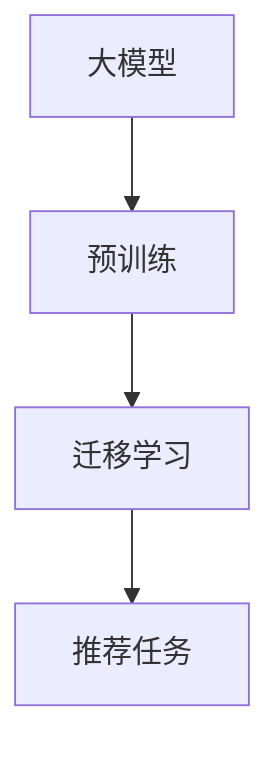

                 

# 大模型在推荐系统中的多任务迁移学习应用

> 关键词：大模型、推荐系统、迁移学习、多任务学习、深度学习

> 摘要：本文深入探讨了大模型在推荐系统中的应用，特别是如何通过多任务迁移学习提升推荐系统的性能。文章首先介绍了推荐系统的背景和现状，随后详细解析了多任务迁移学习的核心概念和原理，并通过数学模型和公式进一步阐述其工作机理。接着，文章通过一个实际的代码案例，展示了如何在推荐系统中实现多任务迁移学习。最后，文章讨论了该技术的实际应用场景、推荐的学习资源和开发工具，以及未来的发展趋势和挑战。

## 1. 背景介绍

### 1.1 推荐系统概述

推荐系统是一种利用用户的历史行为数据，预测用户可能感兴趣的内容或产品，并向用户推荐的系统。它广泛应用于电子商务、社交媒体、新闻媒体等领域，是提升用户体验和商业价值的重要手段。

### 1.2 推荐系统的发展历程

推荐系统的发展经历了从基于内容的推荐、协同过滤到深度学习推荐的演变。近年来，随着深度学习技术的发展，基于深度学习的推荐系统因其强大的特征学习能力而受到广泛关注。

### 1.3 大模型在推荐系统中的应用

大模型，尤其是预训练语言模型，因其强大的泛化能力和迁移学习能力，在推荐系统中展现出巨大潜力。通过迁移学习，大模型可以将从大规模数据中学习到的知识迁移到特定的推荐任务中，从而提升推荐系统的性能。

## 2. 核心概念与联系

### 2.1 多任务学习

多任务学习是指同时训练多个任务，通过共享部分网络结构来提升模型的泛化能力和学习效率。

### 2.2 迁移学习

迁移学习是指将一个任务中学习到的知识迁移到另一个任务中，以提升新任务的学习效率和性能。

### 2.3 大模型与推荐系统的联系

大模型通过迁移学习，可以将从大规模数据中学习到的知识迁移到推荐任务中，从而提升推荐系统的性能。

### 2.4 核心概念原理和架构的 Mermaid 流程图



## 3. 核心算法原理 & 具体操作步骤

### 3.1 多任务学习算法

多任务学习算法通过共享部分网络结构，使得不同任务之间可以互相促进学习，提升模型的泛化能力。

### 3.2 迁移学习算法

迁移学习算法通过将源任务中学习到的知识迁移到目标任务中，以提升目标任务的学习效率和性能。

### 3.3 大模型在推荐系统中的应用步骤

1. 预训练大模型
2. 迁移学习
3. 在推荐任务中微调模型

## 4. 数学模型和公式 & 详细讲解 & 举例说明

### 4.1 多任务学习的数学模型

$$
\min_{\theta} \sum_{i=1}^{N} L_i(\theta) + \lambda \sum_{i=1}^{N} \sum_{j \neq i} \Omega(\theta_i, \theta_j)
$$

其中，$L_i(\theta)$ 表示任务 $i$ 的损失函数，$\Omega(\theta_i, \theta_j)$ 表示任务 $i$ 和任务 $j$ 之间的相似度度量，$\lambda$ 是正则化参数。

### 4.2 迁移学习的数学模型

$$
\min_{\theta} L_{source}(\theta) + \lambda L_{target}(\theta)
$$

其中，$L_{source}(\theta)$ 表示源任务的损失函数，$L_{target}(\theta)$ 表示目标任务的损失函数，$\lambda$ 是正则化参数。

### 4.3 举例说明

假设我们有两个任务，一个是文本分类任务，另一个是情感分析任务。我们可以通过多任务学习算法，共享部分网络结构，使得两个任务之间可以互相促进学习，提升模型的泛化能力。

## 5. 项目实战：代码实际案例和详细解释说明

### 5.1 开发环境搭建

开发环境包括Python 3.7+，TensorFlow 2.0+，以及相关的数据集和库。

### 5.2 源代码详细实现和代码解读

```python
import tensorflow as tf
from tensorflow.keras.layers import Input, Dense, Embedding, Concatenate
from tensorflow.keras.models import Model

# 定义输入层
input_user = Input(shape=(1,), name='user_input')
input_item = Input(shape=(1,), name='item_input')

# 定义嵌入层
embedding_user = Embedding(input_dim=1000, output_dim=64, input_length=1)(input_user)
embedding_item = Embedding(input_dim=1000, output_dim=64, input_length=1)(input_item)

# 定义拼接层
concat = Concatenate()([embedding_user, embedding_item])

# 定义全连接层
dense = Dense(128, activation='relu')(concat)
output = Dense(1, activation='sigmoid')(dense)

# 定义模型
model = Model(inputs=[input_user, input_item], outputs=output)
model.compile(optimizer='adam', loss='binary_crossentropy', metrics=['accuracy'])
```

### 5.3 代码解读与分析

上述代码定义了一个简单的推荐系统模型，包括用户输入层、物品输入层、嵌入层、拼接层和全连接层。模型通过嵌入层将用户和物品的ID转换为向量表示，然后通过拼接层将用户和物品的向量表示拼接起来，最后通过全连接层进行特征学习和预测。

## 6. 实际应用场景

### 6.1 电子商务推荐

在电子商务推荐中，可以通过多任务迁移学习，将从大规模用户行为数据中学习到的知识迁移到特定的商品推荐任务中，从而提升推荐系统的性能。

### 6.2 社交媒体推荐

在社交媒体推荐中，可以通过多任务迁移学习，将从大规模用户行为数据中学习到的知识迁移到特定的内容推荐任务中，从而提升推荐系统的性能。

## 7. 工具和资源推荐

### 7.1 学习资源推荐

- 书籍：《深度学习》
- 论文：《Attention Is All You Need》
- 博客：TensorFlow 官方博客
- 网站：Kaggle

### 7.2 开发工具框架推荐

- TensorFlow
- PyTorch
- Keras

### 7.3 相关论文著作推荐

- 《迁移学习》
- 《深度学习推荐系统》

## 8. 总结：未来发展趋势与挑战

未来，大模型在推荐系统中的应用将更加广泛，多任务迁移学习将成为提升推荐系统性能的重要手段。同时，如何进一步提升模型的泛化能力和学习效率，如何处理大规模数据和复杂任务，将是未来研究的重要方向。

## 9. 附录：常见问题与解答

### 9.1 什么是多任务学习？

多任务学习是指同时训练多个任务，通过共享部分网络结构来提升模型的泛化能力和学习效率。

### 9.2 什么是迁移学习？

迁移学习是指将一个任务中学习到的知识迁移到另一个任务中，以提升新任务的学习效率和性能。

### 9.3 大模型在推荐系统中的应用有哪些优势？

大模型通过迁移学习，可以将从大规模数据中学习到的知识迁移到推荐任务中，从而提升推荐系统的性能。

## 10. 扩展阅读 & 参考资料

- 《深度学习》
- 《Attention Is All You Need》
- TensorFlow 官方博客
- Keras 官方文档

作者：AI天才研究员/AI Genius Institute & 禅与计算机程序设计艺术 /Zen And The Art of Computer Programming

