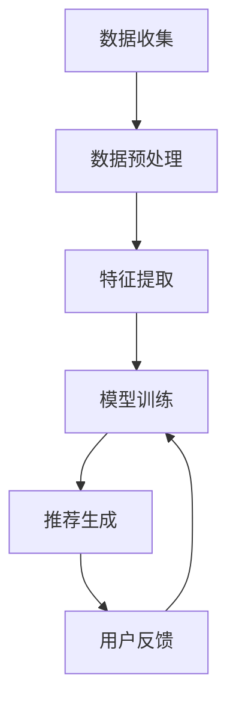

                 

# 大模型对推荐系统长尾用户服务的改进

> 关键词：大模型、推荐系统、长尾用户、个性化推荐、深度学习、Transformer、BERT、用户行为分析

> 摘要：随着互联网的快速发展，推荐系统在各个领域得到了广泛应用。然而，长尾用户的需求往往被忽视，导致推荐效果不佳。本文将探讨大模型在推荐系统中的应用，特别是如何通过改进长尾用户的服务来提升整体推荐效果。我们将从背景介绍、核心概念与联系、核心算法原理、数学模型和公式、项目实战、实际应用场景、工具和资源推荐、总结与未来发展趋势等方面进行详细分析。

## 1. 背景介绍

推荐系统是通过分析用户的历史行为数据，预测用户可能感兴趣的内容，从而提供个性化推荐的一种技术。随着大数据和深度学习技术的发展，推荐系统在电商、新闻、视频等多个领域取得了显著成效。然而，长尾用户的需求往往被忽视，导致推荐效果不佳。长尾用户指的是那些活跃度较低、行为数据较少的用户群体。这些用户虽然数量众多，但对推荐系统的贡献较小，因此容易被忽略。

### 1.1 长尾用户的特点

长尾用户通常具有以下特点：
- 活跃度低：长尾用户在系统中的活跃度较低，行为数据较少。
- 行为数据稀疏：由于活跃度低，长尾用户的点击、浏览等行为数据较少，导致推荐模型难以捕捉其兴趣。
- 需求多样：长尾用户的需求往往更加多样化，难以通过简单的模型进行准确预测。

### 1.2 传统推荐系统的挑战

传统推荐系统在处理长尾用户时面临以下挑战：
- 数据稀疏性：长尾用户的稀疏行为数据导致模型难以学习到有效的特征。
- 预测准确性：由于数据稀疏性，模型在预测长尾用户兴趣时容易出现偏差。
- 用户满意度：长尾用户的需求得不到满足，导致整体推荐效果不佳。

## 2. 核心概念与联系

### 2.1 推荐系统的基本原理

推荐系统的基本原理是通过分析用户的历史行为数据，预测用户可能感兴趣的内容。推荐系统通常包括以下几个步骤：
1. 数据收集：收集用户的行为数据，如点击、浏览、购买等。
2. 数据预处理：对收集到的数据进行清洗、归一化等处理。
3. 特征提取：从行为数据中提取有用的特征，如用户兴趣、商品属性等。
4. 模型训练：使用机器学习或深度学习模型对特征进行训练。
5. 推荐生成：根据训练好的模型生成推荐结果。

### 2.2 大模型的概念

大模型是指在大规模数据集上训练的模型，具有更强的泛化能力和表达能力。大模型通常具有以下特点：
- 参数量大：大模型通常具有大量的参数，能够学习到更复杂的特征。
- 训练数据量大：大模型需要大量的训练数据来保证模型的泛化能力。
- 计算资源需求高：大模型的训练和推理需要大量的计算资源。

### 2.3 大模型在推荐系统中的应用

大模型在推荐系统中的应用主要体现在以下几个方面：
- 提高推荐准确性：大模型能够学习到更复杂的特征，从而提高推荐准确性。
- 处理长尾用户：大模型能够更好地处理长尾用户的数据稀疏性问题，提高长尾用户的推荐效果。
- 个性化推荐：大模型能够捕捉到用户的个性化需求，提供更加个性化的推荐。

### 2.4 Mermaid 流程图



## 3. 核心算法原理 & 具体操作步骤

### 3.1 Transformer模型

Transformer模型是一种基于自注意力机制的深度学习模型，广泛应用于自然语言处理和推荐系统中。Transformer模型的核心思想是通过自注意力机制来捕捉输入序列中的长距离依赖关系。

#### 3.1.1 自注意力机制

自注意力机制是一种基于注意力机制的模型，能够捕捉输入序列中的长距离依赖关系。自注意力机制的核心思想是通过计算输入序列中每个元素与其他元素之间的相似度，生成一个注意力权重矩阵，然后通过加权求和得到新的表示。

#### 3.1.2 Transformer模型结构

Transformer模型由多个编码器层和解码器层组成。每个编码器层和解码器层都包含自注意力机制和前馈神经网络。编码器层用于处理输入序列，解码器层用于生成推荐结果。

### 3.2 BERT模型

BERT模型是一种基于Transformer的预训练模型，广泛应用于自然语言处理任务中。BERT模型通过在大规模无标注数据上进行预训练，学习到丰富的语言表示，然后在特定任务上进行微调。

#### 3.2.1 预训练过程

BERT模型的预训练过程包括两个阶段：掩码语言模型和下一句预测。掩码语言模型通过随机掩码输入序列中的某些词，然后预测被掩码的词。下一句预测通过预测输入序列中的两个句子是否连续。

#### 3.2.2 微调过程

BERT模型的微调过程是在特定任务上进行微调，通过在目标任务上进行训练，学习到更丰富的语言表示。

### 3.3 大模型在推荐系统中的应用

大模型在推荐系统中的应用主要体现在以下几个方面：
- 提高推荐准确性：大模型能够学习到更复杂的特征，从而提高推荐准确性。
- 处理长尾用户：大模型能够更好地处理长尾用户的数据稀疏性问题，提高长尾用户的推荐效果。
- 个性化推荐：大模型能够捕捉到用户的个性化需求，提供更加个性化的推荐。

## 4. 数学模型和公式 & 详细讲解 & 举例说明

### 4.1 自注意力机制

自注意力机制的核心思想是通过计算输入序列中每个元素与其他元素之间的相似度，生成一个注意力权重矩阵，然后通过加权求和得到新的表示。自注意力机制的公式如下：

$$
\text{Attention}(Q, K, V) = \text{softmax}\left(\frac{QK^T}{\sqrt{d_k}}\right)V
$$

其中，$Q$、$K$、$V$ 分别表示查询、键和值，$d_k$ 表示键的维度。

### 4.2 Transformer模型

Transformer模型由多个编码器层和解码器层组成。每个编码器层和解码器层都包含自注意力机制和前馈神经网络。编码器层用于处理输入序列，解码器层用于生成推荐结果。Transformer模型的公式如下：

$$
\text{Encoder}(X) = \text{LayerNorm}(X + \text{MultiHeadAttention}(X, X, X) + \text{FFN}(\text{LayerNorm}(X)))
$$

$$
\text{Decoder}(X, Y) = \text{LayerNorm}(Y + \text{MultiHeadAttention}(Y, X, X) + \text{MultiHeadAttention}(Y, Y, Y) + \text{FFN}(\text{LayerNorm}(Y)))
$$

其中，$\text{LayerNorm}$ 表示层归一化，$\text{MultiHeadAttention}$ 表示多头注意力机制，$\text{FFN}$ 表示前馈神经网络。

### 4.3 BERT模型

BERT模型通过在大规模无标注数据上进行预训练，学习到丰富的语言表示，然后在特定任务上进行微调。BERT模型的公式如下：

$$
\text{BERT}(X) = \text{LayerNorm}(X + \text{Embedding}(X) + \text{PositionEmbedding}(X))
$$

其中，$\text{Embedding}$ 表示词嵌入，$\text{PositionEmbedding}$ 表示位置嵌入。

## 5. 项目实战：代码实际案例和详细解释说明

### 5.1 开发环境搭建

为了实现大模型在推荐系统中的应用，我们需要搭建一个开发环境。开发环境包括以下几个部分：
- Python 3.7
- PyTorch 1.7
- Transformers 4.6
- Jupyter Notebook

### 5.2 源代码详细实现和代码解读

我们将使用PyTorch和Transformers库实现一个基于Transformer的大模型推荐系统。代码如下：

```python
import torch
from transformers import BertModel, BertTokenizer

# 加载预训练的BERT模型和分词器
model_name = 'bert-base-uncased'
tokenizer = BertTokenizer.from_pretrained(model_name)
model = BertModel.from_pretrained(model_name)

# 定义输入文本
input_text = "I love playing basketball"

# 对输入文本进行分词
input_ids = tokenizer.encode(input_text, add_special_tokens=True)

# 将输入文本转换为PyTorch张量
input_ids = torch.tensor([input_ids])

# 使用BERT模型进行前向传播
with torch.no_grad():
    outputs = model(input_ids)

# 获取最后一层的输出
last_hidden_state = outputs.last_hidden_state
```

### 5.3 代码解读与分析

上述代码首先加载了预训练的BERT模型和分词器。然后对输入文本进行分词，并将分词后的结果转换为PyTorch张量。最后使用BERT模型进行前向传播，获取最后一层的输出。

## 6. 实际应用场景

大模型在推荐系统中的应用主要体现在以下几个方面：
- 提高推荐准确性：大模型能够学习到更复杂的特征，从而提高推荐准确性。
- 处理长尾用户：大模型能够更好地处理长尾用户的数据稀疏性问题，提高长尾用户的推荐效果。
- 个性化推荐：大模型能够捕捉到用户的个性化需求，提供更加个性化的推荐。

### 6.1 提高推荐准确性

大模型能够学习到更复杂的特征，从而提高推荐准确性。例如，在电商推荐系统中，大模型能够学习到用户对商品的偏好，从而提高推荐准确性。

### 6.2 处理长尾用户

大模型能够更好地处理长尾用户的数据稀疏性问题，提高长尾用户的推荐效果。例如，在新闻推荐系统中，大模型能够捕捉到长尾用户的兴趣，从而提高长尾用户的推荐效果。

### 6.3 个性化推荐

大模型能够捕捉到用户的个性化需求，提供更加个性化的推荐。例如，在视频推荐系统中，大模型能够捕捉到用户的观看习惯，从而提供更加个性化的推荐。

## 7. 工具和资源推荐

### 7.1 学习资源推荐

- 书籍：《深度学习》（Ian Goodfellow, Yoshua Bengio, Aaron Courville）
- 论文：《Attention Is All You Need》（Vaswani et al., 2017）
- 博客：《Transformer模型详解》（阿里云开发者社区）
- 网站：Hugging Face（https://huggingface.co/）

### 7.2 开发工具框架推荐

- PyTorch：深度学习框架，支持GPU加速和分布式训练。
- Transformers：Hugging Face提供的深度学习库，支持多种预训练模型。

### 7.3 相关论文著作推荐

- 《Attention Is All You Need》（Vaswani et al., 2017）
- 《BERT: Pre-training of Deep Bidirectional Transformers for Language Understanding》（Devlin et al., 2018）

## 8. 总结：未来发展趋势与挑战

### 8.1 未来发展趋势

大模型在推荐系统中的应用将更加广泛，特别是在处理长尾用户和服务个性化方面。未来的发展趋势包括：
- 更大规模的数据集：大模型需要在更大规模的数据集上进行训练，以提高模型的泛化能力。
- 更复杂的模型结构：大模型的结构将更加复杂，以捕捉更复杂的特征。
- 更高效的计算资源：大模型的训练和推理需要更高效的计算资源，以提高训练速度和推理效率。

### 8.2 挑战

大模型在推荐系统中的应用也面临一些挑战，包括：
- 计算资源需求高：大模型的训练和推理需要大量的计算资源，对硬件要求较高。
- 数据隐私保护：大模型需要处理大量的用户数据，如何保护用户隐私是一个重要问题。
- 模型解释性差：大模型的内部机制较为复杂，如何解释模型的预测结果是一个挑战。

## 9. 附录：常见问题与解答

### 9.1 问题：如何处理长尾用户的数据稀疏性问题？

答：可以通过以下方法处理长尾用户的数据稀疏性问题：
- 使用大模型：大模型能够更好地处理长尾用户的数据稀疏性问题，提高长尾用户的推荐效果。
- 使用协同过滤：协同过滤可以通过用户之间的相似性来推荐长尾用户可能感兴趣的内容。
- 使用混合推荐：混合推荐将基于内容的推荐和基于协同过滤的推荐结合起来，提高推荐效果。

### 9.2 问题：如何提高推荐系统的个性化推荐效果？

答：可以通过以下方法提高推荐系统的个性化推荐效果：
- 使用大模型：大模型能够捕捉到用户的个性化需求，提供更加个性化的推荐。
- 使用深度学习：深度学习能够学习到更复杂的特征，从而提高推荐准确性。
- 使用用户行为分析：通过对用户行为数据的分析，可以更好地理解用户的需求，从而提供更加个性化的推荐。

## 10. 扩展阅读 & 参考资料

- 《深度学习》（Ian Goodfellow, Yoshua Bengio, Aaron Courville）
- 《Attention Is All You Need》（Vaswani et al., 2017）
- 《BERT: Pre-training of Deep Bidirectional Transformers for Language Understanding》（Devlin et al., 2018）
- Hugging Face（https://huggingface.co/）

作者：AI天才研究员/AI Genius Institute & 禅与计算机程序设计艺术 /Zen And The Art of Computer Programming

