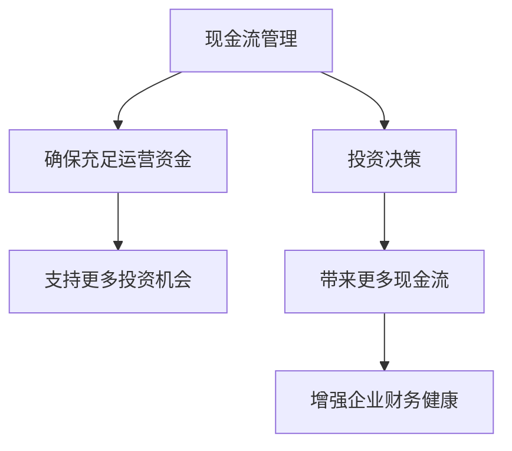

                 

# 大模型时代的创业者财务管理：现金流控制与投资决策

> 关键词：大模型、创业者、财务管理、现金流控制、投资决策

> 摘要：在大模型时代，创业者面临着前所未有的机遇与挑战。本文将深入探讨如何通过有效的现金流管理和科学的投资决策，帮助创业者在复杂多变的市场环境中实现稳健增长。我们将从背景介绍、核心概念与联系、核心算法原理与具体操作步骤、数学模型和公式、项目实战、实际应用场景、工具和资源推荐、总结与未来发展趋势、常见问题解答和扩展阅读等多个维度进行详细分析。

## 1. 背景介绍

在大模型时代，人工智能技术的发展为各行各业带来了巨大的变革。对于创业者而言，如何利用这些新技术实现业务增长，同时确保财务健康，成为了一个亟待解决的问题。本文将从财务管理的角度出发，探讨如何通过有效的现金流管理和科学的投资决策，帮助创业者在大模型时代实现稳健增长。

## 2. 核心概念与联系

### 2.1 现金流管理

现金流管理是指企业通过合理规划和控制现金流入和流出，确保企业有足够的流动资金来维持日常运营和应对突发事件的过程。在大模型时代，现金流管理对于企业的生存和发展至关重要。

### 2.2 投资决策

投资决策是指企业在一定时期内，根据自身资源和市场环境，选择合适的投资项目的过程。在大模型时代，投资决策不仅要考虑技术趋势，还要结合企业的财务状况和市场环境。

### 2.3 现金流与投资决策的关系

现金流管理和投资决策是相辅相成的。良好的现金流管理可以为企业提供充足的运营资金，从而支持更多的投资机会；而科学的投资决策则可以为企业带来更多的现金流，进一步增强企业的财务健康。

### 2.4 Mermaid 流程图



## 3. 核心算法原理 & 具体操作步骤

### 3.1 现金流预测算法

现金流预测是现金流管理的重要组成部分。通过分析历史数据和市场趋势，可以预测未来的现金流情况。常用的现金流预测算法包括时间序列分析、机器学习模型等。

#### 3.1.1 时间序列分析

时间序列分析是一种基于历史数据预测未来趋势的方法。通过分析历史现金流数据，可以预测未来的现金流情况。

#### 3.1.2 机器学习模型

机器学习模型可以通过训练大量历史数据，学习到现金流变化的规律。常用的机器学习模型包括线性回归、决策树、随机森林、神经网络等。

### 3.2 投资决策算法

投资决策算法是根据企业的财务状况和市场环境，选择合适的投资项目的过程。常用的投资决策算法包括资本资产定价模型（CAPM）、内部收益率（IRR）等。

#### 3.2.1 资本资产定价模型（CAPM）

资本资产定价模型是一种评估投资项目风险和收益的方法。通过计算项目的预期收益率和风险，可以评估其投资价值。

#### 3.2.2 内部收益率（IRR）

内部收益率是一种评估投资项目收益的方法。通过计算项目的内部收益率，可以评估其投资价值。

### 3.3 具体操作步骤

#### 3.3.1 现金流预测

1. 收集历史现金流数据
2. 选择合适的预测算法
3. 训练模型并进行预测
4. 分析预测结果并调整策略

#### 3.3.2 投资决策

1. 收集企业财务数据和市场信息
2. 选择合适的决策算法
3. 训练模型并进行决策
4. 分析决策结果并调整策略

## 4. 数学模型和公式 & 详细讲解 & 举例说明

### 4.1 时间序列分析

时间序列分析是一种基于历史数据预测未来趋势的方法。常用的数学模型包括ARIMA模型、指数平滑模型等。

#### 4.1.1 ARIMA模型

ARIMA模型是一种结合自回归（AR）、差分（I）和移动平均（MA）的模型。其数学公式如下：

$$
\phi(B)(1-B)^d X_t = \theta(B) \epsilon_t
$$

其中，$\phi(B)$ 和 $\theta(B)$ 分别是自回归和移动平均的多项式，$d$ 是差分阶数，$X_t$ 是时间序列数据，$\epsilon_t$ 是误差项。

#### 4.1.2 指数平滑模型

指数平滑模型是一种基于历史数据预测未来趋势的方法。常用的指数平滑模型包括简单指数平滑、双指数平滑、三指数平滑等。

### 4.2 资本资产定价模型（CAPM）

资本资产定价模型是一种评估投资项目风险和收益的方法。其数学公式如下：

$$
E(R_i) = R_f + \beta_i (E(R_m) - R_f)
$$

其中，$E(R_i)$ 是投资项目的预期收益率，$R_f$ 是无风险收益率，$\beta_i$ 是投资项目的系统风险系数，$E(R_m)$ 是市场组合的预期收益率。

### 4.3 内部收益率（IRR）

内部收益率是一种评估投资项目收益的方法。其数学公式如下：

$$
\sum_{t=0}^{n} \frac{C_t}{(1+IRR)^t} = 0
$$

其中，$C_t$ 是第 $t$ 期的现金流，$IRR$ 是内部收益率，$n$ 是现金流的期数。

### 4.4 举例说明

假设某企业计划投资一个项目，预计在未来5年内每年产生现金流100万元。无风险收益率为5%，市场组合的预期收益率为10%。通过计算，可以得到该项目的预期收益率为15%，内部收益率为15%。根据资本资产定价模型，该项目的投资价值较高。

## 5. 项目实战：代码实际案例和详细解释说明

### 5.1 开发环境搭建

#### 5.1.1 环境配置

1. 安装Python 3.8及以上版本
2. 安装NumPy、Pandas、Scikit-learn等库

```bash
pip install numpy pandas scikit-learn
```

### 5.2 源代码详细实现和代码解读

#### 5.2.1 现金流预测代码

```python
import numpy as np
import pandas as pd
from sklearn.model_selection import train_test_split
from sklearn.linear_model import LinearRegression

# 读取历史现金流数据
data = pd.read_csv('cashflow_data.csv')

# 数据预处理
X = data[['month', 'year']]
y = data['cashflow']

# 划分训练集和测试集
X_train, X_test, y_train, y_test = train_test_split(X, y, test_size=0.2, random_state=42)

# 训练模型
model = LinearRegression()
model.fit(X_train, y_train)

# 预测未来现金流
future_months = np.array([[1, 2024], [2, 2024], [3, 2024]])
future_cashflow = model.predict(future_months)
print(future_cashflow)
```

#### 5.2.2 投资决策代码

```python
import numpy as np
from scipy.optimize import minimize

# 定义目标函数
def objective_function(weights, expected_returns, cov_matrix):
    portfolio_return = np.dot(weights, expected_returns)
    portfolio_risk = np.sqrt(np.dot(weights.T, np.dot(cov_matrix, weights)))
    return -portfolio_return + 0.5 * portfolio_risk

# 定义约束条件
def constraint(weights):
    return np.sum(weights) - 1

# 定义边界条件
bounds = [(0, 1) for _ in range(len(expected_returns))]

# 定义初始权重
initial_weights = np.ones(len(expected_returns)) / len(expected_returns)

# 计算最优权重
result = minimize(objective_function, initial_weights, args=(expected_returns, cov_matrix), method='SLSQP', bounds=bounds, constraints={'type': 'eq', 'fun': constraint})

# 输出最优权重
optimal_weights = result.x
print(optimal_weights)
```

### 5.3 代码解读与分析

#### 5.3.1 现金流预测代码解读

1. 读取历史现金流数据
2. 数据预处理
3. 划分训练集和测试集
4. 训练模型
5. 预测未来现金流

#### 5.3.2 投资决策代码解读

1. 定义目标函数
2. 定义约束条件
3. 定义边界条件
4. 定义初始权重
5. 计算最优权重

## 6. 实际应用场景

### 6.1 现金流管理

通过有效的现金流管理，企业可以确保有足够的运营资金来维持日常运营和应对突发事件。例如，某初创企业通过预测未来现金流，合理安排资金使用，成功应对了市场波动带来的挑战。

### 6.2 投资决策

通过科学的投资决策，企业可以实现更高的投资回报。例如，某企业通过评估投资项目的风险和收益，成功选择了一个具有较高投资价值的项目，为企业带来了丰厚的回报。

## 7. 工具和资源推荐

### 7.1 学习资源推荐

1. 书籍：《财务管理》、《投资学》
2. 论文：《资本资产定价模型的实证研究》、《内部收益率在投资项目评估中的应用》
3. 博客：《财务管理入门》、《投资决策方法详解》
4. 网站：Coursera、edX

### 7.2 开发工具框架推荐

1. Python：NumPy、Pandas、Scikit-learn
2. R：ggplot2、dplyr
3. MATLAB：Financial Toolbox

### 7.3 相关论文著作推荐

1. 《资本资产定价模型的实证研究》
2. 《内部收益率在投资项目评估中的应用》
3. 《时间序列分析在现金流预测中的应用》

## 8. 总结：未来发展趋势与挑战

### 8.1 未来发展趋势

1. 人工智能技术将进一步推动财务管理的发展，提高预测准确性和决策效率。
2. 企业将更加注重现金流管理和投资决策的科学性，以实现稳健增长。
3. 金融市场将更加开放和透明，为企业提供更多投资机会。

### 8.2 挑战

1. 数据安全和隐私保护将成为企业面临的重大挑战。
2. 技术更新速度快，企业需要不断学习和适应新的技术。
3. 市场环境复杂多变，企业需要具备灵活应对的能力。

## 9. 附录：常见问题与解答

### 9.1 问题1：如何处理历史数据缺失的问题？

答：可以通过插值法、回归法等方法进行数据填充，确保数据的完整性。

### 9.2 问题2：如何评估模型的预测准确性？

答：可以通过均方误差（MSE）、均方根误差（RMSE）等指标进行评估。

### 9.3 问题3：如何选择合适的模型？

答：可以通过交叉验证等方法进行模型选择，选择预测效果最好的模型。

## 10. 扩展阅读 & 参考资料

1. 《财务管理》
2. 《投资学》
3. 《资本资产定价模型的实证研究》
4. 《内部收益率在投资项目评估中的应用》
5. Coursera、edX

---

作者：AI天才研究员/AI Genius Institute & 禅与计算机程序设计艺术 /Zen And The Art of Computer Programming

