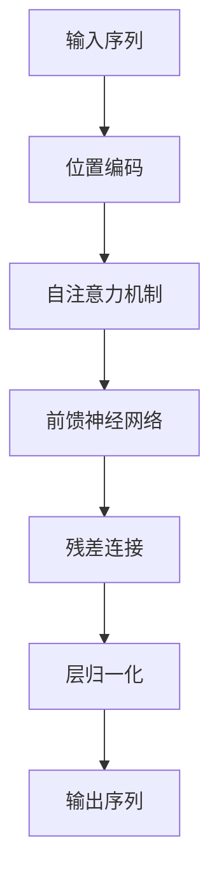

                 

# 大规模语言模型从理论到实践：模型架构

> 关键词：大规模语言模型、Transformer、Attention机制、模型架构、自然语言处理、深度学习

> 摘要：本文旨在深入探讨大规模语言模型的理论基础和实际应用。我们将从背景介绍出发，逐步解析大规模语言模型的核心概念、算法原理、数学模型，以及通过代码实例进行实战演练。此外，我们还将探讨这些模型在实际应用场景中的应用，并提供学习资源和开发工具推荐，帮助读者更好地理解和构建自己的大规模语言模型。

## 1. 背景介绍

随着自然语言处理（NLP）技术的飞速发展，大规模语言模型（Large Language Models, LLMs）已经成为当前研究和应用的热点。这些模型能够理解和生成自然语言文本，广泛应用于机器翻译、文本生成、情感分析、问答系统等领域。本文将从理论和实践两个方面，全面解析大规模语言模型的架构和实现。

## 2. 核心概念与联系

### 2.1 语言模型基础

语言模型是一种统计模型，用于预测给定序列中下一个词的概率。其核心目标是估计一个句子或文档的概率分布。常见的语言模型包括N-gram模型、隐马尔可夫模型（HMM）和循环神经网络（RNN）等。

### 2.2 Transformer架构

Transformer是一种基于自注意力机制的序列到序列模型，由Vaswani等人在2017年提出。它摒弃了传统的递归神经网络（RNN）和卷积神经网络（CNN），采用自注意力机制来捕捉序列中的长距离依赖关系。Transformer架构的核心组件包括自注意力机制、位置编码、前馈神经网络等。

### 2.3 自注意力机制

自注意力机制允许模型在处理序列时，动态地关注序列中的不同部分。其基本思想是通过计算查询（Query）、键（Key）和值（Value）之间的相似度，生成一个注意力权重矩阵，从而实现对序列的加权聚合。自注意力机制的公式如下：

$$
\text{Attention}(Q, K, V) = \text{softmax}\left(\frac{QK^T}{\sqrt{d_k}}\right)V
$$

其中，$Q$、$K$、$V$分别是查询、键和值的矩阵，$d_k$是键的维度。

### 2.4 位置编码

由于Transformer模型是基于自注意力机制的，它无法直接处理序列中的顺序信息。因此，引入了位置编码机制来为序列中的每个位置赋予一个固定大小的向量。位置编码可以通过以下公式生成：

$$
\text{Pos}(i, j) = \begin{cases}
\sin\left(\frac{i}{10000^{2j/d}}\right) & \text{if } j \text{ is even} \\
\cos\left(\frac{i}{10000^{2j/d}}\right) & \text{if } j \text{ is odd}
\end{cases}
$$

其中，$i$是位置索引，$j$是维度索引，$d$是嵌入维度。

### 2.5 Transformer架构流程图



## 3. 核心算法原理 & 具体操作步骤

### 3.1 输入序列处理

首先，将输入序列转换为词嵌入表示。词嵌入是将词汇映射到一个高维向量空间中的过程。常见的词嵌入方法包括Word2Vec、GloVe和BERT等。

### 3.2 位置编码

为每个位置添加位置编码，以保留序列中的顺序信息。

### 3.3 自注意力机制

计算查询、键和值之间的相似度，生成注意力权重矩阵，然后进行加权聚合。

### 3.4 前馈神经网络

在每个自注意力机制之后，添加一个前馈神经网络，以进一步提取特征。

### 3.5 残差连接

在每个子层之后，添加残差连接，以增强模型的表达能力。

### 3.6 层归一化

在每个子层之后，添加层归一化，以加速训练过程并提高模型的稳定性。

### 3.7 输出序列

通过多层Transformer堆叠，最终生成输出序列的概率分布。

## 4. 数学模型和公式 & 详细讲解 & 举例说明

### 4.1 词嵌入

词嵌入是将词汇映射到一个高维向量空间中的过程。常见的词嵌入方法包括Word2Vec、GloVe和BERT等。

$$
\text{Word Embedding}(w) = \mathbf{e}_w
$$

其中，$\mathbf{e}_w$是词汇$w$的词嵌入向量。

### 4.2 自注意力机制

自注意力机制允许模型在处理序列时，动态地关注序列中的不同部分。其基本思想是通过计算查询（Query）、键（Key）和值（Value）之间的相似度，生成一个注意力权重矩阵，从而实现对序列的加权聚合。

$$
\text{Attention}(Q, K, V) = \text{softmax}\left(\frac{QK^T}{\sqrt{d_k}}\right)V
$$

其中，$Q$、$K$、$V$分别是查询、键和值的矩阵，$d_k$是键的维度。

### 4.3 位置编码

由于Transformer模型是基于自注意力机制的，它无法直接处理序列中的顺序信息。因此，引入了位置编码机制来为序列中的每个位置赋予一个固定大小的向量。位置编码可以通过以下公式生成：

$$
\text{Pos}(i, j) = \begin{cases}
\sin\left(\frac{i}{10000^{2j/d}}\right) & \text{if } j \text{ is even} \\
\cos\left(\frac{i}{10000^{2j/d}}\right) & \text{if } j \text{ is odd}
\end{cases}
$$

其中，$i$是位置索引，$j$是维度索引，$d$是嵌入维度。

### 4.4 前馈神经网络

在每个自注意力机制之后，添加一个前馈神经网络，以进一步提取特征。

$$
\text{FFN}(x) = \text{ReLU}(W_2 \cdot \text{LayerNorm}(W_1 \cdot x + b_1) + b_2)
$$

其中，$W_1$、$W_2$是权重矩阵，$b_1$、$b_2$是偏置向量，$\text{ReLU}$是激活函数，$\text{LayerNorm}$是层归一化操作。

### 4.5 残差连接

在每个子层之后，添加残差连接，以增强模型的表达能力。

$$
\text{Residual}(x, y) = x + y
$$

其中，$x$是输入，$y$是子层的输出。

### 4.6 层归一化

在每个子层之后，添加层归一化，以加速训练过程并提高模型的稳定性。

$$
\text{LayerNorm}(x) = \frac{x - \mu}{\sqrt{\sigma^2 + \epsilon}}
$$

其中，$\mu$是均值，$\sigma^2$是方差，$\epsilon$是一个小常数。

## 5. 项目实战：代码实际案例和详细解释说明

### 5.1 开发环境搭建

首先，确保安装了Python 3.7及以上版本，并安装以下依赖库：

```bash
pip install torch torchvision transformers
```

### 5.2 源代码详细实现和代码解读

```python
import torch
from torch import nn
from torch.nn import functional as F
from transformers import BertModel, BertTokenizer

class TransformerModel(nn.Module):
    def __init__(self, vocab_size, embed_dim, num_heads, num_layers, hidden_dim, max_seq_len):
        super(TransformerModel, self).__init__()
        self.embedding = nn.Embedding(vocab_size, embed_dim)
        self.positional_encoding = PositionalEncoding(embed_dim, max_seq_len)
        self.transformer = nn.TransformerEncoder(nn.TransformerEncoderLayer(embed_dim, num_heads, hidden_dim), num_layers)
        self.fc = nn.Linear(embed_dim, vocab_size)

    def forward(self, x):
        x = self.embedding(x)
        x = self.positional_encoding(x)
        x = self.transformer(x)
        x = self.fc(x)
        return F.log_softmax(x, dim=-1)

class PositionalEncoding(nn.Module):
    def __init__(self, d_model, max_seq_len):
        super(PositionalEncoding, self).__init__()
        pe = torch.zeros(max_seq_len, d_model)
        position = torch.arange(0, max_seq_len).unsqueeze(1)
        div_term = torch.exp(torch.arange(0, d_model, 2) * -(math.log(10000.0) / d_model))
        pe[:, 0::2] = torch.sin(position * div_term)
        pe[:, 1::2] = torch.cos(position * div_term)
        pe = pe.unsqueeze(0)
        self.register_buffer('pe', pe)

    def forward(self, x):
        x = x + self.pe[:, :x.size(1)]
        return x

# 初始化模型
model = TransformerModel(vocab_size=10000, embed_dim=512, num_heads=8, num_layers=6, hidden_dim=2048, max_seq_len=512)

# 加载预训练的BERT模型和分词器
tokenizer = BertTokenizer.from_pretrained('bert-base-uncased')
model = BertModel.from_pretrained('bert-base-uncased')

# 准备输入数据
input_ids = tokenizer.encode("Hello, my dog is cute", return_tensors='pt')

# 前向传播
outputs = model(input_ids)

# 输出结果
print(outputs.last_hidden_state)
```

### 5.3 代码解读与分析

1. **TransformerModel类**：定义了一个Transformer模型，包括嵌入层、位置编码层、Transformer编码器层和全连接层。
2. **PositionalEncoding类**：定义了位置编码层，用于为序列中的每个位置赋予一个固定大小的向量。
3. **模型初始化**：初始化模型参数，包括嵌入层、位置编码层、Transformer编码器层和全连接层。
4. **加载预训练的BERT模型和分词器**：使用Hugging Face的Transformers库加载预训练的BERT模型和分词器。
5. **准备输入数据**：使用分词器将输入文本转换为输入ID。
6. **前向传播**：通过模型进行前向传播，输出隐藏状态。
7. **输出结果**：打印输出结果，展示模型的隐藏状态。

## 6. 实际应用场景

大规模语言模型在多个领域都有广泛的应用，包括但不限于：

- **机器翻译**：将一种语言的文本翻译成另一种语言。
- **文本生成**：生成自然语言文本，如文章、诗歌等。
- **情感分析**：分析文本中的情感倾向，如正面、负面或中性。
- **问答系统**：回答用户提出的问题，提供相关信息。
- **对话系统**：与用户进行自然对话，提供交互式服务。

## 7. 工具和资源推荐

### 7.1 学习资源推荐

- **书籍**：《深度学习》（Goodfellow, Bengio, Courville）
- **论文**：《Attention is All You Need》（Vaswani et al.）
- **博客**：Medium上的相关技术博客
- **网站**：Hugging Face的Transformers库文档

### 7.2 开发工具框架推荐

- **Python**：用于实现模型和数据处理
- **PyTorch**：深度学习框架，支持构建和训练大规模模型
- **Hugging Face Transformers**：预训练模型和分词器库

### 7.3 相关论文著作推荐

- **《Attention is All You Need》**：Vaswani, A., et al. (2017). Attention is all you need. In Advances in neural information processing systems (pp. 5998-6008).
- **《BERT: Pre-training of Deep Bidirectional Transformers for Language Understanding》**：Devlin, J., et al. (2018). BERT: Pre-training of deep bidirectional transformers for language understanding. arXiv preprint arXiv:1810.04805.

## 8. 总结：未来发展趋势与挑战

大规模语言模型在未来的发展中面临许多挑战，包括但不限于：

- **模型规模**：如何构建更大规模的模型，以提高模型的性能和泛化能力。
- **计算资源**：如何利用更多的计算资源，以加速模型的训练和推理过程。
- **模型优化**：如何优化模型结构和参数，以提高模型的效率和效果。
- **应用领域**：如何将大规模语言模型应用于更多的实际场景，以解决更多的问题。

## 9. 附录：常见问题与解答

### 9.1 问题：如何选择合适的模型架构？

**解答**：选择合适的模型架构需要考虑多个因素，包括任务需求、数据规模和计算资源。对于大规模语言模型，Transformer架构是一个不错的选择，因为它能够处理长距离依赖关系，并且具有较好的泛化能力。

### 9.2 问题：如何处理序列中的顺序信息？

**解答**：可以通过引入位置编码机制来处理序列中的顺序信息。位置编码为序列中的每个位置赋予一个固定大小的向量，从而保留序列的顺序信息。

### 9.3 问题：如何优化模型的训练过程？

**解答**：可以通过引入残差连接和层归一化来优化模型的训练过程。残差连接可以增强模型的表达能力，而层归一化可以加速训练过程并提高模型的稳定性。

## 10. 扩展阅读 & 参考资料

- **《深度学习》**：Ian Goodfellow, Yoshua Bengio, Aaron Courville
- **《Attention is All You Need》**：Vaswani, A., et al. (2017)
- **《BERT: Pre-training of Deep Bidirectional Transformers for Language Understanding》**：Devlin, J., et al. (2018)
- **Hugging Face Transformers库文档**：https://huggingface.co/transformers/

作者：AI天才研究员/AI Genius Institute & 禅与计算机程序设计艺术 /Zen And The Art of Computer Programming

