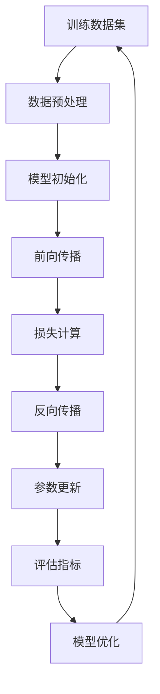

                 

# 大语言模型原理基础与前沿：示范样本选择

> 关键词：大语言模型, 人工智能, 自然语言处理, 深度学习, Transformer, 自动化样本选择

> 摘要：本文旨在深入探讨大语言模型（LLM）的核心原理与前沿技术，特别是样本选择在训练过程中的重要性。通过逐步分析和推理，我们将详细解释大语言模型的工作机制，核心算法原理，数学模型和公式，以及实际代码案例。此外，本文还将探讨大语言模型的实际应用场景，推荐相关学习资源和开发工具，最后展望未来的发展趋势与挑战。

## 1. 背景介绍

大语言模型（Large Language Models, LLMs）是近年来自然语言处理（NLP）领域的重要突破。它们能够生成连贯且高质量的文本，广泛应用于机器翻译、文本摘要、对话系统、内容创作等多个场景。大语言模型的核心在于其强大的语言理解和生成能力，这主要得益于深度学习技术的发展和大规模数据集的训练。

### 1.1 人工智能与自然语言处理

人工智能（AI）是计算机科学的一个分支，旨在使计算机能够模拟人类智能行为。自然语言处理（NLP）是AI的一个重要分支，专注于计算机与人类自然语言之间的交互。大语言模型是NLP领域的一个重要工具，它们通过学习大量文本数据，能够理解和生成自然语言文本。

### 1.2 大语言模型的发展历程

大语言模型的发展经历了几个重要阶段。早期的NLP模型主要依赖于统计方法，如隐马尔可夫模型（HMM）和条件随机场（CRF）。随着深度学习技术的发展，特别是Transformer架构的提出，大语言模型开始展现出前所未有的性能。近年来，随着计算资源的提升和大规模数据集的可用性，大语言模型的规模和性能不断提升。

## 2. 核心概念与联系

### 2.1 大语言模型的核心概念

大语言模型的核心概念包括：训练数据集、模型架构、训练过程、评估指标等。这些概念相互关联，共同构成了大语言模型的工作机制。

### 2.2 核心概念原理与架构

#### 2.2.1 训练数据集

训练数据集是大语言模型学习的基础。一个高质量的训练数据集能够帮助模型更好地理解和生成自然语言文本。训练数据集通常包含大量的文本数据，如书籍、新闻文章、社交媒体帖子等。

#### 2.2.2 模型架构

大语言模型的核心架构是Transformer。Transformer是一种基于自注意力机制的模型，能够高效地处理序列数据。Transformer架构包括多个编码器和解码器层，每个层都包含自注意力机制和前馈神经网络。

#### 2.2.3 训练过程

大语言模型的训练过程主要包括数据预处理、模型初始化、前向传播、反向传播和参数更新等步骤。训练过程的目标是通过最小化损失函数来优化模型参数，使其能够更好地生成自然语言文本。

#### 2.2.4 评估指标

评估大语言模型性能的主要指标包括困惑度（Perplexity）、BLEU分数、ROUGE分数等。这些指标能够从不同角度评估模型的生成质量。

### 2.3 核心概念原理与架构的Mermaid流程图



## 3. 核心算法原理 & 具体操作步骤

### 3.1 Transformer架构详解

Transformer架构的核心在于自注意力机制（Self-Attention Mechanism）和前馈神经网络（Feed-Forward Neural Network）。

#### 3.1.1 自注意力机制

自注意力机制允许模型在处理序列数据时，能够关注到序列中的任意位置。自注意力机制的计算公式如下：

$$
\text{Attention}(Q, K, V) = \text{softmax}\left(\frac{QK^T}{\sqrt{d_k}}\right)V
$$

其中，$Q$、$K$、$V$分别是查询向量、键向量和值向量，$d_k$是键向量的维度。

#### 3.1.2 前馈神经网络

前馈神经网络用于处理自注意力机制的输出。前馈神经网络的计算公式如下：

$$
\text{FFN}(x) = \text{ReLU}(W_1x + b_1)W_2 + b_2
$$

其中，$W_1$、$W_2$是权重矩阵，$b_1$、$b_2$是偏置项。

### 3.2 训练过程详解

大语言模型的训练过程主要包括数据预处理、模型初始化、前向传播、反向传播和参数更新等步骤。

#### 3.2.1 数据预处理

数据预处理主要包括文本清洗、分词、构建词汇表等步骤。文本清洗是为了去除无关字符和噪声，分词是为了将文本分割成单词或子词单元，构建词汇表是为了将单词映射到唯一的索引。

#### 3.2.2 模型初始化

模型初始化主要包括权重初始化和偏置项初始化。权重初始化通常采用均匀分布或正态分布，偏置项初始化通常采用零初始化。

#### 3.2.3 前向传播

前向传播是指模型在处理输入数据时，通过自注意力机制和前馈神经网络进行计算的过程。前向传播的计算公式如下：

$$
\text{Output} = \text{FFN}(\text{Attention}(Q, K, V))
$$

#### 3.2.4 损失计算

损失计算是指通过比较模型的预测结果和真实标签，计算损失函数的过程。损失函数通常采用交叉熵损失函数。

#### 3.2.5 反向传播

反向传播是指通过计算损失函数的梯度，更新模型参数的过程。反向传播的计算公式如下：

$$
\frac{\partial L}{\partial W} = \frac{\partial L}{\partial \text{Output}} \cdot \frac{\partial \text{Output}}{\partial W}
$$

#### 3.2.6 参数更新

参数更新是指通过梯度下降法更新模型参数的过程。参数更新的计算公式如下：

$$
W = W - \eta \cdot \frac{\partial L}{\partial W}
$$

其中，$\eta$是学习率。

## 4. 数学模型和公式 & 详细讲解 & 举例说明

### 4.1 自注意力机制

自注意力机制的核心在于计算查询向量、键向量和值向量之间的相似度。自注意力机制的计算公式如下：

$$
\text{Attention}(Q, K, V) = \text{softmax}\left(\frac{QK^T}{\sqrt{d_k}}\right)V
$$

其中，$Q$、$K$、$V$分别是查询向量、键向量和值向量，$d_k$是键向量的维度。

### 4.2 前馈神经网络

前馈神经网络用于处理自注意力机制的输出。前馈神经网络的计算公式如下：

$$
\text{FFN}(x) = \text{ReLU}(W_1x + b_1)W_2 + b_2
$$

其中，$W_1$、$W_2$是权重矩阵，$b_1$、$b_2$是偏置项。

### 4.3 举例说明

假设我们有一个简单的文本数据集，包含以下句子：

```
I love programming.
Programming is fun.
```

我们可以将这些句子分词并构建词汇表，得到以下词汇表：

```
I, love, programming, is, fun
```

接下来，我们可以使用自注意力机制和前馈神经网络对这些句子进行处理。假设我们有一个简单的Transformer模型，包含一个编码器层和一个解码器层。编码器层的计算公式如下：

$$
\text{Output} = \text{FFN}(\text{Attention}(Q, K, V))
$$

其中，$Q$、$K$、$V$分别是查询向量、键向量和值向量，$d_k$是键向量的维度。

解码器层的计算公式如下：

$$
\text{Output} = \text{FFN}(\text{Attention}(Q, K, V) + \text{Attention}(Q, K, V))
$$

其中，$Q$、$K$、$V$分别是查询向量、键向量和值向量，$d_k$是键向量的维度。

## 5. 项目实战：代码实际案例和详细解释说明

### 5.1 开发环境搭建

为了实现大语言模型，我们需要搭建一个合适的开发环境。开发环境主要包括Python、PyTorch、TensorFlow等工具。

#### 5.1.1 安装Python

首先，我们需要安装Python。Python是实现大语言模型的主要编程语言。我们可以通过以下命令安装Python：

```bash
sudo apt-get install python3
```

#### 5.1.2 安装PyTorch

接下来，我们需要安装PyTorch。PyTorch是实现大语言模型的主要深度学习框架。我们可以通过以下命令安装PyTorch：

```bash
pip install torch torchvision
```

### 5.2 源代码详细实现和代码解读

接下来，我们将实现一个简单的Transformer模型。代码如下：

```python
import torch
import torch.nn as nn
import torch.optim as optim

class Transformer(nn.Module):
    def __init__(self, vocab_size, embed_dim, num_heads, num_layers):
        super(Transformer, self).__init__()
        self.embedding = nn.Embedding(vocab_size, embed_dim)
        self.encoder = nn.TransformerEncoder(nn.TransformerEncoderLayer(embed_dim, num_heads), num_layers)
        self.decoder = nn.Linear(embed_dim, vocab_size)

    def forward(self, x):
        x = self.embedding(x)
        x = self.encoder(x)
        x = self.decoder(x)
        return x

# 定义参数
vocab_size = 10000
embed_dim = 512
num_heads = 8
num_layers = 6

# 创建模型
model = Transformer(vocab_size, embed_dim, num_heads, num_layers)

# 定义损失函数和优化器
criterion = nn.CrossEntropyLoss()
optimizer = optim.Adam(model.parameters(), lr=0.001)

# 训练模型
for epoch in range(10):
    optimizer.zero_grad()
    output = model(input)
    loss = criterion(output, target)
    loss.backward()
    optimizer.step()
```

### 5.3 代码解读与分析

代码中定义了一个简单的Transformer模型，包含嵌入层、编码器和解码器。嵌入层将词汇表中的单词映射到一个高维向量空间。编码器和解码器分别用于处理输入数据和生成输出数据。模型的前向传播过程如下：

1. 将输入数据通过嵌入层映射到高维向量空间。
2. 通过编码器处理输入数据，生成编码后的表示。
3. 通过解码器生成输出数据。

## 6. 实际应用场景

大语言模型在多个实际应用场景中展现出强大的性能。以下是一些典型的应用场景：

### 6.1 机器翻译

大语言模型可以用于机器翻译任务，将一种语言的文本翻译成另一种语言。例如，将英语翻译成法语。

### 6.2 文本摘要

大语言模型可以用于文本摘要任务，将长篇文章压缩成简短的摘要。例如，将一篇新闻文章压缩成一段简短的摘要。

### 6.3 对话系统

大语言模型可以用于对话系统，实现人机对话。例如，实现一个智能客服系统，能够回答用户的问题。

## 7. 工具和资源推荐

### 7.1 学习资源推荐

- 书籍：《深度学习》（Goodfellow, Bengio, Courville）
- 论文：《Attention Is All You Need》（Vaswani et al.）
- 博客：阿里云开发者社区
- 网站：PyTorch官网

### 7.2 开发工具框架推荐

- PyTorch
- TensorFlow
- Hugging Face Transformers库

### 7.3 相关论文著作推荐

- 《Attention Is All You Need》（Vaswani et al.）
- 《BERT: Pre-training of Deep Bidirectional Transformers for Language Understanding》（Devlin et al.）
- 《GPT-3: Language Models are Few-Shot Learners》（Brown et al.）

## 8. 总结：未来发展趋势与挑战

大语言模型在未来的发展趋势主要体现在以下几个方面：

### 8.1 模型规模的扩大

随着计算资源的提升和大规模数据集的可用性，大语言模型的规模将进一步扩大。这将使得模型能够更好地理解和生成自然语言文本。

### 8.2 训练效率的提升

为了应对大规模模型的训练需求，训练效率的提升将成为一个重要方向。这包括优化训练算法、改进硬件加速技术等。

### 8.3 应用场景的拓展

大语言模型的应用场景将进一步拓展，包括但不限于智能客服、智能写作、智能问答等。

### 8.4 挑战与风险

大语言模型的发展也面临一些挑战和风险，包括数据隐私、模型偏见、模型解释性等。这些问题需要我们共同努力解决。

## 9. 附录：常见问题与解答

### 9.1 问题：大语言模型如何处理长文本？

大语言模型通常通过分段处理长文本。具体来说，可以将长文本分成多个段落，每个段落分别进行处理。

### 9.2 问题：大语言模型如何处理多语言文本？

大语言模型可以通过多语言训练来处理多语言文本。具体来说，可以使用多语言数据集进行训练，使得模型能够理解和生成多种语言的文本。

## 10. 扩展阅读 & 参考资料

- 《深度学习》（Goodfellow, Bengio, Courville）
- 《Attention Is All You Need》（Vaswani et al.）
- 《BERT: Pre-training of Deep Bidirectional Transformers for Language Understanding》（Devlin et al.）
- 《GPT-3: Language Models are Few-Shot Learners》（Brown et al.）

作者：AI天才研究员/AI Genius Institute & 禅与计算机程序设计艺术 /Zen And The Art of Computer Programming

