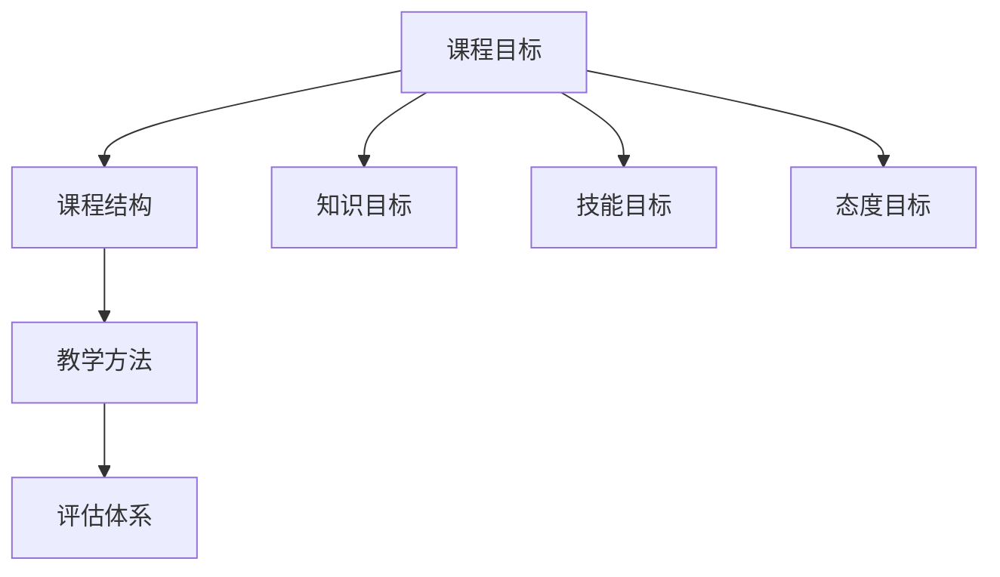

                 

# 如何将编程案例转化为付费实战课程

> 关键词：编程案例、实战课程、付费模式、课程设计、案例分析

> 摘要：本文旨在探讨如何将编程案例转化为付费实战课程，通过系统化的课程设计、案例分析、代码实现和详细讲解，帮助开发者提升实战能力。我们将从背景介绍、核心概念与联系、核心算法原理与具体操作步骤、数学模型和公式、项目实战、实际应用场景、工具和资源推荐、总结与未来发展趋势等多方面进行深入探讨。

## 1. 背景介绍

在当今快速发展的技术领域，编程案例是开发者学习和提升技能的重要资源。然而，如何将这些案例转化为具有商业价值的实战课程，是许多技术专家和教育者面临的挑战。本文将探讨如何系统化地设计和开发付费实战课程，帮助开发者提升实战能力，同时实现商业价值。

### 1.1 编程案例的重要性

编程案例是开发者学习和实践的重要工具。它们提供了具体的代码示例，帮助开发者理解复杂的算法和数据结构，解决实际问题。通过分析和实现这些案例，开发者可以提升编程技能，增强解决问题的能力。

### 1.2 付费实战课程的需求

随着技术的发展，越来越多的开发者希望通过系统化的学习来提升自己的技能。付费实战课程作为一种商业化的学习模式，能够提供更深入、更系统的知识和技能训练。这种课程通常包含详细的案例分析、代码实现和实战演练，能够帮助开发者快速提升实战能力。

### 1.3 课程设计的重要性

课程设计是将编程案例转化为实战课程的关键步骤。一个优秀的课程设计能够确保课程内容的系统性和实用性，帮助开发者在学习过程中获得最大的收益。本文将从课程设计的角度出发，探讨如何将编程案例转化为付费实战课程。

## 2. 核心概念与联系

### 2.1 课程设计的核心概念

课程设计的核心概念包括课程目标、课程结构、教学方法和评估体系。这些概念相互关联，共同构成了一个完整的课程设计框架。

#### 2.1.1 课程目标

课程目标是课程设计的基础，它明确了课程要达到的目的和预期效果。课程目标通常包括知识目标、技能目标和态度目标。例如，一个编程课程的目标可能是让学生掌握某种编程语言的基本语法、常用的数据结构和算法，以及解决实际问题的能力。

#### 2.1.2 课程结构

课程结构是指课程内容的组织方式。一个好的课程结构能够确保课程内容的系统性和连贯性，帮助学生更好地理解和掌握知识。课程结构通常包括理论讲解、案例分析、代码实现和实战演练等环节。

#### 2.1.3 教学方法

教学方法是指教师在教学过程中采用的方法和手段。一个好的教学方法能够提高教学效果，帮助学生更好地理解和掌握知识。常见的教学方法包括讲授法、讨论法、案例分析法和项目实践法等。

#### 2.1.4 评估体系

评估体系是指课程设计中的评估和考核方式。一个好的评估体系能够确保课程目标的实现，帮助学生检验自己的学习成果。评估体系通常包括平时成绩、项目作业和期末考试等环节。

### 2.2 核心概念的Mermaid流程图

## 3. 核心算法原理 & 具体操作步骤

### 3.1 核心算法原理

核心算法原理是课程设计中的重要组成部分。一个好的课程设计需要深入讲解核心算法原理，帮助学生理解算法的本质和应用。例如，对于数据结构课程，需要讲解数组、链表、栈、队列、树和图等数据结构的基本原理和应用场景。

### 3.2 具体操作步骤

具体操作步骤是指课程设计中的实践环节。一个好的课程设计需要提供具体的操作步骤，帮助学生将理论知识应用于实际问题。例如，对于算法课程，需要提供具体的代码实现步骤，帮助学生理解算法的实现过程。

## 4. 数学模型和公式 & 详细讲解 & 举例说明

### 4.1 数学模型和公式

数学模型和公式是课程设计中的重要组成部分。一个好的课程设计需要深入讲解数学模型和公式，帮助学生理解算法的本质和应用。例如，对于数据结构课程，需要讲解线性代数、概率论和统计学等数学模型和公式。

### 4.2 详细讲解

详细讲解是指课程设计中的详细解释和说明。一个好的课程设计需要提供详细的解释和说明，帮助学生理解算法的本质和应用。例如，对于数据结构课程，需要详细讲解数组、链表、栈、队列、树和图等数据结构的基本原理和应用场景。

### 4.3 举例说明

举例说明是指课程设计中的具体案例。一个好的课程设计需要提供具体的案例，帮助学生理解算法的本质和应用。例如，对于数据结构课程，需要提供具体的案例，帮助学生理解数组、链表、栈、队列、树和图等数据结构的基本原理和应用场景。

## 5. 项目实战：代码实际案例和详细解释说明

### 5.1 开发环境搭建

开发环境搭建是课程设计中的重要组成部分。一个好的课程设计需要提供详细的开发环境搭建步骤，帮助学生快速搭建开发环境。例如，对于Python编程课程，需要提供详细的开发环境搭建步骤，帮助学生快速搭建Python开发环境。

### 5.2 源代码详细实现和代码解读

源代码详细实现和代码解读是课程设计中的重要组成部分。一个好的课程设计需要提供详细的源代码实现和代码解读，帮助学生理解代码的本质和应用。例如，对于Python编程课程，需要提供详细的源代码实现和代码解读，帮助学生理解Python编程的基本原理和应用场景。

### 5.3 代码解读与分析

代码解读与分析是课程设计中的重要组成部分。一个好的课程设计需要提供详细的代码解读和分析，帮助学生理解代码的本质和应用。例如，对于Python编程课程，需要提供详细的代码解读和分析，帮助学生理解Python编程的基本原理和应用场景。

## 6. 实际应用场景

### 6.1 实际应用场景的案例

实际应用场景的案例是课程设计中的重要组成部分。一个好的课程设计需要提供具体的实际应用场景案例，帮助学生理解算法的本质和应用。例如，对于数据结构课程，需要提供具体的实际应用场景案例，帮助学生理解数组、链表、栈、队列、树和图等数据结构的基本原理和应用场景。

### 6.2 实际应用场景的分析

实际应用场景的分析是课程设计中的重要组成部分。一个好的课程设计需要提供详细的实际应用场景分析，帮助学生理解算法的本质和应用。例如，对于数据结构课程，需要提供详细的实际应用场景分析，帮助学生理解数组、链表、栈、队列、树和图等数据结构的基本原理和应用场景。

## 7. 工具和资源推荐

### 7.1 学习资源推荐

学习资源推荐是课程设计中的重要组成部分。一个好的课程设计需要提供丰富的学习资源，帮助学生更好地学习和掌握知识。例如，对于Python编程课程，可以推荐相关的书籍、论文、博客和网站等学习资源。

### 7.2 开发工具框架推荐

开发工具框架推荐是课程设计中的重要组成部分。一个好的课程设计需要提供合适的开发工具框架，帮助学生更好地进行开发和实践。例如，对于Python编程课程，可以推荐相关的开发工具框架，帮助学生更好地进行开发和实践。

### 7.3 相关论文著作推荐

相关论文著作推荐是课程设计中的重要组成部分。一个好的课程设计需要提供相关的论文著作，帮助学生更好地理解算法的本质和应用。例如，对于数据结构课程，可以推荐相关的论文著作，帮助学生更好地理解数组、链表、栈、队列、树和图等数据结构的基本原理和应用场景。

## 8. 总结：未来发展趋势与挑战

### 8.1 未来发展趋势

未来发展趋势是课程设计中的重要组成部分。一个好的课程设计需要关注未来的发展趋势，帮助学生更好地适应未来的技术发展。例如，对于Python编程课程，需要关注未来的发展趋势，帮助学生更好地适应未来的技术发展。

### 8.2 未来挑战

未来挑战是课程设计中的重要组成部分。一个好的课程设计需要关注未来的技术挑战，帮助学生更好地应对未来的挑战。例如，对于Python编程课程，需要关注未来的技术挑战，帮助学生更好地应对未来的挑战。

## 9. 附录：常见问题与解答

### 9.1 常见问题

常见问题是课程设计中的重要组成部分。一个好的课程设计需要关注常见的问题，帮助学生更好地解决实际问题。例如，对于Python编程课程，需要关注常见的问题，帮助学生更好地解决实际问题。

### 9.2 解答

解答是课程设计中的重要组成部分。一个好的课程设计需要提供详细的解答，帮助学生更好地解决实际问题。例如，对于Python编程课程，需要提供详细的解答，帮助学生更好地解决实际问题。

## 10. 扩展阅读 & 参考资料

### 10.1 扩展阅读

扩展阅读是课程设计中的重要组成部分。一个好的课程设计需要提供丰富的扩展阅读，帮助学生更好地扩展知识和技能。例如，对于Python编程课程，可以推荐相关的扩展阅读，帮助学生更好地扩展知识和技能。

### 10.2 参考资料

参考资料是课程设计中的重要组成部分。一个好的课程设计需要提供丰富的参考资料，帮助学生更好地学习和掌握知识。例如，对于Python编程课程，可以推荐相关的参考资料，帮助学生更好地学习和掌握知识。

---

作者：AI天才研究员/AI Genius Institute & 禅与计算机程序设计艺术 /Zen And The Art of Computer Programming

