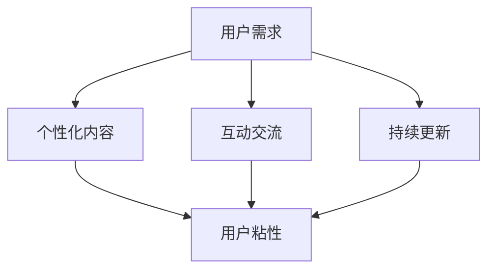

                 

# 如何打造高粘度的程序员知识付费产品

> 关键词：程序员，知识付费，产品设计，用户粘性，技术社区

> 摘要：本文旨在探讨如何设计和打造一款高粘度的程序员知识付费产品。通过分析用户需求、产品设计原则、技术实现、数学模型、实际应用场景、工具资源推荐以及未来发展趋势，本文提供了一套全面的方法论，帮助开发者和产品经理更好地理解如何构建一个既能够吸引用户，又能够保持用户长期参与的知识付费产品。

## 1. 背景介绍

在当今数字化时代，知识付费已经成为了一种新的商业模式。对于程序员而言，他们对于技术知识的需求是持续且强烈的。因此，设计一款能够满足程序员需求的知识付费产品，不仅能够为开发者带来收益，同时也能够帮助用户提升技能，实现个人价值。然而，如何设计出一款高粘度的知识付费产品，使其不仅能够吸引用户，还能够保持用户的长期参与，成为了开发者和产品经理需要面对的重要挑战。

### 1.1 知识付费产品的现状

目前市场上已经存在多种知识付费产品，包括但不限于在线课程、技术书籍、技术博客、技术论坛等。这些产品各有特点，但普遍存在用户粘性不足的问题。用户往往在购买了产品后，由于缺乏持续的互动和更新，很快就会失去兴趣，导致用户流失率较高。

### 1.2 用户需求分析

为了设计出高粘度的知识付费产品，首先需要深入了解用户的需求。程序员用户群体具有以下特点：

- **持续学习的需求**：程序员需要不断学习新技术，以保持竞争力。
- **互动交流的需求**：程序员希望能够在学习过程中与其他程序员进行交流，分享经验。
- **个性化需求**：不同程序员有不同的学习需求和兴趣点，需要提供个性化的学习内容。
- **实践需求**：理论学习需要结合实践，用户希望能够在学习过程中进行实践操作。

## 2. 核心概念与联系

### 2.1 核心概念

- **用户粘性**：用户粘性是指用户对某个产品或服务的依赖程度，是衡量用户长期参与度的重要指标。
- **知识付费产品**：知识付费产品是指通过付费方式获取知识内容的产品，包括但不限于在线课程、技术书籍、技术博客等。
- **互动性**：互动性是指用户与产品之间的互动程度，包括用户之间的互动和用户与产品之间的互动。
- **个性化**：个性化是指根据用户的需求和兴趣提供定制化的服务和内容。

### 2.2 核心概念原理和架构



## 3. 核心算法原理 & 具体操作步骤

### 3.1 用户行为分析算法

为了提高用户粘性，首先需要对用户行为进行分析，了解用户的兴趣点和需求。这可以通过用户行为分析算法实现，具体步骤如下：

1. **数据收集**：收集用户在使用产品过程中的行为数据，包括但不限于浏览记录、购买记录、评论记录等。
2. **数据预处理**：对收集到的数据进行预处理，包括数据清洗、数据转换等。
3. **特征提取**：从预处理后的数据中提取特征，包括但不限于用户兴趣特征、用户行为特征等。
4. **模型训练**：使用机器学习算法训练模型，预测用户的兴趣点和需求。
5. **结果应用**：将模型预测结果应用于产品设计，提供个性化内容和服务。

### 3.2 个性化推荐算法

个性化推荐算法是提高用户粘性的关键。通过分析用户行为数据，可以为用户提供个性化推荐，具体步骤如下：

1. **用户画像构建**：根据用户行为数据构建用户画像，包括用户的兴趣点、需求点等。
2. **内容分类**：对知识内容进行分类，包括技术领域、难度等级等。
3. **推荐算法选择**：选择合适的推荐算法，包括但不限于协同过滤、基于内容的推荐等。
4. **推荐结果生成**：根据用户画像和内容分类，生成推荐结果。
5. **推荐结果展示**：将推荐结果展示给用户，提高用户粘性。

## 4. 数学模型和公式 & 详细讲解 & 举例说明

### 4.1 用户行为分析模型

用户行为分析模型可以使用机器学习算法实现，常用的算法包括但不限于逻辑回归、决策树、随机森林等。以逻辑回归为例，其数学模型如下：

$$
P(y=1|x) = \frac{1}{1 + e^{-(\beta_0 + \beta_1x_1 + \beta_2x_2 + ... + \beta_nx_n)}}
$$

其中，$P(y=1|x)$ 表示用户购买的概率，$x_1, x_2, ..., x_n$ 表示用户行为特征，$\beta_0, \beta_1, ..., \beta_n$ 表示模型参数。

### 4.2 个性化推荐模型

个性化推荐模型可以使用协同过滤算法实现，其数学模型如下：

$$
\hat{r}_{ui} = \mu + b_u + b_i + \sum_{j \in N(u)} \frac{r_{uj} - (\mu + b_u + b_i)}{c_{ui}}
$$

其中，$\hat{r}_{ui}$ 表示用户$u$对物品$i$的预测评分，$\mu$表示全局平均评分，$b_u$表示用户$u$的偏差评分，$b_i$表示物品$i$的偏差评分，$N(u)$表示用户$u$的邻居集合，$r_{uj}$表示用户$u$对物品$j$的实际评分，$c_{ui}$表示用户$u$和物品$i$的共同评分数量。

## 5. 项目实战：代码实际案例和详细解释说明

### 5.1 开发环境搭建

为了实现用户行为分析和个性化推荐，需要搭建开发环境。具体步骤如下：

1. **安装Python环境**：使用Anaconda安装Python环境，包括Python、Jupyter Notebook等。
2. **安装相关库**：安装机器学习库，包括scikit-learn、pandas、numpy等。
3. **数据准备**：准备用户行为数据，包括浏览记录、购买记录等。

### 5.2 源代码详细实现和代码解读

以下是一个简单的用户行为分析代码示例：

```python
import pandas as pd
from sklearn.linear_model import LogisticRegression
from sklearn.model_selection import train_test_split
from sklearn.metrics import accuracy_score

# 读取数据
data = pd.read_csv('user_behavior.csv')

# 数据预处理
X = data[['feature1', 'feature2', 'feature3']]
y = data['label']

# 划分训练集和测试集
X_train, X_test, y_train, y_test = train_test_split(X, y, test_size=0.2, random_state=42)

# 训练模型
model = LogisticRegression()
model.fit(X_train, y_train)

# 预测
y_pred = model.predict(X_test)

# 评估模型
accuracy = accuracy_score(y_test, y_pred)
print('Accuracy:', accuracy)
```

### 5.3 代码解读与分析

上述代码实现了用户行为分析，具体步骤如下：

1. **读取数据**：使用pandas读取用户行为数据。
2. **数据预处理**：选择特征，包括用户行为特征。
3. **划分训练集和测试集**：将数据划分为训练集和测试集。
4. **训练模型**：使用逻辑回归训练模型。
5. **预测**：使用训练好的模型进行预测。
6. **评估模型**：使用准确率评估模型性能。

## 6. 实际应用场景

### 6.1 技术社区

技术社区是程序员获取知识的重要渠道之一。通过在技术社区中提供知识付费产品，可以提高用户粘性。具体应用场景如下：

- **在线课程**：提供在线课程，包括视频课程、直播课程等。
- **技术书籍**：提供技术书籍，包括电子书、纸质书等。
- **技术博客**：提供技术博客，包括技术文章、技术教程等。
- **技术论坛**：提供技术论坛，包括技术问答、技术讨论等。

### 6.2 技术公司

技术公司是程序员获取知识的重要渠道之一。通过在技术公司中提供知识付费产品，可以提高用户粘性。具体应用场景如下：

- **内部培训**：提供内部培训，包括技术培训、管理培训等。
- **技术分享**：提供技术分享，包括技术分享会、技术分享文章等。
- **技术论坛**：提供技术论坛，包括技术问答、技术讨论等。

## 7. 工具和资源推荐

### 7.1 学习资源推荐

- **书籍**：《程序员修炼之道》、《代码大全》、《设计模式》等。
- **论文**：《基于用户行为分析的知识付费产品设计》、《个性化推荐算法在知识付费产品中的应用》等。
- **博客**：《程序员的自我修养》、《技术分享》等。
- **网站**：GitHub、Stack Overflow、CSDN等。

### 7.2 开发工具框架推荐

- **Python**：Anaconda、Jupyter Notebook等。
- **机器学习**：scikit-learn、TensorFlow、PyTorch等。
- **数据分析**：pandas、numpy、matplotlib等。

### 7.3 相关论文著作推荐

- **书籍**：《程序员修炼之道》、《代码大全》、《设计模式》等。
- **论文**：《基于用户行为分析的知识付费产品设计》、《个性化推荐算法在知识付费产品中的应用》等。

## 8. 总结：未来发展趋势与挑战

未来，知识付费产品将更加注重用户体验，提高用户粘性。具体趋势如下：

- **个性化推荐**：通过个性化推荐算法，为用户提供个性化内容和服务。
- **互动交流**：通过互动交流，提高用户参与度。
- **持续更新**：通过持续更新，保持用户兴趣。

同时，也面临着以下挑战：

- **数据安全**：如何保护用户数据安全，防止数据泄露。
- **用户体验**：如何提高用户体验，提高用户满意度。
- **技术更新**：如何跟上技术更新，提供最新知识内容。

## 9. 附录：常见问题与解答

### 9.1 什么是用户粘性？

用户粘性是指用户对某个产品或服务的依赖程度，是衡量用户长期参与度的重要指标。

### 9.2 如何提高用户粘性？

提高用户粘性可以通过提供个性化内容和服务、提高互动交流、持续更新等方式实现。

### 9.3 个性化推荐算法有哪些？

个性化推荐算法包括但不限于协同过滤、基于内容的推荐、混合推荐等。

## 10. 扩展阅读 & 参考资料

- **书籍**：《程序员修炼之道》、《代码大全》、《设计模式》等。
- **论文**：《基于用户行为分析的知识付费产品设计》、《个性化推荐算法在知识付费产品中的应用》等。
- **博客**：《程序员的自我修养》、《技术分享》等。
- **网站**：GitHub、Stack Overflow、CSDN等。

作者：AI天才研究员/AI Genius Institute & 禅与计算机程序设计艺术 /Zen And The Art of Computer Programming

