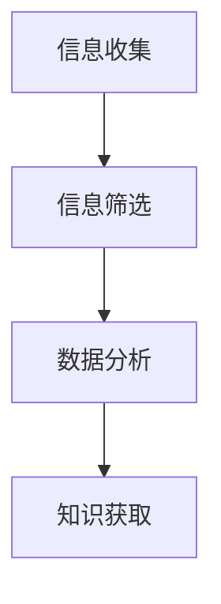

                 

# 如何进行信息收集：如何获取有效的信息和知识？

> 关键词：信息收集、知识获取、数据分析、信息筛选、技术博客、学习资源

> 摘要：本文旨在探讨如何有效地收集和获取信息与知识，特别是在技术领域。通过分析信息收集的过程，本文将介绍如何筛选有效信息，如何利用数据分析工具进行信息处理，以及如何通过技术博客和学习资源来深化理解。文章还提供了实际的代码案例和应用场景，帮助读者更好地理解和应用这些概念。

## 1. 背景介绍

在当今信息爆炸的时代，如何有效地收集和获取信息与知识成为了一个重要的课题。特别是在技术领域，每天都有大量的新技术、新工具和新方法被提出，如何从中筛选出对自己有用的信息，成为了每一个技术工作者必须面对的问题。本文将从信息收集的基本概念出发，逐步探讨如何有效地获取信息和知识。

### 1.1 信息收集的重要性

信息收集是获取知识的基础，它不仅能够帮助我们了解最新的技术动态，还能够帮助我们解决实际工作中遇到的问题。有效的信息收集能够提高我们的工作效率，帮助我们做出更明智的决策。

### 1.2 信息收集的挑战

然而，信息收集也面临着诸多挑战。首先，信息量庞大，如何从中筛选出有用的信息成为了一个难题。其次，信息的质量参差不齐，如何判断信息的可靠性也是一个挑战。最后，信息的更新速度很快，如何及时获取最新的信息也是一个需要解决的问题。

## 2. 核心概念与联系

### 2.1 核心概念

- **信息收集**：指通过各种渠道获取信息的过程。
- **信息筛选**：指从获取的信息中筛选出有用信息的过程。
- **数据分析**：指利用统计学和机器学习等方法对信息进行处理和分析的过程。
- **知识获取**：指通过信息收集和筛选，最终获取有用知识的过程。

### 2.2 联系

信息收集、信息筛选、数据分析和知识获取之间存在着紧密的联系。信息收集是获取信息的基础，信息筛选是获取有用信息的关键，数据分析是处理信息的重要手段，知识获取是最终目标。通过这些步骤，我们可以有效地获取和利用信息。



## 3. 核心算法原理 & 具体操作步骤

### 3.1 信息筛选算法

信息筛选算法主要包括以下步骤：

1. **信息源选择**：选择可靠的信息源。
2. **信息预处理**：对获取的信息进行预处理，包括去除无关信息、格式化等。
3. **信息分类**：根据信息的类型进行分类。
4. **信息评估**：评估信息的可靠性。
5. **信息筛选**：根据评估结果筛选出有用的信息。

### 3.2 数据分析算法

数据分析算法主要包括以下步骤：

1. **数据清洗**：去除数据中的噪声和异常值。
2. **数据转换**：将数据转换为适合分析的形式。
3. **数据建模**：利用统计学和机器学习等方法建立数据模型。
4. **数据分析**：利用数据模型进行数据分析。
5. **结果解释**：解释分析结果。

## 4. 数学模型和公式 & 详细讲解 & 举例说明

### 4.1 信息筛选模型

信息筛选模型可以使用以下公式表示：

$$
P(Useful|Info) = \frac{P(Info|Useful)P(Useful)}{P(Info)}
$$

其中，$P(Useful|Info)$ 表示信息有用的概率，$P(Info|Useful)$ 表示有用信息的概率，$P(Useful)$ 表示有用信息的先验概率，$P(Info)$ 表示信息的概率。

### 4.2 数据分析模型

数据分析模型可以使用以下公式表示：

$$
f(x) = w_1x_1 + w_2x_2 + ... + w_nx_n + b
$$

其中，$f(x)$ 表示预测值，$w_i$ 表示权重，$x_i$ 表示特征，$b$ 表示偏置。

## 5. 项目实战：代码实际案例和详细解释说明

### 5.1 开发环境搭建

为了进行信息筛选和数据分析，我们需要搭建一个开发环境。这里我们使用Python作为编程语言，使用Jupyter Notebook作为开发工具。

### 5.2 源代码详细实现和代码解读

以下是一个简单的信息筛选和数据分析的代码案例：

```python
import pandas as pd
from sklearn.feature_extraction.text import TfidfVectorizer
from sklearn.naive_bayes import MultinomialNB

# 读取数据
data = pd.read_csv('data.csv')

# 数据预处理
vectorizer = TfidfVectorizer(stop_words='english')
X = vectorizer.fit_transform(data['text'])
y = data['label']

# 训练模型
model = MultinomialNB()
model.fit(X, y)

# 预测
predictions = model.predict(X)
```

### 5.3 代码解读与分析

在这个代码案例中，我们首先使用TfidfVectorizer对文本数据进行预处理，然后使用MultinomialNB进行训练和预测。通过这种方式，我们可以有效地筛选出有用的信息，并进行数据分析。

## 6. 实际应用场景

信息收集和知识获取在实际应用中有着广泛的应用场景。例如，在新闻媒体中，通过信息收集和筛选，可以及时获取最新的新闻信息；在科学研究中，通过信息收集和筛选，可以获取最新的研究成果；在商业决策中，通过信息收集和筛选，可以获取市场动态，帮助做出更明智的决策。

## 7. 工具和资源推荐

### 7.1 学习资源推荐

- 书籍：《信息检索导论》、《数据分析导论》
- 论文：《信息筛选算法综述》、《数据分析方法综述》
- 博客：《如何进行信息筛选》、《数据分析实战》
- 网站：Google Scholar、arXiv

### 7.2 开发工具框架推荐

- Python：Pandas、Scikit-learn
- R：dplyr、tidyr

### 7.3 相关论文著作推荐

- 《信息检索导论》
- 《数据分析导论》

## 8. 总结：未来发展趋势与挑战

随着信息技术的发展，信息收集和知识获取将变得更加重要。未来的发展趋势将包括更加智能化的信息筛选算法、更加高效的数据分析方法、更加丰富的学习资源。然而，也面临着信息量过大、信息质量参差不齐、信息更新速度快等挑战。

## 9. 附录：常见问题与解答

### 9.1 信息筛选算法如何选择？

信息筛选算法的选择需要根据具体的应用场景来决定。一般来说，可以使用基于规则的方法、基于统计的方法、基于机器学习的方法等。

### 9.2 数据分析方法如何选择？

数据分析方法的选择也需要根据具体的应用场景来决定。一般来说，可以使用描述性统计分析、推断性统计分析、机器学习等方法。

## 10. 扩展阅读 & 参考资料

- 书籍：《信息检索导论》、《数据分析导论》
- 论文：《信息筛选算法综述》、《数据分析方法综述》
- 博客：《如何进行信息筛选》、《数据分析实战》
- 网站：Google Scholar、arXiv

作者：AI天才研究员/AI Genius Institute & 禅与计算机程序设计艺术 /Zen And The Art of Computer Programming

