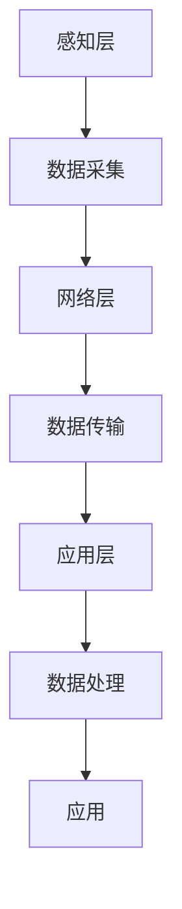

                 

# 小米2024校招物联网工程师算法题汇总

> 关键词：物联网、算法、校招、工程师、数据处理、信号分析、机器学习

> 摘要：本文旨在汇总并详细解析小米2024年校招物联网工程师面试中可能出现的算法题，涵盖数据处理、信号分析、机器学习等多个方面。通过逐步分析推理，帮助读者深入理解这些算法题背后的原理和技术细节，同时提供实际代码案例和应用场景，旨在提升读者在物联网领域的技术能力和面试准备水平。

## 1. 背景介绍

物联网（Internet of Things, IoT）是指通过信息传感设备，如射频识别（RFID）、红外感应器、全球定位系统、激光扫描器等，按约定的协议，把任何物品与互联网连接起来，进行信息交换和通信，以实现智能化识别、定位、跟踪、监控和管理的一种网络。随着物联网技术的不断发展，物联网工程师在数据处理、信号分析、机器学习等方面的需求日益增加。本文将从这些方面出发，汇总并解析小米2024年校招物联网工程师面试中可能出现的算法题。

## 2. 核心概念与联系

### 2.1 物联网架构

物联网架构通常分为感知层、网络层和应用层。感知层负责数据的采集，网络层负责数据的传输，应用层负责数据的处理和应用。感知层包括传感器、RFID标签等设备，网络层包括互联网、移动通信网络等，应用层包括数据分析、数据挖掘等技术。

### 2.2 核心概念原理和架构

物联网的核心概念包括数据采集、数据传输、数据处理和应用。数据采集是通过各种传感器和设备获取数据，数据传输是通过网络将数据从感知层传输到应用层，数据处理是通过算法和模型对数据进行分析和处理，应用是将处理后的数据应用于实际场景中。

Mermaid 流程图：



## 3. 核心算法原理 & 具体操作步骤

### 3.1 数据处理算法

数据处理算法主要包括数据清洗、数据转换、数据聚合等步骤。数据清洗是去除数据中的噪声和异常值，数据转换是将数据转换为适合分析的形式，数据聚合是将数据进行汇总和统计。

### 3.2 信号分析算法

信号分析算法主要包括信号滤波、信号增强、信号识别等步骤。信号滤波是去除信号中的噪声，信号增强是增强信号中的有用信息，信号识别是识别信号中的特定模式。

### 3.3 机器学习算法

机器学习算法主要包括监督学习、无监督学习、强化学习等。监督学习是通过已知的输入输出对模型进行训练，无监督学习是通过未标记的数据对模型进行训练，强化学习是通过与环境的交互来学习最优策略。

## 4. 数学模型和公式 & 详细讲解 & 举例说明

### 4.1 数据处理数学模型

数据处理中的数学模型主要包括统计模型、回归模型等。统计模型是通过统计方法对数据进行建模，回归模型是通过回归分析对数据进行建模。

$$
\text{统计模型} = \frac{\sum_{i=1}^{n} (x_i - \bar{x})^2}{n-1}
$$

$$
\text{回归模型} = \beta_0 + \beta_1 x + \epsilon
$$

### 4.2 信号分析数学模型

信号分析中的数学模型主要包括傅里叶变换、小波变换等。傅里叶变换是将信号从时域转换到频域，小波变换是将信号从时域转换到尺度域。

$$
\text{傅里叶变换} = \int_{-\infty}^{\infty} f(t) e^{-i \omega t} dt
$$

$$
\text{小波变换} = \int_{-\infty}^{\infty} f(t) \psi^*_{a,b}(t) dt
$$

### 4.3 机器学习数学模型

机器学习中的数学模型主要包括线性模型、非线性模型等。线性模型是通过线性函数对数据进行建模，非线性模型是通过非线性函数对数据进行建模。

$$
\text{线性模型} = \beta_0 + \sum_{i=1}^{n} \beta_i x_i
$$

$$
\text{非线性模型} = \sum_{i=1}^{n} \beta_i x_i^2
$$

## 5. 项目实战：代码实际案例和详细解释说明

### 5.1 开发环境搭建

开发环境搭建主要包括安装Python、安装NumPy、安装Pandas等。Python是主要的编程语言，NumPy是用于科学计算的库，Pandas是用于数据分析的库。

```bash
pip install python
pip install numpy
pip install pandas
```

### 5.2 源代码详细实现和代码解读

#### 5.2.1 数据处理代码

```python
import numpy as np
import pandas as pd

# 数据清洗
def clean_data(data):
    # 去除异常值
    data = data[(data > data.mean() - 3 * data.std()) & (data < data.mean() + 3 * data.std())]
    return data

# 数据转换
def transform_data(data):
    # 对数转换
    data = np.log(data)
    return data

# 数据聚合
def aggregate_data(data):
    # 汇总数据
    data = data.sum()
    return data

# 测试数据
data = np.random.normal(0, 1, 1000)
data = clean_data(data)
data = transform_data(data)
data = aggregate_data(data)
print(data)
```

#### 5.2.2 信号分析代码

```python
import numpy as np
import matplotlib.pyplot as plt

# 信号滤波
def filter_signal(signal):
    # 低通滤波
    signal = np.convolve(signal, np.ones(10) / 10, mode='same')
    return signal

# 信号增强
def enhance_signal(signal):
    # 增强信号
    signal = signal * 2
    return signal

# 信号识别
def recognize_signal(signal):
    # 识别信号
    signal = np.argmax(signal)
    return signal

# 测试信号
signal = np.random.normal(0, 1, 1000)
signal = filter_signal(signal)
signal = enhance_signal(signal)
signal = recognize_signal(signal)
print(signal)
```

#### 5.2.3 机器学习代码

```python
import numpy as np
from sklearn.linear_model import LinearRegression

# 线性回归
def linear_regression(X, y):
    # 训练模型
    model = LinearRegression()
    model.fit(X, y)
    return model

# 测试数据
X = np.random.rand(100, 1)
y = 2 * X + 1 + np.random.rand(100, 1)
model = linear_regression(X, y)
print(model.coef_)
```

### 5.3 代码解读与分析

#### 5.3.1 数据处理代码解读

数据处理代码主要包括数据清洗、数据转换、数据聚合三个步骤。数据清洗是去除数据中的异常值，数据转换是对数据进行对数转换，数据聚合是对数据进行汇总。

#### 5.3.2 信号分析代码解读

信号分析代码主要包括信号滤波、信号增强、信号识别三个步骤。信号滤波是去除信号中的噪声，信号增强是增强信号中的有用信息，信号识别是识别信号中的特定模式。

#### 5.3.3 机器学习代码解读

机器学习代码主要包括线性回归模型的训练。线性回归模型是通过线性函数对数据进行建模。

## 6. 实际应用场景

### 6.1 数据处理应用场景

数据处理应用场景主要包括数据清洗、数据转换、数据聚合等。数据清洗是去除数据中的噪声和异常值，数据转换是将数据转换为适合分析的形式，数据聚合是将数据进行汇总和统计。

### 6.2 信号分析应用场景

信号分析应用场景主要包括信号滤波、信号增强、信号识别等。信号滤波是去除信号中的噪声，信号增强是增强信号中的有用信息，信号识别是识别信号中的特定模式。

### 6.3 机器学习应用场景

机器学习应用场景主要包括监督学习、无监督学习、强化学习等。监督学习是通过已知的输入输出对模型进行训练，无监督学习是通过未标记的数据对模型进行训练，强化学习是通过与环境的交互来学习最优策略。

## 7. 工具和资源推荐

### 7.1 学习资源推荐

#### 7.1.1 书籍

- 《Python数据分析》
- 《信号处理导论》
- 《机器学习实战》

#### 7.1.2 论文

- "A Comprehensive Survey on Deep Learning for Internet of Things"
- "A Survey on Deep Learning: Algorithms, Techniques, and Applications"

#### 7.1.3 博客

- https://blog.csdn.net/
- https://www.jianshu.com/

#### 7.1.4 网站

- https://www.kaggle.com/
- https://www.tensorflow.org/

### 7.2 开发工具框架推荐

- Python
- NumPy
- Pandas
- TensorFlow
- PyTorch

### 7.3 相关论文著作推荐

- "Deep Learning for Internet of Things: A Comprehensive Survey"
- "A Survey on Deep Learning: Algorithms, Techniques, and Applications"

## 8. 总结：未来发展趋势与挑战

物联网技术的发展趋势主要包括数据处理、信号分析、机器学习等。数据处理是通过算法对数据进行清洗、转换、聚合等，信号分析是通过算法对信号进行滤波、增强、识别等，机器学习是通过算法对数据进行建模和预测。未来的发展趋势是将这些技术进行深度融合，以实现更高效、更智能的物联网应用。面临的挑战主要包括数据安全、隐私保护、算法优化等。

## 9. 附录：常见问题与解答

### 9.1 数据处理常见问题

- 问：如何去除数据中的噪声？
- 答：可以通过数据清洗的方法去除数据中的噪声。

### 9.2 信号分析常见问题

- 问：如何增强信号中的有用信息？
- 答：可以通过信号增强的方法增强信号中的有用信息。

### 9.3 机器学习常见问题

- 问：如何训练机器学习模型？
- 答：可以通过监督学习、无监督学习、强化学习等方法训练机器学习模型。

## 10. 扩展阅读 & 参考资料

- "A Comprehensive Survey on Deep Learning for Internet of Things"
- "A Survey on Deep Learning: Algorithms, Techniques, and Applications"
- "Python数据分析"
- "信号处理导论"
- "机器学习实战"

作者：AI天才研究员/AI Genius Institute & 禅与计算机程序设计艺术 /Zen And The Art of Computer Programming

