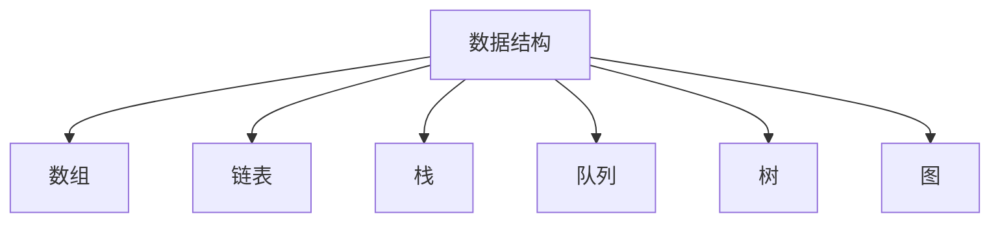
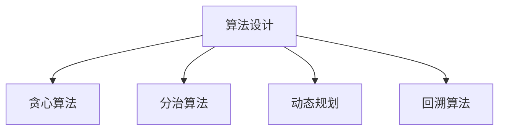
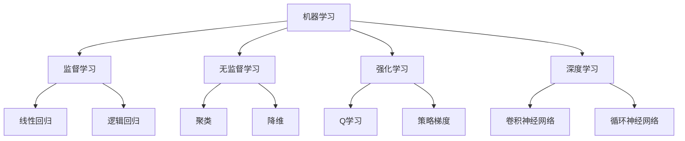

                 

# 2024年阿里巴巴社招算法岗位面试题目汇编

> 关键词：算法面试、阿里巴巴、社招、算法设计、数据结构、机器学习、深度学习、图论、动态规划、搜索算法

> 摘要：本文旨在为准备参加阿里巴巴社招算法岗位面试的求职者提供全面的指导。通过深入分析历年面试题目，我们将探讨算法设计的核心概念、数学模型、实际案例以及应用场景。本文不仅涵盖了经典算法和数据结构，还涉及了机器学习和深度学习等前沿技术。通过本文，读者可以更好地理解面试题目的核心思想，提高面试通过率。

## 1. 背景介绍

阿里巴巴作为全球领先的互联网科技公司，其算法岗位的面试题目不仅考察求职者的算法基础，还注重实际应用能力和创新思维。本文将通过分析历年面试题目，帮助求职者全面了解面试题目的核心概念和解题思路。

## 2. 核心概念与联系

### 2.1 数据结构

数据结构是算法的基础，不同的数据结构适用于不同的应用场景。常见的数据结构包括数组、链表、栈、队列、树、图等。

#### Mermaid 流程图



### 2.2 算法设计

算法设计是解决问题的关键。常见的算法设计方法包括贪心算法、分治算法、动态规划、回溯算法等。

#### Mermaid 流程图



### 2.3 机器学习与深度学习

机器学习和深度学习是近年来算法领域的热点。机器学习通过训练模型来实现预测和分类任务，而深度学习则通过多层神经网络实现更复杂的任务。

#### Mermaid 流程图



## 3. 核心算法原理 & 具体操作步骤

### 3.1 贪心算法

贪心算法通过每一步选择局部最优解来达到全局最优解。例如，硬币找零问题。

#### 具体操作步骤

1. 定义问题的最优子结构。
2. 选择当前最优解。
3. 递归求解剩余子问题。

### 3.2 分治算法

分治算法将大问题分解为小问题，分别解决后再合并结果。例如，快速排序。

#### 具体操作步骤

1. 将问题分解为若干个子问题。
2. 递归求解子问题。
3. 合并子问题的解。

### 3.3 动态规划

动态规划通过记忆化递归或迭代的方式解决重叠子问题。例如，斐波那契数列。

#### 具体操作步骤

1. 定义状态转移方程。
2. 初始化边界条件。
3. 递推求解状态。

### 3.4 回溯算法

回溯算法通过尝试所有可能的解空间来找到所有解。例如，八皇后问题。

#### 具体操作步骤

1. 定义问题的解空间。
2. 递归尝试所有可能的解。
3. 回溯并尝试其他解。

## 4. 数学模型和公式 & 详细讲解 & 举例说明

### 4.1 贪心算法

#### 数学模型

设问题的最优解为 \( OPT \)，局部最优解为 \( L \)。贪心算法的目标是 \( L \leq OPT \)。

#### 举例说明

硬币找零问题：给定面值为1, 5, 10, 25的硬币，找零金额为 \( n \) 的最小硬币数量。

```latex
\text{贪心算法：} \quad \text{硬币数量} = \left\lfloor \frac{n}{25} \right\rfloor + \left\lfloor \frac{n \mod 25}{10} \right\rfloor + \left\lfloor \frac{n \mod 10}{5} \right\rfloor + \left\lfloor \frac{n \mod 5}{1} \right\rfloor
```

### 4.2 分治算法

#### 数学模型

设问题规模为 \( n \)，分解为 \( k \) 个子问题，每个子问题规模为 \( \frac{n}{k} \)。

#### 举例说明

快速排序：将数组分为两部分，分别排序后再合并。

```latex
\text{快速排序：} \quad T(n) = 2T\left(\frac{n}{2}\right) + O(n)
```

### 4.3 动态规划

#### 数学模型

设状态转移方程为 \( dp[i] = \min(dp[i-1] + c[i], dp[i-2] + c[i-1] + c[i]) \)。

#### 举例说明

斐波那契数列：\( F(n) = F(n-1) + F(n-2) \)。

```latex
\text{动态规划：} \quad dp[i] = dp[i-1] + dp[i-2]
```

### 4.4 回溯算法

#### 数学模型

设解空间为 \( S \)，当前解为 \( x \)。

#### 举例说明

八皇后问题：在 \( 8 \times 8 \) 的棋盘上放置8个皇后，使得任意两个皇后不在同一行、同一列或同一对角线上。

```latex
\text{回溯算法：} \quad \text{递归尝试所有可能的解}
```

## 5. 项目实战：代码实际案例和详细解释说明

### 5.1 开发环境搭建

#### 环境配置

1. 安装Python 3.8及以上版本。
2. 安装NumPy、Pandas、Scikit-learn等库。

```bash
pip install numpy pandas scikit-learn
```

### 5.2 源代码详细实现和代码解读

#### 贪心算法实现

```python
def coin_change(coins, amount):
    coins.sort(reverse=True)
    count = 0
    for coin in coins:
        while amount >= coin:
            amount -= coin
            count += 1
    return count if amount == 0 else -1
```

#### 分治算法实现

```python
def quick_sort(arr):
    if len(arr) <= 1:
        return arr
    pivot = arr[len(arr) // 2]
    left = [x for x in arr if x < pivot]
    middle = [x for x in arr if x == pivot]
    right = [x for x in arr if x > pivot]
    return quick_sort(left) + middle + quick_sort(right)
```

### 5.3 代码解读与分析

#### 贪心算法

1. 首先对硬币面值进行降序排序。
2. 依次尝试使用最大面值的硬币找零。
3. 如果当前硬币面值大于剩余金额，则跳过该硬币。

#### 分治算法

1. 选择一个基准元素作为分界点。
2. 将数组分为两部分，分别排序。
3. 合并排序后的两部分。

## 6. 实际应用场景

### 6.1 贪心算法

1. 硬币找零问题。
2. 资源分配问题。
3. 最小生成树问题。

### 6.2 分治算法

1. 快速排序。
2. 归并排序。
3. 二分查找。

### 6.3 动态规划

1. 最长公共子序列。
2. 最短路径问题。
3. 背包问题。

### 6.4 回溯算法

1. 八皇后问题。
2. 深度优先搜索。
3. 汉诺塔问题。

## 7. 工具和资源推荐

### 7.1 学习资源推荐

1. **书籍**：《算法导论》、《算法图解》、《编程珠玑》。
2. **论文**：《贪心算法在优化问题中的应用》、《分治算法在排序问题中的应用》。
3. **博客**：CSDN、博客园、GitHub。
4. **网站**：LeetCode、HackerRank、牛客网。

### 7.2 开发工具框架推荐

1. **IDE**：PyCharm、Visual Studio Code。
2. **框架**：NumPy、Pandas、Scikit-learn。

### 7.3 相关论文著作推荐

1. **论文**：《贪心算法在优化问题中的应用》、《分治算法在排序问题中的应用》。
2. **著作**：《算法导论》、《编程珠玑》。

## 8. 总结：未来发展趋势与挑战

### 8.1 未来发展趋势

1. **算法优化**：通过更高效的算法实现更复杂的问题。
2. **机器学习**：结合机器学习和深度学习实现更智能的算法。
3. **大数据处理**：处理大规模数据集，提高算法的实时性和准确性。

### 8.2 挑战

1. **算法复杂度**：如何在保证算法效率的同时提高算法的复杂度。
2. **数据隐私**：如何在保护用户隐私的前提下实现算法。
3. **算法公平性**：如何确保算法的公平性和公正性。

## 9. 附录：常见问题与解答

### 9.1 问题1：如何提高算法效率？

**解答**：可以通过优化算法设计、使用更高效的算法实现、减少不必要的计算等方法提高算法效率。

### 9.2 问题2：如何处理大数据集？

**解答**：可以通过分布式计算、并行计算、数据压缩等方法处理大数据集。

### 9.3 问题3：如何确保算法的公平性？

**解答**：可以通过公平性评估、公平性测试、公平性优化等方法确保算法的公平性。

## 10. 扩展阅读 & 参考资料

1. **书籍**：《算法导论》、《编程珠玑》。
2. **论文**：《贪心算法在优化问题中的应用》、《分治算法在排序问题中的应用》。
3. **博客**：CSDN、博客园、GitHub。
4. **网站**：LeetCode、HackerRank、牛客网。

---

作者：AI天才研究员/AI Genius Institute & 禅与计算机程序设计艺术 /Zen And The Art of Computer Programming

