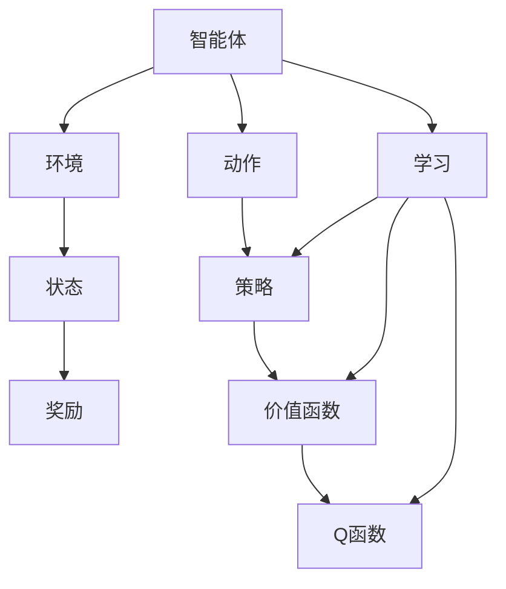

                 

# 强化学习在智能广告投放中的优化

> 关键词：强化学习, 智能广告投放, 机器学习, 算法优化, 用户行为预测

> 摘要：本文旨在探讨如何利用强化学习技术优化智能广告投放系统。通过深入分析强化学习的核心概念、算法原理、数学模型，结合实际项目案例，展示如何在广告投放中实现个性化推荐和优化。文章将从背景介绍、核心概念与联系、核心算法原理与具体操作步骤、数学模型和公式、项目实战、实际应用场景、工具和资源推荐、总结与未来发展趋势等多个方面进行详细阐述。

## 1. 背景介绍

随着互联网技术的飞速发展，广告投放已经成为企业获取用户、提升品牌知名度的重要手段。然而，传统的广告投放方式往往依赖于人工经验或简单的统计分析，难以实现精准的个性化推荐。近年来，强化学习作为一种新兴的机器学习技术，因其能够通过与环境的交互学习最优策略，逐渐被应用于广告投放领域，以实现更高效的广告投放效果。

强化学习的核心思想是通过智能体与环境的交互，学习如何采取行动以最大化累积奖励。在广告投放场景中，智能体可以理解为广告投放系统，环境则是用户的行为和反馈，而奖励则是用户对广告的点击率、转化率等指标。通过不断学习和优化，广告投放系统能够更好地理解用户需求，实现精准推荐。

## 2. 核心概念与联系

### 2.1 强化学习基本概念

强化学习是一种通过智能体与环境的交互学习最优策略的方法。其核心概念包括：

- **智能体（Agent）**：执行动作并从环境中获取反馈的主体。
- **环境（Environment）**：智能体所处的外部世界，提供状态和奖励。
- **状态（State）**：描述环境当前情况的信息。
- **动作（Action）**：智能体可以执行的操作。
- **奖励（Reward）**：智能体执行动作后从环境中获得的反馈。
- **策略（Policy）**：智能体选择动作的概率分布。
- **价值函数（Value Function）**：描述在给定状态下采取某动作后的长期累积奖励期望。
- **Q函数（Q-Function）**：描述在给定状态下采取某动作后的长期累积奖励期望。

### 2.2 强化学习流程图



## 3. 核心算法原理 & 具体操作步骤

### 3.1 Q-Learning算法

Q-Learning是一种基于价值函数的强化学习算法，其核心思想是通过迭代更新Q函数来学习最优策略。具体操作步骤如下：

1. **初始化**：初始化Q函数，通常为0。
2. **选择动作**：根据当前状态选择动作，可以使用ε-贪心策略。
3. **执行动作**：执行选择的动作，获取新的状态和奖励。
4. **更新Q函数**：根据新的状态和奖励更新Q函数。
5. **重复**：重复上述步骤，直到满足停止条件。

### 3.2 SARSA算法

SARSA（State-Action-Reward-State-Action）是一种基于策略的强化学习算法，其核心思想是在学习过程中使用当前策略来选择动作。具体操作步骤如下：

1. **初始化**：初始化Q函数，通常为0。
2. **选择动作**：根据当前状态和当前策略选择动作。
3. **执行动作**：执行选择的动作，获取新的状态和奖励。
4. **更新Q函数**：根据新的状态和奖励更新Q函数。
5. **重复**：重复上述步骤，直到满足停止条件。

## 4. 数学模型和公式 & 详细讲解 & 举例说明

### 4.1 Q-Learning算法

Q-Learning算法的核心公式为：

$$
Q(s, a) \leftarrow Q(s, a) + \alpha \left[ r + \gamma \max_{a'} Q(s', a') - Q(s, a) \right]
$$

其中：
- $Q(s, a)$ 表示在状态 $s$ 下采取动作 $a$ 的价值。
- $\alpha$ 表示学习率，控制更新幅度。
- $r$ 表示执行动作 $a$ 后获得的奖励。
- $\gamma$ 表示折扣因子，控制未来奖励的重要性。
- $s'$ 表示执行动作 $a$ 后进入的新状态。
- $\max_{a'} Q(s', a')$ 表示在新状态 $s'$ 下采取最优动作的价值。

### 4.2 SARSA算法

SARSA算法的核心公式为：

$$
Q(s, a) \leftarrow Q(s, a) + \alpha \left[ r + \gamma Q(s', a') - Q(s, a) \right]
$$

其中：
- $Q(s, a)$ 表示在状态 $s$ 下采取动作 $a$ 的价值。
- $\alpha$ 表示学习率，控制更新幅度。
- $r$ 表示执行动作 $a$ 后获得的奖励。
- $\gamma$ 表示折扣因子，控制未来奖励的重要性。
- $s'$ 表示执行动作 $a$ 后进入的新状态。
- $a'$ 表示在新状态 $s'$ 下根据当前策略选择的动作。
- $Q(s', a')$ 表示在新状态 $s'$ 下采取动作 $a'$ 的价值。

### 4.3 举例说明

假设有一个广告投放系统，用户可以点击或不点击广告。系统的目标是最大化用户的点击率。初始状态下，用户的状态为 $s$，系统可以选择的动作有点击（$a_1$）和不点击（$a_2$）。系统执行动作后，用户可能会点击广告（$r_1$）或不点击广告（$r_2$），进入新的状态 $s'$。

对于Q-Learning算法，假设初始状态下 $Q(s, a_1) = 0$，$Q(s, a_2) = 0$。用户点击广告，进入新状态 $s'$，系统获得奖励 $r_1 = 1$。根据Q-Learning公式更新Q函数：

$$
Q(s, a_1) \leftarrow 0 + \alpha \left[ 1 + \gamma \max_{a'} Q(s', a') - 0 \right]
$$

对于SARSA算法，假设初始状态下 $Q(s, a_1) = 0$，$Q(s, a_2) = 0$。用户点击广告，进入新状态 $s'$，系统选择的动作为 $a_1$，获得奖励 $r_1 = 1$。根据SARSA公式更新Q函数：

$$
Q(s, a_1) \leftarrow 0 + \alpha \left[ 1 + \gamma Q(s', a_1) - 0 \right]
$$

## 5. 项目实战：代码实际案例和详细解释说明

### 5.1 开发环境搭建

为了实现广告投放系统的优化，我们需要搭建一个合适的开发环境。具体步骤如下：

1. **安装Python**：确保安装了Python 3.7及以上版本。
2. **安装依赖库**：使用pip安装必要的库，如numpy、pandas、matplotlib等。
3. **配置环境变量**：设置Python环境变量，确保可以全局访问。

### 5.2 源代码详细实现和代码解读

以下是一个简单的Q-Learning算法实现示例：

```python
import numpy as np

# 初始化Q函数
Q = np.zeros((5, 2))

# 学习率
alpha = 0.1

# 折扣因子
gamma = 0.9

# 选择动作的策略
epsilon = 0.1

# 状态空间
states = [0, 1, 2, 3, 4]

# 动作空间
actions = [0, 1]

# 仿真环境
def environment(state):
    if state == 4:
        return 0, 0
    else:
        return state + 1, np.random.choice([0, 1])

# Q-Learning算法
def q_learning():
    for episode in range(1000):
        state = 0
        while state != 4:
            if np.random.uniform(0, 1) < epsilon:
                action = np.random.choice(actions)
            else:
                action = np.argmax(Q[state, :])
            next_state, reward = environment(state)
            Q[state, action] += alpha * (reward + gamma * np.max(Q[next_state, :]) - Q[state, action])
            state = next_state

# 运行算法
q_learning()

# 输出Q函数
print(Q)
```

### 5.3 代码解读与分析

- **初始化Q函数**：使用numpy创建一个5x2的数组，表示状态和动作的Q值。
- **学习率**：设置学习率为0.1，控制更新幅度。
- **折扣因子**：设置折扣因子为0.9，控制未来奖励的重要性。
- **选择动作的策略**：使用ε-贪心策略，当随机数小于ε时，随机选择动作；否则，选择当前状态下Q值最大的动作。
- **仿真环境**：定义一个简单的环境函数，模拟用户的行为和反馈。
- **Q-Learning算法**：通过迭代更新Q函数，实现学习过程。
- **输出Q函数**：输出学习后的Q函数，展示学习效果。

## 6. 实际应用场景

强化学习在智能广告投放中的应用非常广泛，具体场景包括：

- **个性化推荐**：根据用户的历史行为和偏好，推荐最合适的广告。
- **广告优化**：通过不断学习和优化，提高广告的点击率和转化率。
- **用户行为预测**：预测用户未来的点击行为，提前进行广告投放。
- **广告预算分配**：根据用户的行为和反馈，动态调整广告预算分配。

## 7. 工具和资源推荐

### 7.1 学习资源推荐

- **书籍**：《强化学习：一种统计方法》（Reinforcement Learning: An Introduction）。
- **论文**：《Deep Reinforcement Learning in Continuous Action Spaces》。
- **博客**：Medium上的强化学习系列文章。
- **网站**：Coursera上的强化学习课程。

### 7.2 开发工具框架推荐

- **TensorFlow**：一个强大的深度学习框架，支持强化学习。
- **PyTorch**：另一个流行的深度学习框架，支持强化学习。
- **OpenAI Gym**：一个用于开发和比较强化学习算法的平台。

### 7.3 相关论文著作推荐

- **《Reinforcement Learning: An Introduction》**：深入讲解强化学习的基本概念和算法。
- **《Deep Reinforcement Learning in Continuous Action Spaces》**：探讨深度强化学习在连续动作空间中的应用。
- **《Reinforcement Learning with Deep Neural Networks》**：介绍深度神经网络在强化学习中的应用。

## 8. 总结：未来发展趋势与挑战

强化学习在智能广告投放中的应用前景广阔，但也面临一些挑战。未来的发展趋势包括：

- **算法优化**：开发更高效的算法，提高学习速度和泛化能力。
- **数据驱动**：利用大数据和云计算技术，提高数据处理和分析能力。
- **模型融合**：结合其他机器学习技术，如深度学习和迁移学习，提高模型性能。
- **伦理问题**：关注用户隐私和数据安全，确保算法的公平性和透明性。

## 9. 附录：常见问题与解答

### 9.1 问题1：如何选择合适的算法？

**解答**：根据具体应用场景和数据特点选择合适的算法。Q-Learning适用于离散动作空间，SARSA适用于策略学习。

### 9.2 问题2：如何处理高维状态空间？

**解答**：可以使用深度强化学习方法，如DQN（Deep Q-Network），通过神经网络学习高维状态空间的Q函数。

### 9.3 问题3：如何提高学习效率？

**解答**：通过增加样本数量、优化学习率和折扣因子等方法提高学习效率。

## 10. 扩展阅读 & 参考资料

- **书籍**：《强化学习：一种统计方法》（Reinforcement Learning: An Introduction）。
- **论文**：《Deep Reinforcement Learning in Continuous Action Spaces》。
- **博客**：Medium上的强化学习系列文章。
- **网站**：Coursera上的强化学习课程。

---

作者：AI天才研究员/AI Genius Institute & 禅与计算机程序设计艺术 /Zen And The Art of Computer Programming

