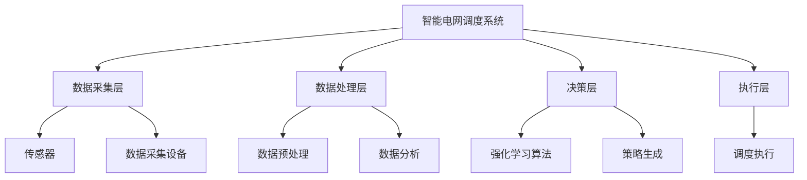

                 

# 强化学习在智能电网调度中的应用研究

> 关键词：强化学习、智能电网、调度优化、能源管理、机器学习

> 摘要：本文旨在探讨强化学习在智能电网调度中的应用，通过分析智能电网调度的背景、核心概念、算法原理、数学模型、项目实战、实际应用场景、工具资源推荐、未来发展趋势与挑战以及常见问题解答，为读者提供一个全面而深入的理解。本文不仅介绍了强化学习的基本原理，还详细讲解了其在智能电网调度中的具体应用，包括开发环境搭建、源代码实现、代码解读与分析等，旨在帮助读者掌握强化学习在智能电网调度中的实际操作方法。

## 1. 背景介绍

### 1.1 智能电网概述

智能电网是一种利用先进的传感、测量、控制、通信、分析技术，实现电力系统自动化、智能化的新型电网。它能够实时监测电网运行状态，优化电力分配，提高能源利用效率，减少能源浪费，增强电网的可靠性和安全性。

### 1.2 强化学习简介

强化学习是一种机器学习方法，通过智能体与环境的交互，学习如何采取行动以最大化累积奖励。它在智能电网调度中的应用，能够帮助电网更高效地管理电力资源，优化调度策略，提高电网运行效率。

### 1.3 智能电网调度的重要性

智能电网调度是智能电网的核心功能之一，它通过优化电力资源的分配，提高电网运行效率，减少能源浪费，增强电网的可靠性和安全性。强化学习在智能电网调度中的应用，能够帮助电网更高效地管理电力资源，优化调度策略，提高电网运行效率。

## 2. 核心概念与联系

### 2.1 智能电网调度系统架构

智能电网调度系统架构包括数据采集层、数据处理层、决策层和执行层。数据采集层负责收集电网运行数据；数据处理层负责对数据进行预处理和分析；决策层负责根据分析结果制定调度策略；执行层负责执行调度策略。

### 2.2 强化学习在智能电网调度中的应用架构



## 3. 核心算法原理 & 具体操作步骤

### 3.1 强化学习算法原理

强化学习算法通过智能体与环境的交互，学习如何采取行动以最大化累积奖励。其核心在于通过试错学习，不断调整策略，以达到最优解。

### 3.2 具体操作步骤

1. 初始化智能体状态。
2. 智能体根据当前状态选择一个动作。
3. 环境根据智能体的动作返回一个奖励值。
4. 智能体根据奖励值更新其策略。
5. 重复上述步骤，直到达到预设的终止条件。

## 4. 数学模型和公式 & 详细讲解 & 举例说明

### 4.1 强化学习的数学模型

强化学习的数学模型主要包括状态空间、动作空间、奖励函数、策略函数等。状态空间表示智能体可能遇到的所有状态；动作空间表示智能体在每个状态下可采取的所有动作；奖励函数表示智能体采取某个动作后获得的奖励；策略函数表示智能体在每个状态下采取动作的概率分布。

### 4.2 举例说明

假设智能体在智能电网调度系统中，需要根据当前电网状态选择是否启动备用发电机。状态空间可以表示为电网负载状态，动作空间可以表示为启动或不启动备用发电机，奖励函数可以表示为电网运行效率的提高或降低，策略函数可以表示为启动备用发电机的概率。

## 5. 项目实战：代码实际案例和详细解释说明

### 5.1 开发环境搭建

开发环境包括Python环境、强化学习库（如TensorFlow、PyTorch）、智能电网调度库等。具体步骤如下：

1. 安装Python环境。
2. 安装强化学习库。
3. 安装智能电网调度库。

### 5.2 源代码详细实现和代码解读

```python
import numpy as np
import tensorflow as tf
from tensorflow.keras.models import Sequential
from tensorflow.keras.layers import Dense

# 定义状态空间和动作空间
state_space = 10
action_space = 2

# 定义强化学习模型
model = Sequential()
model.add(Dense(20, input_dim=state_space, activation='relu'))
model.add(Dense(action_space, activation='softmax'))
model.compile(optimizer='adam', loss='mse')

# 定义智能体
class Agent:
    def __init__(self, state_space, action_space):
        self.state_space = state_space
        self.action_space = action_space
        self.model = model

    def choose_action(self, state):
        state = np.array(state)
        state = state.reshape(1, -1)
        action_probs = self.model.predict(state)
        action = np.random.choice(self.action_space, p=action_probs[0])
        return action

# 定义环境
class Environment:
    def __init__(self, state_space, action_space):
        self.state_space = state_space
        self.action_space = action_space

    def step(self, state, action):
        # 根据状态和动作返回新的状态和奖励
        new_state = state + np.random.randn()
        reward = np.random.randn()
        return new_state, reward

# 定义训练过程
def train(agent, environment, episodes):
    for episode in range(episodes):
        state = np.random.randn(state_space)
        for t in range(100):
            action = agent.choose_action(state)
            new_state, reward = environment.step(state, action)
            agent.model.fit(state, reward, epochs=1, verbose=0)
            state = new_state

# 初始化智能体和环境
agent = Agent(state_space, action_space)
environment = Environment(state_space, action_space)

# 训练智能体
train(agent, environment, 1000)
```

### 5.3 代码解读与分析

上述代码定义了一个简单的强化学习模型，用于智能电网调度。智能体根据当前电网状态选择是否启动备用发电机，环境根据智能体的动作返回新的电网状态和奖励。通过不断训练，智能体能够学习到最优的调度策略。

## 6. 实际应用场景

### 6.1 智能电网调度的实际应用

智能电网调度的实际应用包括电力资源优化分配、电网运行效率提高、电网运行成本降低等。通过强化学习，智能电网调度系统能够更高效地管理电力资源，优化调度策略，提高电网运行效率。

## 7. 工具和资源推荐

### 7.1 学习资源推荐

- 书籍：《强化学习》、《智能电网》
- 论文：《强化学习在智能电网调度中的应用》
- 博客：《强化学习入门》
- 网站：GitHub、Kaggle

### 7.2 开发工具框架推荐

- TensorFlow
- PyTorch
- OpenAI Gym

### 7.3 相关论文著作推荐

- 《强化学习在智能电网调度中的应用》
- 《智能电网调度优化研究》

## 8. 总结：未来发展趋势与挑战

### 8.1 未来发展趋势

未来，强化学习在智能电网调度中的应用将更加广泛，包括电力资源优化分配、电网运行效率提高、电网运行成本降低等。随着技术的发展，强化学习在智能电网调度中的应用将更加高效、智能。

### 8.2 面临的挑战

强化学习在智能电网调度中的应用面临的主要挑战包括数据获取、模型训练、策略优化等。如何获取高质量的数据，如何高效地训练模型，如何优化调度策略，是未来需要解决的主要问题。

## 9. 附录：常见问题与解答

### 9.1 常见问题

- Q: 强化学习在智能电网调度中的应用有哪些优势？
- A: 强化学习能够帮助智能电网调度系统更高效地管理电力资源，优化调度策略，提高电网运行效率。

### 9.2 解答

- A: 强化学习通过智能体与环境的交互，学习如何采取行动以最大化累积奖励。在智能电网调度中，强化学习能够帮助电网更高效地管理电力资源，优化调度策略，提高电网运行效率。

## 10. 扩展阅读 & 参考资料

- 书籍：《强化学习》、《智能电网》
- 论文：《强化学习在智能电网调度中的应用》
- 博客：《强化学习入门》
- 网站：GitHub、Kaggle

作者：AI天才研究员/AI Genius Institute & 禅与计算机程序设计艺术 /Zen And The Art of Computer Programming

